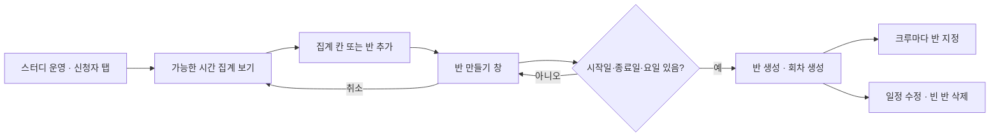
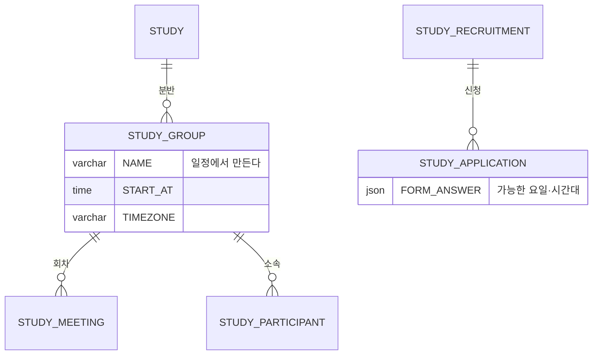

# 캡틴은 스터디 신청자를 보고 반을 결정할 수 있다.

기준 프로토타입: 스터디 운영 — 신청자 탭 반 편성 (playground 운영 콘솔 · 스터디 운영)

## 1. 기본설명

· **진입·사용 흐름**

· **완료 기준**

1. 요일 × 오전·오후·저녁 칸별 가능 인원 집계 조회
2. 집계 칸에서 반 만들기 시작 — 그 칸의 가능 인원과 명단 함께 표시
3. 빈 상태에서 반 추가
4. 반 생성 시 시작일·종료일·요일·시간·시간대로 회차 생성. 생성 전 반 이름·회차 수 미리보기
5. 반 이름은 그 반의 일정 — 따로 입력하지 않음
6. 크루별 반 지정·이동. 담당 캡틴도 명단 맨 위에서 지정
7. 반 일정 수정 — 오늘 이후 회차만 재생성, 기록된 출석은 유지
8. 크루 없는 반만 삭제
9. 반이 없을 때 다음 할 일 안내

## 2. 화면명세

> **화면**: 스터디 운영 — 신청자 탭

### 1. 가능한 시간 집계

- **내용**: 응답한 크루 수
- **데이터**: 신청 때 받은 가능한 요일·시간대 응답

### 1-1. 집계 표

- **내용**
  - 요일 × 오전·오후·저녁. 칸마다 가능한 사람 수
  - 사람이 많은 칸일수록 더 드러난다. 아무도 없으면 빈 칸
- **동작**: 칸을 누르면 그 요일·시각이 채워진 반 만들기 창(1-2)이 열린다
- **정책**
  - 축은 신청 화면이 받은 축과 같다 (요일 × 오전·오후·저녁)
  - 반을 자동으로 나누지 않는다. 인원·지역·난이도는 캡틴이 함께 본다
  - 많고 적음을 색만으로 구분하지 않는다. 숫자를 함께 둔다

### 1-2. 반 만들기 창

- **내용**
  - 고른 칸의 요일·시각이 채워져 있다. 그 칸이 가능한 사람 수와 이름
  - 시작일 · 종료일 · 요일 · 시간 · 시간대
  - 만들어질 반 이름과 생길 회차 수
- **동작**: 시작일 · 종료일 · 요일이 모두 있어야 만들 수 있다
- **정책**
  - 시간대 선택지는 한국 · 미국 서부 둘이다. 펼치지 않고 둘 다 보인다
  - 다른 시간대의 시각을 함께 알린다 (예: 목 21:00 KST 는 미국에서 수요일)
- **조건**: 집계 칸이나 「반 추가」를 눌렀을 때

### 2. 반 목록

- **내용**: 반 개수. 없으면 「아직 반이 없습니다. 위 표에서 시간을 골라 만드세요.」
- **동작**: 「반 추가」는 빈 반 만들기 창을 연다

### 2-1. 반 한 줄

- **내용**: 반 이름 · 진행 기간 · 속한 크루 수
- **정책**: 반 이름은 그 반의 일정이다 (예: 「수 20:00 KST」). 일정을 바꾸면 이름도 바뀐다
- **조건**: 반이 하나 이상일 때

### 2-2. 일정 수정

- **동작**: 누르면 그 반의 일정이 채워진 창이 열린다
- **정책**
  - 바꾸면 오늘 이후 회차만 다시 만든다
  - 이미 찍힌 출석은 남는다
- **조건**: 반이 하나 이상일 때

### 2-3. 반 삭제

- **동작**: 크루가 한 명이라도 있으면 누를 수 없다
- **정책**: 사람이 든 반은 지우지 못한다 — 그 반의 출석 기록까지 사라진다
- **조건**: 반이 하나 이상일 때

### 3. 크루의 반

- **내용**: 크루 명단의 반 칸. 반이 둘 이상이면 고를 수 있고, 하나면 반 이름만 보인다
- **동작**: 바꾸면 그 자리에서 반이 옮겨진다
- **정책**
  - 담당 캡틴은 신청서가 없어도 명단 맨 위에 「캡틴」 줄로 보이고 반 칸이 있다. 반이 없으면 「반 미지정」
  - 담당 캡틴은 반을 받으면 명부에 들어가고, 출석·완주는 크루와 같다. 모집 정원에는 넣지 않는다 ([POL-0001](../../_registry/policies/POL-0001-roles.md))

### 상태별 화면

| 상태 | 화면 | 카피 |
| --- | --- | --- |
| 반 없음 | 집계 표 · 안내 | `아직 반이 없습니다. 위 표에서 시간을 골라 만드세요.` |
| 기본 | 집계 표 · 반 목록 · 크루의 반 | — |
| 검증 실패 | 반 만들기 창, 만들기 불가 | — |
| 삭제 불가 | 크루가 있는 반의 삭제 잠김 | — |

### 데이터 관계

### 비고

- 범위 밖: 신청 폼 설계, 네비게이터 지정, 출석부
- 구현 지시: 반은 모집 전에 만들지 않는다. 모집 중에도 크루가 들어오므로 반 편성은 여러 번 한다
- 미구현: 프로토는 반·지정을 화면에서만 처리한다

## 3. 시스템 요건

### 데이터

| 대상 | 필드 | 쓰기 |
| --- | --- | --- |
| 분반 | NAME · START_AT · TIMEZONE · 시작일 · 종료일 · 요일 | 만들기·수정 |
| 회차 | 분반 일정으로 만든 `SCHEDULED_AT` | 만들기·일정 수정 시 |
| 명부 | `STUDY_PARTICIPANT.STUDY_GROUP_ID` | 크루의 반 지정 |
| 명부 | `STUDY_PARTICIPANT` 행 추가 | 담당 캡틴의 반 지정 (행이 없을 때) |

### 처리

- 반 만들기: 시작일~종료일 사이 고른 요일마다 회차를 만든다. 시각은 반 시간대의 현지 시각을 UTC 로 바꿔 저장한다
- 일정 수정: 오늘 이후 회차를 지우고 새 일정으로 다시 만든다. 지난 회차와 출석은 두고 간다
- 반 삭제: 소속 크루가 있으면 거절한다
- 반 이름은 요일·시각·시간대로 만든다

### 계산 규칙 (단일 정의)

- 집계 칸 인원: 그 요일·시간대를 가능하다고 답한 신청 수

### API

| 메서드 | 경로 | 권한 |
| --- | --- | --- |
| GET | `/api/admin/studies/{studyId}/availability` | 캡틴 |
| POST | `/api/admin/studies/{studyId}/groups` | 캡틴 |
| PATCH · DELETE | `/api/admin/studies/{studyId}/groups/{groupId}` | 캡틴 |
| PATCH | `/api/admin/studies/{studyId}/participants/{participantId}/group` | 캡틴 |
| PUT | `/api/admin/studies/{studyId}/captain/group` | 캡틴 |

계약은 [study-group/spec.md](../../../specs/study-group/spec.md).

### 권한

- 캡틴만. 네비게이터는 반을 편성하지 못한다. 서버에서 검증한다

### 외부 연동

- 없음

## 4. 미확정

- ~~분반·반 지정 API 경로와 스펙 위치~~ → [study-group/spec.md](../../../specs/study-group/spec.md) (2026-10-06)
- 신청 폼은 가능한 **요일**만 받는다. 요일 × 오전·오후·저녁 집계를 하려면 신청 폼에 시간대 질문이 먼저 필요하다
- `STUDY_GROUP` 에 시작일·종료일·요일 컬럼이 없다
- 반 일정을 바꿀 때 지워지는 오늘 이후 회차에 찍힌 휴가 신청 처리
