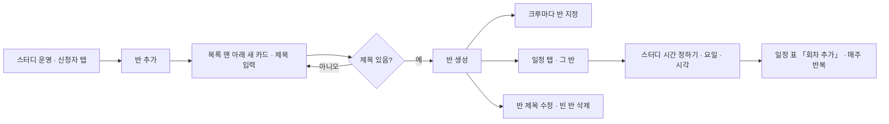
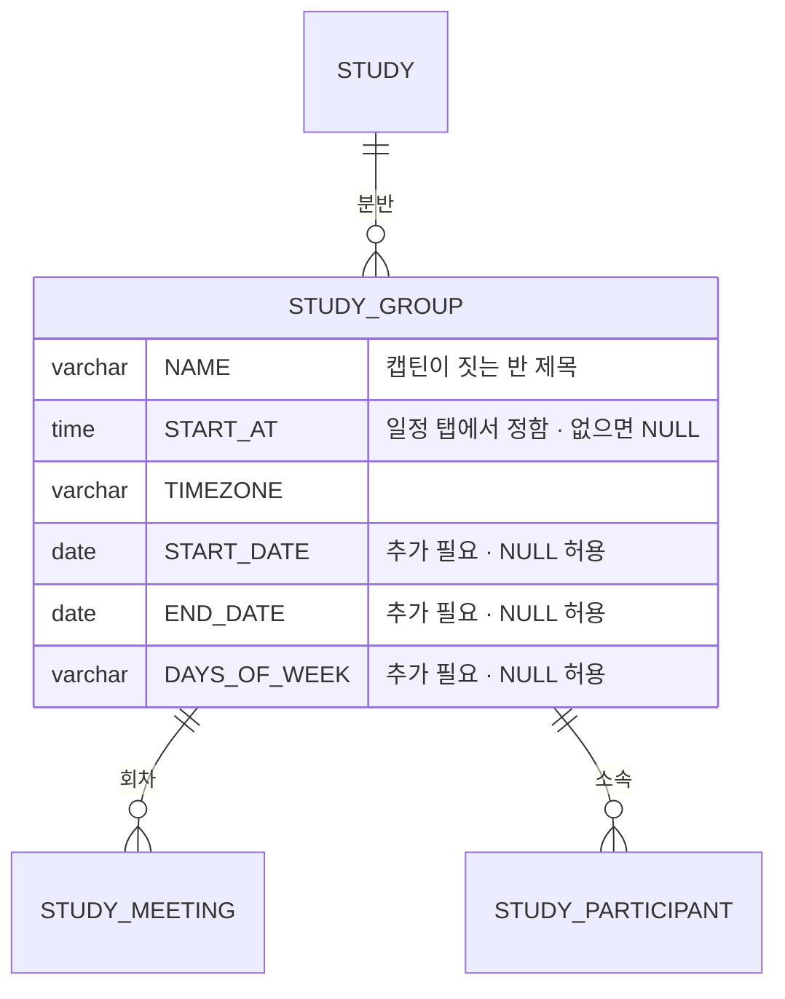

# 캡틴은 스터디 신청자를 보고 반을 결정할 수 있다.

기준 프로토타입: 스터디 운영 — 신청자 탭 반 편성 (playground 운영 콘솔 · 스터디 운영)

관련 결정: [10-14 백오피스 신청자 탭 정리](../../../docs/share/2026-10-14-class-title-and-captain-applies.md) · [10-22 킥오프는 캡틴이 정한다](../../../docs/share/2026-10-22-kickoff-by-captain.md) · [10-18 신청하면 기본반 명부에 들어간다](../../../docs/share/2026-10-18-roster-on-apply.md)

## 1. 기본설명

· **진입·사용 흐름**

```mermaid
flowchart LR
  A["스터디 운영 · 신청자 탭"] --> B["반 추가"]
  B --> C["목록 맨 아래 새 카드 · 제목 입력"]
  C --> D{"제목 있음?"}
  D -->|아니오| C
  D -->|예| E["반 생성"]
  E --> F["크루마다 반 지정"]
  E --> G["일정 탭 · 그 반"]
  G --> H["스터디 시간 정하기 · 요일 · 시각"]
  H --> I["일정 표 「회차 추가」 · 매주 반복"]
  E --> J["반 제목 수정 · 빈 반 삭제"]
```

· **완료 기준**

1. 「반 추가」로 반 제목만 입력해 반 생성. 제목이 비면 생성 불가
2. 반 생성 시 회차를 만들지 않음
3. 반 한 줄에 반 제목 · 속한 크루 수
4. 반 「수정」으로 제목 변경 — 회차·출석 유지
5. 크루별 반 지정·이동
6. 크루 없는 반만 삭제
7. 반이 없을 때 다음 할 일 안내
8. 일정 탭에서 스터디 시간 없는 반에 「스터디 시간 정하기」 → 요일 · 시각 · 시간대만 저장. 회차는 만들지 않음
8-1. 회차는 일정 표 「회차 추가」로만 생성. 회차 없는 반은 스터디 요일 매주 반복 · 시각으로 채워져 열림. 회차 추가는 킥오프를 만들지 않음
8-2. 킥오프는 캡틴이 일정 탭 「킥오프 정하기 · 수정」으로 일자 · 시각을 정함. 1회차보다 앞, 지난 날도 가능. 네비게이터는 고칠 수 없음
9. 일정 탭 반 정보 카드의 스터디 시간 「수정」 — 요일·시각·시간대만 변경. 회차 추가·재생성 없음
10. 반의 기간은 저장하지 않음 — 첫 회차 ~ 마지막 회차
10. 캡틴 전용 명단 줄 없음. 참여하려는 캡틴은 신청 폼 제출 후 크루와 같은 줄로 표시

## 2. 화면명세

> **화면**: 스터디 운영 — 신청자 탭 · 일정 탭(반 일정)

### 1. 반 목록

- **내용**: 반 개수. 없으면 「아직 반이 없습니다. 「반 추가」로 반을 만들고 크루를 나눠 주세요.」
- **동작**: 「반 추가」는 모달 없이 목록 맨 아래에 새 카드를 입력 상태(1-4)로 연다

### 1-1. 반 한 줄

- **내용**: 반 제목 · 속한 크루 수
- **정책**: 스터디 시간 · 기간은 적지 않는다. 일정 탭 반 정보 카드에서 보고 고친다
- **조건**: 반이 하나 이상일 때

### 1-2. 수정

- **동작**: 그 카드의 제목이 입력칸(1-4)으로 바뀐다. 모달 없음
- **정책**: 이름만 바뀐다. 회차·출석은 그대로
- **조건**: 반이 하나 이상일 때

### 1-3. 반 삭제

- **동작**: 기본반이거나, 명부에 크루가 남아 있거나, 출석 기록이 남아 있으면 누를 수 없다 — 수료 · 참여 중단 크루도 센다, 회원 탈퇴는 세지 않는다. 판정은 서버의 `groups[].canDelete` 를 그린다
- **정책**: 반을 지우려고 출석 기록을 지우지 않는다. 다른 반으로 옮긴 크루의 지난 출석도 옛 반에 남아 있어, 명부가 비어도 출석 기록이 있으면 지우지 못한다. 수료 · 참여 중단 크루가 어느 반이었는지 기록도 끊기지 않게 한다 ([share 10-20](../../../docs/share/2026-10-20-class-delete-keeps-crew-history.md))
- **조건**: 반이 하나 이상일 때

### 1-4. 카드 안 반 제목 입력

- **내용**: 카드 한 줄 — 왼쪽 반 제목 입력칸(줄의 절반, 최대 20자), 오른쪽 「취소 · 저장」
- **동작**: 제목이 비면 「반 제목을 입력해 주세요.」 · Enter 저장 · Esc/취소로 닫기(새 카드는 사라짐)
- **정책**
  - 회차를 만들지 않는다. 반을 나누는 시점에는 모일 시각이 정해지지 않았을 수 있다
  - 제목은 캡틴이 짓는다. 일정으로 이름을 만들지 않는다
- **조건**: 「반 추가」·「수정」을 눌렀을 때

### 2. 크루의 반

- **내용**: 크루 명단의 반 칸. 반이 둘 이상이면 고를 수 있고, 하나면 반 이름만 보인다
- **동작**: 바꾸면 그 자리에서 반이 옮겨진다
- **정책**: 캡틴은 신청했을 때만 명단에 있다. 신청하지 않은 캡틴의 줄은 없다 ([POL-0001](../../_registry/policies/POL-0001-roles.md))

### 3. 반 일정 (일정 탭)

- **내용**
  - 스터디 시간 없는 반: 「아직 이 반의 스터디 시간이 없습니다.」 · 「스터디 시간 정하기」
  - 스터디 시간 있는 반: 반 정보 카드의 스터디 시간 옆 「수정」
- **동작**: 둘 다 스터디 시간 창을 연다 — 스터디 요일 · 스터디 시간(시각 · 시간대). 요일이 하나 이상이면 저장
- **정책**
  - 스터디 시간을 정하거나 바꿔도 회차는 생기거나 바뀌지 않는다 — 회차는 일정 표 「회차 추가」로만 만든다 (→ [share 10-14](../../../docs/share/2026-10-14-class-title-and-captain-applies.md))
  - 회차가 없는 반의 「회차 추가」는 스터디 요일 매주 반복 · 스터디 시각으로 채워 연다. 기간은 반복의 시작 · 종료 일자로 정한다
  - 반의 기간은 저장하지 않는다 — 첫 회차 ~ 마지막 회차로 계산한다
  - 시간대 선택지는 한국 · 미국 서부 둘. 다른 시간대의 시각을 함께 알린다
  - 네비게이터는 일정 탭에서 고치지 않는다. 신청자 탭 명단에서 지정한다
- **조건**: 일정 탭에서 반을 골랐을 때
- 상세 번호: 스터디 운영 일정 관리 명세 13 · 13-3 · 14 · 14-1 · 14-2

### 상태별 화면

| 상태 | 화면 | 카피 |
| --- | --- | --- |
| 반 없음 | 안내 | `아직 반이 없습니다. 「반 추가」로 반을 만들고 크루를 나눠 주세요.` |
| 기본 | 반 목록 · 크루의 반 | — |
| 스터디 시간 없음 | 일정 탭 안내 · 「스터디 시간 정하기」 | `아직 이 반의 스터디 시간이 없습니다.` |
| 검증 실패 | 카드 안 반 제목 입력 · 반 일정 창 | `반 제목을 입력해 주세요.` · `시작일 · 종료일 · 요일을 모두 정해야 합니다.` |
| 삭제 불가 | 크루가 있는 반의 삭제 잠김 | — |

### 데이터 관계

```mermaid
erDiagram
  STUDY ||--o{ STUDY_GROUP : "분반"
  STUDY_GROUP ||--o{ STUDY_MEETING : "회차"
  STUDY_GROUP ||--o{ STUDY_PARTICIPANT : "소속"
  STUDY_GROUP {
    varchar NAME "캡틴이 짓는 반 제목"
    time START_AT "일정 탭에서 정함 · 없으면 NULL"
    varchar TIMEZONE
    date START_DATE "추가 필요 · NULL 허용"
    date END_DATE "추가 필요 · NULL 허용"
    varchar DAYS_OF_WEEK "추가 필요 · NULL 허용"
  }
```

### 비고

- 범위 밖: 신청 폼 설계, 네비게이터 지정, 출석부
- 보류(MVP 이후): 신청자 가능한 시간 집계 — 신청 폼의 가능한 시간 질문이 필수가 아니라 집계가 대표성을 갖지 못한다
- 구현 지시: 스터디를 만들 때 기본반 하나를 같이 만들고, 신청자는 거기로 들어온다. 반을 더 나눌지는 신청자를 보고 정한다. 모집 중에도 크루가 들어오므로 반 편성은 여러 번 한다
- 미구현: 프로토는 반·지정을 화면에서만 처리한다
- 기획 미정 (2026-10-20): **스터디 시작 뒤 반 이동** — 시작 뒤에도 옮길 수 있다. 옮긴 사람의 출석률을 옛 반 · 새 반 회차로 어떻게 셀지 정해야 한다 (지금 계산은 지금 반 회차만 본다)
- 기획 미정 (2026-10-20): **다른 반 출석** — A반 참여자가 B반 회차에 출석할 수 있다. 어느 반 회차에 어떤 상태로 남기고 출석률에 어떻게 셀지 정해야 한다 (지금은 대시보드만 소속 반 `EXCUSED` 로 인정, 디스코드 출석은 다른 반에 찍지 않는다). → [반 편성 스펙 미확정](../../../specs/study-group/spec.md#미확정)

<!-- spec:start class -->

> 스터디를 만들면 「기본반」이 하나 생긴다. 신청한 크루는 모두 기본반에 들어온다 — 반이 없으면 명부에 넣을 수도, 일정을 짤 수도 없다
>
> 반을 더 나눌지는 신청자를 보고 정한다. 나누면 크루를 새 반으로 옮긴다
>
> 반은 제목 하나로 만든다. 스터디 시간(요일 · 시각 · 시간대)은 일정 탭에서 그 반에 정하고, 회차는 일정 표의 「회차 추가」로 만든다
>
> 반 편성은 한 번 하고 끝나지 않는다 — 모집 중에도 크루가 계속 들어온다
>
> 캡틴도 참여하려면 크루처럼 신청한다. 신청하면 명단에 크루와 같은 줄로 나오고 반을 받는다

### 1 — 반 목록

- **조건**: 신청자 탭을 보고 있을 때
- **내용**: 반 개수. 처음에는 기본반 하나다 — 반이 없는 상태는 없다
- **동작**: 「반 추가」는 모달 없이 목록 맨 아래에 새 카드를 입력 상태(1-4)로 연다. 열려 있는 동안 「반 추가」는 잠긴다

#### 1-1 — 반 한 줄

- **조건**: 반이 하나 이상일 때
- **내용**: 반 제목 · 속한 크루 수 · 「수정」 · 「삭제」
- **정책**: 스터디 시간 · 기간은 여기 적지 않는다 — 일정 탭 반 정보 카드가 말하고, 거기서 고친다

#### 1-2 — 수정

- **조건**: 반이 하나 이상일 때
- **동작**: 누르면 그 카드의 제목이 입력칸(1-4)으로 바뀐다 — 모달을 띄우지 않는다
- **정책**
  - 이름만 바뀐다. 회차와 출석은 그대로다
  - 한 번에 한 카드만 입력 상태가 된다

#### 1-3 — 반 삭제

- **조건**: 반이 하나 이상일 때
- **동작**
  - 기본반이거나, 명부에 크루가 남아 있거나, 출석 기록이 남아 있으면 비활성 — 수료 · 참여 중단 크루도 센다, 회원 탈퇴는 세지 않는다
  - 판정은 서버의 `groups[].canDelete` 를 그린다
- **정책**
  - 기본반은 새로 신청한 크루가 들어오는 반이라 지우지 않는다
  - 반을 지우려고 출석 기록을 지우지 않는다. 출석 기록이 남은 반은 지울 수 없다 — 다른 반으로 옮긴 크루의 지난 출석도 옛 반에 남아 있다
  - 수료 · 참여 중단 크루가 어느 반이었는지 기록이 끊기지 않게 한다 (share 10-20)

#### 1-4 — 카드 안 반 제목 입력

- **조건**: 「반 추가」나 「수정」을 눌렀을 때
- **내용**
  - 카드 한 줄 — 왼쪽에 반 제목 입력칸(줄의 절반, 최대 20자), 오른쪽에 「취소 · 저장」
  - 새 반은 빈 칸에 예시 「A반 · 미국 금요일반」
- **동작**
  - 제목이 비어 있으면 저장할 수 없다 — 입력칸 아래 「반 제목을 입력해 주세요.」
  - Enter 로 저장, Esc · 「취소」로 닫는다. 새 카드는 취소하면 사라진다
- **정책**
  - 여기서는 회차를 만들지 않는다 — 반을 나눌 때는 몇 시에 모일지 아직 모를 수 있다
  - 제목은 캡틴이 짓는다. 일정에서 이름을 만들지 않는다

#### 1-5 — 기본 표시

- **조건**: 반 목록의 첫 카드
- **내용**: 반 제목 옆 「기본」
- **정책**
  - 스터디를 만들 때 생긴 반이다. 새로 신청한 크루는 여기로 들어온다
  - 이름은 「수정」으로 바꿀 수 있다 (예: 「목요일반」). 바꿔도 기본반이다

### 2 — 크루의 반

- **조건**: 신청자 탭을 보고 있을 때
- **내용**: 크루 명단의 반 칸. 반이 둘 이상이면 고르는 칸이, 하나면 반 이름이 나온다
- **동작**: 바꾸면 그 자리에서 반이 옮겨진다
- **정책**
  - 신청하면 기본반으로 들어온다. 반을 나눴으면 여기서 옮긴다
  - 옮기면 지난 출석은 옛 반에 남고, 앞으로의 회차부터 새 반 출석부에 오른다. 옛 반의 앞으로 회차 칸(휴가 포함)은 지운다
  - 캡틴은 신청했을 때만 이 명단에 있다. 신청하지 않은 캡틴의 줄은 없다 (POL-0001)

<!-- spec:end class -->

## 3. 시스템 요건

### 개발 범위

> 2026-10-14 `beta` 기준. **지금 → 할 일**만 적는다. 다 끝나면 「할 일」이 모두 「없음」이 된다.
> FE 「지금」은 실제 앱의 화면과 데이터 연결(API · mock)까지 본 값이다 — 완료 기준 하나하나의 동작은 따로 확인하지 않았다.
> BE 「지금」은 스펙 엔드포인트 표의 상태 칸을 옮겨 적는다.
> 2026-10-23 갱신 — FE · BE 「지금」을 머지된 PR 로 다시 봤다.

| 구분 | 대상 | 지금 | 할 일 |
|---|---|---|---|
| FE | back-office-front 신청자 탭의 반 만들기 · 반 목록 · 크루의 반 | 있음 (#302) — 반 만들기 · 이름 바꾸기 · 삭제 · 크루 반 지정 (`features/participants`). 명단은 `GET …/participants` 를 부르는데 그 API 는 아직 없다 (아래) | 없음 |
| FE | back-office-front 일정 탭의 반 일정 · 킥오프 정하기 | 없음 | 아래 회차 목록 · 킥오프 API 에 연결한다 |
| BE | 반 `POST` · `PATCH` · `DELETE` · 크루 반 지정 | 반 `POST` · `DELETE` 구현완료. `PATCH` 는 제목만. 반 지정 일괄 `PATCH …/participants` 구현완료 (#303). 명단 `GET …/participants` 는 구현 진행 중 | `PATCH` 스터디 시간 · 명단 `GET` ([study-group 스펙](../../../specs/study-group/spec.md)) |
| BE | `PUT /api/admin/studies/{studyId}/groups/{groupId}/kickoff` · 반 회차 목록 `GET …/groups/{groupId}/meetings` | 구현완료 (#312) | 없음 |

### 데이터

| 대상 | 필드 | 쓰기 |
| --- | --- | --- |
| 분반 | NAME | 만들기 · 수정 |
| 분반 | START_AT · TIMEZONE · 요일 | 스터디 시간 정하기 · 수정 (만들 때는 비어 있음). 기간은 두지 않는다 |
| 회차 | `SCHEDULED_AT` · `TITLE` | 일정 표 「회차 추가」로만 — [회차 스펙](../../../specs/study-meeting/spec.md) |
| 킥오프 | `MEETING_TYPE = KICKOFF` · `SCHEDULED_AT` | 일정 탭 「킥오프 정하기 · 수정」으로만 (캡틴) — [회차 스펙 「킥오프 정하기」](../../../specs/study-meeting/spec.md#킥오프-정하기-백오피스) |
| 명부 | `STUDY_PARTICIPANT.STUDY_GROUP_ID` | 반 · 역할 한 번에 바꾸기 |

### 처리

- 반 만들기: 제목만 저장한다. 회차를 만들지 않는다
- 스터디 시간 정하기 · 수정: `START_AT` · `TIMEZONE` · 요일만 저장한다. 회차는 만들지도 바꾸지도 않는다
- 반의 기간: 저장하지 않는다. 첫 회차 ~ 마지막 회차의 `SCHEDULED_AT` 으로 계산해 응답에 담는다
- 수정: `NAME` 만 바꾼다
- 반 삭제: 기본반은 거절한다 (409 `DEFAULT_GROUP_NOT_DELETABLE`). `ACTIVE` · `PAUSED` · `COMPLETED` · `WITHDRAWN` 명부 행이나, 탈퇴 회원 밖의 출석 행이 있으면 거절한다 (409 `GROUP_NOT_EMPTY`). 지울 때 회차와 탈퇴 회원의 출석 행만 함께 지운다

### 계산 규칙 (단일 정의)

- 반 크루 수: 그 반에 지정된 활성 명부 행 수

### API

| 메서드 | 경로 | 권한 |
| --- | --- | --- |
| POST | `/api/admin/studies/{studyId}/groups` | 캡틴 |
| PATCH · DELETE | `/api/admin/studies/{studyId}/groups/{groupId}` | 캡틴 |
| PATCH | `/api/admin/studies/{studyId}/participants` — 반 · 역할 한 번에 (2026-10-21, 한 사람씩 API 를 합쳤다) | 캡틴 |

계약은 [study-group/spec.md](../../../specs/study-group/spec.md).

### 권한

- 캡틴만. 네비게이터는 반을 편성하지 못한다. 서버에서 검증한다

### 외부 연동

- 없음

## 4. 미확정

- ~~분반·반 지정 API 경로와 스펙 위치~~ → [study-group/spec.md](../../../specs/study-group/spec.md) (2026-10-06)
- ~~가능한 시간 집계 축(요일 × 시간대)~~ → 집계는 MVP 이후로 보류 (→ [share 10-14](../../../docs/share/2026-10-14-class-title-and-captain-applies.md))
- ~~담당 캡틴의 반 지정~~ → 캡틴도 참여하려면 신청한다. 따로 넣는 길을 두지 않는다 (→ [share 10-14](../../../docs/share/2026-10-14-class-title-and-captain-applies.md))
- `STUDY_GROUP` 에 요일 컬럼(`DAYS_OF_WEEK`)이 없다. 시작일·종료일은 두지 않는다 — 회차에서 계산 (→ [share 10-14](../../../docs/share/2026-10-14-class-title-and-captain-applies.md))
- ~~반 일정을 바꿀 때 지워지는 오늘 이후 회차에 찍힌 휴가 신청 처리~~ → 스터디 시간 수정이 회차를 건드리지 않아 없어졌다 (2026-10-14)
