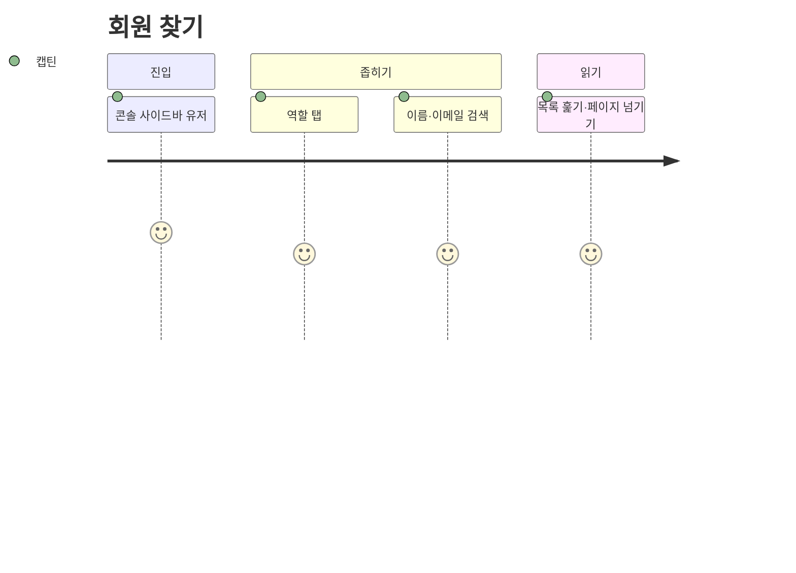
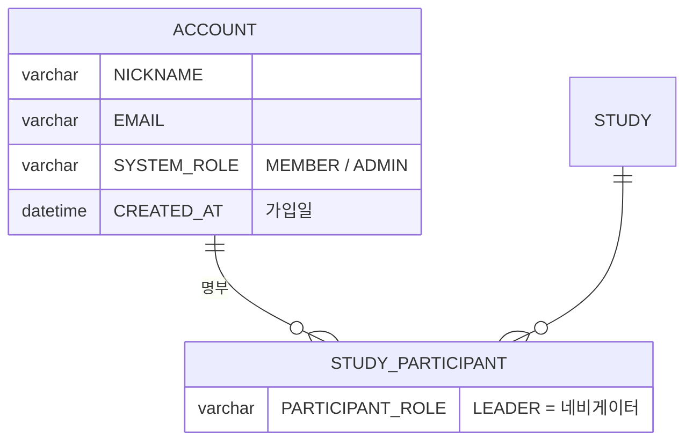

# 캡틴은 전체 회원 리스트를 조회할 수 있다.

기준 프로토타입: 유저 (playground 운영 콘솔 · 유저)

## 1. 기본설명

· **진입·사용 흐름**

· **완료 기준**

1. 가입 회원 전체 조회 — 탈퇴 회원 제외
2. 이름·이메일·권한·담당 스터디·가입일 표기
3. 전체·캡틴·네비게이터·크루 필터
4. 이름·이메일 검색
5. 걸러진 인원 수 표시
6. 참여 스터디 없는 회원은 휴면 구분
7. 20명씩 페이지 이동

## 2. 화면명세

> **화면**: 유저 (운영 콘솔)

### 1. 페이지 머리

- **내용**: 「유저」

### 2. 역할 탭 · 검색 · 인원 수

- **내용**
  - 탭: 전체 · 캡틴 · 네비게이터 · 크루
  - 걸러진 뒤의 인원 수
- **동작**
  - 탭을 고르면 그 사람들만 남는다. 「네비게이터」는 담당 스터디가 있는 사람이다
  - 검색은 이름과 이메일에 걸린다
- **정책**
  - 인원 수는 탭·검색으로 걸러진 전체 수다. 현재 페이지의 수가 아니다
  - 네 탭이 모두 보인다. 접지 않는다
  - 역할 순서는 어디서나 캡틴 → 네비게이터 → 크루

### 3. 유저 목록

- **내용**: 이름(참여 스터디가 없으면 「휴면」) · 이메일 · 권한 · 네비게이터 · 가입일
- **정책**
  - 정렬: 캡틴 → 담당 스터디가 있는 사람 → 나머지. 그 안에서 참여 스터디가 많은 순
  - 네비게이터 칸은 읽기 전용이다. 담당은 그 스터디의 크루 명단에서 정한다
  - 네비게이터 칸에는 담당 스터디 이름을 적는다. 둘 이상이면 하나만 적고 나머지는 개수로 접는다
- **데이터**: `ACCOUNT` · 담당 스터디(`STUDY_PARTICIPANT.PARTICIPANT_ROLE = LEADER`) · 참여 스터디 수

### 4. 페이지 이동

- **내용**: 한 페이지 20명. 지금 페이지가 드러난다
- **동작**
  - 탭이나 검색을 바꾸면 첫 페이지로 돌아간다
  - 한 페이지에 다 들어가면 보이지 않는다
- **정책**: 지금 페이지는 색만으로 구분하지 않는다

### 상태별 화면

| 상태 | 화면 | 카피 |
| --- | --- | --- |
| 기본 | 탭 · 검색 · 목록 | 인원 수 |
| 휴면 | 이름 칸 | `휴면` |
| 검색 결과 없음 | 인원 0 | — |

### 데이터 관계

### 비고

- 범위 밖: 권한 바꾸기 — [captain-grant-roles](../captain-grant-roles/PRD.md), 정지·초대
- 구현 지시: 탈퇴한 회원의 출석 기록은 남되 누구인지 알 수 없다. 이 목록에는 나오지 않는다 (이용약관 제11조 3항)

## 3. 시스템 요건

### 데이터

- 행마다: 계정 ID · 닉네임 · 이메일 · `SYSTEM_ROLE` · 가입일 · 담당 스터디 목록 · 참여 스터디 수
- 휴면: 참여 스터디 수 0

### 처리

- 탭·검색·페이지 조건을 받아 걸러진 전체 수와 그 페이지 행을 돌려준다
- 검색은 닉네임과 이메일의 부분 일치

### API

| 메서드 | 경로 | 권한 |
| --- | --- | --- |
| GET | `/api/admin/users` (`role` · `q` · `offset` · `limit`) | 캡틴 |

계약은 [admin-users/spec.md](../../../specs/admin-users/spec.md).

### 권한

- 캡틴만. 서버에서 검증한다

### 개인정보

- 이메일이 담긴 목록은 운영 콘솔 API 로만 돌려준다
- 탈퇴한 계정은 이미 삭제되어 나오지 않는다

### 외부 연동

- 없음

## 4. 미확정

- ~~회원 목록 API 경로와 스펙 위치~~ → `GET /api/admin/users`, [admin-users/spec.md](../../../specs/admin-users/spec.md) (2026-10-06)
- 이름 칸에 닉네임을 쓸지 Google 이름을 쓸지
