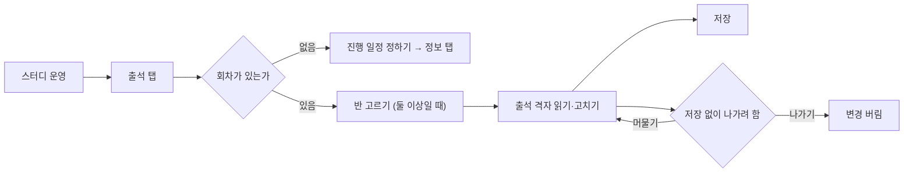
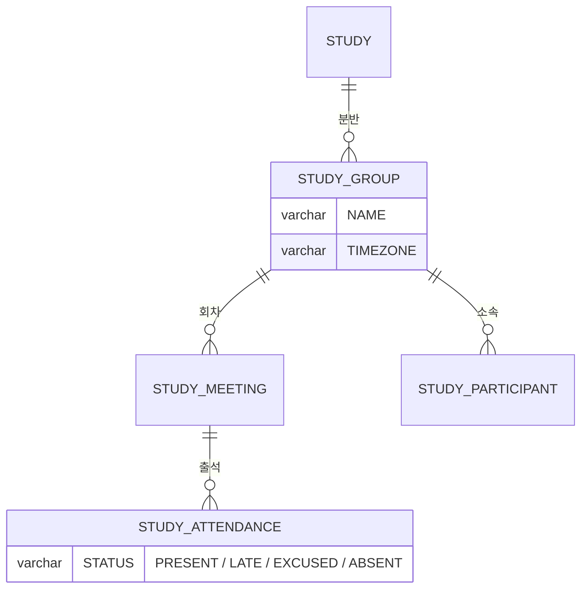

# 캡틴은 스터디별 출석명부를 볼 수 있다.

기준 프로토타입: 스터디 운영 — 출석 탭 (playground 운영 콘솔 · 스터디 운영)

## 1. 기본설명

· **진입·사용 흐름**

· **완료 기준**

1. 반마다 크루 × 회차 출석 상태를 한 화면에서 볼 수 있다
2. 반이 둘 이상이면 반을 골라 볼 수 있다
3. 어느 반인지, 크루 수·회차 수, 날짜를 읽는 시간대 기준을 먼저 알 수 있다
4. 크루별 출석률을 볼 수 있다
5. 칸을 눌러 출석 상태를 바꾸고, 저장을 눌러 한 번에 반영할 수 있다. 저장 전 변경을 되돌릴 수 있다
6. 저장하지 않은 변경이 있으면 그 사실과 칸 수를 알 수 있고, 나가려 할 때 한 번 더 묻는다
7. 진행 일정이 없어 회차가 없으면 무엇을 해야 하는지와 갈 곳을 본다

## 2. 화면명세

> **화면**: 스터디 운영 — 출석 탭

### 1. 출석부 머리

- **내용**: 「출석부 수요일반 · 크루 6 · 회차 4 · KST 기준」처럼 반 · 규모 · 날짜 기준 시간대
- **정책**: 회차 날짜는 반이 도는 시간대의 현지 날짜다. 기준 시간대를 함께 적는다

### 1-1. 반 선택

- **내용**: 반 이름(=일정)들. 고른 반이 드러난다
- **정책**: 반이 하나면 보이지 않는다
- **조건**: 반이 둘 이상일 때

### 2. 회차 추가

- **내용**: 지금은 누를 수 없다
- **정책**: 반 일정이 만들지 못하는 예외 회차(보강·일회성 변경)를 더하는 자리다

### 3. 출석 격자

- **내용**: 가로는 회차, 세로는 크루. 한 칸이 한 사람의 한 회차
- **정책**
  - 가로 회차 · 세로 크루 배치를 지킨다 — 구글시트로 하던 출석부와 같은 모양이라야 운영자가 그대로 옮겨 온다
  - 회차별 화면을 따로 두지 않는다. 한 사람의 결석 횟수를 한 줄에서 본다
- **데이터**: 크루 × 회차 `STUDY_ATTENDANCE.STATUS`

### 3-1. 크루 열

- **내용**: 크루 이름. 가로로 넘겨도 계속 보인다

### 3-2. 회차 머리

- **내용**: 회차 번호와 날짜

### 3-3. 출석 칸

- **내용**: 출석 · 지각 · 결석 · 휴가 중 하나. 체크 전이면 비어 있다
- **동작**
  - 누를 때마다 출석 → 지각 → 결석 → 휴가 → 미체크
  - 눌러도 저장하지 않는다
  - 저장된 값과 다르면 「저장되지 않음」으로 구분된다
- **정책**
  - 한 바퀴 돌면 미체크로 돌아온다
  - 바뀐 칸은 색만으로 구분하지 않는다

### 3-4. 크루별 출석률

- **내용**: 정수 %. 체크된 회차가 없으면 「—」
- **동작**: 칸을 바꾸면 바로 다시 계산된다. 저장 전 미리보기다
- **정책**
  - 분모는 체크된 회차뿐이다
  - 휴가는 분모에서 뺀다
  - 지각은 0.5 로 센다

### 4. 조작 안내

- **내용**: 칸을 누르는 순서, 출석률 계산 기준, 저장해야 반영된다는 사실

### 5. 일정 미정 안내

- **내용**
  - 「아직 진행 일정이 정해지지 않았습니다.」
  - 「정보 탭에서 요일 · 시간을 정하면 출석부가 만들어집니다.」
  - 「진행 일정 정하기」
- **동작**: 「진행 일정 정하기」를 누르면 정보 탭으로 간다
- **조건**: 회차가 하나도 없을 때

### 6. 저장

- **내용**
  - 저장. 바뀐 칸이 없으면 누를 수 없다
  - 바뀐 칸이 있으면 「변경 취소」가 함께 보인다
- **동작**
  - 저장 → 바뀐 칸을 한 번에 반영하고 「저장되었습니다.」
  - 변경 취소 → 저장 전 값으로 되돌린다
  - 처리 중에는 저장과 칸이 잠긴다
- **정책**: 칸마다 따로 보내지 않는다. 한 요청으로 보낸다

### 7. 저장 필요 상태

- **내용**
  - 머리 옆 「저장 필요 · N칸」
  - 출석 탭에 「저장 전」
  - 「저장되지 않은 변경 N칸. 저장을 눌러야 반영됩니다.」
- **정책**: 칸 수만으로 알리지 않는다. 「저장 필요」라는 말을 함께 둔다
- **조건**: 저장된 값과 다른 칸이 있을 때

### 8. 이탈 확인

- **내용**
  - 「저장하지 않은 변경이 있습니다」
  - 「저장을 누르지 않으면 고친 출석이 사라집니다. 나가기 전에 저장해 주세요.」
  - 「저장하지 않고 나가기」 · 「이 화면에 머물기」
- **동작**
  - 머물기 → 출석 탭에 남고 고친 값이 유지된다
  - 저장하지 않고 나가기 → 고친 값을 버리고 가려던 곳으로 간다
- **정책**: 새로고침·창 닫기는 브라우저 기본 안내를 쓴다
- **조건**: 저장하지 않은 변경이 있는 채로 탭·링크를 누를 때

### 상태별 화면

| 상태 | 화면 | 카피 |
| --- | --- | --- |
| 기본 | 머리 · 격자 · 안내 | `출석부 {반} · 크루 N · 회차 N · {시간대} 기준` |
| 회차 없음 | 일정 미정 안내 | `아직 진행 일정이 정해지지 않았습니다.` |
| 저장 전 | 저장 필요 표시 | `저장되지 않은 변경 N칸. 저장을 눌러야 반영됩니다.` |
| 처리중 | 저장·칸 잠김 | — |
| 완료 | 저장 결과 | `저장되었습니다.` |
| 이탈 확인 | 확인 창 | `저장하지 않은 변경이 있습니다` |

### 데이터 관계

### 비고

- 범위 밖: 반 만들기 — [captain-assign-classes](../captain-assign-classes/PRD.md), 디스코드 출석 체크
- 미구현: 회차 추가(예외 회차)
- 구현 지시: 출석부는 반마다 하나다. 회차는 반의 진행 일정이 만든다

## 3. 시스템 요건

### 데이터

- 읽기: 반의 회차 목록, 크루 목록, 크루 × 회차 상태, 크루별 출석률, 반 평균
- 쓰기: `STUDY_ATTENDANCE.STATUS` — `PRESENT` · `LATE` · `ABSENT` · `EXCUSED`

### 처리

- 저장은 바뀐 칸을 `updates[]` 한 요청으로 보낸다. 서버는 한 트랜잭션으로 반영한다 — 하나라도 거절되면 아무것도 반영하지 않는다
- 칸의 회차·참여자가 그 스터디에 속하지 않으면 400. 같은 칸이 두 번 오면 400. 같은 칸을 동시에 고치면 나중 요청의 값이 남는다 (충돌 409는 없다 — [출석 스펙](../../../specs/attendance/spec.md))

### 계산 규칙 (단일 정의)

- 출석률 = (출석 + 지각 × 0.5) / (체크된 회차 − 휴가). 분모 0 이면 null → 「—」
- 정의 위치: [attendance/spec.md](../../../specs/attendance/spec.md) 출석률 산식. 화면 미리보기도 같은 식을 쓴다

### API

| 메서드 | 경로 | 권한 |
| --- | --- | --- |
| GET | `/api/studies/{studyId}/attendances` | 캡틴 |
| POST | `/api/studies/{studyId}/attendances` | LEADER |

### 권한

- 열람: 캡틴
- 쓰기: attendance 스펙은 그 스터디의 LEADER 만 허용한다

### 외부 연동

- 없음

## 4. 미확정

- 캡틴(`SYSTEM_ROLE = ADMIN`)이 운영 콘솔에서 출석을 고칠 수 있게 쓰기 권한을 넓힐지
- 미체크로 되돌린 칸을 저장하는 방법 — 쓰기 API 는 네 값만 받는다
- 예외 회차 추가
