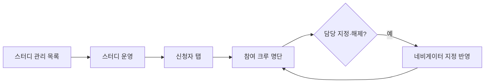
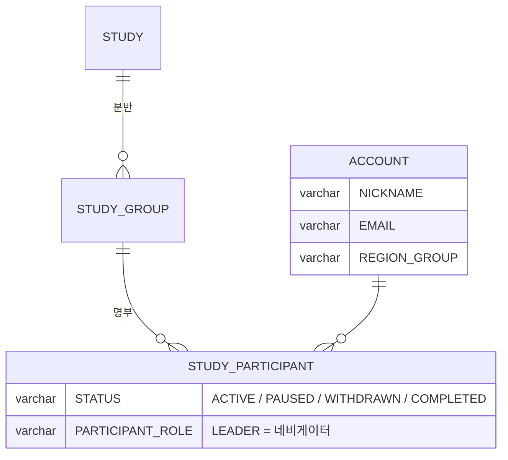

# 캡틴은 개별 스터디의 참석자를 볼 수 있다.

기준 프로토타입: 스터디 운영 — 신청자 탭 참여 크루 명단 (playground 운영 콘솔 · 스터디 운영)

## 1. 기본설명

· **진입·사용 흐름**

· **완료 기준**

1. 스터디 운영 화면에서 어느 스터디의 명단인지와 모집 상태를 알 수 있다
2. 그 스터디에 참여한 크루의 이름·이메일·지역·완주율·반을 볼 수 있다
3. 참여 인원과 정원을 함께 볼 수 있다
4. 지난 스터디 이력이 없는 크루는 「첫 참여」로 보인다
5. 크루를 이 스터디의 네비게이터로 지정하거나 해제할 수 있다. 여러 명을 지정할 수 있다

## 2. 화면명세

> **화면**: 스터디 운영 (운영 콘솔) — 머리 · 신청자 탭

### 1. 스터디 머리

- **내용**: 어느 스터디의 명단을 보고 있는지

### 1-1. 스터디명

- **데이터**: `STUDY.TITLE` (운영 콘솔은 한국어)

### 1-2. 모집 상태 · 공개 예정

- **내용**
  - 「모집중 · D-5」 · 「오늘 마감」 · 「모집 마감」 중 하나
  - 아직 공개하지 않았으면 「공개 예정」이 함께 붙는다
- **정책**
  - 머리는 상태만 말한다. 마감일의 실제 날짜는 정보 탭에 있다
  - 모집 상태는 `recruitState()` 한 곳에서 계산한다. 사용자 사이트와 같다

### 2. 탭

- **내용**: 정보 · 신청 폼 · 신청 결과 · 신청자 · 출석. 참여 명단과 반 편성은 신청자 탭에 있다

### 3. 참여 크루 명단

- **내용**: 이름 · 이메일 · 지역 · 완주율 · 반
- **정책**
  - 승인 단계는 없다. 신청한 사람이 곧 크루다
  - 완주율은 지난 스터디 이력이다. 이력이 없으면 숫자 대신 「첫 참여」
- **데이터**: `STUDY_PARTICIPANT` · `ACCOUNT`
- **조건**: 신청자 탭을 보고 있을 때

### 3-1. 참여 인원 / 정원

- **내용**: 「참여 크루 8/12」처럼 참여 인원과 정원
- **데이터**: 참여자 수 · `STUDY_RECRUITMENT.RECRUITMENT_CAPACITY`
- **조건**: 신청자 탭을 보고 있을 때

### 3-2. 담당 — 이 스터디의 네비게이터

- **내용**: 이 크루가 이 스터디를 맡았는가. 맡았으면 드러나고, 해제할 수단이 함께 있다
- **동작**
  - 캡틴이 크루를 이 스터디의 네비게이터로 지정하거나 해제한다
  - 여러 명을 지정할 수 있다
- **정책**
  - 역할은 스터디마다 따로 선다. 지정된 사람은 이 스터디에 한해 크루 명단 열람 · 정보 수정 · 출석 현황 수정 · 스터디 공지 발행을 할 수 있다
  - 다른 스터디에서는 크루일 뿐이다
  - 지정은 캡틴만 한다
  - 계정 권한(캡틴 · 크루)과 섞지 않는다
- **데이터**: `STUDY_PARTICIPANT.PARTICIPANT_ROLE` (쓰기)
- **조건**: 신청자 탭을 보고 있을 때

### 상태별 화면

| 상태 | 화면 | 카피 |
| --- | --- | --- |
| 기본 | 머리 · 명단 · 인원 | `참여 크루 N/M` |
| 공개 전 | 머리 | `공개 예정` |
| 이력 없음 | 완주율 칸 | `첫 참여` |

### 데이터 관계

### 비고

- 범위 밖: 반 편성 — [captain-assign-classes](../captain-assign-classes/PRD.md), 회차별 출석 — [captain-view-attendance-roster](../captain-view-attendance-roster/PRD.md), 제명
- 미구현: 담당 지정은 화면에서만 처리한다. 저장 API 가 없다

## 3. 시스템 요건

### 데이터

- 명단: 그 스터디의 `STUDY_PARTICIPANT` 와 계정 이름·이메일·지역, 소속 분반
- 완주율: 그 크루의 지난 스터디 이력. 이력이 없으면 null 로 보내고 화면은 「첫 참여」

### 처리

- 네비게이터 지정: `PARTICIPANT_ROLE = LEADER`, 해제: `MEMBER`

### 계산 규칙 (단일 정의)

- 모집 상태: `recruitState()` — [study-recruit-status/spec.md](../../../specs/study-recruit-status/spec.md)
- 완주율: 지난 참여 수 대비 완주 수 — 정의 위치 미정

### API

| 메서드 | 경로 | 권한 |
| --- | --- | --- |
| GET | 스터디 참여 명단 — `/api/admin` 아래, 미정 | 캡틴 |
| PATCH | 담당 지정·해제 — 미정 | 캡틴 |

### 권한

- 명단 열람: 캡틴, 그 스터디의 네비게이터
- 담당 지정: 캡틴만. 서버에서 검증한다

### 개인정보

- 이메일은 운영 콘솔에서만 보인다. 사용자 사이트 응답에 싣지 않는다

### 외부 연동

- 없음

## 4. 미확정

- 명단·담당 지정 API 경로
- 완주율 정의와 계산 위치
- 공동 네비게이터(`CO_LEADER`)를 이 화면에서 구분할지
