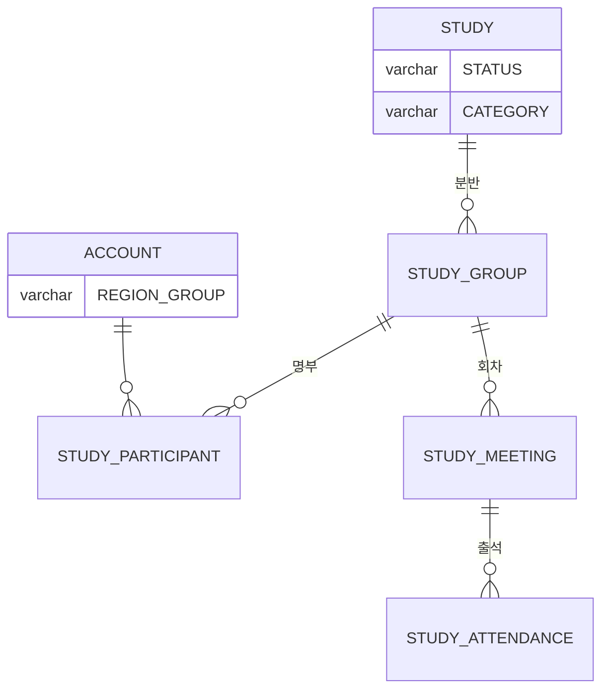

# 캡틴은 운영 현황을 한 화면에서 볼 수 있다.

기준 프로토타입: 운영 콘솔 › 대시보드 — https://playground.studyclub-plusplus.com/proto/console

## 1. 기본설명

### 하는 일

- 지금 굴러가는 스터디와 앞으로 들어올 것, 곧 있을 행사를 **한 화면에서** 훑는다
- 크루 규모 · 평균 출석률 · 1인당 참여 스터디로 커뮤니티가 어떻게 움직이는지 본다
- 출석률이 어느 방향으로 가고 있는지, 어느 분야를 많이 하고 있는지 확인한다

### 완료 기준

1. 활성 크루·평균 출석률·1인당 참여 스터디·커뮤니티 멤버 한 줄 조회
2. 진행중·모집중 스터디와 예정 행사를 건수와 함께 조회
3. 모집 마감·행사까지 남은 일수 표기
4. 평균 출석률 전주 대비와 최근 12주 추세
5. 크루 지역 분포
6. 카테고리별 스터디 수 — 진행중·누적 전환
7. 항목에서 해당 스터디·목록으로 이동

---

## 2. 화면명세

### 1 — 제목 줄
- **내용**: 「대시보드」

#### 1-1 — 기준 · 갱신 시각
- **내용**: 이 화면의 수가 **어느 범위**이고 **언제 읽은 것**인가
- **정책**
  - 범위와 시각을 함께 적는다 — 둘 다 없으면 오늘 수인지 알 수 없다
  - 시각은 **보는 사람의 시간대**로 바꿔 적고 약칭을 붙인다 (KST · ET · PT) — [POL-0006](../../_registry/policies/POL-0006-timezone.md)

### 2 — KPI 카드
- **내용**: 커뮤니티의 규모와 건강을 넷으로 요약해 알려준다
- **정책**
  - 넷을 같은 비중으로 둔다. 하나를 경고처럼 드러내지 않는다
  - 넷 다 전기간을 센다. 기간을 고를 수 없다

#### 2-1 — 활성 크루
- **내용**: 지금 스터디를 하고 있는 **사람이 몇 명인가**. 세는 범위를 함께 알린다
- **동작**: 누르는 자리가 아니다 — 수만 읽는다
- **정책**
  - 참여 건이 아니라 사람을 센다 — 한 사람이 두 스터디에 있어도 1이다
  - **2-3 의 분모와 같은 집합이어야 한다.** 모수가 갈리면 같은 화면의 두 카드가 다른 전체를 말한다
  - **유저 목록으로 보내지 않는다.** 그 목록은 가입자 전체라 이 카드와 모수가 다르다 — 눌러서 간 곳의
    수가 다르면 어느 쪽이 맞는지 되묻게 된다. 그 때문에 유저 목록에 활성 크루 필터를 새로 만들지도 않는다
- **데이터**: 진행 중 스터디의 참여자 (동일인 중복 제거)

#### 2-2 — 평균 출석률
- **내용**: 전체 스터디를 합친 출석률. 정수 %로, 지각을 포함해 센다는 사실과 함께
- **데이터**: (출석 + 지각 × 0.5) / 대상 회차. 휴가는 분모에서 뺀다

#### 2-2-1 — 전주 대비
- **조건**: 지난주 값이 있을 때
- **내용**: 지난주보다 얼마나 오르고 내렸는가 (%p). 오름과 내림을 구분해 알린다
- **정책**
  - **이 카드는 내림을 나쁜 변화로 다룬다.** 인원 수 카드는 반대로 오름이 좋은 변화다
  - 지난주 값이 없으면 변화를 아예 보여주지 않는다 — 「–」 를 두면 「변화 없음」으로 읽힌다

#### 2-3 — 크루 1인당 참여 스터디
- **내용**: 한 사람이 평균 몇 개의 스터디를 하고 있는가. 소수 한 자리까지
- **데이터**: 진행 중 스터디의 참여 건수 ÷ 활성 크루(2-1)

#### 2-4 — 커뮤니티 멤버
- **내용**: 가입한 사람이 모두 몇 명인가. 보조 문구는 **「온보딩 완료 회원」**
- **정책**
  - 가입 전체 수다 — 스터디를 하고 있는 사람(2-1)과 다른 모수다
  - 지역은 여기 적지 않는다. 바로 아래 4 가 같은 것을 더 자세히 말한다

### 3 — 현황 보드
- **내용**: 지금 굴러가는 것 · 앞으로 들어올 것 · 곧 있을 것 셋을 각각 몇 건인지와 함께
- **정책**
  - 셋을 동시에 보여준다 — 고르게 하면 고르지 않은 쪽의 일은 없는 일이 된다
  - 각 묶음은 최대 4건까지 보여주고 나머지는 건수로 접는다
  - 건수가 0이든 최대든 이 영역의 높이는 같다

#### 3-1 — 진행중 스터디
- **내용**: 지금 굴러가는 스터디의 이름. 이름순
- **데이터**: 기수 상태가 `ONGOING` 인 것 — 날짜로 계산하지 않는다 ([POL-0002](https://github.com/StudyClub-PlusPlus/studyclub-engineering/blob/beta/01-planning/_registry/policies/POL-0002-study-status.md))
- **동작**
  - 행을 누르면 그 스터디로 간다
  - 「전체 보기」·「외 N개」를 누르면 **상태 「진행 중」**이 걸린 스터디 목록으로 간다
- **정책**: 이름 외의 값(출석률·회차)은 적지 않는다 — 그 수가 무슨 뜻인지 설명할 자리가 여기 없다

#### 3-2 — 모집중 스터디
- **내용**: 스터디 이름과 **모집이 며칠 남았는가**. 마감일과 남은 일수를 함께
- **동작**: 「전체 보기」·「외 N개」를 누르면 **상태 「개설」 + 모집중**이 걸린 목록으로 간다
- **데이터**: 기수 상태가 `OPEN` 이고 모집 상태가 `RECRUITING` 인 것
- **정책**
  - 마감이 가까운 것부터
  - 임박(7일 이내) · 오늘 마감 · 마감 경과 셋을 서로 구분해 알린다. 색만으로 가르지 않는다

#### 3-3 — 예정 행사
- **조건**: 행사 기능은 MVP 범위 밖이다
- **내용**: 제목 옆에 **「준비 중」**, 본문에 **「행사 일정 안내 준비 중」**
- **정책**: 칸을 지우지 않는다 — 나중에 넣을 때 보드 배치가 다시 흔들린다

#### 3-4 — 외 N개
- **조건**: 항목이 4개를 넘을 때
- **내용**: 보여주지 못한 것이 몇 건 남았는가
- **동작**: 누르면 전체 보기와 같은 곳으로 간다

### 4 — 크루 지역 분포
- **내용**: 크루가 어느 지역에 얼마나 있는가 — 지역별 비율과 인원을 함께, 그 지역의 시간대와 같이
- **정책**
  - **한국 KST / 북미 동부 ET / 북미 서부 PT** 세 줄 — [POL-0006](../../_registry/policies/POL-0006-timezone.md)
  - 시간대는 계절을 타지 않는 이름으로 적는다 (PST/PDT 가 아니라 PT)
  - 「기타 · 미분류」 칸을 두지 않는다 — 시간대는 가입 때 받는 필수값이라 빈 사람이 없다
- **데이터**: 활성 크루의 거주 지역

### 5 — 평균 출석률 추세
- **내용**: 최근 12주 출석률이 어떻게 움직였는가. 주 단위로, 시간 순서대로
- **동작**: 한 주를 집으면 그 주의 출석률과 밑재료를 알린다 — 「2026-08-24 주 · 출석률 68% (출석 412 / 대상 606)」
- **정책**
  - **체크된 회차가 없는 주는 값이 없는 것으로 다룬다. 0% 로 알리지 않는다** — 쉬어간 주가 폭락으로 보이면 없는 문제를 찾게 된다
  - 값이 한 주뿐이어도 그 값을 알린다 — 이어지는 선이 없을 뿐이다

#### 5-1 — 12주 평균
- **내용**: 그 기간의 평균값. 각 주가 평균보다 위인지 아래인지 견줄 수 있게 함께
- **정책**: 평균은 값이 있는 주만으로 계산한다

### 6 — 카테고리별 스터디 수
- **내용**: 어느 분야에 스터디가 몇 개씩 있는가. 많은 분야부터, 서로의 크기를 견줄 수 있게
- **동작**
  - 행 전체가 링크다
  - 「진행중」에서 누르면 **해당 카테고리 + 상태 「진행 중」**이 걸린 목록으로 간다
  - 「누적」에서 누르면 **해당 카테고리 + 상태 전체**가 걸린 목록으로 간다
- **정책**
  - 출석률을 여기 얹지 않는다 — 이 카드가 답하는 질문은 「어느 분야를 얼마나 하고 있나」 하나다
  - **카테고리는 스터디마다 하나다.** 합계가 총 스터디 수와 맞는다 — [POL-0003](../../_registry/policies/POL-0003-study-fields.md)
- **데이터**: 목록으로 넘길 때는 표시 라벨이 아니라 **카테고리 코드**를 쓴다

#### 6-1 — 진행중 · 누적
- **내용**: 세는 범위를 고를 수 있다 — 「진행중」 · 「누적」. 기본값은 「진행중」
- **동작**: 고른 범위로 개수와 순서가 다시 계산된다. 그 범위에 0개인 카테고리는 나오지 않는다
- **정책**
  - 「진행중」은 종료된 스터디를 뺀다. 「누적」은 종료분까지 센다
  - 고른 범위는 저장하지 않는다 — 새로고침하면 기본값으로 돌아간다

### 상태별 화면

| 상태 | 화면 | 카피 |
|---|---|---|
| 기본 | KPI 4장 · 보드 3칸 · 지표 3카드 | — |
| 보드 칸이 비었을 때 | 칸 높이를 유지한 채 가운데 안내만 | 「모집중 스터디가 없습니다」 |
| 전주 값 없음 | 값만 표시, 변화 영역 없음 | — |
| 출석 기록 없음 | 변화 대신 안내 | 「아직 출석 기록이 없습니다.」 |
| 카테고리 0건 | 막대 대신 안내 | 「해당하는 스터디가 없습니다.」 |

### 데이터 관계

### 비고

- 추세 차트만 최근 12주를 본다. 나머지는 전기간이다
- 자동 갱신 없음 — 새로고침으로만 다시 읽는다
- **범위 밖** — 스터디 관리 · 반 편성 · 출석 명부 · 유저 관리 · 행사 기능
- **미구현** — 위젯별 로딩·오류 상태. 지금은 한 번에 그려진다
- 상태 이름은 [POL-0002](https://github.com/StudyClub-PlusPlus/studyclub-engineering/blob/beta/01-planning/_registry/policies/POL-0002-study-status.md) 를 따른다 — 작성 중 · 개설 · 진행 중 · 종료 · 운영 종료. 스터디 목록의 상태 축과 같은 값이다
- **집계 기준은 주현님 명세(PR #90 `specs/dashboard/spec.md`)와 맞춰야 한다** — ACTIVE 고유 회원·PAUSED 제외·한국 시간 주간 비교 등

---

## 3. 시스템 요건

### 데이터

| 값 | 출처 | 비고 |
|---|---|---|
| 활성 크루 | 진행 중 스터디의 참여자 | 사람 단위. 동일인 중복 제거 |
| 참여 건수 | 사람 × 스터디 | 같은 사람의 같은 스터디 중복 등록은 1건 |
| 평균 출석률 | 계산값 | 저장하지 않는다 |
| 주별 출석률 | 회차 날짜 기준 주간 집계 | 체크된 회차가 없는 주는 값 없음 |
| 카테고리별 스터디 수 | 스터디의 카테고리 | **스터디마다 하나.** 합계가 총 스터디 수와 맞는다. 진행중 / 누적 두 벌 |
| 커뮤니티 멤버 | 온보딩을 마친 가입자 | 활성 크루와 다른 모수 |

### 계산 규칙 (저장하지 않는 값)

| 값 | 식 | 단일 정의 위치 |
|---|---|---|
| 평균 출석률 | (출석 + 지각 × 0.5) / 대상 회차 | 출석률 계산 모듈 |
| 대상 회차 | 체크된 회차 중 휴가를 뺀 수 | 같은 모듈 |
| 1인당 참여 스터디 | 참여 건수 ÷ 활성 크루 | 대시보드 집계 |
| 전주 대비 출석률 | 최근 주 − 직전 주 (%p) | 같은 곳 |

> 출석률 식은 출석 명부·회원 화면과 **같은 모듈**을 쓴다. 한 곳에서만 계산하고 모든 화면이 공유한다.

### API · 권한

| 메서드 | 경로 | 응답 |
|---|---|---|
| GET | `/api/admin/stats/summary` | activeCrew · attendanceRate · studiesPerCrew · communityMembers · delta |
| GET | `/api/admin/studies?status=ongoing&limit=4` | total · items(id, title) |
| GET | `/api/admin/studies?status=recruiting&sort=deadline_asc&limit=4` | total · items(id, title, recruitDeadline) |
| GET | `/api/admin/stats/attendance-trend?weeks=12` | average · points(weekStart, rate, attended, target) |
| GET | `/api/admin/stats/studies-by-category` | items(category, categoryCode, running, total) |

- 위젯별로 따로 부른다. 하나가 실패해도 전체가 에러 화면으로 바뀌지 않는다
- 캡틴만 연다. **라우팅 가드만으로 처리하지 않고** 모든 `/api/admin/*` 에서 서버가 역할을 검증한다 — [POL-0001](../../_registry/policies/POL-0001-roles.md)

## 4. 미확정

- 집계를 서버 한 곳에서 할지
- 「주」의 경계를 어느 시간대 기준으로 자를지
- 활성 크루의 「진행 중」에 모집중(`OPEN`) 스터디를 포함할지
