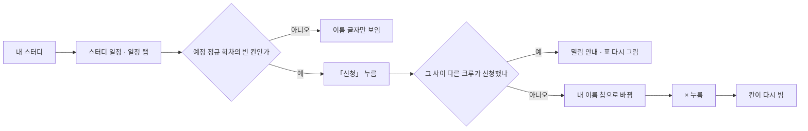
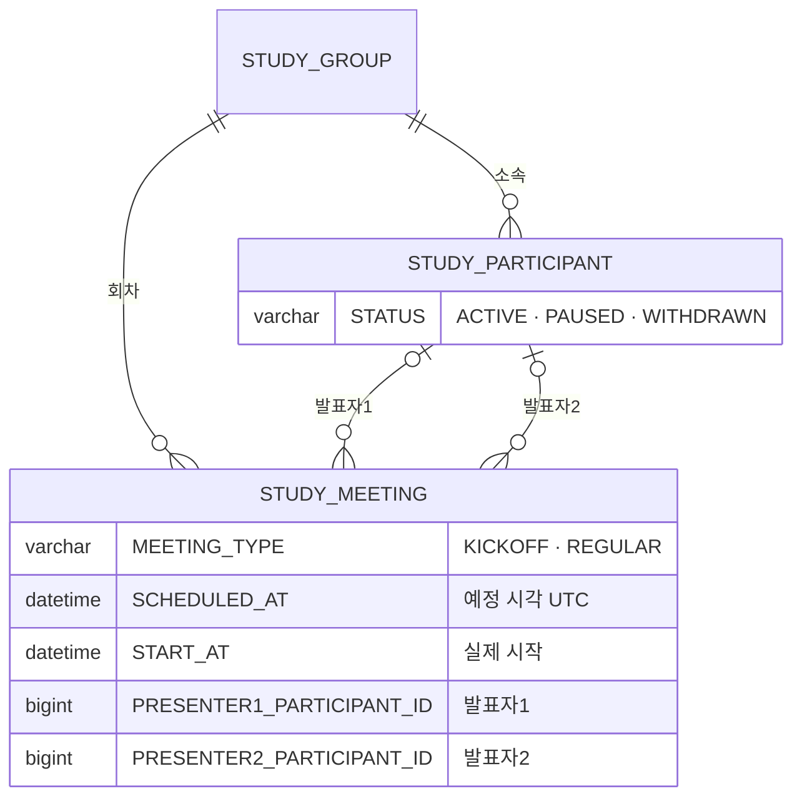

# 크루는 발표자를 신청할 수 있다.

기준 프로토타입: 스터디 일정 — 일정 탭, 크루로 볼 때 (playground 사용자 사이트 · 내 스터디 → 스터디 일정)

화면 캡처 (2026-10-06): [크루 일정](../navigator-register-sessions/assets/4-crew-schedule.jpg)

## 1. 기본설명

· **배경**

구글 시트에서는 킥오프 때 정한 발표 순서를 각자 시트에 이름을 적어 채웠다. 누구나 아무 칸이나 고칠 수 있어 남의 이름을 지우거나 같은 칸에 두 사람이 적는 일이 생겼다. 웹에서는 크루가 **빈 칸에만, 자기 이름만** 넣고 뺄 수 있게 하고, 먼저 저장한 사람이 칸을 갖는다.

· **하는 일**

- 예정 회차의 빈 발표자 칸에 내 이름을 넣는다 (선착순)
- 내가 들어간 칸에서 내 이름을 뺀다
- 다른 크루가 먼저 신청한 칸은 그 사실을 보고 다른 칸을 고른다
- 발표 배정은 출석부의 발표 표시 · 발표 횟수로 이어진다 ([crew-view-attendance-record](../crew-view-attendance-record/PRD.md))

· **진입·사용 흐름**

· **완료 기준**

1. 예정 정규 회차의 빈 발표자 칸에 「신청」 표시
2. 신청 즉시 저장 — 별도 저장 버튼 없음
3. 내 이름 칩의 × 로 즉시 취소
4. 한 회차 한 칸 — 이미 들어간 회차에는 「신청」 없음
5. 다른 사람이 들어간 칸은 이름만 표시, 해제 불가
6. 동시 신청 시 먼저 저장된 사람이 차지, 늦은 사람에게 안내
7. 킥오프·시작한 회차는 신청·취소 없음
8. 출석부의 발표 표시·발표 횟수에 즉시 반영

## 2. 화면명세

> **화면**: 스터디 일정 — 일정 탭 (크루)

스터디 정보 카드 · 시간대 탭 · 일정 표의 나머지 열은 [회차 등록 PRD](../navigator-register-sessions/PRD.md) 3 · 8 · 11과 같다. 크루에게 일정 표는 글자 표이고, 고칠 수 있는 칸은 발표자 칸뿐이다.

### 1. 신청 칩

- **내용**: 빈 발표자 칸을 칸 너비만큼 채우는 「신청」 칩. 포인트 색 실선 테두리 · 포인트 색 글자. `+` 기호 · 점선을 쓰지 않는다
- **동작**: 누르면 그 칸에 나를 넣고 바로 저장한다
- **정책**
  - 선착순 — 비어 있는 칸에만 넣는다
  - 한 회차에 한 칸 — 같은 회차의 다른 칸에 내가 있으면 이 칸에는 칩이 없다
  - 신청 수에 상한을 두지 않는다 (회차마다 한 칸씩이면 여러 회차를 맡을 수 있다)
- **조건**: 크루 · 예정 정규 회차 · 빈 칸 · 같은 회차에 내가 없음
- **데이터**: `STUDY_MEETING.PRESENTER1_PARTICIPANT_ID` · `PRESENTER2_PARTICIPANT_ID`

### 2. 내 이름 칩

- **내용**: 포인트 색 바탕 칩 「내 이름 ×」. 이름이 길면 말줄임
- **동작**: × 를 누르면 그 칸에서 나를 빼고 바로 저장한다. 확인 창을 띄우지 않는다 — 다시 「신청」을 누르면 되돌린다(그 사이 다른 크루가 가져가지 않았다면)
- **정책**
  - × 는 24px 이상 누를 자리를 둔다
  - 다른 사람 이름은 칩이 아니라 글자로만 보인다 — 뺄 수 없다
- **조건**: 크루 · 예정 정규 회차 · 그 칸이 나

### 3. 다른 사람 · 지난 회차 · 킥오프

- **내용**
  - 다른 사람이 들어간 칸: 이름 글자. 참여를 중단한 사람은 「이름 (참여 종료)」
  - 시작한 회차: 이름 글자 또는 「—」. 줄 전체가 흐리다
  - 킥오프: 발표자 칸이 없다
- **정책**: 시작한 회차는 출석이 기록돼 있어 발표 배정도 고정한다

### 4. 신청 밀림 안내

- **내용**: 표 위 경고 한 줄 「방금 다른 크루가 N회차 발표자1로 신청했습니다.」
- **동작**: 저장하지 않고 표를 서버 값으로 다시 그린다. 다른 칸 · 다른 회차를 고르면 된다
- **조건**: 누르기 직전 다른 크루가 그 칸을 먼저 저장했을 때 (서버 409 `PRESENTER_SLOT_TAKEN`)

### 5. 결과 알림

- **내용**: 화면에 성공 문구를 두지 않는다. 칩이 바뀌는 것으로 충분하다
- **정책**: 스크린리더에만 「N회차 발표자1로 신청했습니다.」 · 「N회차 발표자1 신청을 취소했습니다.」를 알린다
- **접근성**: 「신청」 칩 이름은 「N회차 발표자1 신청」, × 는 「N회차 발표자1 신청 취소」

### 상태별 화면

| 상태 | 화면 | 카피 |
| --- | --- | --- |
| 기본 | 빈 칸에 「신청」 칩 | `신청` |
| 신청함 | 내 이름 칩 + × | — (스크린리더 `N회차 발표자1로 신청했습니다.`) |
| 처리중 | 누른 칩 잠김 | — |
| 신청 밀림 | 표 위 경고 · 표 다시 그림 | `방금 다른 크루가 N회차 발표자1로 신청했습니다.` |
| 이미 시작함 | 표 다시 그림 · 칩 사라짐 | `이미 시작한 회차라 바꿀 수 없습니다.` |
| 그 밖의 실패 | 표 위 경고 | `신청하지 못했습니다. 잠시 후 다시 시도해 주세요.` |

### 데이터 관계

### 비고

- 범위 밖: 캡틴 · 네비게이터의 발표자 지정 · 변경(회차 수정 — [회차 등록 PRD](../navigator-register-sessions/PRD.md) 9), 신청 알림, 대기 · 교환 요청
- 발표자1이 메인, 발표자2가 보충이라는 나눔은 스터디 규칙에 적는 운영 관례다. 화면 · 서버는 두 칸을 똑같이 다룬다
- 참여를 중단하면 그가 맡은 **예정** 회차의 발표자 칸은 서버가 비운다. 지난 회차의 배정은 남긴다
- 미구현: 프로토타입은 브라우저 저장 값으로 선착순을 흉내 낸다 (누르기 직전 저장값을 다시 읽는다)

## 3. 시스템 요건

### 데이터

| 대상 | 필드 | 크루 쓰기 |
| --- | --- | --- |
| 회차 | `PRESENTER1_PARTICIPANT_ID` · `PRESENTER2_PARTICIPANT_ID` | 빈 칸에 자기 명부 행 ID 만 넣고, 자기만 뺀다 |

### 처리

- 분반 잠금 → 권한 판정 → 대상 회차 잠금 순서로 처리한다. 같은 칸에 동시에 신청하면 먼저 잠근 쪽이 이긴다
- 신청: 칸이 차 있으면 409 `PRESENTER_SLOT_TAKEN`. 같은 회차 다른 칸에 내가 있으면 409 `PRESENTER_ALREADY_ASSIGNED`
- 취소: 그 칸이 내가 아니면 409 `PRESENTER_NOT_ME`
- 시작한 회차(`now >= SCHEDULED_AT` 또는 `START_AT` 있음)는 409 `MEETING_ALREADY_STARTED`. 킥오프는 400
- 화면은 409 를 받으면 회차 목록을 다시 불러 표를 다시 그린다

### API

| 메서드 | 경로 | 권한 |
| --- | --- | --- |
| GET | `/api/studies/{studyId}/meetings` 회차 · 발표자 · 참여자 · `me` | 그 분반 활성 참여자 |
| PUT | `/api/studies/{studyId}/meetings/{meetingId}/presenters/{slot}/me` 신청 | 그 분반 활성 참여자 |
| DELETE | `/api/studies/{studyId}/meetings/{meetingId}/presenters/{slot}/me` 취소 | 그 분반 활성 참여자 |

`slot` 은 `1` · `2`. 응답은 204. 계약 정본: [회차 스펙 「발표 신청 · 취소」](../../../specs/study-meeting/spec.md).

### 권한

- 그 분반에 내 활성 명부 행(`ACTIVE` · `PAUSED`)이 있어야 한다. 캡틴 · 네비게이터도 이 API 로는 자기만 넣고 뺀다
- 남을 넣거나 빼는 것은 회차 수정(PUT `/meetings/{meetingId}`) — 그 분반 네비게이터 · 그 스터디를 만든 캡틴만
- 서버에서 검증한다. 화면에서 칩을 숨기는 것은 편의일 뿐이다

### 외부 연동

- 없음

### 현재 백엔드와 차이 (2026-10-06 `beta`)

- 발표자 컬럼(`PRESENTER1/2_PARTICIPANT_ID`) · `MEETING_TYPE` 이 없다
- 신청 · 취소 API 가 없고, 회차 목록 GET 이 네비게이터 · 캡틴만 허용한다
- 노션 작업: #57 `[BE] 회차·분반 컬럼 추가 마이그레이션`, #58 `[BE] 사용자 사이트 캡틴 판정·보기/고치기 권한 분리`, #59 `[BE] 회차 API 확장`, #60 `[BE] 발표 신청·취소 API`, #62 `[BE] 킥오프 자동 생성·하차 시 발표자 비우기`

## 4. 미확정

- 한 사람이 맡을 수 있는 발표 수에 상한을 둘지 — 지금은 두지 않는다
- 발표자1이 빠진 날 발표자2가 대신한 것을 따로 기록할지 — 지금은 네비게이터가 일정의 발표자를 고쳐서 남긴다
- 신청 마감(예: 회차 하루 전)을 둘지 — 지금은 회차 시작 전까지 언제든
- 상태별 화면의 처리중 · 이미 시작함 · 그 밖의 실패 문구는 프로토타입에 없다(브라우저 저장이라 실패가 없다). 구현 때 확정
