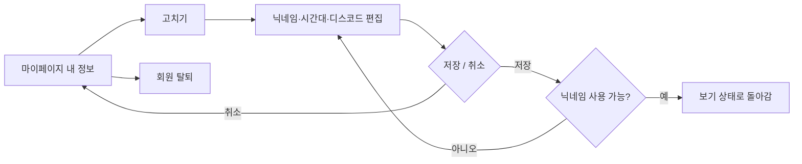
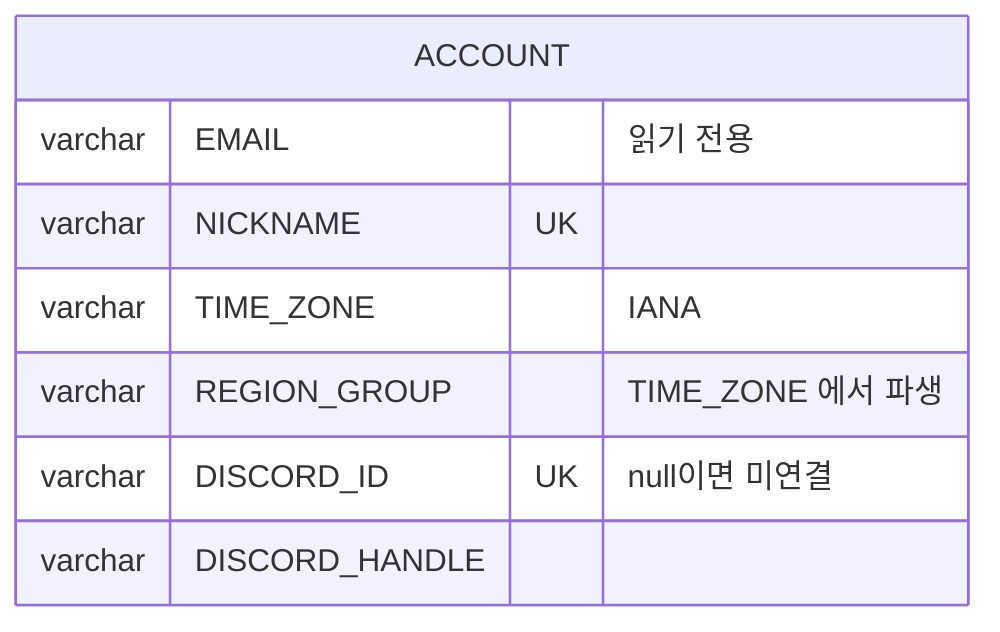

# 크루는 프로필을 수정할 수 있다.

기준 프로토타입: 마이페이지 (playground 사용자 사이트 · 마이페이지 내 정보)

## 1. 기본설명

· **진입·사용 흐름**

· **완료 기준**

1. 마이페이지에서 닉네임·이메일·시간대·디스코드 연결 상태 조회
2. 같은 자리에서 닉네임·시간대·디스코드·마케팅 수신 한 번에 수정
3. 닉네임은 가입과 같은 규칙으로 검사 — 자기 현재 닉네임은 중복 아님
4. 쓸 수 없는 값이거나 확인 중이면 저장 차단
5. 저장 시 보기 상태로 복귀 및 즉시 반영
6. 취소 시 수정값 폐기
7. 디스코드 연결·해제
8. 이메일 수정 불가
9. 회원 탈퇴 지면으로 이동

## 2. 화면명세

> **화면**: 마이페이지 — 내 정보

### 1. 내 정보

- **내용**: 닉네임 · 이메일 · 시간대 · 디스코드 연결 상태
- **동작**: 고치기 전에는 값만 보인다. 고치기를 누르면 같은 자리에 입력 수단이 들어선다
- **정책**
  - 보기와 편집은 같은 카드 안에서 바뀐다. 다른 지면으로 가지 않는다
  - 이메일은 읽기 전용이다
- **데이터**: `ACCOUNT.NICKNAME` · `ACCOUNT.EMAIL` · `ACCOUNT.TIME_ZONE` · `ACCOUNT.DISCORD_ID`·`DISCORD_HANDLE`

### 1-1. 고치기

- **내용**: 편집을 시작하는 자리. 무엇을 고치는지 짚으면 알려 준다
- **동작**
  - 누르면 카드 전체가 편집 상태가 된다
  - 편집 중에는 이 자리가 보이지 않는다
- **정책**: 값마다 따로 고치지 않는다. 한 번에 고치고 한 번에 저장한다

### 2. 닉네임

- **내용**
  - 지금 닉네임
  - 현재 글자수와 상한
  - 한 줄로 규칙 또는 지금 값의 상태
- **동작**
  - 한글 조합 중에는 검사하지 않는다
  - 형식을 먼저 보고, 형식이 맞으면 중복을 묻는다
- **정책**
  - 규칙은 가입과 같다 — [crew-google-login-onboarding](../crew-google-login-onboarding/PRD.md) 닉네임 참조
  - 지금 쓰는 내 닉네임과 같은 값은 중복으로 보지 않는다
  - 상태 문구는 도움말 자리를 바꿔 쓴다. 아래 요소가 밀리지 않는다
- **데이터**: 비교값은 앞뒤 공백 제거 → NFC → 소문자. 저장값은 입력 그대로
- **조건**: 편집 상태일 때

### 3. 시간대

- **내용**: 고른 지역. 편집 상태에서는 고르는 자리가 된다
- **정책**
  - 선택지는 가입과 같다: 한국 · 서울 / 북미 동부 / 북미 서부
  - 이 값이 거주 지역이고, 반을 가르는 단위다
- **데이터**: `ACCOUNT.TIME_ZONE` (IANA id). 지역(`REGION_GROUP`)은 여기서 파생한다

### 4. 디스코드

- **내용**: 연결됐으면 디스코드 계정 이름, 아니면 「연결 안 됨」
- **동작**: 편집 상태에서만 연결하기 · 연결 해제가 보인다
- **데이터**: `ACCOUNT.DISCORD_ID` · `ACCOUNT.DISCORD_HANDLE` (선택 수집 항목)

### 5. 저장 · 취소

- **동작**
  - 저장 → 보기 상태로 돌아가고 값이 바로 반영된다
  - 닉네임이 쓸 수 없는 값이거나 확인 중이면 저장이 눌리지 않는다
  - 취소 → 고친 값을 버리고 보기 상태로 돌아간다
- **조건**: 편집 상태일 때

### 6. 회원 탈퇴

- **내용**: 회원 탈퇴로 가는 링크
- **동작**: 누르면 탈퇴 지면으로 간다
- **정책**
  - 보기·편집 어느 상태에서도 같은 자리에 있다
  - 찾을 수 있되 주액션보다 드러나지 않는다
- **작업**: 탈퇴 지면은 [crew-leave](../crew-leave/PRD.md)

### 상태별 화면

| 상태 | 화면 | 카피 |
| --- | --- | --- |
| 기본 | 값만 보이는 카드 | — |
| 편집 | 입력 수단이 들어선 카드 · 저장 · 취소 | — |
| 검증 실패 | 닉네임 상태 줄, 저장 불가 | 형식 오류 · 중복 문구 |
| 처리중 | 닉네임 확인 중, 저장 불가 | 확인 중 |
| 디스코드 미연결 | 디스코드 값 | `연결 안 됨` |
| 완료 | 보기 상태, 새 값 | — |

### 데이터 관계

### 비고

- 범위 밖: 프로필 사진·직함·국가·도시 수정, 이메일 변경
- 미구현: 저장은 브라우저에만 한다. 저장 API 가 없다

## 3. 시스템 요건

### 데이터

| 필드 | 쓰기 | 제약 |
| --- | --- | --- |
| NICKNAME | O | 가입과 같은 형식. 정규화 값 기준 유일 |
| TIME_ZONE | O | 한국 · 북미 동부 · 북미 서부의 IANA id 중 하나 |
| REGION_GROUP | 서버 계산 | TIME_ZONE 에서 파생. 클라이언트가 보내지 않는다 |
| DISCORD_ID, DISCORD_HANDLE | 연동 흐름으로만 | 연결 해제 시 null |
| EMAIL | X | 읽기 전용 |

### 처리

- 저장은 바뀐 필드만 받는다
- 닉네임 중복은 저장 시 서버가 다시 판정한다. 본인 계정은 비교 대상에서 뺀다
- 실패 응답: 400 형식 · 409 중복 · 401 세션 만료. 실패해도 입력값은 화면에 남긴다

### API

| 메서드 | 경로 | 권한 |
| --- | --- | --- |
| GET | `/auth/me` | 로그인 |
| GET | `/api/nicknames/availability` | 로그인 |
| PATCH | 프로필 저장 — 미정 | 로그인 본인 |
| POST | `/api/me/discord/link` | 로그인 본인 |

디스코드 연동 계약은 [study-application/spec.md](../../../specs/study-application/spec.md).

### 권한

- 본인만 자기 프로필을 고친다. 서버에서 토큰의 계정으로만 저장한다

### 외부 연동

- Discord OAuth: 연결 실패 시 연결 안 됨 상태를 유지하고 다시 시도할 수 있다

## 4. 미확정

- 프로필 저장 API 경로와 스펙 위치
- 디스코드 연결 해제 API
