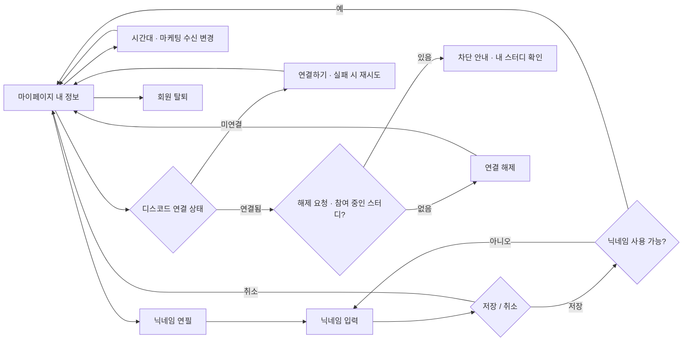
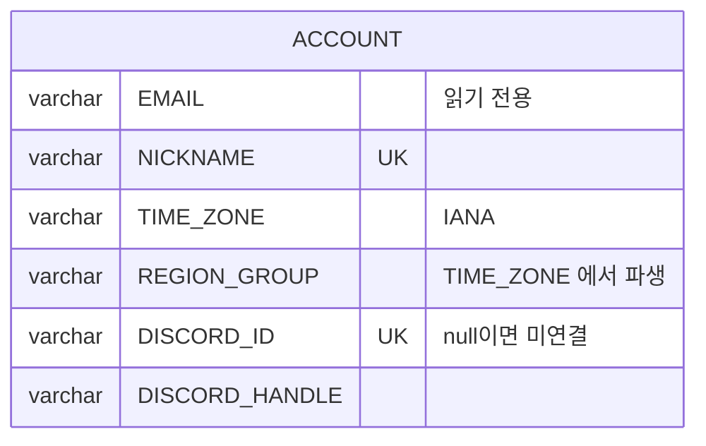

# 크루는 프로필을 수정할 수 있다.

기준 프로토타입: 마이페이지 (playground 사용자 사이트 · 마이페이지 내 정보)

## 1. 기본설명

· **진입·사용 흐름**

```mermaid
flowchart LR
  A["마이페이지 내 정보"] --> B["닉네임 연필"]
  B --> C["닉네임 입력"]
  C --> D{"저장 / 취소"}
  D -->|취소| A
  D -->|저장| E{"닉네임 사용 가능?"}
  E -->|아니오| C
  E -->|예| A
  A --> H["시간대 · 마케팅 수신 변경"] --> A
  A --> I{"디스코드 연결 상태"}
  I -->|미연결| J["연결하기 · 실패 시 재시도"] --> A
  I -->|연결됨| K{"해제 요청 · 참여 중인 스터디?"}
  K -->|있음| L["차단 안내 · 내 스터디 확인"]
  K -->|없음| M["연결 해제"] --> A
  A --> G["회원 탈퇴"]
```

· **완료 기준**

1. 마이페이지에서 닉네임·이메일·시간대·디스코드 연결 상태·마케팅 수신 조회
2. 줄마다 따로 저장 — 닉네임만 입력 후 저장, 시간대·마케팅 수신은 바꾸면 바로 저장
3. 닉네임은 가입과 같은 규칙으로 검사 — 자기 현재 닉네임은 중복 아님
4. 쓸 수 없는 값이거나 확인 중이면 닉네임 저장 차단
5. 저장 시 즉시 반영 및 저장 표시
6. 닉네임 취소 시 수정값 폐기
7. 미연결 시 연결하기, 연결 후 계정 이름 및 연결 해제 표시
8. 참여 중 스터디가 하나 이상이면 해제 차단 및 연결 유지
9. 모든 스터디 참여 중단 후 재시도 안내와 내 스터디룸 이동
10. 연결 실패·인증 취소 시 미연결 유지 및 재시도
11. 이메일 수정 불가
12. 회원 탈퇴 지면으로 이동

## 2. 화면명세

> **화면**: 마이페이지 — 내 정보

### 상태별 화면

| 상태 | 화면 | 카피 |
| --- | --- | --- |
| 기본 | 닉네임 · 이메일, 시간대 선택 · 디스코드 · 마케팅 수신 줄 | — |
| 닉네임 편집 | 닉네임 줄만 입력칸 · 취소 · 저장 | — |
| 검증 실패 | 닉네임 상태 줄, 저장 불가 | 형식 오류 · 중복 문구 |
| 처리중 | 닉네임 확인 중, 저장 불가 | 확인 중 |
| 디스코드 미연결 | 연결하기 | `연결 안 됨` |
| 연결됨 | 계정 이름과 연결 해제 | `@jiwon_dev` (예시) |
| 해제 차단 | 연결 유지 · 내 스터디 확인하기 | `참여 중인 스터디가 있어 디스코드 연결을 해제할 수 없어요.` |
| 연결 실패·취소 | 재시도 | 연결 결과별 오류 안내 |
| 마케팅 수신 | 동의 여부를 체크 상태로. 누르면 바로 저장 | `스터디 소식과 행사 안내를 이메일로 받기` |
| 완료 | 새 값 · 줄 끝 저장 표시 | `저장됨` |

### 데이터 관계

```mermaid
erDiagram
  ACCOUNT {
    varchar EMAIL "읽기 전용"
    varchar NICKNAME UK
    varchar TIME_ZONE "IANA"
    varchar REGION_GROUP "TIME_ZONE 에서 파생"
    varchar DISCORD_ID UK "null이면 미연결"
    varchar DISCORD_HANDLE
  }
```

### 비고

- 범위 밖: 직함·국가·도시 수정, 이메일 변경
- 프로필 사진: 2026-10-07 결정으로 받는다 — 내 정보 카드에서 올리고 지운다. 정책 [POL-0007](../../_registry/policies/POL-0007-account-data.md), 스펙 [profile-image](../../../specs/profile-image/spec.md). 사진 영역의 위치·문구는 이 PRD 에 아직 없다 (기획 확정 필요)
- Playground 데이터는 브라우저에만 저장. 실제 프로필 저장 API는 구현됨

<!-- spec:start profile -->

> Playground는 브라우저에만 저장한다. 실제 프로필 저장 API는 존재하며, 디스코드 계정 이름 응답·해제 API는 후속 개발 대상이다

### 1 — 내 정보

- **내용**: 닉네임과 이메일, 그 아래 시간대 · 디스코드 · 마케팅 수신 줄
- **동작**: **줄마다 스스로 저장된다**. 카드 전체를 편집 상태로 바꾸지 않는다
- **정책**
  - 닉네임은 형식·중복 검사 후 저장한다. 디스코드는 연결 성공·해제 가능 여부를 확인한 뒤 반영한다
  - 카드 전체를 편집 상태로 바꾸면 저장 버튼을 기다리는 값과 즉시 저장되는 값이 한 카드에 섞인다
  - 이름 칸은 고정 폭이고 값은 그 바로 옆에서 시작한다. 고칠 값이 넷뿐이라 페이지 폭을 다 쓰지 않는다
  - 바로 저장된 줄은 끝에 잠깐 「저장됨」을 띄운다 — 저장 버튼이 없는 줄도 저장됐는지 알 수 있게
  - **체크박스 줄에는 띄우지 않는다** — 켜졌는지 꺼졌는지가 곧 결과라 덧붙일 말이 없다 ([POL-0008](https://github.com/StudyClub-PlusPlus/studyclub-engineering/blob/beta/01-planning/_registry/policies/POL-0008-screen-rules.md))
- **데이터**: 닉네임 · 이메일 · 시간대 · 디스코드 연결 상태 · 마케팅 수신 동의

#### 1-1 — 닉네임 고치기

- **내용**: 닉네임 바로 옆 연필. 짚어 보면 「닉네임 수정」
- **동작**: 누르면 닉네임 줄만 입력칸이 된다
- **정책**: 고치는 자리는 고칠 값 바로 옆이다. 카드 모서리에 두면 무엇을 고치는지 읽히지 않는다

### 2 — 닉네임

- **조건**: 닉네임을 고칠 때
- **내용**: 밑줄 입력칸 · 글자수/상한 · 취소 · 저장. 그 아래 한 줄로 규칙 또는 지금 값의 상태
- **동작**
  - **가입 때와 같은 규칙으로 검사한다**. 형식도 중복도
  - 지금 쓰고 있는 이름은 중복으로 보지 않는다. 자기 이름을 자기가 쓰고 있을 뿐이다
  - 한글 조합 중에는 검사하지 않는다
  - 쓸 수 없는 값이거나 확인 중이면 저장이 눌리지 않는다. Enter 는 저장, Esc 는 취소
- **정책**
  - 같은 이름을 가입에서는 막고 여기서는 받으면 두 화면이 다른 말을 하게 된다
  - 이메일 줄 자리를 상태 문구로 바꾼다. 줄을 더하면 아래가 밀린다
- **데이터**
  - 비교값은 앞뒤 공백 제거 → NFC → 소문자. 저장값은 입력 그대로
  - `PATCH /api/me` — 시간대는 지금 값을 같이 보낸다

### 3 — 시간대

- **내용**: 고르는 자리가 늘 열려 있다
- **동작**: 고르면 바로 저장된다
- **정책**
  - 가입 때와 같은 선택지다. 한국 · 서울 / 북미 동부 / 북미 서부
  - 이 값이 곧 거주 지역이고, 반이 갈리는 단위다
- **데이터**
  - IANA 시간대 id. 지역 값은 여기서 파생한다
  - `PATCH /api/me` — 닉네임은 지금 값을 같이 보낸다

### 4 — 디스코드

- **내용**: 연결됐으면 계정 이름과 연결 해제, 아니면 연결 안 됨과 연결하기
- **동작**
  - 연결 성공 시 계정 이름과 연결 해제 버튼으로 바뀐다
  - 해제 요청 시 참여 중인 스터디를 확인한다. 하나 이상이면 연결을 유지하고 4-1 안내, 없으면 연결 안 됨으로 전환한다
- **정책**
  - 본인의 마이페이지에 연결된 계정 이름을 표시한다. 숫자 Discord ID는 표시하지 않는다
  - **참여 중에는 연결을 바꿀 수 없다 — 해제도, 다른 계정으로 갈아타기도** ([POL-0007](https://github.com/StudyClub-PlusPlus/studyclub-engineering/blob/beta/01-planning/_registry/policies/POL-0007-account-data.md)). 해제만 막으면 다시 연동해 덮어쓰는 길이 남는데, 그러면 옛 계정이 스터디 채널 role 을 쥔 채 남고 새 계정은 참여자인데 들어오지 못한다
  - **화면에는 바꾸는 길을 두지 않는다** — 연결된 동안에는 해제뿐이다. 다시 연결은 해제한 뒤에 한다
  - Playground 판정: 시작 전 확정·참여 중 포함, 완주·참여 중단 제외. 실제 서버 참여 상태(휴식 포함) 매핑은 API 담당자 확인 필요
- **데이터**
  - GET /api/me의 discordLinked. 연결된 계정 이름 discordHandle 응답 추가 필요
  - 연결 해제 API 및 서버의 참여 상태 검증은 미구현
  - **연동(덮어쓰기) 요청도 같은 검증을 거친다** — 참여 중이면 거절한다. 계정을 잃어 갇힌 사람은 문의로 받아 **코드로 푼다**(화면을 만들지 않는다). 그때 옛 계정의 스터디 role 도 함께 떼고 기록을 남긴다

#### 4-1 — 참여 중 해제 차단

- **조건**: 참여 중인 스터디가 있는 회원이 연결 해제를 누를 때
- **내용**
  - 참여 중인 모든 스터디의 참여를 중단한 뒤 다시 시도해 주세요.
  - 참여 중단은 캡틴에게 문의해 주세요.
  - 내 스터디 확인하기
- **동작**: 내 스터디 확인하기를 누르면 내 스터디룸으로 이동한다
- **정책**
  - 거절 시 연결된 계정 이름과 연결 상태를 유지한다
  - **「해제할 수 없어요」를 적지 않는다** — 눌렀는데 그대로인 것은 화면이 이미 말한다. 남길 말은 **그래서 무엇을 해야 하는가**다
  - **「캡틴」이라고 부른다** — 스터디마다 배정된 운영진이라는 개념이 아직 없고, 참여 중단은 백오피스에서만 되는데 백오피스는 캡틴만 들어온다. 화면에서 사람을 가리킬 때는 역할 이름으로 적는다 ([POL-0001](https://github.com/StudyClub-PlusPlus/studyclub-engineering/blob/beta/01-planning/_registry/policies/POL-0001-roles.md))
  - 실서비스에서는 서버가 최종 판정한다. 계정 탈퇴는 별도 절차로 처리한다

#### 4-2 — 연결 실패·취소

- **조건**: 연결 실패 또는 인증 취소 시
- **내용**
  - 디스코드에 연결하지 못했어요. 잠시 후 다시 시도해 주세요.
  - 디스코드 연결을 취소했어요. 다시 연결할 수 있어요.
- **동작**: 연결 안 됨 상태를 유지하며 연결하기로 재시도한다

### 5 — 마케팅 수신

- **내용**: 동의 여부를 체크 상태로 보여준다
- **동작**: 누르면 바로 저장된다. 실패하면 이전 값으로 돌아가고 사유를 보여준다
- **정책**
  - **가입 때 받는 선택 동의라 끄고 켜는 길이 있어야 한다**. 가입 화면에만 두면 바꿀 수 없다
  - 가입 완료·탈퇴 같은 안내 메일은 이 값과 무관하게 나간다 (처리방침 제2조)
  - 매체를 함께 적는다. 지금은 이메일뿐이지만, 늘어나면 어느 쪽을 끈 것인지 알아야 한다
- **데이터**: `ACCOUNT_CONSENT.MARKETING`: 미구현. 지금은 브라우저에만 저장한다

### 7 — 회원 탈퇴

- **내용**: 카드 바로 아래 왼쪽, 작은 글씨
- **동작**: 누르면 탈퇴 지면으로 간다
- **정책**
  - 카드 안 한 줄을 통째로 내주지 않는다. 링크 하나에 무게가 실린다
  - 찾을 수 있되 눈에 띄지 않아야 한다

<!-- spec:end profile -->

## 3. 시스템 요건

### 개발 범위

> 2026-10-26 기준 (디스코드 연결 해제·계정 이름 API 반영). **지금 → 할 일**만 적는다. 다 끝나면 「할 일」이 모두 「없음」이 된다.
> FE 「지금」은 실제 앱의 화면과 데이터 연결(API · mock)까지 본 값이다 — 완료 기준 하나하나의 동작은 따로 확인하지 않았다.
> BE 「지금」은 스펙 엔드포인트 표의 상태 칸을 옮겨 적는다.

| 구분 | 대상 | 지금 | 할 일 |
|---|---|---|---|
| FE | core-front `/my` 내 정보 (`ProfileCard`) | 있음 — 닉네임 · 시간대 저장, 마케팅 수신 API 연결 | 계정 이름·연결·해제·참여 중 차단 안내 연결 |
| BE | `PATCH /api/me` · 마케팅 수신 `GET` · `PUT` | 있음 · 엔드포인트 표가 있는 스펙 없음 | [profile-edit 스펙](../../../specs/profile-edit/spec.md)에 표를 둔다 |
| BE | `POST /api/me/discord/link` | 구현완료 | [crew-submit-application](../crew-submit-application/PRD.md#개발-범위)과 같은 일 |
| Playground | 디스코드 연결·해제·차단·실패 | 구현 · 브라우저 시뮬레이션 | 없음 |
| BE | `GET /api/me` | 구현완료 — nullable `discordHandle` 포함 | 없음 |
| BE | `DELETE /api/me/discord/link` | 구현완료 — 참여 중이면 409 `DISCORD_UNLINK_BLOCKED` ([스펙](../../../specs/study-application/spec.md#디스코드-연결-해제)) | 없음 |
| 기획 | 해제 차단 참여 상태 | 서버는 명부 `ACTIVE`·`PAUSED`(휴식 포함)면 막는다. Playground는 시작 전 확정·참여 중 포함, 완주·중단 제외 | Playground 시안 문구의 「API 담당자 확인 필요」 정리 (spec.ts) |

### 데이터

| 필드 | 쓰기 | 제약 |
| --- | --- | --- |
| NICKNAME | O | 가입과 같은 형식. 정규화 값 기준 유일 |
| TIME_ZONE | O | 한국 · 북미 동부 · 북미 서부의 IANA id 중 하나 |
| REGION_GROUP | 서버 계산 | TIME_ZONE 에서 파생. 클라이언트가 보내지 않는다 |
| MARKETING_CONSENT | O | 선택 동의. 끄고 켤 수 있다. 안내 메일은 이 값과 무관하게 나간다 |
| DISCORD_ID, DISCORD_HANDLE | 연동 흐름으로만 | 연결 해제 시 null |
| EMAIL | X | 읽기 전용 |

### 처리

- 저장은 바뀐 필드만 받는다
- 닉네임 중복은 저장 시 서버가 다시 판정한다. 본인 계정은 비교 대상에서 뺀다
- 실패 응답: 400 형식 · 409 중복 · 401 세션 만료. 실패해도 입력값은 화면에 남긴다

### API

| 메서드 | 경로 | 권한 |
| --- | --- | --- |
| GET | `/api/me` | 로그인 본인 |
| GET | `/api/nicknames/availability` | 로그인 |
| PATCH | `/api/me` | 로그인 본인 |
| POST | `/api/me/discord/link` | 로그인 본인 |

디스코드 연동 계약은 [study-application/spec.md](../../../specs/study-application/spec.md).

### 권한

- 본인만 자기 프로필을 고친다. 서버에서 토큰의 계정으로만 저장한다

### 외부 연동

- Discord OAuth: 연결 실패 시 연결 안 됨 상태를 유지하고 다시 시도할 수 있다

## 4. 비고

- **구현 지시** — Playground는 브라우저에만 저장. 실제 프로필 저장 API와 분리
- **미구현** — 내 정보의 discordHandle 응답 및 디스코드 연결 해제 API
- **구현 지시** — 해제 제한은 서버 최종 판정. 조회와 해제 사이 참여 상태 변경까지 검증
- **구현 지시** — 사용자 직접 참여 중단 화면은 별도 범위. 내 스터디룸 확인 및 해당 스터디 운영진 문의 안내
