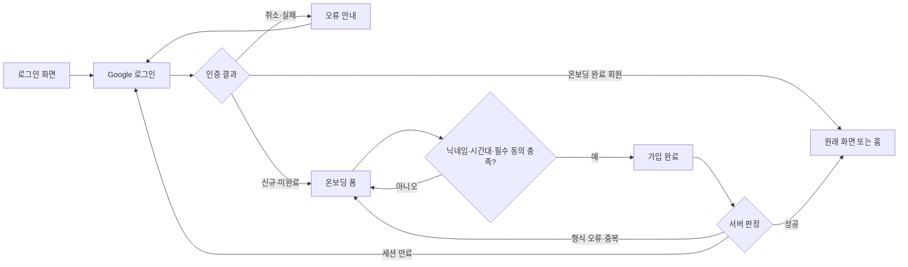
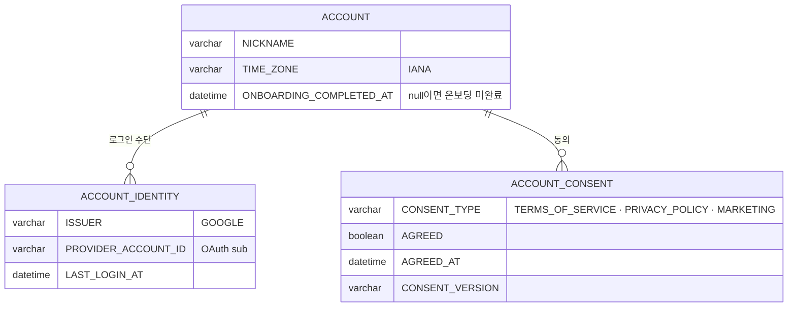

# 크루는 Google 계정으로 로그인하고 온보딩을 마칠 수 있다.

기준 프로토타입: Google 로그인 · 회원가입 온보딩 (playground 사용자 사이트 · 로그인 → 온보딩)

## 1. 기본설명

· **진입·사용 흐름**

· **완료 기준**

1. Google 계정 로그인 — 다른 인증 수단 없음
2. 온보딩 완료 회원은 원래 보던 화면(없으면 홈)으로
3. 신규·온보딩 미완료 회원은 온보딩 화면으로
4. 인증 취소·실패 시 사유 안내 및 재시도
5. 닉네임 제안값(Google 이름) 자동 채움 및 수정
6. 닉네임 형식·중복 검사 — 제출 전 결과 표시
7. 시간대 선택 3종 — 기기 시간대 기본 선택
8. 필수 동의 3종 검증, 마케팅 수신은 선택
9. 약관·방침 전문 열람 및 그 자리에서 동의
10. 서버 오류·세션 만료 시 입력값 유지

## 2. 화면명세

### Google 로그인

> **화면**: Google 로그인

#### 1. 로그인 안내

- **내용**: 서비스 이름과 로그인하는 이유
- **정책**: 한국어·영어 UI를 둔다

#### 2. Google 로그인

- **내용**: 이 화면의 유일한 주액션
- **동작**
  - 누르면 Google 인증을 시작한다
  - 처리 중에는 다시 눌리지 않는다
  - 신규·온보딩 미완료 → 온보딩 화면
  - 온보딩 완료 → 원래 화면, 없으면 홈
- **정책**: 인증 수단은 Google 하나다
- **데이터**: 로그인 응답의 `user.onboardingCompletedAt`(분기) · `suggestedNickname`(온보딩 제안값)

#### 3. 인증 실패

- **내용**: 무엇이 잘못됐는지와 다시 시도하라는 안내
- **동작**: 로그인 버튼을 다시 누르면 흐름을 다시 시작한다
- **조건**: 인증을 취소했거나 실패했을 때

### 회원가입 · 온보딩

> **화면**: 회원가입 · 온보딩

#### 1. 가입 안내

- **내용**: Google 계정이 연결됐다는 사실과 환영 문구
- **정책**
  - 한 페이지 폼이다
  - 사진·관심 분야·거주 국가·도시·비밀번호는 받지 않는다

#### 2. 닉네임

- **내용**
  - Google 이름을 제안값으로 채워 둔다. 제안값이 없으면 빈 칸
  - 현재 글자수와 상한
- **동작**
  - 한글 조합 중에는 검사하지 않는다
  - 빈 값은 칸을 벗어나거나 제출을 누른 뒤에 알린다. 들어오자마자 알리지 않는다
- **정책**
  - 앞뒤 공백을 뺀 뒤 2~20자
  - 한글·영문·숫자·밑줄만 허용한다
  - 밑줄만으로 된 이름, 예약어, `account_` 로 시작하는 이름은 금지한다
  - 허용되지 않은 문자는 입력을 막지 않고 알린다
  - 임시 `account_` 이름은 제안값으로 보이지 않는다
- **데이터**: 요청 `nickname`

#### 2-1. 닉네임 상태 줄

- **내용**
  - 기본은 규칙 안내
  - 그 밖에는 지금 값의 상태: 확인 중 · 사용 가능 · 중복 · 형식 오류 · 검사 실패
  - 허용되지 않은 문자는 그 글자를 따옴표로 감싸 보여 준다. 3개까지, 넘으면 개수로 접는다
  - 공백과 이모지는 문장으로 따로 알린다
- **동작**
  - 형식이 맞는 값만 중복을 묻는다
  - 마지막 입력 뒤 잠시 쉬면 한 번 묻는다. 앞선 요청은 취소한다
- **정책**
  - 상태 문구는 도움말 자리를 바꿔 쓴다. 상태가 바뀌어도 아래 요소가 밀리지 않는다
  - 서술은 「-입니다」, 행동 요청은 「-해 주세요」로 끝맺는다
- **데이터**: 비교값은 앞뒤 공백 제거 → NFC → 소문자. 저장값은 입력 그대로

#### 3. 나의 시간대

- **내용**: 고른 지역. 목록을 열면 지역별 UTC 시차를 함께 알려 준다
- **동작**
  - 기기 시간대로 맞춰 둔 채 시작한다
  - 방향키·Enter·Escape 로 고를 수 있다
- **정책**
  - 선택지는 한국 · 북미 동부 · 북미 서부 셋이다. 반을 가르는 단위가 이 셋이다
  - 시차는 고정값으로 두지 않는다. 서머타임에 따라 바뀐다
  - 라벨은 「나의 시간대」다
- **데이터**: 요청 `timeZone` — IANA id (예: `America/Vancouver`)

#### 4. 약관 동의

- **내용**: 필수 셋과 선택 하나
- **정책**
  - 모두 선택되지 않은 채 시작한다
  - 끝까지 스크롤하도록 강제하지 않는다. 열람과 동의는 별개 동작이다
  - 전문은 화면에 펼쳐 두지 않는다

#### 4-1. 전체 동의

- **내용**: 한 번에 모두 켜는 자리. 선택 항목까지 포함한다는 사실을 함께 알린다
- **동작**
  - 켜면 아래 넷이 모두 켜진다
  - 아래에서 하나를 끄면 전체 동의도 풀린다

#### 4-2. 동의 항목

- **내용**
  - 만 14세 이상 · 이용약관 · 개인정보 수집·이용 · 마케팅 정보 수신
  - 줄마다 필수인지 선택인지 드러난다
  - 마케팅 줄에는 무엇을 어디로 보내는지 한 줄로 적는다
- **정책**
  - 만 14세 이상 확인을 맨 위에 둔다 — 가입 자격이다 (이용약관 제3조 4항)
  - 수신 매체는 이메일뿐이다
- **데이터**
  - `termsOfServiceAgreed` · `privacyPolicyAgreed` 는 `true` 필수
  - `marketingAgreed` 는 동의하지 않았을 때도 `false` 로 보낸다
  - 약관 버전·동의 시각은 서버가 기록한다

#### 4-3. 약관 보기

- **내용**: 전문을 여는 자리. 이용약관·개인정보 수집·이용 줄에만 있다
- **동작**
  - 누르면 전문이 열린다
  - 그냥 닫거나, 동의하고 닫을 수 있다

#### 5. 가입 완료

- **내용**: 이 화면의 주액션
- **동작**
  - 닉네임·시간대·필수 동의가 모두 되면 누를 수 있다
  - 중복 검사 중에도 누를 수 있다. 검사 결과를 기다린 뒤 이어서 보낸다
  - 제출 중에는 다시 눌리지 않는다
- **데이터**: `POST /accounts/onboarding`

#### 6. 오류 안내

- **내용**: 오류 이유와 다음 행동(다시 시도 또는 다시 로그인)
- **동작**: 세션이 만료돼 다시 로그인하고 돌아와도 쓰던 값이 남아 있다
- **정책**
  - 400 형식 오류 → 해당 칸에 표시
  - 409 중복 → 닉네임 상태 줄에 표시
  - 401 → 다시 로그인
  - 어떤 오류든 입력한 값을 지우지 않는다
  - 중복 여부는 제출 시 서버 판정이 최종이다
- **조건**: 서버 오류 또는 세션 만료

### 상태별 화면

| 상태 | 화면 | 카피 |
| --- | --- | --- |
| 기본 | 로그인 버튼 | — |
| 처리중 | 로그인 버튼 잠김 | — |
| 인증 실패 | 오류 안내 + 로그인 버튼 | 오류 이유와 다시 시도 안내 |
| 온보딩 기본 | 제안 닉네임 · 기기 시간대 · 동의 모두 해제 | — |
| 검증 실패 | 닉네임 상태 줄 | 형식 오류 · 중복 문구 |
| 제출 중 | 가입 완료 잠김 | — |
| 처리 실패 | 오류 안내, 입력 유지 | 다시 시도 |
| 세션 만료 | 오류 안내, 입력 유지 | 다시 로그인 |
| 완료 | 원래 화면 또는 홈 | — |

### 데이터 관계

### 비고

- 범위 밖: 프로필 수정, 회원 탈퇴, 백오피스 로그인
- 미구현: 프로토는 Google 인증·회원 저장·동의 저장을 하지 않는다. 작성 중 입력은 브라우저에만 남는다
- 미구현: 영문 약관이 없어 en 로케일에서도 약관 원문은 한국어다
- 구현 지시: 이메일 미확인(`SOCIAL_LOGIN_EMAIL_REQUIRED`)·계정 연결 필요(`ACCOUNT_LINK_REQUIRED`)는 로그인 단계에서 따로 처리한다

## 3. 시스템 요건

### 데이터

| 대상 | 필드 | 의미 |
| --- | --- | --- |
| 계정 | NICKNAME | 필수. 저장은 입력 그대로, 비교는 정규화 값 |
| 계정 | TIME_ZONE | 필수. IANA id. 고정 시차로 저장하지 않는다 |
| 계정 | ONBOARDING_COMPLETED_AT | null 이면 온보딩 미완료 |
| 로그인 수단 | ISSUER, PROVIDER_ACCOUNT_ID | 사람 찾기 키. 이메일로 찾지 않는다 |
| 동의 | CONSENT_TYPE, AGREED, AGREED_AT, CONSENT_VERSION | 이용약관·개인정보는 AGREED=true 여야 저장 |

### 처리

- 로그인: Google code 교환 → `(ISSUER, sub)` 로 계정 조회 → 없으면 계정과 로그인 수단을 만든다
- 온보딩: 닉네임·시간대·동의를 한 트랜잭션으로 저장하고 `ONBOARDING_COMPLETED_AT` 을 채운다
- 닉네임 중복은 정규화 값으로 판정한다. 제출 시 다시 판정한다
- 실패 응답: 400 형식 · 401 세션 만료 · 409 중복

### API

| 메서드 | 경로 | 권한 |
| --- | --- | --- |
| POST | `/auth/social-login` | 불필요 |
| GET | `/auth/me` | 로그인 (미완료 가능) |
| GET | `/api/nicknames/availability` | 로그인 (미완료 가능) |
| POST | `/accounts/onboarding` | 로그인 (미완료 가능) |

계약은 [user-onboarding/spec.md](../../../specs/user-onboarding/spec.md) · [auth-google-login/spec.md](../../../specs/auth-google-login/spec.md).

### 권한

- 로그인: 누구나
- 온보딩: 로그인했고 온보딩을 마치지 않은 본인. 서버에서 검증한다

### 외부 연동

- Google OAuth: code 교환 실패 → 인증 실패 안내(3). 이메일 없음·미확인 → `400 SOCIAL_LOGIN_EMAIL_REQUIRED`

## 4. 미확정

- 만 14세 확인과 마케팅 수신 매체를 담을 필드가 없다
- 로그인 응답의 `suggestedNickname` 을 `account.nickname` 으로 옮길지
