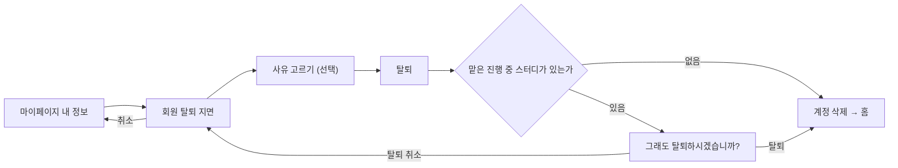
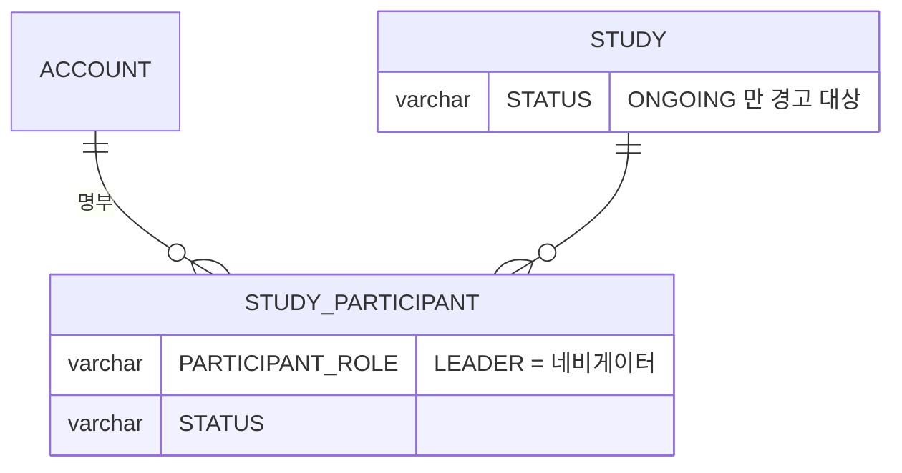

# 크루는 회원에서 탈퇴할 수 있다.

기준 프로토타입: 회원 탈퇴 (playground 사용자 사이트 · 마이페이지 → 회원 탈퇴)

## 1. 기본설명

· **진입·사용 흐름**

· **완료 기준**

1. 마이페이지 내 정보에서 탈퇴 지면으로 들어올 수 있다
2. 탈퇴는 되돌릴 수 없고, 다시 가입해도 지난 기록은 돌아오지 않는다는 사실을 탈퇴 전에 안다
3. 탈퇴 사유를 고를 수 있다. 고르지 않아도 탈퇴할 수 있다
4. 네비게이터로 맡은 진행 중인 스터디가 있으면, 그 스터디 이름과 수를 탈퇴 전에 본다
5. 맡은 스터디가 있으면 한 번 더 확인한 뒤에 탈퇴된다. 없으면 바로 탈퇴된다
6. 탈퇴를 취소하면 이 지면에 머문다
7. 탈퇴가 끝나면 로그아웃된 채 홈으로 간다

## 2. 화면명세

> **화면**: 회원 탈퇴

### 1. 제목과 안내

- **내용**
  - 되돌릴 수 없다는 사실
  - 다시 가입할 수 있지만 지난 기록은 돌아오지 않는다는 사실
- **정책**: 안내는 이 두 가지만 적는다. 지워지는 항목을 하나씩 나열하지 않는다

### 2. 탈퇴 사유

- **내용**: 고르는 한 칸. 선택지는 「원하는 스터디 없음」 · 「스터디 참여가 부담됨」 · 「기타」
- **동작**: 고른 값은 탈퇴 요청과 함께 보낸다
- **정책**
  - 필수가 아니다
  - 직접 쓰는 칸은 두지 않는다. 사유는 집계용이다
- **데이터**: `reason` — `NO_DESIRED_STUDY` · `PARTICIPATION_BURDEN` · `OTHER`. 계정과 잇지 않고 사유만 쌓는다

### 3. 맡은 스터디 경고

- **내용**
  - 네비게이터로 맡은 진행 중인 스터디 이름과 그 수
  - 캡틴에게 탈퇴 사실을 공유해 달라는 당부
  - 탈퇴를 누른 뒤에는 이 안에 「그래도 탈퇴하시겠습니까?」와 탈퇴 · 탈퇴 취소
- **동작**
  - 탈퇴를 다시 누르면 처리한다
  - 탈퇴 취소를 누르면 이 지면에 그대로 머문다
- **정책**
  - 탈퇴를 막지 않는다. 한 번 더 묻는다
  - 인계는 화면에서 하지 않는다
  - 맡은 스터디가 없으면 이 요소와 재확인 단계가 없다
  - 탈퇴 버튼보다 앞에 둔다. 경고는 들어오자마자 보이고, 재확인 문구만 누른 뒤에 붙는다
  - 진행 중인 스터디만 센다
  - 경고 문구는 배경과 충분히 대비되어 읽혀야 한다
- **데이터**: 네비게이터로 맡은 진행 중 스터디 목록 — 서버가 판정한다
- **조건**: 네비게이터로 맡은 진행 중 스터디가 있을 때

### 4. 탈퇴 · 취소

- **동작**
  - 맡은 스터디가 없으면 바로 처리하고 홈으로 보낸다
  - 맡은 스터디가 있으면 3 안에서 한 번 더 묻는다
  - 처리 중에는 다시 눌리지 않는다
  - 취소는 마이페이지로 돌아간다
- **정책**
  - 머무는 길(취소)을 탈퇴와 같은 자리에 둔다
  - 유예 기간을 두지 않는다. 요청 즉시 삭제한다
- **데이터**: `DELETE /api/me`

### 상태별 화면

| 상태 | 화면 | 카피 |
| --- | --- | --- |
| 기본 | 안내 · 사유 · 탈퇴 · 취소 | — |
| 맡은 스터디 있음 | 경고 추가 | 맡은 스터디 이름·수, 캡틴 공유 당부 |
| 재확인 | 경고 안 재확인 줄 | `그래도 탈퇴하시겠습니까?` |
| 처리중 | 탈퇴 잠김 | — |
| 완료 | 홈, 로그아웃 | — |

### 데이터 관계

### 비고

- 범위 밖: 네비게이터 인계, 탈퇴 철회
- 미구현: 프로토는 화면에서만 처리한다. 실제 계정을 지우지 않는다
- 구현 지시: 들어오는 길은 마이페이지 내 정보 한 곳이다

## 3. 시스템 요건

### 데이터

| 대상 | 처리 |
| --- | --- |
| `ACCOUNT` (프로필·디스코드 연동 포함) | 물리 삭제 |
| `ACCOUNT_CONSENT` | 계정 삭제에 따라 함께 삭제 |
| `ACCOUNT_IDENTITY` | 물리 삭제 — 같은 Google 계정으로 다시 가입할 수 있어야 한다 |
| `STUDY_PARTICIPANT` | 물리 삭제 — 맡던 네비게이터 자리도 사라진다 |
| `STUDY_BOOKMARK` · `STUDY_PROPOSAL_INTEREST` | 물리 삭제 |
| `STUDY_ATTENDANCE` · `STUDY_REVIEW` | 보존. 계정이 없어져 누구인지 알 수 없게 된다 (이용약관 제11조 3항) |
| `ACCOUNT_LEAVE_REASON` | 탈퇴마다 1행. `REASON` = `NO_DESIRED_STUDY` · `PARTICIPATION_BURDEN` · `OTHER` · null. 계정 ID 를 두지 않는다 |

### 처리

- 요청 즉시 삭제한다. 유예 없음
- 사유가 세 값 외면 `400 INVALID_INPUT`
- 맡은 진행 중 스터디 판정: `STUDY_PARTICIPANT.PARTICIPANT_ROLE = LEADER` 이고 `STUDY.STATUS = ONGOING`
- 탈퇴 뒤 클라이언트는 저장된 토큰을 지우고 홈으로 보낸다. 이미 발급된 토큰은 서버가 무효화하지 못한다 — [user-leave/spec.md](../../../specs/user-leave/spec.md) 알려진 한계

### API

| 메서드 | 경로 | 권한 |
| --- | --- | --- |
| DELETE | `/api/me` | 로그인 본인 |
| GET | `/api/me/studies` | 로그인 본인 — `participantRole`·`isActiveNavigator` 로 경고 판정 |

계약은 [user-leave/spec.md](../../../specs/user-leave/spec.md).

### 권한

- 본인만 자기 계정을 탈퇴한다. 서버는 토큰의 계정만 지운다

### 외부 연동

- 없음. 디스코드 연동 정보는 계정 삭제에 포함된다

## 4. 미확정

- 발급된 토큰의 서버 측 무효화
