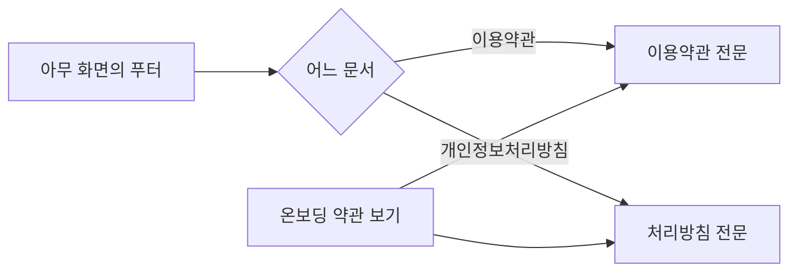

# 크루는 이용약관과 개인정보처리방침을 확인할 수 있다.

기준 프로토타입: 이용약관 · 개인정보 처리방침 (playground 사용자 사이트 · 푸터 링크)

## 1. 기본설명

· **진입·사용 흐름**

· **완료 기준**

1. 모든 화면 하단에서 이용약관과 개인정보처리방침을 열 수 있다
2. 로그인하지 않아도 두 문서를 읽을 수 있다
3. 개인정보처리방침 링크는 다른 링크와 구분되어 찾을 수 있다
4. 문서마다 최종 개정일과 시행일을 알 수 있다
5. 장·조항 단위로 나뉜 전문을 읽을 수 있다
6. 원문이 강조한 조항은 강조된 채로 읽힌다
7. 처리방침의 표는 좁은 화면에서도 열 대응이 흐트러지지 않고 읽힌다

## 2. 화면명세

> **화면**: 이용약관 · 개인정보 처리방침 (같은 구조)

### 1. 문서 제목

- **내용**
  - 이용약관: 「이용약관」. en 로케일은 「Terms of Service」
  - 처리방침: 「개인정보 처리방침」

### 1-1. 최종 개정일

- **내용**: 「최종 개정일 YYYY-MM-DD」
- **정책**
  - 문안이 바뀔 때만 갱신한다. 오탈자 교정은 개정이 아니다
  - 처리방침은 수집 항목·보유 기간·위탁처가 바뀌면 반드시 갱신한다
  - 처리방침의 개정일은 제16조 제1항의 적용일과 같은 날짜다

### 1-2. 도입부

- **내용**: 서비스 이름이 들어간 한 줄과 시행일
- **정책**: 개정일(언제 고쳤는가)과 시행일(언제부터 적용되는가)은 다른 값이다

### 2. 본문

- **내용**
  - 이용약관: 장 제목, 그 아래 조항 제목과 문단·목록
  - 처리방침: 조항 제목과 문단·목록·표·인용
- **정책**
  - 이용약관에서 원문이 강조한 조항은 강조를 유지한다: 비밀번호 미수집 · 만 14세 미만 가입 불가 · 무료 서비스 보상 없음 · 스터디 책임 귀속 · 면책
  - 처리방침의 표는 좁은 화면에서 줄바꿈으로 뭉개지지 않고 가로로 넘겨 읽는다
  - 법률 문서는 임의로 번역하지 않는다. 영문 문안이 없으면 en 로케일에서도 한국어 원문을 보인다
- **데이터**: 문서 원문 — `proto/core/lib/legal.ts`

### 상태별 화면

| 상태 | 화면 | 카피 |
| --- | --- | --- |
| 기본 | 제목 · 개정일 · 도입부 · 본문 | — |
| en 로케일 | 제목만 영문, 본문 한국어 | `Terms of Service` |

### 비고

- 범위 밖: 가입·탈퇴 시점의 동의 흐름, 개정 이력(이전 버전) 열람, 개인정보 열람·정정·삭제 요청(처리방침 제10조의 이메일로 받는다)
- 미구현: 처리방침 초안의 【 】 값(클럽명·시행일·대표 이메일·수탁자·보호책임자·국외 이전)이 비어 있다
- 미구현: 영문 문안
- 구현 지시: 푸터의 두 링크는 모든 화면 하단에 있다. 이 문서의 번호에는 포함하지 않는다

## 3. 시스템 요건

### 데이터

- 문서 원문과 최종 개정일·시행일은 프론트엔드 정적 콘텐츠다. 저장소가 필요 없다
- 가입 동의에 쓰는 약관 버전(`ACCOUNT_CONSENT.CONSENT_VERSION`)과 화면의 최종 개정일은 같은 개정을 가리켜야 한다

### 처리

- 서버 처리 없음

### API

- 없음

### 권한

- 누구나. 로그인하지 않아도 된다

### 외부 연동

- 없음

## 4. 미확정

- 처리방침 【 】 값
- 영문 문안을 둘지
