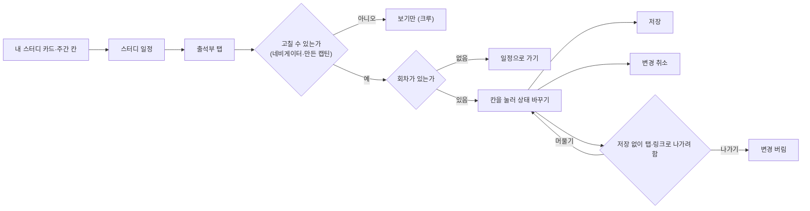
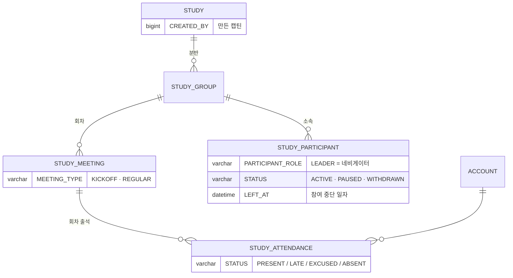

# 네비게이터는 스터디별 출석 상태를 수정할 수 있다.

기준 프로토타입: 스터디 일정 — 출석부 탭, 캡틴·네비게이터로 볼 때 (playground 사용자 사이트 · 내 스터디 → 스터디 일정 → 출석부)

화면 캡처 (2026-10-06): [네비게이터 출석부](../navigator-register-sessions/assets/3-navigator-attendance.jpg)

## 1. 기본설명

· **진입·사용 흐름**

· **완료 기준**

1. 내 분반의 참여자 × 회차 출석 상태를 한 화면에서 본다
2. 칸을 눌러 출석 · 지각 · 결석 · 휴가 · 미체크 사이를 바꾼다
3. 바꾼 칸은 저장을 눌러야 반영된다. 저장 전에는 어느 칸이 바뀌었는지 테두리로 안다
4. 저장 전 변경을 한 번에 되돌릴 수 있다
5. 저장하지 않은 변경이 있는 채로 탭·링크로 나가려 하면 한 번 더 묻는다
6. 참여자별 출석률을 보고, 칸을 바꾸면 바로 다시 계산된다. 킥오프는 출석률에 넣지 않는다
7. 내 분반 참여자만 보인다. 캡틴은 백오피스 출석부(전체 참여자)로 바로 갈 수 있다
8. 회차가 없으면 그 사실과 일정으로 가는 길을 본다
9. 네비게이터와 그 스터디를 만든 캡틴만 고친다. 다른 참여자에게는 보기 화면이다 ([crew-view-attendance-record](../crew-view-attendance-record/PRD.md))

## 2. 화면명세

> **화면**: 스터디 일정 — 출석부 탭 (캡틴·네비게이터)

스터디 정보 카드 · 탭은 [회차 등록 PRD](../navigator-register-sessions/PRD.md) 11·12와 같다. 범위 안내 · 머리 줄(반 · 인원 · 기준 시간대) · 진행 기간 · 조작 안내 · 회차 추가 버튼은 두지 않는다 — 탭 이름과 표가 이미 말해 준다.

### 1. 백오피스 출석부

- **내용**: 「백오피스 출석부 (전체 참여자)」 버튼. 표 위 오른쪽
- **동작**: 백오피스에서 그 스터디의 출석 탭으로 간다
- **정책**: 캡틴에게만 보인다. 네비게이터는 백오피스에 들어갈 수 없다
- **조건**: 그 스터디를 만든 캡틴일 때

### 2. 출석부

- **내용**
  - 참여자 × 회차 격자. 한 칸이 한 사람의 한 회차
  - 첫 열은 「킥오프」, 다음 열부터 「1회」 「2회」 …. 회차 머리 아래 일자 `M/dd`
  - 이름 열 → 발표 횟수 열 → 회차 칸들 → 출석률 열. 이름 열은 가로로 넘겨도 고정
  - 이름 옆에 캡틴 · 네비게이터 역할 칩. 크루는 칩이 없다. 맨 위 줄은 나
  - 칸 값은 출석 · 지각 · 결석 · 휴가 중 하나, 체크하지 않았으면 점선 테두리 빈 칸
  - 발표자로 맡은 회차의 칸 왼쪽 위에 마이크 표시
- **동작**
  - 칸을 누를 때마다 출석 → 지각 → 결석 → 휴가 → 미체크 순으로 바뀐다
  - 칸에 마우스를 올리면 「눌러서 출석 → 지각 → 결석 → 휴가 → 미체크」. 저장 상태는 말하지 않는다 — 테두리가 보여 준다
  - 눌러도 저장하지 않는다. 저장된 값과 다른 칸은 테두리만 강조한다 (점 표시 없음)
- **정책**
  - 한 바퀴 돌면 미체크로 돌아온다. 잘못 누른 것을 되돌릴 수 있다
  - 바뀐 칸은 색만으로 구분하지 않는다. 스크린리더는 「출석 · 저장되지 않음」처럼 읽는다
  - 반 선택은 없다. 내 분반 하나만 보인다
  - 발표 표시 · 발표 횟수는 일정 탭의 발표자1·2에서 계산한다. 출석부에서 입력하지 않는다
  - 출석률 열 너비는 고정한다. 숫자 길이에 따라 표가 흔들리지 않게
- **데이터**: `STUDY_ATTENDANCE` — 내 분반의 회차 × 참여자
- **조건**: 회차가 하나 이상일 때

### 2-1. 스터디를 중단한 사람

- **내용**: 흐린 이름 + 「참여 중단」 칩. 중단 일자 뒤 회차 칸은 「—」 (누를 수 없다)
- **정책**
  - 하차·제명을 가르지 않는다. 사유는 보이지도 저장하지도 않는다
  - 맨 아래 줄로 내린다. 줄을 지우지 않는다 — 중단 전 출석은 남고 고칠 수 있다
  - 출석률은 중단 일자까지의 회차만 센다. 숫자는 회색 · 보통 굵기
- **데이터**: `STUDY_PARTICIPANT.STATUS = WITHDRAWN` · `LEFT_AT`

### 3. 저장 바

- **내용**: 화면 아래 오른쪽에 붙는 한 줄 「변경 취소 · 저장」. 변경 칸 수 · 안내 문구는 없다
- **동작**
  - 저장 → 바뀐 칸을 한 번에 반영한다. 화면에 결과 문구는 두지 않고, 스크린리더에만 「출석 n칸을 저장했습니다.」
  - 변경 취소 → 저장 전 값으로 되돌린다
  - 저장 중에는 저장 · 변경 취소 · 칸이 잠긴다
- **정책**: 바뀐 칸이 없으면 저장을 누를 수 없다
- **조건**: 바뀐 칸이 하나 이상일 때

### 4. 나가기 확인

- **내용**: 창 제목 「저장하지 않은 변경이 있습니다」 · 본문 「저장을 누르지 않으면 고친 내용이 사라집니다. 나가기 전에 저장해 주세요.」 · 「저장하지 않고 나가기」 · 「이 화면에 머물기」
- **동작**: 저장하지 않은 칸이 있는 채로 일정 탭 · 「내 스터디」 링크를 누르면 뜬다
- **정책**: 새로고침 · 창 닫기는 브라우저 기본 안내를 쓴다

### 5. 회차 없음

- **내용**: 「아직 회차가 없습니다.」 · 「일정 탭에서 회차를 만들면 이 반의 출석부가 만들어집니다.」 · 「일정으로 가기」
- **동작**: 누르면 일정 탭으로 간다
- **조건**: 분반에 회차가 하나도 없을 때

### 상태별 화면

| 상태 | 화면 | 카피 |
| --- | --- | --- |
| 기본 | 출석부 (캡틴은 백오피스 출석부 버튼) | — |
| 고치는 중 | 바뀐 칸 테두리 강조 · 저장 바 | `변경 취소` · `저장` |
| 처리중 | 저장 · 변경 취소 · 칸 잠김 | — |
| 완료 | 저장 바 사라짐 | — (스크린리더 `출석 n칸을 저장했습니다.`) |
| 나가기 확인 | 확인 창 | `저장하지 않은 변경이 있습니다` |
| 회차 없음 | 격자 대신 안내 | `아직 회차가 없습니다.` |
| 고칠 수 없음 | 보기 화면 ([crew-view-attendance-record](../crew-view-attendance-record/PRD.md)) | — |

### 데이터 관계

### 비고

- 범위 밖: 회차 추가·수정(일정 탭 — [회차 등록 PRD](../navigator-register-sessions/PRD.md)), 스터디 전체 참여자 출석부(백오피스 — [captain-view-attendance-roster](../captain-view-attendance-roster/PRD.md)), 디스코드 출석 체크, 참여자 제명
- 미구현: 저장은 브라우저에만 남는다
- 구현 지시: 칸 값 · 순환 · 저장 방식은 백오피스 출석부와 같은 컴포넌트를 쓴다. 다른 점은 보이는 참여자 범위와 머리 줄을 숨기는 것뿐이다
- 옛 출석 기록 주소 `/my/joined/{id}/attendance` 는 이 탭(`/my/joined/{id}/schedule/attendance`)으로 보낸다

## 3. 시스템 요건

### 데이터

| 필드 | 값 |
| --- | --- |
| STUDY_ATTENDANCE.STATUS | `PRESENT` 출석 · `LATE` 지각 · `ABSENT` 결석 · `EXCUSED` 휴가. 읽을 때 null 이면 미체크 |

### 처리

- 저장은 바뀐 칸만 모아 한 요청으로 보낸다 (`updates[]`)
- 행이 없으면 만들고, 있으면 고친다
- 한 요청 전체를 한 트랜잭션으로 반영한다. 한 칸이라도 거절되면 아무것도 반영하지 않는다
- 서버는 각 칸의 회차·참여자가 그 스터디에 속하는지 검증한다. 아니면 400
- 같은 칸이 한 요청에 두 번 오면 400. 같은 칸을 동시에 고치면 나중 요청의 값이 남는다 (한 문장 upsert라 충돌 409는 없다 — [출석 스펙](../../../specs/attendance/spec.md))

### 계산 규칙 (단일 정의)

- 출석률 = (출석 × 1 + 지각 × 0.5) / 체크한 정규 회차. 휴가 · 미체크는 분모에서 뺀다. 분모가 0 이면 「—」
- 킥오프(`MEETING_TYPE = KICKOFF`)는 칸은 보이고 체크도 하지만 출석률에 넣지 않는다
- 참여 중단자는 `LEFT_AT` 까지의 회차만 센다
- 백오피스 출석부 · 내 스터디 출석률과 같은 식이다 — [attendance/spec.md](../../../specs/attendance/spec.md)

### API

| 메서드 | 경로 | 권한 |
| --- | --- | --- |
| GET | `/api/studies/{studyId}/attendances` | 그 분반 활성 참여자(조회) · 네비게이터 · 만든 캡틴 |
| POST | `/api/studies/{studyId}/attendances` | 그 분반 LEADER · CO_LEADER · 그 스터디를 만든 캡틴 |

계약은 [attendance/spec.md](../../../specs/attendance/spec.md).

### 권한

- 고치기: 그 분반의 `PARTICIPANT_ROLE = LEADER` · `CO_LEADER`, 그 스터디를 만든 캡틴(`STUDY.CREATED_BY`). 아니면 403
- 다른 캡틴(ADMIN)이 신청해 참여했으면 사용자 사이트에서는 크루다 — 고치기는 백오피스에서 한다
- 서버에서 검증한다. 화면에서 칸을 막는 것은 편의일 뿐이다

### 외부 연동

- 없음

### 현재 백엔드와 차이 (2026-10-06 `beta`)

- 캡틴 판정이 `SYSTEM_ROLE = ADMIN` 이면 누구나 통과 — 만든 캡틴으로 좁혀야 한다 (노션 #58)
- 출석률이 킥오프를 빼지 않고, 응답에 역할 · 참여 상태 · 중단 일자가 없다 (노션 #63)

## 4. 미확정

- 미체크로 되돌린 칸을 저장하는 방법 — 쓰기 API 는 네 값만 받는다
- 네비게이터 쓰기를 맡은 분반 칸으로 좁힐지. 지금 서버 검증은 스터디 단위다
- ~~캡틴(`SYSTEM_ROLE = ADMIN`)이 사용자 사이트에서 쓸 때의 권한 판정~~ → 그 스터디를 만든 캡틴만 고친다. 다른 캡틴은 크루 (2026-10-06)
