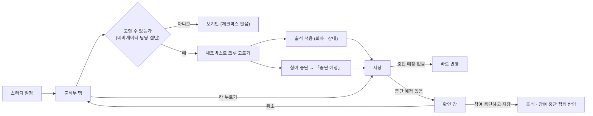
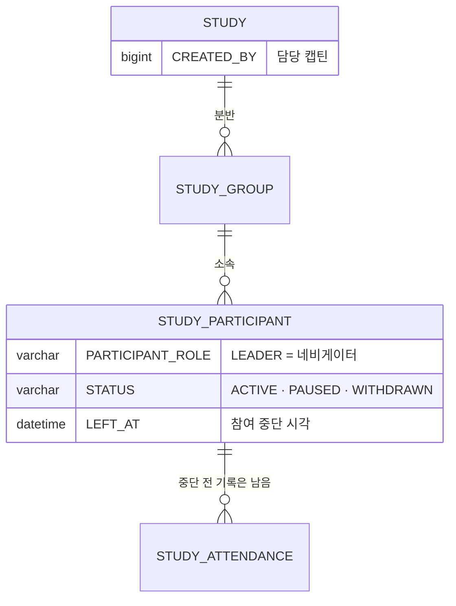

# 네비게이터는 참여자를 스터디에서 제명할 수 있다.

기준 프로토타입: 스터디 일정 — 출석부 탭, 캡틴·네비게이터로 볼 때 (playground 사용자 사이트 · 내 스터디 → 스터디 일정 → 출석부)

화면 캡처 (2026-10-07): [저장 확인 창](assets/1-withdraw-confirm.jpg)

## 1. 기본설명

· **진입·사용 흐름**

· **완료 기준**

1. 출석부의 크루 줄 맨 왼쪽 체크박스로 사람을 고른다. 머리 칸 체크박스로 전체 선택 · 해제한다
2. 고른 사람의 한 회차 칸을 같은 출석 상태로 한 번에 바꾼다 (출석 적용)
3. 고른 사람을 「중단 예정」으로 둔다. 바로 반영하지 않는다 — 줄에 「중단 예정」 칩과 「취소」가 붙는다
4. 「저장」 한 번에 출석 변경과 참여 중단이 함께 반영된다. 하나라도 실패하면 둘 다 반영되지 않는다
5. 중단 예정이 있으면 저장 전에 확인 창이 뜬다. 창은 중단할 사람 이름 · 바뀐 출석 칸 수와 네 가지를 말한다 — 지금까지 출석은 남는다 · 지금 뒤에 시작하는 회차는 「—」이고 출석률에서 빠진다 · 디스코드 채널 · 드라이브 링크와 발표자 선택에서 빠진다 · 다시 참여시킬 수 없다
6. 반영되면 중단한 줄이 맨 아래로 내려가 「참여 중단」 칩이 붙는다. **저장한 시각 뒤에 시작하는 회차** 칸은 「—」, 출석률은 그 앞 회차로 다시 계산된다. 중단 전 출석 기록은 지워지지 않는다
7. 「변경 취소」는 출석 변경과 중단 예정을 모두 되돌린다
8. 나 · 담당 캡틴 · 네비게이터 줄과 이미 중단한 줄에는 체크박스가 없다. 중단한 사람은 다시 참여시킬 수 없다
9. 크루 화면에는 체크박스 · 선택 바가 없다
10. 처리하지 못하면 확인 창이 남고 창 안에 오류 문구가 보인다 (프로토 미구현)

## 2. 화면명세

> **화면**: 스터디 일정 — 출석부 탭 (캡틴·네비게이터)

격자 · 칸 순환 · 나가기 확인은 [출석 상태 수정 PRD](../navigator-edit-attendance/PRD.md) 와 같다. 이 문서는 그 위에 붙는 것과 저장이 달라지는 것만 쓴다.

### 1. 체크박스

- **내용**: 크루 줄 이름 왼쪽의 체크박스. 머리 칸 「크루」 왼쪽에 전체 선택 체크박스
- **동작**
  - 줄 체크박스로 한 사람씩 고른다
  - 전체 선택은 고를 수 있는 사람을 모두 고르거나 모두 푼다. 일부만 골랐으면 「일부 선택(−)」 표시
- **정책**
  - 나 · 담당 캡틴 · 네비게이터 줄 · 이미 중단한 줄에는 체크박스가 없다. 이름 열은 자리를 비워 맞춘다
  - 크루로 참여한 다른 캡틴은 크루 줄이다
  - 스크린리더는 「건우 선택」 · 「크루 전체 선택」으로 읽는다
- **조건**: 그 분반의 네비게이터이거나 담당 캡틴일 때

### 2. 선택 바

- **내용**: 한 명이라도 고르면 표 아래(저장 바 위)에 붙는 한 줄
  - 「선택한 n명」
  - 회차 고르기 · 상태 고르기(출석 · 지각 · 결석 · 휴가 · 미체크) · 「출석 적용」
  - 「참여 중단」 — 배경 없이 테두리 · 글씨만 빨강
  - 「선택 해제」
- **동작**
  - 출석 적용 → 고른 사람들의 그 회차 칸을 그 상태로 바꾼다. 저장 전 변경이라 칸 테두리가 강조되고 저장을 눌러야 반영된다
  - 참여 중단 → 고른 사람들을 「중단 예정」으로 두고 선택을 푼다. 바로 반영하지 않는다
  - 선택 해제 → 고른 것을 모두 푼다
- **정책**
  - 회차는 오늘 이전 마지막 회차(방금 끝난 회차)가 먼저 골라져 있다
  - 결과 문구는 화면에 두지 않는다. 스크린리더만 「2명의 4회 칸을 휴가(으)로 바꿨습니다. 저장해야 반영됩니다.」 · 「2명을 중단 예정으로 표시했습니다. 저장해야 반영됩니다.」
- **조건**: 한 명 이상 골랐을 때

### 3. 중단 예정 줄

- **내용**: 이름 옆 빨간 칩 「중단 예정」 + 「취소」
- **동작**: 「취소」를 누르면 그 사람만 중단 예정에서 뺀다
- **정책**
  - 줄은 그 자리에 둔다. 칸도 그대로 고칠 수 있다 — 저장 전까지는 아직 참여 중이다
  - 중단 예정이 있으면 저장 바가 켜진다 (바뀐 출석 칸이 없어도)
- **데이터**: 화면 상태 — 저장 때 `withdrawals[]` 로 나간다

### 4. 저장 · 확인 창

- **내용**
  - 저장 바는 지금과 같다 — 「변경 취소 · 저장」
  - 중단 예정이 있을 때 저장을 누르면 확인 창
    - 제목 「○○ 님의 참여를 중단하고 저장할까요?」 / 「n명의 참여를 중단하고 저장할까요?」
    - 「참여 중단 건우, 지호」 · 「출석 n칸」(바뀐 칸이 있을 때)
    - 지금까지의 출석 기록은 그대로 남습니다.
    - 지금 뒤에 시작하는 회차는 「—」로 비고 출석률에서 빠집니다.
    - 더는 스터디 디스코드 채널 · 드라이브 링크를 볼 수 없고, 발표자로 고를 수 없습니다.
    - 중단한 뒤에는 다시 참여시킬 수 없습니다.
    - 버튼 「취소」 · 「참여 중단하고 저장」(빨강)
- **동작**
  - 중단 예정이 없으면 확인 창 없이 지금처럼 바로 저장한다
  - 확인하면 출석과 참여 중단을 한 요청으로 반영한다. 중단한 줄은 맨 아래로 내려가고 「참여 중단」 칩이 붙는다
  - 화면 결과 문구는 없다. 스크린리더만 「출석 1칸을 저장하고 2명의 참여를 중단했습니다.」
  - 취소 · Esc · 바깥 누르기는 아무것도 반영하지 않는다. 중단 예정과 바뀐 칸은 그대로 남는다. 처음 포커스는 「취소」
  - 변경 취소 → 바뀐 출석 칸과 중단 예정을 모두 되돌린다
- **정책**
  - 되돌릴 수 없는 일이 저장에 섞이므로, 중단 예정이 있을 때만 확인 창을 띄운다
  - 하차 · 제명을 가르지 않는다. 사유를 묻지도 남기지도 않는다
  - 중단 시각은 저장한 순간이다. 지난 날짜로 소급하지 않는다
  - 이미 발표자로 잡힌 앞 회차는 그대로 남고 일정 탭에 「이름 (참여 종료)」로 보인다 — 네비게이터가 바꾼다
  - 중단당한 사람에게 따로 알리지 않는다 (미확정 — §4)
- **데이터**: `STUDY_ATTENDANCE` upsert + `STUDY_PARTICIPANT.STATUS` `ACTIVE` → `WITHDRAWN` · `LEFT_AT`

### 5. 중단한 사람의 줄

[출석 상태 수정 PRD](../navigator-edit-attendance/PRD.md) §2-1 그대로다 — 흐린 이름 · 「참여 중단」 칩 · 맨 아래 줄 · 중단 뒤 칸 「—」 · 회색 출석률. 체크박스가 없다. 일정 탭 발표자 드롭다운에서 고를 수 없고, 이미 배정된 칸은 「이름 (참여 종료)」.

### 상태별 화면

| 상태 | 화면 | 카피 |
| --- | --- | --- |
| 기본 | 크루 줄 왼쪽 체크박스 | — |
| 선택 | 선택 바 | `선택한 n명` · `출석 적용` · `참여 중단` · `선택 해제` |
| 고치는 중 | 바뀐 칸 테두리 · 「중단 예정」 칩 · 저장 바 | `중단 예정` · `취소` · `변경 취소` · `저장` |
| 확인 | 확인 창 (중단 예정이 있을 때만) | `n명의 참여를 중단하고 저장할까요?` |
| 처리중 | 저장 · 변경 취소 · 칸 · 체크박스 잠김 | — |
| 완료 | 중단한 줄 맨 아래 · 「참여 중단」 칩 | — (스크린리더 `출석 n칸을 저장하고 m명의 참여를 중단했습니다.`) |
| 실패 | 확인 창 유지 · 창 안 오류 (프로토 미구현) | `저장하지 못했습니다. 잠시 뒤 다시 시도해 주세요.` |
| 크루 | 체크박스 · 선택 바 없음 | — |

### 데이터 관계

### 비고

- 범위 밖: 크루 스스로의 하차, 회원 탈퇴([crew-leave](../crew-leave/PRD.md)), 네비게이터 지정 · 해제(백오피스 — [captain-view-attendees](../captain-view-attendees/PRD.md)), 디스코드 채널 권한 회수
- 미구현: 프로토는 브라우저에만 남는다(`sc_participant_left`). 출석과 중단을 따로 저장한다(서버는 한 요청). 처리중 · 실패 화면 없음. 프로토는 브라우저 시간대로 회차 시각과 견준다
- 구현 지시: 체크박스 · 선택 바 · 확인 창은 출석 격자 컴포넌트의 선택 속성(`onWithdraw`)을 넘길 때만 나온다. 백오피스 출석 탭은 넘기지 않아 바뀌지 않는다

## 3. 시스템 요건

### API

| 메서드 | 경로 | 권한 |
| --- | --- | --- |
| POST | `/api/studies/{studyId}/attendances` (`updates[]` + `withdrawals[]`) | 출석: 기존 출석 쓰기 권한 · 중단: 대상과 같은 분반의 네비게이터 · 담당 캡틴 |

새 엔드포인트 없이 출석 저장 요청에 `withdrawals[]` 를 더한다. 계약은 [study-participant/spec.md](../../../specs/study-participant/spec.md).

### 처리

- 출석 upsert 와 참여 중단을 **한 트랜잭션**으로 반영한다. 하나라도 거절되면 아무것도 반영하지 않는다
- 중단: `STATUS = WITHDRAWN` · `LEFT_AT = now()`. 출석 행은 지우지 않는다
- 이미 `WITHDRAWN` 이면 그대로 둔다. `LEFT_AT` 을 덮어쓰지 않는다
- 대상이 나 · 네비게이터 · 담당 캡틴이면 거절. `DELETED`(회원 탈퇴) · `COMPLETED` 는 바꾸지 않는다. 끝난 스터디(`ENDED` · `CLOSED`)도 바꾸지 않는다
- 되돌리는 API 는 두지 않는다

### 계산 규칙

- 출석률은 `SCHEDULED_AT <= LEFT_AT` 인 회차만 센다 — [attendance/spec.md](../../../specs/attendance/spec.md) `upper_bound` 와 같다. 시각으로 견주므로 같은 날 뒤 회차도 빠진다

### 권한

- 중단: 대상과 **같은 분반**의 네비게이터(명부에 살아 있음) · 담당 캡틴(`STUDY.CREATED_BY`). 아니면 403 — 출석 쓰기와 같은 분반 단위([authz-guards](../../../specs/authz-guards/spec.md) B)
- 크루로 참여한 다른 캡틴은 크루다 — 403
- 서버에서 검증한다. 화면에서 체크박스를 숨기는 것은 편의일 뿐이다

### 보안 · 개인정보

- 감사 로그에 호출자 ID · 대상 명부 행 ID · 동작 · 시각만 남긴다. 이름 · 이메일은 남기지 않는다
- 중단된 사람은 디스코드 채널 · 드라이브 링크를 받지 않는다 ([my-studies](../../../specs/my-studies/spec.md) `relation = WITHDRAWN`)

### 외부 연동

- 없음

## 4. 미확정

- 중단당한 사람에게 알림(메일 · 디스코드 DM)을 보낼지
- 디스코드 채널 권한까지 회수할지 — 지금은 링크만 감춘다
- 잘못 중단했을 때 되살리는 길 — 사용자 사이트에는 두지 않기로 했다(2026-10-07). 백오피스에서 캡틴이 되살릴지는 정하지 않았다
- 회차 머리 칸 「전원 출석」 같은 한 회차 일괄 버튼을 둘지 — 지금은 체크박스 + 출석 적용으로 한다
