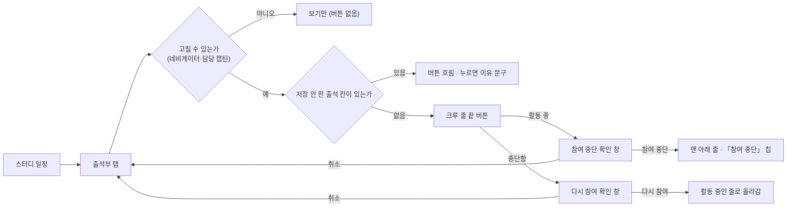
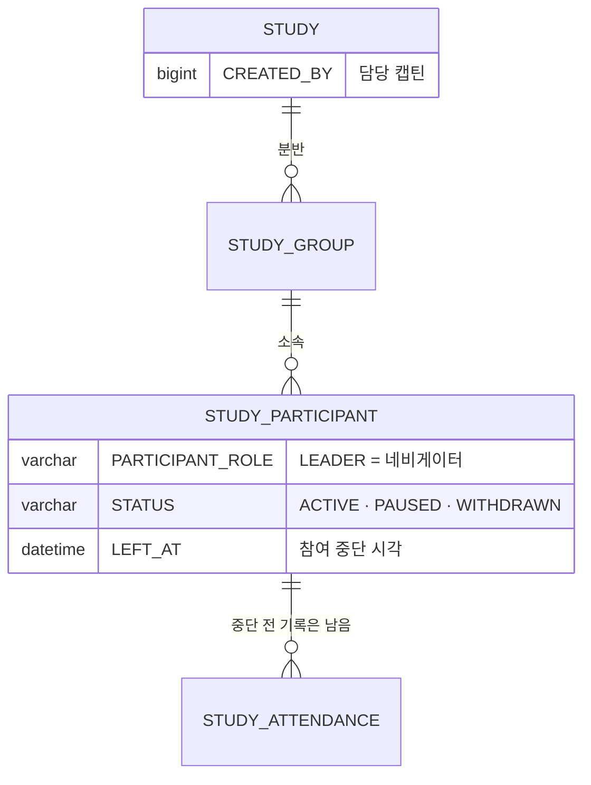

# 네비게이터는 참여자를 스터디에서 제명할 수 있다.

기준 프로토타입: 스터디 일정 — 출석부 탭, 캡틴·네비게이터로 볼 때 (playground 사용자 사이트 · 내 스터디 → 스터디 일정 → 출석부)

화면 캡처 (2026-10-07): [참여 중단 확인 창](assets/1-withdraw-confirm.jpg)

## 1. 기본설명

· **진입·사용 흐름**

· **완료 기준**

1. 출석부의 크루 줄에서 그 사람의 참여를 중단시킨다
2. 누르면 바로 바뀌지 않고 확인 창이 한 번 뜬다. 창은 네 가지를 말한다 — 지금까지 출석은 남는다 · 지금 뒤에 시작하는 회차는 「—」이고 출석률에서 빠진다 · 디스코드 채널 · 드라이브 링크와 발표자 선택에서 빠진다 · 되돌릴 수 있다
3. 중단하면 그 줄이 맨 아래로 내려가 「참여 중단」 칩이 붙는다. **누른 시각 뒤에 시작하는 회차** 칸은 「—」, 출석률은 그 앞 회차로 다시 계산된다 — 같은 날 저녁 회차도 낮에 중단했으면 「—」
4. 중단 전 출석 기록은 지워지지 않는다
5. 잘못 중단했으면 같은 줄에서 다시 참여시킨다. 줄은 활동 중인 줄로 올라가고 「—」였던 칸에 다시 체크할 수 있다
6. 나 · 담당 캡틴 · 네비게이터 줄에는 버튼이 없다
7. 저장하지 않은 출석 칸이 있으면 버튼이 흐려진다. 흐린 버튼을 누르면 화면에 「출석을 먼저 저장해 주세요 …」가 보인다(가리키기 · 터치 · 키보드 모두)
8. 크루 화면에는 버튼이 없다
9. 처리하지 못하면 확인 창이 남고 창 안에 오류 문구가 보인다 (프로토 미구현)

## 2. 화면명세

> **화면**: 스터디 일정 — 출석부 탭 (캡틴·네비게이터)

격자 · 저장 바 · 나가기 확인은 [출석 상태 수정 PRD](../navigator-edit-attendance/PRD.md) 와 같다. 이 문서는 그 위에 붙는 것만 쓴다.

### 1. 참여 중단 · 다시 참여 버튼

- **내용**: 크루 줄 이름 칸 끝의 아이콘 버튼. 활동 중이면 사람-빼기 아이콘 「참여 중단」, 중단한 사람이면 사람-확인 아이콘 「다시 참여」. 가리키면 버튼 이름이 보인다
- **동작**: 누르면 확인 창(2)이 뜬다
- **정책**
  - 캡틴·네비게이터 화면에만 있다
  - 나 · 담당 캡틴 · 네비게이터 줄에는 없다 — 운영진의 역할 · 참여는 백오피스에서 캡틴이 바꾼다. 크루로 참여한 다른 캡틴은 크루 줄이다
  - 저장하지 않은 출석 칸이 있으면 흐려진다. 줄이 움직이면 어느 칸을 고쳤는지 놓친다
    - 흐린 버튼을 누르면 저장 바 왼쪽에 「출석을 먼저 저장해 주세요. 참여 중단 · 다시 참여는 저장한 뒤에 할 수 있습니다.」. 저장 · 변경 취소하면 사라진다
    - 스크린리더는 버튼 설명(`aria-describedby`)으로 늘 이유를 듣고, 눌렀을 때 한 번 더 듣는다
  - 보이는 크기 28px, 누르는 자리 44px — 줄 높이를 늘리지 않는다
  - 스크린리더는 「건우 참여 중단」처럼 이름과 함께 읽는다
- **데이터**: `STUDY_PARTICIPANT.STATUS` · `PARTICIPANT_ROLE`
- **조건**: 그 분반의 네비게이터이거나 담당 캡틴일 때

### 2. 확인 창

- **내용**
  - 참여 중단 — 제목 「○○ 님의 참여를 중단할까요?」
    - 지금까지의 출석 기록은 그대로 남습니다.
    - 지금 뒤에 시작하는 회차는 「—」로 비고 출석률에서 빠집니다.
    - 더는 스터디 디스코드 채널 · 드라이브 링크를 볼 수 없고, 발표자로 고를 수 없습니다.
    - 잘못 눌렀다면 같은 줄에서 다시 참여시킬 수 있습니다.
    - 버튼 「취소」 · 「참여 중단」(빨강)
  - 다시 참여 — 제목 「○○ 님을 다시 참여시킬까요?」
    - 활동 중인 줄로 올라가고, 「—」였던 회차 칸에 다시 출석을 체크할 수 있습니다.
    - 중단해 있던 동안의 출석은 비어 있습니다. 필요하면 체크해 주세요.
    - 스터디 디스코드 채널 · 드라이브 링크를 다시 봅니다.
    - 버튼 「취소」 · 「다시 참여」
- **동작**
  - 확인하면 바로 반영한다(출석 저장 바를 거치지 않는다). 줄이 맨 아래로 내려가거나(중단) 활동 중인 줄로 올라간다(다시 참여)
  - 화면 결과 문구는 없다. 스크린리더만 「건우 님의 참여를 중단했습니다. 맨 아래 줄로 옮겼습니다.」 / 「건우 님이 다시 참여합니다.」
  - 취소 · Esc · 바깥 누르기는 아무것도 바꾸지 않는다. 처음 포커스는 「취소」
- **정책**
  - 하차 · 제명을 가르지 않는다. 사유를 묻지도 남기지도 않는다
  - 중단 시각은 누른 순간이다. 지난 날짜로 소급하지 않는다
  - 이미 발표자로 잡힌 앞 회차는 그대로 남고 일정 탭에 「이름 (참여 종료)」로 보인다 — 네비게이터가 바꾼다
  - 중단당한 사람에게 따로 알리지 않는다 (미확정 — §4)
- **데이터**: `STUDY_PARTICIPANT.STATUS` `ACTIVE` ↔ `WITHDRAWN` · `LEFT_AT`

### 3. 중단한 사람의 줄

[출석 상태 수정 PRD](../navigator-edit-attendance/PRD.md) §2-1 그대로다 — 흐린 이름 · 「참여 중단」 칩 · 맨 아래 줄 · 중단 뒤 칸 「—」 · 회색 출석률. 일정 탭 발표자 드롭다운에서 고를 수 없고, 이미 배정된 칸은 「이름 (참여 종료)」.

### 상태별 화면

| 상태 | 화면 | 카피 |
| --- | --- | --- |
| 기본 | 크루 줄 끝 버튼 | `참여 중단` · `다시 참여` (가리킬 때) |
| 막힘 | 버튼 흐림 → 누르면 저장 바 왼쪽 문구 | `출석을 먼저 저장해 주세요. 참여 중단 · 다시 참여는 저장한 뒤에 할 수 있습니다.` |
| 확인 | 확인 창 | `○○ 님의 참여를 중단할까요?` · `○○ 님을 다시 참여시킬까요?` |
| 처리중 | 확인 버튼 로딩 · 창 닫기 막음 (프로토 미구현) | — |
| 완료 | 줄 이동 · 칩 | — (스크린리더 `○○ 님의 참여를 중단했습니다. 맨 아래 줄로 옮겼습니다.`) |
| 실패 | 확인 창 유지 · 창 안 오류 (프로토 미구현) | `처리하지 못했습니다. 잠시 뒤 다시 시도해 주세요.` |
| 크루 | 버튼 없음 | — |

### 데이터 관계

### 비고

- 범위 밖: 크루 스스로의 하차, 회원 탈퇴([crew-leave](../crew-leave/PRD.md)), 네비게이터 지정 · 해제(백오피스 — [captain-view-attendees](../captain-view-attendees/PRD.md)), 디스코드 채널 권한 회수
- 미구현: 프로토는 브라우저에만 남는다(`sc_participant_left`). 처리중 · 실패 화면 없음. 프로토는 브라우저 시간대로 회차 시각과 견준다
- 구현 지시: 버튼은 출석 격자 컴포넌트의 선택 속성(`onWithdraw` · `onRestore`)이다. 백오피스 출석 탭은 넘기지 않아 바뀌지 않는다

## 3. 시스템 요건

### API

| 메서드 | 경로 | 권한 |
| --- | --- | --- |
| POST | `/api/studies/{studyId}/participants/{participantId}/withdraw` | 대상과 같은 분반의 네비게이터 · 담당 캡틴 |
| POST | `/api/studies/{studyId}/participants/{participantId}/restore` | 대상과 같은 분반의 네비게이터 · 담당 캡틴 |

계약은 [study-participant/spec.md](../../../specs/study-participant/spec.md).

### 처리

- 중단: `STATUS = WITHDRAWN` · `LEFT_AT = now()`. 출석 행은 지우지 않는다
- 다시 참여: `STATUS = ACTIVE` · `LEFT_AT = NULL`
- 둘 다 멱등 — 이미 그 상태면 그대로 200
- 대상이 나 · 네비게이터 · 담당 캡틴이면 거절. `DELETED`(회원 탈퇴) · `COMPLETED` 는 바꾸지 않는다. 끝난 스터디(`ENDED` · `CLOSED`)도 바꾸지 않는다

### 계산 규칙

- 출석률은 `SCHEDULED_AT <= LEFT_AT` 인 회차만 센다 — [attendance/spec.md](../../../specs/attendance/spec.md) `upper_bound` 와 같다. 시각으로 견주므로 같은 날 뒤 회차도 빠진다

### 권한

- 대상과 **같은 분반**의 네비게이터(명부에 살아 있음) · 담당 캡틴(`STUDY.CREATED_BY`). 아니면 403 — 출석 쓰기와 같은 분반 단위([authz-guards](../../../specs/authz-guards/spec.md) B)
- 크루로 참여한 다른 캡틴은 크루다 — 403
- 서버에서 검증한다. 화면에서 버튼을 숨기는 것은 편의일 뿐이다

### 보안 · 개인정보

- 감사 로그에 호출자 ID · 대상 명부 행 ID · 동작 · 시각만 남긴다. 이름 · 이메일은 남기지 않는다
- 중단된 사람은 디스코드 채널 · 드라이브 링크를 받지 않는다 ([my-studies](../../../specs/my-studies/spec.md) `relation = WITHDRAWN`)

### 외부 연동

- 없음

## 4. 미확정

- 중단당한 사람에게 알림(메일 · 디스코드 DM)을 보낼지
- 디스코드 채널 권한까지 회수할지 — 지금은 링크만 감춘다
- 스스로 그만둔 사람도 네비게이터가 다시 참여시킬 수 있다 — 하차 · 제명을 가르지 않기로 해서 생긴 결과다. 본인 동의 없이 명단에 다시 보이므로, 막을지는 운영 결정. 지금은 감사 로그(`RESTORE`)로 추적한다
