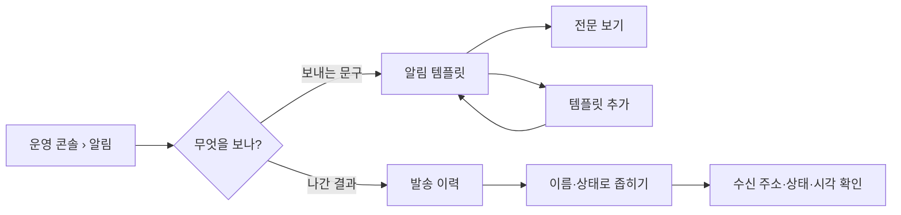

# 캡틴은 알림 템플릿, 발송 이력 조회가 가능하다.

기준 프로토타입: 운영 콘솔 › 알림 — https://playground.studyclub-plusplus.com/proto/console/notifications

## 1. 기본설명

회원에게 **무엇을 보내는지**(템플릿)와 **무엇이 나갔는지**(발송 이력)를 한 메뉴에서 본다.
회원이 「메일을 못 받았다」고 할 때 운영진이 처음 여는 자리다.

### 진입·사용 흐름

### 완료 기준

1. 한 메뉴 안에서 템플릿·발송 이력 탭 전환
2. 템플릿 제목·본문 전문 보기 — 치환 변수 원문 그대로
3. 템플릿 추가 (이름·제목·본문)
4. 발송 이력 최근 순 조회 — 요청 시각 · 수신 주소 · 발송 시각
5. 상태 문구 표기 — 색만으로 가르지 않음
6. 이름·상태 드롭다운 및 건수 확인
7. 조회 실패와 0건 구분
8. 발송 이력은 조회 전용 — 재발송·취소 없음

---

## 2. 화면명세

> **화면**: 운영 콘솔 › 알림 — 사이드바는 「알림」 하나이고, 안에서 두 탭으로 가른다.
> 사이드바를 두 단으로 만들면 다른 메뉴와 깊이가 달라져 훑기 어렵다.

### 알림 템플릿

#### 1 — 목록
- **내용**: 알림 이름 · 채널 · 제목 · 마지막 수정
- **동작**: 알림 이름을 누르면 전문을 본다
- **정책**
  - **「종류」라는 구분 축을 두지 않는다** — 템플릿 하나가 곧 알림 하나이고, 이름이 그 알림이다
    ([POL-0009](../../_registry/policies/POL-0009-notification.md))
  - 백엔드의 이벤트 코드는 화면에 내보내지 않는다 — 운영자가 쓸 값이 아니다
  - **마지막 수정은 늘 값이 있다** — 등록한 날이 첫 수정일이라 「수정된 적 없음」이라는 상태가 없다
  - 채널은 지금 모두 「메일」이다. 디스코드는 보낼 수단이 아직 없다
- **데이터**: `GET /api/admin/notification-templates`

#### 2 — 템플릿 추가
- **동작**: 누르면 창이 열리고, 추가하면 목록 맨 위에 선다
- **정책**: **나가는 알림이 늘 때마다 코드를 고치지 않게 한다** — 문구는 운영자가 더한다

##### 2-1 — 추가 창
- **내용**: 알림 이름 · 제목 · 본문
- **동작**: 셋 중 하나라도 비면 추가되지 않는다
- **정책**
  - 이벤트 코드를 입력받지 않는다
  - **채널을 고르게 하지 않는다** — 지금 보낼 수 있는 것은 메일뿐이다. 디스코드가 열리면 칸을 더한다
  - 쓸 수 있는 치환 변수를 칸 아래에 적는다 — 「`{{nickname}}` 으로 닉네임 삽입」
  - 닫는 수단은 X 하나다. 입력·설정 창이라 취소를 두지 않는다
    ([POL-0008](../../_registry/policies/POL-0008-screen-rules.md))
- **데이터**: `POST /api/admin/notification-templates`

#### 3 — 전문 보기
- **내용**: 알림 이름 · 채널 · 제목 · 본문 · 마지막 수정
- **정책**
  - **치환 변수를 그대로 보여준다** — 미리 채워 보여주면 원문이 무엇인지 알 수 없다
  - 줄바꿈을 원문대로 지킨다. 메일에 그 모양으로 나간다

### 발송 이력

#### 4 — 거르는 칸
- **내용**: 알림 이름 · 상태 두 축. 고르기 전에는 **축 이름만** 보이고, 하나 고르면 첫 줄이 「전체」가 된다
  ([POL-0008](../../_registry/policies/POL-0008-screen-rules.md))
- **동작**: 고르면 첫 페이지로 돌아간다
- **정책**: 거르는 선택지는 **등록된 템플릿에서 온다**. 따로 관리하지 않는다

##### 4-1 — 총 건수
- **내용**: 지금 조건에 걸린 전체 건수
- **정책**: 보이는 20건이 아니라 조건 전체의 수다 — 페이지를 넘기지 않고도 규모를 안다

#### 5 — 이력 표
- **내용**: 요청 시각 · 알림 이름 · 채널 · 수신 주소 · 상태 · 발송 시각
- **동작**: 요청 시각 내림차순 고정. 열 머리로 정렬하지 않고, 행을 눌러도 아무 일도 없다
- **정책**
  - **수신 주소는 서버가 가린 값을 그대로 쓴다** — 전체 주소를 보는 길을 두지 않는다. 열어 두면
    조회 이력을 남겨야 하는데 그럴 장치가 없다
  - 상태는 **문구와 색을 함께** 쓴다. 색만으로 가르면 색을 구분하지 못하는 사람이 읽을 수 없다
  - 「발송 완료」는 **보냈다는 뜻**이지 받았다는 뜻이 아니다 — 수신함 도착·읽음은 알 수 없다
  - 모르는 상태값은 원문 코드를 회색으로 그대로 적는다. 빈칸으로 두지 않는다
  - 시각은 **보는 사람의 시간대**로, **24시간제**로 적는다 ([POL-0006](../../_registry/policies/POL-0006-timezone.md))

| 상태 | 화면 문구 | 뜻 |
|---|---|---|
| `PENDING` | 발송 대기 | 아직 집어가지 않았다 |
| `PROCESSING` | 발송 중 | 발송기가 들고 있다 |
| `SENT` | 발송 완료 | **보냈다** — 받았는지는 모른다 |
| `FAILED` | 발송 실패 | 보내지 못했다 |

#### 6 — 페이지 이동
- **조건**: 이력이 한 건이라도 있을 때
- **내용**: 이전 · 현재/전체 페이지 · 다음. 화살표만 두고 글자를 적지 않는다
- **동작**: 한 페이지 20건. 양 끝에서는 해당 방향이 눌리지 않고, 보던 페이지가 사라지면 첫 페이지로 돌아간다

### 상태별 화면

| 상태 | 화면 | 카피 |
|---|---|---|
| 읽는 중 | 표 자리에 20줄의 빈 칸. 거르는 칸 비활성 | — |
| 이력 없음 | 표 자리에 안내 한 줄 | 「아직 알림 발송 이력이 없습니다.」 |
| 거른 결과 없음 | 안내 + 전체 보기 | 「선택한 상태의 발송 이력이 없습니다.」 |
| 읽기 실패 | 안내 + 다시 시도 | 「발송 이력을 불러오지 못했습니다. 다시 시도해 주세요.」 |

**읽기 실패를 「0건」으로 보여주지 않는다** — 없는 것과 못 읽은 것은 다른 일이고, 운영자가 할 일도 다르다.

### 비고

- **범위 밖** — 템플릿 수정·삭제 · 재발송 · 발송 취소 · 실패 사유 상세 · 전체 주소 보기 ·
  도착·읽음 여부 · 성공률 통계 · CSV 내려받기. **API 가 주지 않는 것을 화면이 지어내면 운영자는
  없는 수단을 찾는다**
- 템플릿 화면은 **지금 등록된 문구**를 보여준다. 특정 발송 건에 쓰인 그때 원문이 아니다
- **다음에 붙을 것** — 회원 탈퇴가 붙으면 「발송 취소」 상태가 생긴다(보내기 전에 보낼 이유가 없어진 건).
  발송 실패와 구분해 적고, 지금 거르는 선택지에는 미리 넣지 않는다
- **미구현** — 서버 연동. 프로토는 mock 으로 그린다

---

## 3. 시스템 요건

### API

| 메서드 | 경로 | 설명 |
|---|---|---|
| GET | `/api/admin/notification-templates` | 템플릿 목록 |
| POST | `/api/admin/notification-templates` | 템플릿 추가 — 이름 · 제목 · 본문 (채널은 메일 고정) |
| GET | `/api/admin/notifications` | 발송 이력 — `status` · `eventType` · `offset` · `limit`(20) |

- 발송 이력 응답: `items[]`(`createdAt` · `eventType` · `recipientType` · `recipientValue`(마스킹) ·
  `status` · `sentAt`) + `total`. `id` · `templateId` 는 받되 화면에 쓰지 않는다
- 알림 스펙의 `/back-office/notifications` 는 **구 경로**다 ([specs/notification](../../../specs/notification/spec.md))
- 권한: 캡틴 ([POL-0001](../../_registry/policies/POL-0001-roles.md)). 라우팅만으로 막지 않고 서버가 검증한다

### 처리

| 경우 | 처리 |
|---|---|
| `sentAt` 이 없는데 상태가 `SENT` | 발송 시각 자리에 `—`. 오류로 다루지 않는다 |
| `offset` 이 `total` 을 넘김 | 첫 페이지로 되돌린다 |
| 같은 조건을 연달아 부름 | 앞선 요청을 버리고 마지막 응답만 반영한다 |
| `createdAt` 을 읽을 수 없음 | 원문 문자열을 그대로 적는다 |
| 모르는 `status` | 원문 코드를 회색 배지로 적는다 |

### 템플릿이 곧 알림이다

백엔드는 `EVENT_TYPE` 코드로 알림을 구분하지만, **운영자에게는 알림 이름만 보인다.** 템플릿을 더하면
보낼 수 있는 알림이 늘어나는 구조여야 한다 — 기획이 정한 고정 목록을 코드에 박아 두면 새 알림마다
개발을 기다리게 된다 ([POL-0009](../../_registry/policies/POL-0009-notification.md)).
