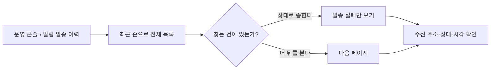

# 캡틴은 알림 발송 이력을 볼 수 있다.

기준 프로토타입: 운영 콘솔 › 알림 발송 이력 — https://playground.studyclub-plusplus.com/proto/console/notifications

## 1. 기본설명

가입 환영 메일이 **어느 주소로 나갔고 지금 어떤 상태인가**를 확인한다. 회원이 「메일을 못 받았다」고
할 때 운영진이 처음 여는 화면이다.

### 진입·사용 흐름

### 완료 기준

1. 가입 환영 메일이 **언제 요청돼 어느 주소로 나갔는지**를 최근 순으로 본다
2. 각 건이 지금 어떤 상태인지 **문구로** 안다 — 색만으로 가르지 않는다
3. 상태로 목록을 좁힐 수 있고, 좁힌 조건의 전체 건수를 안다
4. 20건씩 넘겨 가며 지난 이력을 본다
5. **못 읽은 것과 한 건도 없는 것을 구분해서** 안다
6. 읽기만 한다 — 이 화면에서 다시 보내거나 취소하지 않는다

---

## 2. 화면명세

> **화면**: 운영 콘솔 › 알림 발송 이력

### 1 — 제목과 한 줄
- **내용**: 「알림 발송 이력」과 「가입 환영 메일의 발송 상태를 확인할 수 있습니다.」
- **정책**
  - 지금 나가는 알림이 **한 종류뿐**이라는 사실을 한 줄로 밝힌다
  - 알림 템플릿은 **별개 화면**이다. 사이드바에서도 따로 선다

### 2 — 상태 필터
- **내용**: 전체 · 발송 대기 · 발송 중 · 발송 완료 · 발송 실패. 들어오면 전체
- **동작**: 고르면 첫 페이지로 돌아간다 — 3페이지를 보던 중에 거르면 그 페이지가 없을 수 있다
- **정책**
  - 알림 종류 필터는 두지 않는다 — 고를 것이 하나뿐이다
  - 전체일 때는 상태 조건을 서버에 보내지 않는다

#### 2-1 — 총 건수
- **내용**: 지금 조건에 걸린 전체 건수
- **정책**: 화면에 보이는 20건이 아니라 **조건 전체**의 수다 — 페이지를 넘기지 않고도 규모를 안다

#### 2-2 — 새로고침
- **동작**: 같은 조건으로 다시 읽는다. 연타하면 마지막 요청의 답만 반영한다
- **정책**
  - **재발송이 아니다.** 아이콘과 「새로고침」을 함께 둬서 다시 보낸다는 뜻으로 읽히지 않게 한다
  - 읽는 동안에는 필터와 함께 눌리지 않는다

### 3 — 이력 표
- **내용**: 요청 시각 · 알림 종류 · 채널 · 수신 주소 · 상태 · 발송 시각
- **동작**
  - 요청 시각 내림차순 고정. 열 머리를 눌러 정렬하지 않는다
  - 행을 눌러도 아무 일도 없다 — 상세 화면이 없다
- **정책**
  - **수신 주소는 서버가 가린 값을 그대로 쓴다** — 화면에서 풀거나 다시 가리지 않는다
  - 상태는 **문구와 색을 함께** 쓴다. 색만으로 가르면 색을 구분하지 못하는 사람이 읽을 수 없다
  - 「발송 완료」는 **보냈다는 뜻**이지 받았다는 뜻이 아니다 — 수신함 도착·읽음은 알 수 없다
  - 모르는 상태값이 오면 원문 코드를 회색으로 그대로 적는다. 빈칸으로 두지 않는다
  - 시각은 **보는 사람의 시간대**로 적고 약칭(KST · ET · PT)을 붙인다
    ([POL-0006](../../_registry/policies/POL-0006-timezone.md)). 읽을 수 없는 값이면 원문을 그대로 둔다
  - 내부 id 와 템플릿 id 는 화면에 내보내지 않는다 — 운영자가 쓸 일이 없다
- **데이터**: `createdAt` · `eventType` · `recipientType` · `recipientValue`(마스킹) · `status` · `sentAt`

| 상태 | 화면 문구 | 뜻 |
|---|---|---|
| `PENDING` | 발송 대기 | 아직 집어가지 않았다 |
| `PROCESSING` | 발송 중 | 발송기가 들고 있다 |
| `SENT` | 발송 완료 | **보냈다** — 받았는지는 모른다 |
| `FAILED` | 발송 실패 | 보내지 못했다 |

### 4 — 페이지 이동
- **조건**: 이력이 한 건이라도 있을 때
- **내용**: 이전 · 현재/전체 페이지 · 다음
- **동작**
  - 한 페이지 20건 고정
  - 첫 페이지에서는 이전이, 마지막에서는 다음이 눌리지 않는다
  - 보던 페이지가 사라졌으면 첫 페이지로 돌아간다 — 그사이 건수가 늘거나 줄면 생긴다
- **정책**: 0건이면 이 줄을 아예 그리지 않는다

### 상태별 화면

| 상태 | 화면 | 카피 |
|---|---|---|
| 읽는 중 | 표 자리에 20줄의 빈 칸. 필터·새로고침 비활성 | — |
| 이력 없음 | 표 자리에 안내 한 줄 | 「아직 알림 발송 이력이 없습니다.」 |
| 거른 결과 없음 | 안내 한 줄 + 전체 보기 | 「선택한 상태의 발송 이력이 없습니다.」 |
| 읽기 실패 | 안내 한 줄 + 다시 시도 | 「발송 이력을 불러오지 못했습니다. 다시 시도해 주세요.」 |
| 로그인 끊김 | 로그인 안내 후 로그인 화면으로 | — |

- **읽기 실패를 「0건」으로 보여주지 않는다** — 없는 것과 못 읽은 것은 다른 일이고, 운영자가 할 일도 다르다
- 비었을 때도 표 자리의 높이를 지킨다 — 상태가 바뀔 때마다 화면이 들썩이지 않게

### 비고

- **범위 밖** — 수신자 이름·이메일 검색 · 날짜 범위 필터 · 정렬 선택 · 실패 사유 상세 ·
  재발송·발송 취소 · 메일 제목·본문 · 전체 주소 보기 · 도착·읽음 여부 · 성공률 통계 · CSV 내려받기.
  **API 가 주지 않는 것을 화면이 지어내면 운영자는 없는 수단을 찾는다**
- 알림 템플릿 화면으로 링크를 걸더라도 그 화면은 **지금 등록된 문구**를 보여준다. 그때 나간 원문이
  아니므로 「이 건에 쓰인 문구」라고 적지 않는다
- **다음에 붙을 것** — 회원 탈퇴가 붙으면 「발송 취소」 상태가 생긴다(보내기 전에 보낼 이유가 없어진 건).
  발송 실패와 구분해 적고, 지금 필터 선택지에는 미리 넣지 않는다
- **미구현** — 서버 연동. 프로토는 mock 128건으로 그린다

---

## 3. 시스템 요건

### API

`GET /api/admin/notifications`

| 요청 | 값 |
|---|---|
| `status` | 상태 필터. 「전체」일 때는 보내지 않는다 |
| `eventType` | `USER_REGISTERED` |
| `offset` | 건너뛸 건수 (0 · 20 · 40 …) |
| `limit` | 20 고정 |

| 응답 | 값 |
|---|---|
| `items[]` | `createdAt` · `eventType` · `recipientType` · `recipientValue`(마스킹) · `status` · `sentAt`(null 가능) · `id`(미노출) · `templateId`(미노출) |
| `total` | 지금 조건의 전체 건수 |

- 알림 스펙에 남아 있는 `/back-office/notifications` 는 **구 경로**다. 위 경로를 쓴다
  ([specs/notification](../../../specs/notification/spec.md))
- 권한: 캡틴 ([POL-0001](../../_registry/policies/POL-0001-roles.md)). 라우팅만으로 막지 않고 서버가 검증한다

### 처리

| 경우 | 처리 |
|---|---|
| `sentAt` 이 없는데 상태가 `SENT` | 발송 시각 자리에 `—`. 오류로 다루지 않는다 |
| `offset` 이 `total` 을 넘김 | 첫 페이지로 되돌린다 |
| 새로고침 연타 | 앞선 요청을 버리고 마지막 응답만 반영한다 |
| `createdAt` 을 읽을 수 없음 | 원문 문자열을 그대로 적는다 |
| 모르는 `status` | 원문 코드를 회색 배지로 적는다 |

### 결정한 것

- **수신 주소는 마스킹한 채로 둔다.** 운영진이 전체 주소를 볼 길을 두지 않는다 — 열어 두면 조회 이력을
  남겨야 하고, 지금은 그럴 장치가 없다. 본인 확인이 필요한 문의는 별도 절차로 다룬다
- **시각은 보는 사람의 시간대로 적는다** — 운영진이 한국·북미에 흩어져 있어 서버 기준으로 적으면
  각자 머릿속에서 환산해야 한다 ([POL-0006](../../_registry/policies/POL-0006-timezone.md))
