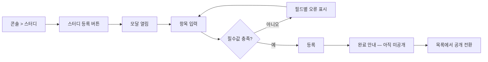
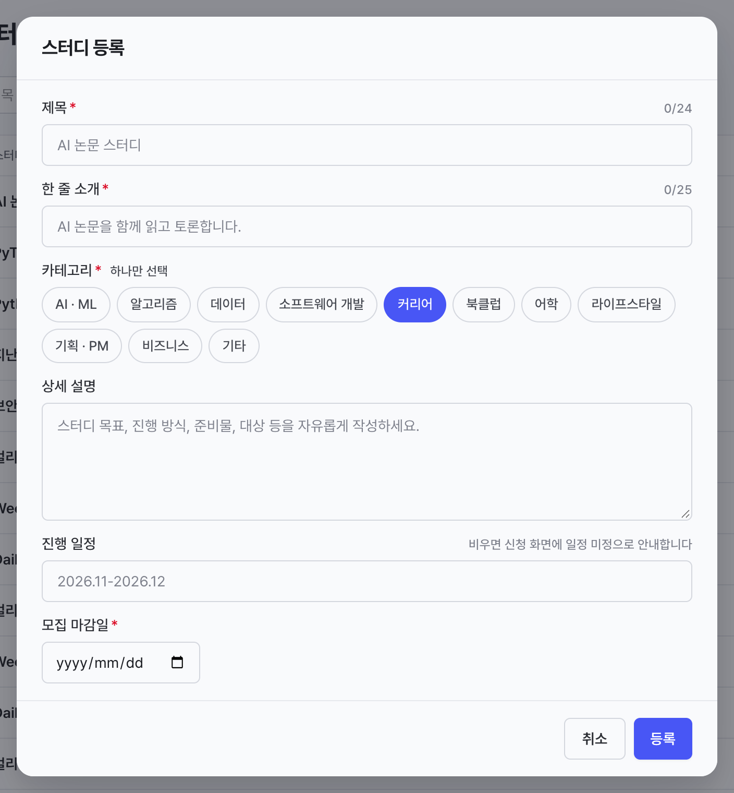
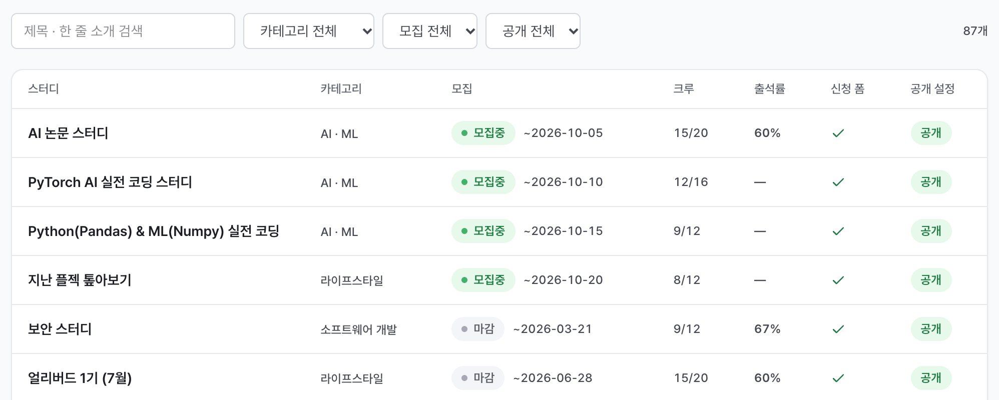

# 캡틴은 스터디를 등록할 수 있다.

기준 프로토타입: 운영 콘솔 › 스터디 관리 — https://playground.studyclub-plusplus.com/proto/console/studies

## 1. 기본설명

### 진입·사용 흐름

### 완료 기준

1. 필수 네 항목(제목 · 한 줄 소개 · 카테고리 · 모집 마감일)을 채우면 등록된다
2. **등록한 스터디는 사용자 사이트에 보이지 않는다.** 공개는 목록에서 따로 켠다
3. 마감일을 지정하면 카드에 마감일이 표시되고, 그날이 지나면 「모집 마감」으로 바뀐다
4. 고른 카테고리로 목록에서 구분된다

---

## 2. 화면명세

> **화면**: 운영 콘솔 › 스터디 › 「스터디 등록」 모달

**항목 순서**: 제목 → 한 줄 소개 → 카테고리 → 상세 설명 → 진행 일정 → 모집 마감일.
**무엇을 만드는지부터 받고 날짜를 마지막에 받는다** — 제목을 쓰기 전에 마감일을 묻는 것은 아직
정하지 않은 것을 먼저 묻는 일이다.

### 1 — 모달 전체
- **내용**: 제목 「스터디 등록」. 부제 없음
- **동작**
  - 배경 클릭 · Esc · 「취소」 → 닫힘
  - 열릴 때 **한 번만** 첫 입력 요소로 포커스 이동 (입력 중에는 포커스를 옮기지 않는다)
  - 열려 있는 동안 배경 스크롤 잠금. Tab 이 모달 안을 순환
- **정책**: 모든 입력 항목이 한 화면에 들어와야 한다

### 2 — 제목 (필수)
- **내용**: 이 스터디를 무엇이라 부를 것인가. 예시 「AI 논문 스터디」
- **동작**: 비어 있으면 등록 불가
- **정책**: 60자 상한 (초과 시 오류)
- **데이터**: `study.title`

#### 2-1 — 글자수 카운터
- **내용**: `현재/권장` 형식 (예: `0/24`)
- **정책**: 경고일 뿐 등록을 막지 않는다. 권장 길이를 넘으면 목록 카드에서 제목이 잘릴 수 있다

### 3 — 한 줄 소개 (필수)
- **내용**: 목록에서 이 스터디를 한 줄로 설명하는 문장
- **데이터**: `study.summary` — 목록 카드에 노출. 길면 잘릴 수 있다

#### 3-1 — 글자수 카운터
- **내용**: `현재/권장` 형식 (예: `0/25`)

### 4 — 카테고리 (필수)
- **내용**: 이 스터디가 어느 분야인가. 고른 것과 고르지 않은 것이 한눈에 갈린다
- **동작**
  - **하나만 고른다.** 고른 것을 다시 누르면 선택이 풀린다
  - 주어진 목록에서만 고른다. 자유 입력은 없다
- **정책**
  - 선택지 **11종 고정** · 목록 순서는 등록 빈도 기준 — [POL-0003 스터디 정보 항목](../../_registry/policies/POL-0003-study-fields.md)
  - 이 목록은 **실제로 열린 스터디에서 뽑은 것**이다. 기획이 정하고 API enum 이 따라온다
  - **하나만 고르게 한다** — 여럿을 달면 「이 스터디가 무슨 분야인가」에 답이 둘이 되고,
    목록·대시보드의 카테고리별 합계가 총 스터디 수와 어긋난다
- **데이터**: 고른 카테고리 하나. 목록 카드의 색·아이콘도 이 값으로 정한다

#### 4-1 — 선택 안내
- **내용**: 「하나만 선택」

### 5 — 상세 설명
- **내용**: 스터디 목표·진행 방식·준비물·대상을 길게 적는 자리
- **동작**: 선택 입력
- **데이터**: `study.description` — 스터디 상세에서 사용. 목록 카드에는 미노출

### 6 — 진행 일정
- **내용**: 모집 때 알리는 일정 문구. 비워도 등록된다
- **동작**: 자유 텍스트. 날짜 형식을 강제하지 않는다
- **정책**
  - 모집 마감일과 별개다. 이쪽은 「언제 모이느냐」, 마감일은 「언제까지 신청받느냐」
  - 실제로 회차를 만드는 요일·시간은 **반**이 갖는다. 모집 시점에는 반이 없다
- **데이터**: `study.schedule`

#### 6-1 — 일정 안내
- **내용**: 「비우면 신청 시 가능한 시간을 받습니다」
- **정책**: 이 칸의 유무가 신청 화면을 가른다 — 있으면 참여 가능 확인, 없으면 가능한 시간을 받는다

### 7 — 모집 마감일 (필수)
- **내용**: 언제까지 신청을 받는가
- **정책**: 이 값 하나로 모집 상태가 정해진다 — [POL-0002 스터디 상태](../../_registry/policies/POL-0002-study-status.md)
- **데이터**: `study.recruitment.deadline`

### 8 — 취소
- **동작**: 모달 닫기. 입력값 폐기

### 9 — 등록
- **동작**
  - 검증 통과 → 저장 → 완료 화면으로 전환
  - 검증 실패 → 해당 필드에 오류 표시, 저장 안 함
  - 처리 중 → 진행 중임을 알리고 버튼 비활성 (중복 제출 차단)
- **정책**
  - 검토·승인 단계는 없다
  - **등록 결과는 늘 미공개다.** 등록 시점에는 신청 폼도 회차도 없어서, 그대로 사이트에 서면
    크루가 신청할 데 없는 스터디를 보게 된다
- **데이터**: `POST /api/studies`

### 공개일이 이 화면에 없는 이유

등록 폼에 공개일을 두면 그 날짜가 **준비가 끝났다는 뜻**이 되어 버린다. 실제로 준비가 끝났는지는
날짜가 아니라 신청 폼이 걸렸는지로 갈린다. 그래서 등록은 늘 미공개로 끝나고, 공개는 목록의
「공개 설정」에서 켠다 — 거기서는 신청 폼이 없으면 켤 수 없다.

### 목록에서 보이는 모습

### 상태별 화면

| 상태 | 화면 | 카피 |
|---|---|---|
| 기본 | 모든 입력 항목이 한 화면에 | — |
| 검증 실패 | 해당 필드에 오류와 문구. 초점은 첫 오류 필드로 | 「제목을 입력하세요.」 / 「한 줄 소개를 입력하세요.」 / 「카테고리를 고르세요.」 / 「모집 마감일을 고르세요.」 / 「60자 이내로 입력하세요.」 |
| 처리중 | 등록이 진행 중임을 알리고 등록·취소 모두 비활성 | — |
| 완료 | 본문이 안내문으로 교체, 닫는 수단 하나만 남음 | 「등록되었습니다. 아직 사이트에 보이지 않습니다 — 목록에서 공개를 켜세요.」 |

---

## 3. 시스템 요건

### 데이터

| 필드 | 타입 | 필수 | 제약 |
|---|---|---|---|
| title | string | 필수 | 1~60자 |
| summary | string | 필수 | 1줄 |
| description | text | | |
| category | enum(11) | 필수 | 고정 목록 중 **하나** |
| deadline | date | 필수 | 모집 상태를 가르는 축 |
| schedule | string | | 비우면 목록에 일정 미표시 |
| published | boolean | 필수 | **등록 시 항상 false.** 이 화면은 이 값을 입력받지 않는다 |
| created_by | FK(User) | 필수 | 등록한 캡틴 |

모집 상태는 컬럼으로 저장하지 않는다.

### 처리

- **검증(서버 기준)** — title · summary · category · deadline 필수 · title ≤ 60자 · category 는 11종 중 하나
- **저장** — `published = false` 로 레코드 생성 후 목록 캐시 무효화
- **실패 응답** — 검증 400(필드별 오류) · 권한 403 · 저장 500(화면은 입력값 유지)
- **완료 정의** — 등록한 스터디가 **운영 콘솔** 조회 응답에 포함된다 (공개 API 에는 아직 없다)

### API · 권한

| 메서드 | 경로 | 권한 |
|---|---|---|
| POST | `/api/studies` | 캡틴 ([POL-0001](../../_registry/policies/POL-0001-roles.md)) |
| GET | `/api/studies` | 공개 (공개된 건만) |

---

## 4. 비고

- **범위 밖** — 공개 전환 · 신청 폼 연결 · 신청 접수 · 반 편성 · 등록 후 수정·삭제 ·
  주차별 커리큘럼·후기·통계 입력 · 상세 설명의 서식(마크다운) · 작성 중 이탈 처리
- **미구현** — `POST /api/studies`. 프로토는 화면에서만 처리한다
- **미구현** — `STUDY` 에 공개 여부 필드. 기본값은 미공개다
