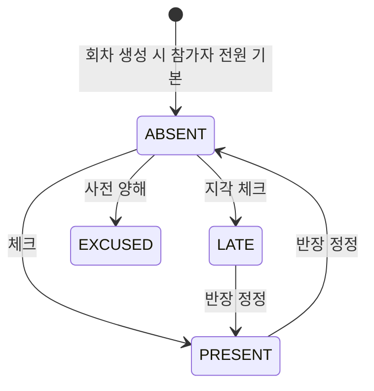

# ATTENDANCE — 출석

회차(STUDY_SESSION) × 회원 1행. 반장이 회차 시작 시 디스코드 명령어로 찍고, 사후 수정 가능.
마이페이지 출석 현황·완주율은 **여기서 계산**해서 가져간다 (다른 화면에서 재계산 금지).

## 컬럼

| 컬럼 | 타입 | NULL | 설명 |
|---|---|---|---|
| ID | BIGINT PK | N | |
| USER_ID | BIGINT FK → USER | N | |
| STUDY_SECTION_ID | BIGINT FK → STUDY_SECTION | N | 비정규화 — 반별 집계 쿼리용 (SESSION 을 통해 도출 가능) |
| STUDY_SESSION_ID | BIGINT FK → STUDY_SESSION | N | |
| STATUS | VARCHAR(20) | N | 아래 |
| START_TIME | DATETIME | Y | 입장 시각 |
| END_TIME | DATETIME | Y | 퇴장 시각 |
| CREATED_BY | BIGINT FK → USER | N | 찍은 사람 (반장 / 봇이면 시스템 계정) |
| UPDATED_BY | BIGINT FK → USER | Y | 수정한 사람 |
| CREATED_AT / UPDATED_AT | DATETIME | N | |

## 관계
- N : 1 [USER](./USER.md), [STUDY_SESSION](./STUDY_SESSION.md), [STUDY_SECTION](./STUDY_SECTION.md)

## 상태 — STATUS

| 값 | 뜻 | 완주율 계산 |
|---|---|---|
| `PRESENT` | 출석 | 출석 |
| `LATE` | 지각 (기준 시간은 운영 정책) | 출석 |
| `EXCUSED` | 사전 양해 결석 | 분모 제외 |
| `ABSENT` | 결석. 기본값 (회차 종료 시 미체크 인원 자동 ABSENT) | 결석 |

전이 제한 없음 — 반장/운영자가 사후 수정 가능. 대신 `UPDATED_BY`/`UPDATED_AT` 로 누가 언제 바꿨는지 남긴다.

## 제약
- `UNIQUE(STUDY_SESSION_ID, USER_ID)`
- 인덱스 `(USER_ID, STUDY_SECTION_ID)` — 마이페이지 출석 현황

## 미확정
- 행 생성 시점 — 회차 시작 시 참가자 전원 `ABSENT` 로 미리 만들지(집계 단순), 체크된 사람만 만들지(행 적음). 전자 제안.
- 지각 기준(분)·완주율 공식 — 운영 정책. 스키마 무관.
- 디스코드 명령어로 찍을 때 `CREATED_BY` 는 명령 친 반장의 USER.ID (DISCORD_ID 로 매핑).
