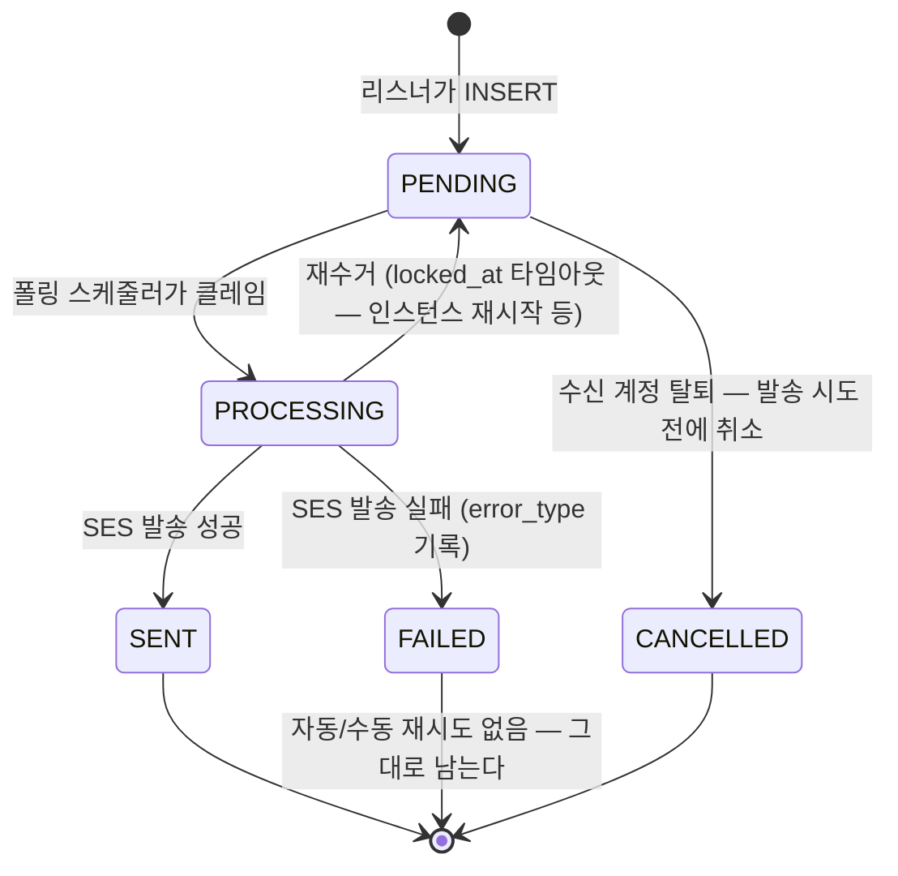

# NOTIFICATION — 알림 발송 이력

알림 수신처·닉네임 스냅샷과 발송 상태를 저장한다. 온보딩 커밋 이후 별도 트랜잭션으로 생성한다.

> 스펙: [notification](../../specs/notification/spec.md)

## 컬럼

| 컬럼 | 타입 | NULL | 설명 |
|---|---|---|---|
| ID | BIGINT PK | N | |
| EVENT_TYPE | VARCHAR(40) | N | 이번 구현에서 쓰는 값은 `USER_REGISTERED` 뿐. 다른 5종은 코드에 없음 |
| RECIPIENT_TYPE | VARCHAR(20) | N | 이번 구현에서 쓰는 값은 `EMAIL` 뿐. `DISCORD` 는 정의하지 않는다 |
| RECIPIENT_VALUE | VARCHAR(255) | N | 발송 시점 이메일 스냅샷 (나중에 회원이 이메일을 바꿔도 이 값은 그대로) |
| RECIPIENT_USER_ID | BIGINT | Y | ID 참조([ACCOUNT](./ACCOUNT.md), FK 없음) — 웰컴메일은 항상 본인 수신이라 이번 구현에서는 NULL 이 나오지 않는다. 컬럼 자체는 nullable(운영 공용 발송 등 미래 대비) |
| TEMPLATE_ID | BIGINT | N | ID 참조([NOTIFICATION_TEMPLATE](./NOTIFICATION_TEMPLATE.md), FK 없음) |
| PAYLOAD | JSON | N | `{"nickname": "..."}`. 리스너가 INSERT 시점에 `ACCOUNT.NICKNAME` 을 읽어 스냅샷 (발송 시점에 다시 조회하지 않음 — RECIPIENT_VALUE 와 같은 이유) |
| STATUS | VARCHAR(20) | N | `PENDING`/`PROCESSING`/`SENT`/`FAILED`/`CANCELLED` |
| LOCKED_AT | DATETIME(6) | Y | PROCESSING 전환 시각. 재수거 판단 기준이자 클레임 토큰(재수거로 값이 달라지면 이전 클레임의 완료 처리를 무시한다) |
| ERROR_TYPE | VARCHAR(30) | Y | FAILED 일 때만. `TEMPLATE_MISSING`/`INVALID_RECIPIENT`/`PROVIDER_ERROR`/`UNKNOWN`. 자동 재시도 판단에는 안 쓴다(이번 구현엔 자동 재시도가 없음) — 실패 원인을 나중에 사람이 보기 위한 값 |
| SCHEDULED_AT | DATETIME(6) | Y | 이번 구현에서는 항상 NULL(즉시 발송). 시간 트리거형 이벤트를 위해 컬럼만 미리 둔다 |
| SENT_AT | DATETIME(6) | Y | 발송 성공 시각 |
| CREATED_AT / UPDATED_AT | DATETIME(6) | N | `BaseEntity` |

## 관계

- N : 1 [ACCOUNT](./ACCOUNT.md), ID 참조뿐 FK 는 없다(애그리거트 간 참조 — database-guide.md 외래키 정책). 계정이 삭제돼도 RECIPIENT_USER_ID 는 DB 가 자동으로 지워주지 않는다.
- N : 1 [NOTIFICATION_TEMPLATE](./NOTIFICATION_TEMPLATE.md), 마찬가지로 ID 참조뿐이라 사용 중인 템플릿도 삭제될 수 있다 — 편집 화면이 없어 이번 구현에서는 실제로 일어나지 않는다.

## 상태 — STATUS

`CANCELLED` 는 `FAILED` 와 구분한다 — `FAILED` 는 발송을 시도했다가 실패한 것(`ERROR_TYPE` 기록),
`CANCELLED` 는 발송 시도 전에 수신자가 탈퇴해 더 보낼 이유가 없어진 것이다. `ERROR_TYPE` 은 `FAILED`
전용이라 `CANCELLED` 에는 채우지 않는다. 트리거는 [user-leave spec](../../specs/user-leave/spec.md#알림-비식별화)
의 `DELETE /api/me` 뿐이다.

## 제약

- 인덱스 `idx_notification_status_created (STATUS, CREATED_AT)`, `idx_notification_recipient_user (RECIPIENT_USER_ID)`, `idx_notification_template (TEMPLATE_ID)`.
- PAYLOAD 는 MySQL JSON. 이메일·닉네임 원문은 발송에만 사용하며 조회 응답에서 이메일을 마스킹한다.
- PROCESSING 은 5분 초과 시 재수거한다. FAILED 는 자동/수동 재시도하지 않는다.
- RECIPIENT_USER_ID·TEMPLATE_ID 는 애그리거트 사이 참조라 FK 를 걸지 않는다 — ID + 인덱스만
  ([database-guide.md 외래키 정책](../backend-development-guide/database-guide.md)). 엔티티 간에도 객체 연관 없이 ID 로만 참조한다.
