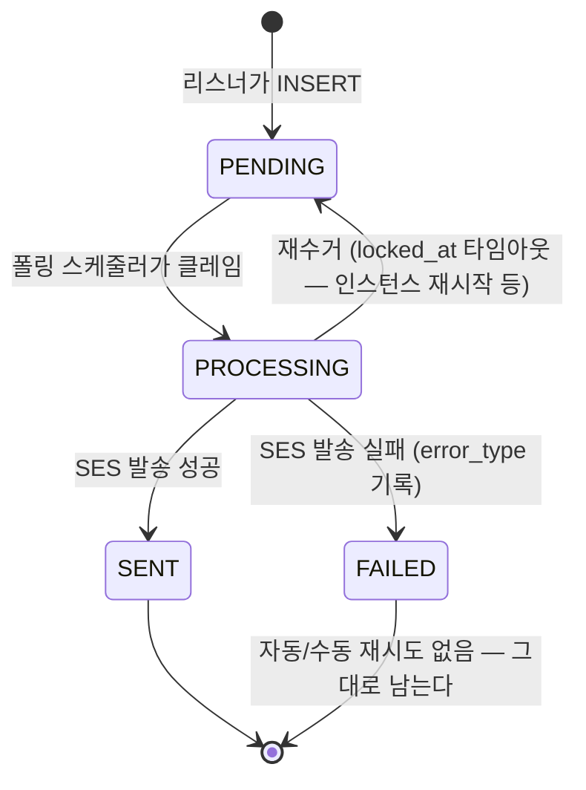

# NOTIFICATION — 알림 발송 이력

알림 수신처·닉네임 스냅샷과 발송 상태를 저장한다. 온보딩 커밋 이후 별도 트랜잭션으로 생성한다.

> 스펙: [notification](../../specs/notification/spec.md)

## 컬럼

| 컬럼 | 타입 | NULL | 설명 |
|---|---|---|---|
| ID | BIGINT PK | N | |
| EVENT_TYPE | VARCHAR(40) | N | 이번 구현에서 쓰는 값은 `USER_REGISTERED` 뿐. 다른 5종은 코드에 없음 |
| RECIPIENT_TYPE | VARCHAR(20) | N | 이번 구현에서 쓰는 값은 `EMAIL` 뿐. `DISCORD` 는 정의하지 않는다 |
| RECIPIENT_VALUE | VARCHAR(255) | N | 발송 시점 이메일 스냅샷 (나중에 회원이 이메일을 바꿔도 이 값은 그대로) |
| RECIPIENT_USER_ID | BIGINT FK→ACCOUNT | Y | 웰컴메일은 항상 본인 수신이라 이번 구현에서는 NULL 이 나오지 않는다. 컬럼 자체는 nullable(운영 공용 발송 등 미래 대비) |
| TEMPLATE_ID | BIGINT FK→NOTIFICATION_TEMPLATE | N | |
| PAYLOAD | JSON | N | `{"nickname": "..."}`. 리스너가 INSERT 시점에 `ACCOUNT.NICKNAME` 을 읽어 스냅샷 (발송 시점에 다시 조회하지 않음 — RECIPIENT_VALUE 와 같은 이유) |
| STATUS | VARCHAR(20) | N | `PENDING`/`PROCESSING`/`SENT`/`FAILED` |
| LOCKED_AT | DATETIME | Y | PROCESSING 전환 시각. 재수거 판단 기준 |
| ERROR_TYPE | VARCHAR(30) | Y | FAILED 일 때만. `TEMPLATE_MISSING`/`INVALID_RECIPIENT`/`PROVIDER_ERROR`/`UNKNOWN`. 자동 재시도 판단에는 안 쓴다(이번 구현엔 자동 재시도가 없음) — 실패 원인을 나중에 사람이 보기 위한 값 |
| SCHEDULED_AT | DATETIME | Y | 이번 구현에서는 항상 NULL(즉시 발송). 시간 트리거형 이벤트를 위해 컬럼만 미리 둔다 |
| SENT_AT | DATETIME | Y | 발송 성공 시각 |
| CREATED_AT / UPDATED_AT | DATETIME(6) | N | `BaseEntity` |

## 관계

- N : 1 [ACCOUNT](./ACCOUNT.md), 수신 계정 삭제 시 RECIPIENT_USER_ID 는 NULL.
- N : 1 [NOTIFICATION_TEMPLATE](./NOTIFICATION_TEMPLATE.md), 사용 중 템플릿 삭제는 FK가 차단한다.

## 상태 — STATUS

## 제약

- 인덱스 `idx_notification_status_created (STATUS, CREATED_AT)`.
- PAYLOAD 는 MySQL JSON. 이메일·닉네임 원문은 발송에만 사용하며 조회 응답에서 이메일을 마스킹한다.
- PROCESSING 은 5분 초과 시 재수거한다. FAILED 는 자동/수동 재시도하지 않는다.

스펙에서 확정한 FK를 적용한다. 엔티티 간에는 객체 연관 없이 ID로 참조한다.
