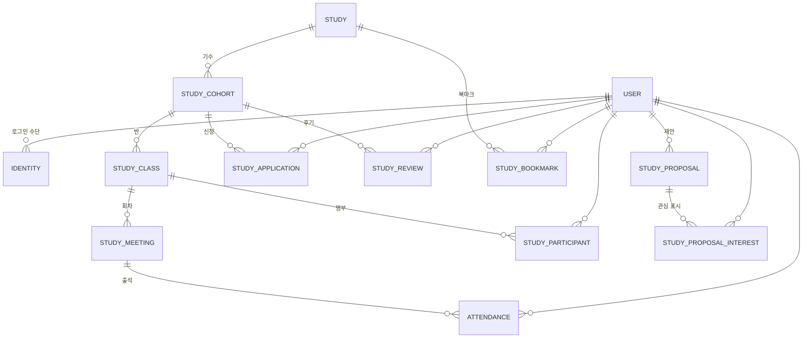
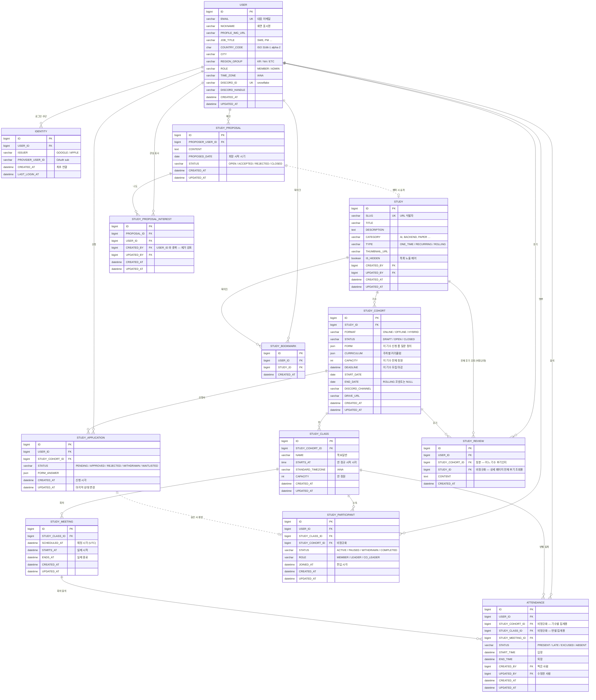

# ERD — StudyClub++ 데이터 모델

백엔드 스쿼드 08/24 회의에서 통합한 ERD 의 **레포 정본**. 테이블당 md 1개, 변경은 PR 로.

**그림은 mermaid 로 관리한다** — 이미지(`.png`)를 두지 않는다. 이미지는 옆의 문서가 바뀌어도
같이 안 바뀌고, 무엇이 달라졌는지 diff 에 안 보이고, 고치려면 원본 도구를 가진 사람이 필요하다.
mermaid 는 PR diff 에 그대로 뜨고 GitHub 이 렌더한다.

> 원본은 drawio 통합본(김지윤) + 테이블 설계 표(김보아·박세은). 이 문서들은 그것을 옮기고 **상태값·전이·제약**을 붙인 것이다.
> 아직 회의에서 확정 안 된 항목은 각 문서 하단 **미확정** 에 모아 두었다 — 08/28 회의 안건.

## 규약 (제안 — 08/30 일 회의에서 확정)


| 항목        | 규칙                                                                                            | 예                             |
| --------- | --------------------------------------------------------------------------------------------- | ----------------------------- |
| 테이블·컬럼 이름 | **대문자 · snake_case · 단수**                                                                     | `STUDY_CLASS`, `CREATED_AT` |
| PK        | `ID BIGINT AUTO_INCREMENT`                                                                    |                               |
| FK        | `<참조테이블>_ID`                                                                                  | `STUDY_ID`, `USER_ID`         |
| 시각        | `DATETIME` (UTC 저장, 표시 시 사용자 `TIME_ZONE` 적용)                                                  |                               |
| enum      | `VARCHAR(20)` 에 대문자 코드 문자열. 숫자 코드 대신 문자열 — 로그·쿼리에서 읽힌다                                        | `PENDING`, `APPROVED`         |
| 감사 컬럼     | `CREATED_AT` · `UPDATED_AT` 은 전 테이블 기본. 운영자가 만지는 테이블은 `CREATED_BY` · `UPDATED_BY`(USER.ID) 추가 |                               |
| 삭제        | 물리 삭제 대신 상태(`CLOSED`/`WITHDRAWN`) 또는 `REMOVED_AT`                                             |                               |

> **컬럼 대문자는 이 문서의 표기법이다 — 물리 컬럼은 소문자다.**
> MySQL 은 컬럼 식별자를 항상 대소문자 구분 없이 다루므로 `CREATED_AT` 과 `created_at` 은 같은 컬럼이다.
> 실제로 갈리는 건 **테이블 이름뿐**이라(리눅스 `lower_case_table_names=0`) 테이블만 물리적으로
> 대문자로 고정한다 — [database-guide §테이블·컬럼 이름 규칙](../backend-development-guide/database-guide.md#테이블컬럼-이름-규칙)

drawio 의 `NUMBER`/`DATE` 는 도구 기본 타입이라 여기서는 **MySQL 8 타입**으로 옮겼다 (`BIGINT`/`INT`/`DATETIME`/`DATE`).

## 설계 원칙 (요구사항 정의에서)

1. **상태는 최대한 저장하지 않고 날짜·관계로 계산한다.** 모집중/모집예정/마감은 `STUDY.DEADLINE`·`START_DATE` 로 판정. 저장하는 상태는 사람이 결정하는 것(승인/거절, 출석)만.
2. **삭제 대신 종료.** 스터디는 `CLOSED`, 참가자는 `WITHDRAWN`.
3. **한 사람 · 한 스터디 기준으로 전부 연결된다.** 신청 → 승인 → 명부(참가자) → 회차 → 출석 → 마이페이지가 같은 `USER_ID`·`STUDY_ID` 를 따라간다.
4. 비회원 공개 범위(목록·상세)와 로그인 사용자 범위(신청·출석·마이페이지)를 분리한다.

## 한눈에 보기 (관계도)

테이블과 연결만. 컬럼은 아래 [전체 ERD](#전체-erd-컬럼-포함) 또는 각 테이블 문서에.



## 전체 ERD (컬럼 포함)

위 관계도에 컬럼·키를 붙인 것. 이 다이어그램이 **예전 `erd-2026-08-24.png` 를 대신한다.**
타입 길이(`VARCHAR(255)` 등)와 제약·상태 전이는 각 테이블 문서가 정본이다 — 여기서는 구조만 본다.



## 테이블


| 영역  | 테이블                                                     | 한 줄                    | 저장하는 상태                              |
| --- | ------------------------------------------------------- | ---------------------- | ------------------------------------ |
| 회원  | [USER](./USER.md)                                       | 회원 프로필                 | `ROLE`                               |
| 회원  | [IDENTITY](./IDENTITY.md)                               | 소셜 로그인 수단 (구글 → 애플 확장) | —                                    |
| 회원  | [SESSION](./SESSION.md)                                 | 발급 토큰 (**Redis 캐시** — DB 테이블 아님) | — |
| 스터디 | [STUDY](./STUDY.md)                                     | 스터디/클럽 정체성             | `TYPE`                               |
| 스터디 | [STUDY_COHORT](./STUDY_COHORT.md)                       | 기수/회차 — 실제 운영 인스턴스     | `STATUS`, `FORMAT`                   |
| 스터디 | [STUDY_CLASS](./STUDY_CLASS.md)                         | 반 (요일·시간대별)            | —                                    |
| 스터디 | [STUDY_MEETING](./STUDY_MEETING.md)                     | 회차 (반의 N번째 모임)         | —                                    |
| 모집  | [STUDY_APPLICATION](./STUDY_APPLICATION.md)             | 신청서 (폼 스냅샷 + 답변)       | `STATUS`                             |
| 모집  | [STUDY_PARTICIPANT](./STUDY_PARTICIPANT.md)             | 명부 — 반에 소속된 사람         | `STATUS`, `ROLE`                     |
| 운영  | [ATTENDANCE](./ATTENDANCE.md)                           | 회차별 출석                 | `STATUS`                             |
| 반응  | [STUDY_REVIEW](./STUDY_REVIEW.md)                       | 후기                     | —                                    |
| 반응  | [STUDY_BOOKMARK](./STUDY_BOOKMARK.md)                   | 북마크                    | —                                    |
| 제안  | [STUDY_PROPOSAL](./STUDY_PROPOSAL.md)                   | "이런 스터디 열어주세요"         | `STATUS`                             |
| 제안  | [STUDY_PROPOSAL_INTEREST](./STUDY_PROPOSAL_INTEREST.md) | 제안에 "나도"               | —                                    |


## ERD 추가·변경 절차

**테이블을 하나 추가하면 문서 1개를 만들고 mermaid 2곳을 고친다.** 셋 중 하나라도 빠지면
그림과 문서가 갈라지고, 갈라진 순간부터 아무도 어느 쪽을 믿을지 모른다.


| #   | 무엇을                             | 어디를                             |
| --- | ------------------------------- | ------------------------------- |
| 1   | **문서 1개 추가**                    | `docs/erd/<TABLE>.md` — 아래 템플릿  |
| 2   | **mermaid ①** — 관계선 추가          | README [§한눈에 보기](#한눈에-보기-관계도)   |
| 3   | **mermaid ②** — 엔티티 블록 + 관계선 추가 | README [§전체 ERD](#전체-erd-컬럼-포함) |
| 4   | 표에 한 줄 추가                       | README [§테이블](#테이블)             |


**컬럼만 바꿀 때**는 2곳 — 해당 테이블 문서 + §전체 ERD 의 그 엔티티 블록.
(관계가 안 바뀌면 §한눈에 보기는 그대로 둔다.)

### 왜 mermaid 가 두 개인가

역할이 다르다. **§한눈에 보기**는 처음 오는 사람이 3초 만에 구조를 잡는 지도라 관계선만 있고,
**§전체 ERD**는 컬럼까지 붙은 참조본이다. 후자를 한눈에 보기용으로 쓰기엔 너무 크고,
전자를 참조본으로 쓰기엔 정보가 없다. 그래서 둘 다 두고, 대신 **둘을 같이 고치는 것을 규칙으로 박는다.**

### 테이블 문서 템플릿

```markdown
# <TABLE> — <한 줄>

<이 테이블이 무엇이고 왜 있는지 2~3줄. 다른 테이블과 헷갈리는 지점이 있으면 여기서 가른다>

## 컬럼

| 컬럼 | 타입 | NULL | 설명 |
|---|---|---|---|
| ID | BIGINT PK | N | |
| ... | | | |
| CREATED_AT / UPDATED_AT | DATETIME | N | |

## 관계
- N : 1 [<TABLE>](./<TABLE>.md)

## 상태 — STATUS
<값 표 + 전이가 있으면 mermaid stateDiagram-v2. 없으면 "없음" 이라고 쓴다>

## 제약
- `UNIQUE(...)`
- 인덱스 `(...)`

## 미확정
- <확정 안 된 것. 없으면 섹션 생략>
```

- **상태값은 저장하는 것만 표에 쓴다.** 날짜로 계산하는 상태는 "저장하지 않음 — 시각으로 계산"으로 따로 (예: [SESSION](./SESSION.md), [STUDY_MEETING](./STUDY_MEETING.md))
- 이름·타입은 위 [규약](#규약-제안--0830-일-회의에서-확정)을 따른다

### 셀프 체크

PR 올리기 전에 레포 루트에서:

```bash
for t in $(ls docs/erd/*.md | grep -v README | xargs -n1 basename | sed 's/\.md$//'); do
  grep -q "^  $t {" docs/erd/README.md || echo "§전체 ERD 누락: $t"
  sed -n '/## 한눈에 보기/,/## 전체 ERD/p' docs/erd/README.md | grep -q "\b$t\b" || echo "§한눈에 보기 누락: $t"
  grep -q "\[$t\](./$t.md)" docs/erd/README.md || echo "§테이블 표 누락: $t"
done
```

출력이 없으면 통과. **mermaid 가 실제로 렌더되는지는 PR 의 Files changed 미리보기로 확인한다**
(GitHub 이 렌더한다). 로컬에서 보려면 `npx @mermaid-js/mermaid-cli -i <파일>.mmd -o out.svg`.

### 코드와의 관계

ERD 는 **설계 합의**고, 실제 스키마의 정본은 마이그레이션(`backend/api/src/main/resources/db/migration/V*.sql`)이다.
ERD 를 바꿨다고 스키마가 바뀌지 않는다 — 구현할 때 마이그레이션을 따로 쓴다.
규칙은 [`../backend-development-guide/database-guide.md`](../backend-development-guide/database-guide.md).

## 미확정 (08/28 안건)

- **네이밍** — 대문자·snake·단수. drawio 에 소문자 테이블(`STUDY_CLASS`·`STUDY_PROPOSAL*`)이 섞여 있다.
- **신청 폼** — `STUDY_COHORT.FORM` + `STUDY_APPLICATION.FORM_ANSWER` JSON 으로 갈지, `STUDY_QUESTION`+`STUDY_APPLICATION_ANSWER` 테이블로 갈지(표 설계).
- **STUDY.CATEGORY** — 코드값(drawio)인지 `STUDY_CATEGORY` 테이블 FK(표 설계)인지.
- **회차 알림 자동화·디스코드 명령어 출석** — 스키마 영향 없음(ATTENDANCE.CREATED_BY 로 충분). 봇 쪽 결정.

**해결됨 — 기수(코호트)**: 클럽 N기는 새 STUDY 행이 아니라 별도 테이블
[STUDY_COHORT](./STUDY_COHORT.md) 로 낸다. `STUDY.TYPE`
(`ONE_TIME`/`RECURRING`/`ROLLING`)이 STUDY 에 남고,
기수마다 달라지는 `FORMAT`·`STATUS`·`CURRICULUM`·`CAPACITY`·`DEADLINE`·
`START_DATE`/`END_DATE`·`DISCORD_CHANNEL`·`DRIVE_URL` 은 전부 STUDY_COHORT 로
이동했다. 근거는 `study_schema_design_decisions.md` 참고.

