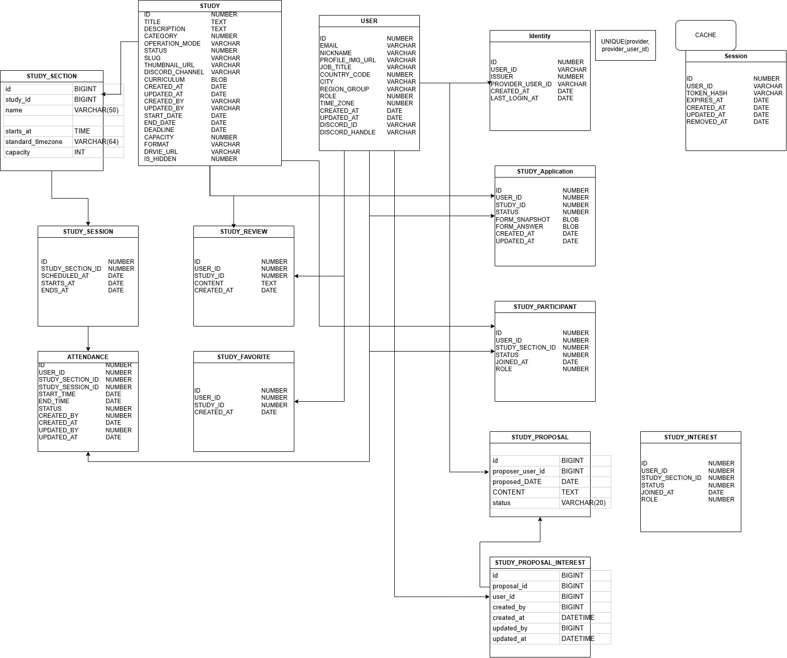
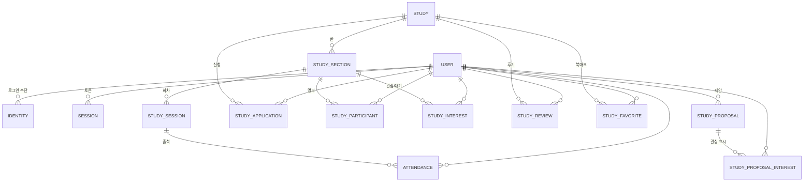

# ERD — StudyClub++ 데이터 모델

백엔드 스쿼드 08/24 회의에서 통합한 ERD 의 **레포 정본**. 테이블당 md 1개, 변경은 PR 로.

> 원본은 drawio 통합본(김지윤) + 테이블 설계 표(김보아·박세은). 이 문서들은 그것을 옮기고 **상태값·전이·제약**을 붙인 것이다.
> 아직 회의에서 확정 안 된 항목은 각 문서 하단 **미확정** 에 모아 두었다 — 08/28 회의 안건.

## 규약 (제안 — 08/30 일 회의에서 확정)

| 항목 | 규칙 | 예 |
|---|---|---|
| 테이블·컬럼 이름 | **대문자 · snake_case · 단수** | `STUDY_SECTION`, `CREATED_AT` |
| PK | `ID BIGINT AUTO_INCREMENT` | |
| FK | `<참조테이블>_ID` | `STUDY_ID`, `USER_ID` |
| 시각 | `DATETIME` (UTC 저장, 표시 시 사용자 `TIME_ZONE` 적용) | |
| enum | `VARCHAR(20)` 에 대문자 코드 문자열. 숫자 코드 대신 문자열 — 로그·쿼리에서 읽힌다 | `PENDING`, `APPROVED` |
| 감사 컬럼 | `CREATED_AT` · `UPDATED_AT` 은 전 테이블 기본. 운영자가 만지는 테이블은 `CREATED_BY` · `UPDATED_BY`(USER.ID) 추가 | |
| 삭제 | 물리 삭제 대신 상태(`CLOSED`/`WITHDRAWN`) 또는 `REMOVED_AT` | |

drawio 의 `NUMBER`/`DATE` 는 도구 기본 타입이라 여기서는 **MySQL 8 타입**으로 옮겼다 (`BIGINT`/`INT`/`DATETIME`/`DATE`).

## 설계 원칙 (요구사항 정의에서)

1. **상태는 최대한 저장하지 않고 날짜·관계로 계산한다.** 모집중/모집예정/마감은 `STUDY.DEADLINE`·`START_DATE` 로 판정. 저장하는 상태는 사람이 결정하는 것(승인/거절, 출석)만.
2. **삭제 대신 종료.** 스터디는 `CLOSED`, 참가자는 `WITHDRAWN`.
3. **한 사람 · 한 스터디 기준으로 전부 연결된다.** 신청 → 승인 → 명부(참가자) → 회차 → 출석 → 마이페이지가 같은 `USER_ID`·`STUDY_ID` 를 따라간다.
4. 비회원 공개 범위(목록·상세)와 로그인 사용자 범위(신청·출석·마이페이지)를 분리한다.

## 관계도

## 테이블

| 영역 | 테이블 | 한 줄 | 저장하는 상태 |
|---|---|---|---|
| 회원 | [USER](./USER.md) | 회원 프로필 | `ROLE` |
| 회원 | [IDENTITY](./IDENTITY.md) | 소셜 로그인 수단 (구글 → 애플 확장) | — |
| 회원 | [SESSION](./SESSION.md) | 발급 토큰 (캐시 후보) | — (만료·폐기는 시각으로 계산) |
| 스터디 | [STUDY](./STUDY.md) | 스터디/클럽 본체 | `STATUS`, `OPERATION_MODE`, `FORMAT` |
| 스터디 | [STUDY_SECTION](./STUDY_SECTION.md) | 반 (요일·시간대별) | — |
| 스터디 | [STUDY_SESSION](./STUDY_SESSION.md) | 회차 (반의 N번째 모임) | — |
| 모집 | [STUDY_APPLICATION](./STUDY_APPLICATION.md) | 신청서 (폼 스냅샷 + 답변) | `STATUS` |
| 모집 | [STUDY_PARTICIPANT](./STUDY_PARTICIPANT.md) | 명부 — 반에 소속된 사람 | `STATUS`, `ROLE` |
| 모집 | [STUDY_INTEREST](./STUDY_INTEREST.md) | 반 관심/대기 등록 | `STATUS`, `ROLE` |
| 운영 | [ATTENDANCE](./ATTENDANCE.md) | 회차별 출석 | `STATUS` |
| 반응 | [STUDY_REVIEW](./STUDY_REVIEW.md) | 후기 | — |
| 반응 | [STUDY_FAVORITE](./STUDY_FAVORITE.md) | 북마크 | — |
| 제안 | [STUDY_PROPOSAL](./STUDY_PROPOSAL.md) | "이런 스터디 열어주세요" | `STATUS` |
| 제안 | [STUDY_PROPOSAL_INTEREST](./STUDY_PROPOSAL_INTEREST.md) | 제안에 "나도" | — |

## 미확정 (08/28 안건)

- **네이밍** — 대문자·snake·단수. drawio 에 소문자 테이블(`STUDY_SECTION`·`STUDY_PROPOSAL*`)이 섞여 있다.
- **STUDY.STATUS 를 둘 것인가** — 표 설계는 "상태 컬럼 없이 날짜로 계산" 추천, drawio 는 `STATUS` 보유. 이 문서는 **라이프사이클(DRAFT/OPEN/CLOSED)만 저장, 모집 상태는 계산**으로 절충 — [STUDY](./STUDY.md#상태).
- **STUDY_INTEREST vs STUDY_PARTICIPANT** — 컬럼이 같다. 대기자 명부로 쓸지, PARTICIPANT.STATUS=`WAITLISTED` 로 합칠지.
- **신청 폼** — `FORM_SNAPSHOT`/`FORM_ANSWER` JSON 으로 갈지(drawio), `STUDY_QUESTION`+`STUDY_APPLICATION_ANSWER` 테이블로 갈지(표 설계).
- **STUDY.CATEGORY** — 코드값(drawio)인지 `STUDY_CATEGORY` 테이블 FK(표 설계)인지.
- **스터디 vs 클럽** — 스터디=1회성, 클럽=기수제·반복. 스터디가 클럽이 될 수 있다 → `OPERATION_MODE` 변경으로 표현. 기수(코호트) 테이블은 아직 없음.
- **회차 알림 자동화·디스코드 명령어 출석** — 스키마 영향 없음(ATTENDANCE.CREATED_BY 로 충분). 봇 쪽 결정.
