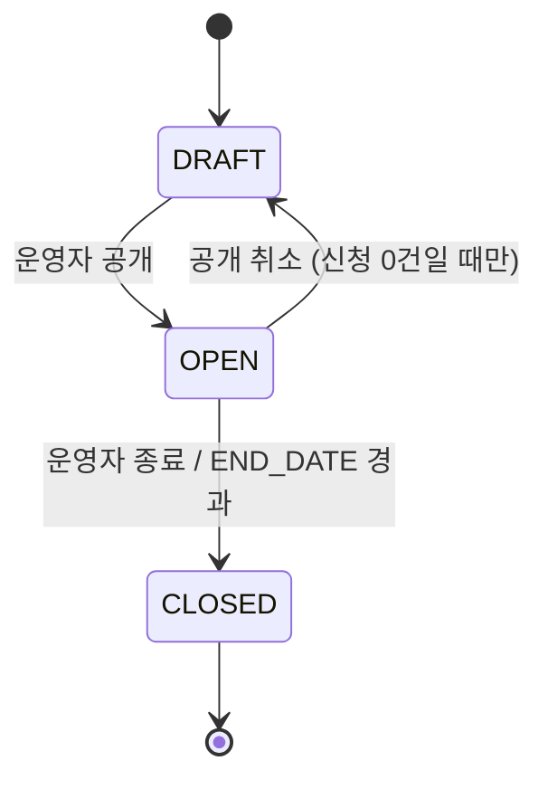

# STUDY — 기수 / 운영 스터디

[STUDY_PROGRAM](./STUDY_PROGRAM.md) 의 특정 회차/기수. "스터디가 무엇인가"는 STUDY_PROGRAM 이,
"이번 기수는 어떻게 운영되는가"는 여기가 답한다. 클럽(`STUDY_KIND=CLUB`)은 여러 STUDY 를 갖고,
지난 기수는 그대로 남아 이력 조회가 가능해야 한다. 스터디(`STUDY_KIND=STUDY`)도
예외 없이 기수를 1개 갖는다 — "기수 없는 STUDY_PROGRAM"이라는
특수 케이스를 만들지 않는다.

새 기수를 만들 때는 직전 기수의 설정을 복사해 시작점으로 삼을 수 있지만, 이후 값은
독립적으로 저장된다 — 새 기수를 나중에 고쳐도 지난 기수 값은 바뀌지 않는다.

## 컬럼

| 컬럼 | 타입 | NULL | 설명 |
|---|---|---|---|
| ID | BIGINT PK | N | |
| PROGRAM_ID | BIGINT | N | STUDY_PROGRAM 참조. 구 `STUDY_ID` |
| STUDY_DELIVERY_FORMAT | VARCHAR(20) | N | `ONLINE` / `OFFLINE` / `HYBRID` |
| STATUS | VARCHAR(20) | N | 아래 |
| APPLICATION_FORM | JSON | Y | 이 기수 신청 폼 질문 정의 |
| CURRICULUM | JSON | Y | 주차별 커리큘럼. 구조는 프론트와 합의 |
| CAPACITY | INT | Y | 이 기수 전체 정원. 분반별 정원은 STUDY_GROUP |
| RECRUIT_DEADLINE | DATETIME | Y | 이 기수 모집 마감 |
| START_DATE | DATE | Y | 진행 시작일 |
| END_DATE | DATE | Y | 진행 종료일. NULL 허용 — 고정 종료 없는 클럽은 NULL |
| DISCORD_CHANNEL_URL | VARCHAR(2048) | Y | 이 기수 디스코드 채널 링크 |
| DRIVE_URL | VARCHAR(2048) | Y | 이 기수 자료 드라이브 링크 |
| SCHEDULE | VARCHAR(255) | Y | 운영 일정 요약 |
| PUBLISH_DATE | DATETIME | Y | 공개 예정 일시 |

## 관계
- N : 1 [STUDY_PROGRAM](./STUDY_PROGRAM.md)
- 1 : N [STUDY_GROUP](./STUDY_GROUP.md) — 분반이 하나뿐인 기수도 분반을 1개 만든다
- 1 : N [STUDY_RECRUITMENT](./STUDY_RECRUITMENT.md) — 모집 회차
- 1 : N [STUDY_REVIEW](./STUDY_REVIEW.md) — 정본 FK. STUDY_PROGRAM_ID 는 STUDY_REVIEW 쪽 비정규화 컬럼

## 상태 — STATUS (라이프사이클)

사람이 결정하는 것만 저장 — 모집중/마감은 아래 "모집 상태"에서 계산.

| 값 | 뜻 | 편집 |
|---|---|---|
| `DRAFT` | 작성 중. 비공개 | 전부 가능 |
| `OPEN` | 공개. 탐색에 노출, 신청 가능 여부는 날짜로 | 기본 정보 일부 잠김 (기간·정원·포맷) |
| `CLOSED` | 이 기수 종료. 지난 기수 탭에 노출. 클럽이면 다음 기수를 새로 열 수 있다 | 읽기 전용 |

### 모집 상태 (계산 — 저장 안 함)

`STATUS = OPEN` 일 때만 의미 있다.

| 판정 | 조건 |
|---|---|
| `UPCOMING` 모집예정 | `now() < 모집 시작` |
| `RECRUITING` 모집중 | `모집 시작 <= now() < RECRUIT_DEADLINE` 그리고 정원 미달 |
| `RECRUIT_CLOSED` 모집마감 | `now() >= RECRUIT_DEADLINE` 또는 정원 도달 |
| `ONGOING` 진행중 | `START_DATE <= today <= END_DATE` |
| `ENDED` 종료 | `today > END_DATE` |

## 제약
- 인덱스 `(PROGRAM_ID, STATUS)` — `idx_study_program_study_status`

## 미확정
- 모집 시작 시각 컬럼 (`PUBLISH_AT` / `RECRUIT_START_DATE`) — 모집예정 탭을 하려면 필요.
- `PARENT_STUDY_ID` — 기수 포크가 필요하다는 요구가 생기기 전까지는 추가하지 않는다.
