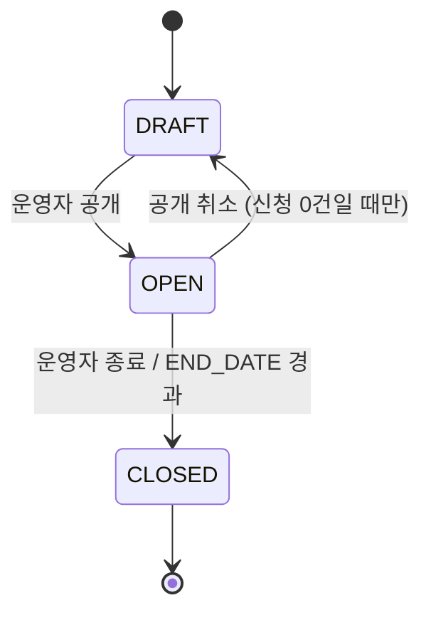

# STUDY — 스터디 / 클럽

모집 공고이자 운영 단위. 탐색·신청·출석·마이페이지가 전부 이 행을 본다.
**스터디** = 1회성, **클럽** = 기수제·반복 — 둘은 같은 테이블이고 `OPERATION_MODE` 로 구분한다.

## 컬럼

| 컬럼 | 타입 | NULL | 설명 |
|---|---|---|---|
| ID | BIGINT PK | N | |
| SLUG | VARCHAR(100) | N | URL 식별자. UNIQUE |
| TITLE | VARCHAR(200) | N | |
| DESCRIPTION | TEXT | Y | 상세 소개 |
| CATEGORY | VARCHAR(50) | N | 분야 (`AI`, `BACKEND`, `PAPER` …) |
| OPERATION_MODE | VARCHAR(20) | N | 아래 |
| FORMAT | VARCHAR(20) | N | 아래 |
| STATUS | VARCHAR(20) | N | 아래 |
| THUMBNAIL_URL | VARCHAR(512) | Y | |
| DISCORD_CHANNEL | VARCHAR(512) | Y | 디스코드 채널 링크 |
| DRIVE_URL | VARCHAR(512) | Y | 자료 드라이브 링크 (drawio 오타 `DRVIE_URL` 교정) |
| CURRICULUM | JSON | Y | 주차별 커리큘럼. 구조는 프론트와 합의 |
| CAPACITY | INT | Y | 전체 정원. 반별 정원은 STUDY_SECTION |
| DEADLINE | DATETIME | N | 모집 마감 |
| START_DATE / END_DATE | DATE | Y | 진행 기간 |
| IS_HIDDEN | BOOLEAN | N | 목록 노출 제어. 기본 FALSE |
| CREATED_BY / UPDATED_BY | BIGINT FK → USER | Y | |
| CREATED_AT / UPDATED_AT | DATETIME | N | |

## 관계
- 1 : N [STUDY_SECTION](./STUDY_SECTION.md) — 반이 하나뿐이어도 반을 만든다 (참가자·회차가 반에 붙는다)
- 1 : N [STUDY_APPLICATION](./STUDY_APPLICATION.md), [STUDY_REVIEW](./STUDY_REVIEW.md), [STUDY_FAVORITE](./STUDY_FAVORITE.md)

## 상태

### STATUS — 라이프사이클 (저장)

사람이 결정하는 것만 저장한다. 모집중/마감은 아래 "모집 상태"에서 계산.

| 값 | 뜻 | 편집 |
|---|---|---|
| `DRAFT` | 작성 중. 비공개 | 전부 가능 |
| `OPEN` | 공개. 탐색에 노출, 신청 가능 여부는 날짜로 | 기본 정보 일부 잠김 (기간·정원·모드) |
| `CLOSED` | 종료. 삭제 대신 이 상태. 지난 스터디 탭에 노출 | 읽기 전용 |

### 모집 상태 (계산 — 저장 안 함)

`STATUS = OPEN` 일 때만 의미 있다.

| 판정 | 조건 |
|---|---|
| `UPCOMING` 모집예정 | `now() < 모집 시작` (모집 시작 = 공개 시각 또는 별도 컬럼 — 미확정) |
| `RECRUITING` 모집중 | `모집 시작 <= now() < DEADLINE` 그리고 정원 미달 |
| `RECRUIT_CLOSED` 모집마감 | `now() >= DEADLINE` 또는 정원 도달 |
| `ONGOING` 진행중 | `START_DATE <= today <= END_DATE` |
| `ENDED` 종료 | `today > END_DATE` |

### OPERATION_MODE

| 값 | 뜻 |
|---|---|
| `ONE_TIME` | 스터디. 한 번 모집해 한 번 진행 |
| `RECURRING` | 클럽. 기수제로 반복 |
| `ALWAYS` | 상시 모집 (DEADLINE 무시) |

스터디가 클럽이 되면 `ONE_TIME → RECURRING` 으로 바꾼다.

### FORMAT

| 값 | 뜻 |
|---|---|
| `ONLINE` | 디스코드 |
| `OFFLINE` | 대면 |
| `HYBRID` | |

## 제약
- `UNIQUE(SLUG)`
- 인덱스 `(STATUS, IS_HIDDEN, DEADLINE)` — 탐색 목록 쿼리

## 미확정
- `STATUS` 자체를 둘지 (표 설계는 "두지 말자"). 위 절충안이 기본 제안.
- 모집 시작 시각 컬럼 (`PUBLISH_AT` / `RECRUIT_START_DATE`) — 모집예정 탭을 하려면 필요.
- `CATEGORY` 를 문자열 코드로 둘지 `STUDY_CATEGORY` 테이블 FK 로 둘지.
- 국/영문 이중 제목(`TITLE_KO/EN`) — 표 설계에 있음. 프론트가 ko/en 이라 필요할 수 있다.
- 기수(코호트) 개념 — 클럽 N기를 새 STUDY 행으로 낼지, 별도 테이블로 낼지.
