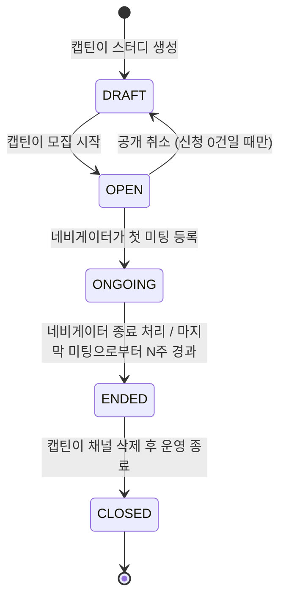

# STUDY — 기수 / 운영 스터디

[STUDY_PROGRAM](./STUDY_PROGRAM.md) 의 특정 회차/기수. "스터디가 무엇인가(정체성)"는 STUDY_PROGRAM 이,
"이번 기수는 어떻게 운영되는가"와 "이번 기수의 제목·설명·카테고리는 무엇인가"는 모두 여기가 답한다.
클럽(`STUDY_PROGRAM.STUDY_KIND=CLUB`)은 여러 STUDY 를 갖고, 지난 기수는 그대로 남아 이력 조회가 가능해야 한다.
스터디(`STUDY_PROGRAM.STUDY_KIND=STUDY`)도 예외 없이 기수를 1개 갖는다 — "기수 없는 STUDY_PROGRAM"이라는
특수 케이스를 만들지 않는다.

새 기수를 만들 때는 직전 기수의 설정을 복사해 시작점으로 삼을 수 있지만, 이후 값은
독립적으로 저장된다 — 새 기수를 나중에 고쳐도 지난 기수 값은 바뀌지 않는다.

## 컬럼

| 컬럼 | 타입 | NULL | 설명 |
|---|---|---|---|
| ID | BIGINT PK | N | 생성 순서 그대로 [최신 기수 판정](#채널-삭제와-closed)에 쓴다 — 그 용도로 별도 컬럼을 두지 않는다 |
| PROGRAM_ID | BIGINT | N | STUDY_PROGRAM 참조 |
| TITLE | VARCHAR(200) | N | 이 기수 제목 |
| ONE_LINE_SUMMARY | VARCHAR(255) | N | 한 줄 소개 |
| DESCRIPTION | TEXT | Y | 상세 소개. **마크다운 허용.** 등록 시 기본 템플릿 제공 — `## 목표` · `## 진행 방식` · `## 참가 대상` · `## 특이사항`. 별도 칸이 없는 내용(킥오프·문의처 등)은 여기에 쓴다 |
| CATEGORY | VARCHAR(50) | N | 분야 (`AI`, `BACKEND`, `PAPER` …) |
| THUMBNAIL_URL | VARCHAR(2048) | Y | 목록·상세 카드 이미지. 등록 폼에서 업로드한 파일을 올린 뒤 그 호스팅 URL을 담는다(업로드 엔드포인트는 미구현 — 실제 파일을 못 넣는다, data URL로도 대체 불가). 비어 있으면 주제 기반 기본 이미지를 쓴다 |
| STATUS | VARCHAR(20) | N | 아래 |
| APPLICATION_FORM | JSON | Y | 이 기수 신청 폼 질문 정의 |
| CURRICULUM | JSON | Y | 주차별 커리큘럼. 구조는 프론트와 합의 |
| START_AT | DATETIME | Y | 진행 시작 일시 |
| END_AT | DATETIME | Y | 진행 종료 일시. NULL 허용 — 고정 종료 없는 클럽은 NULL |
| DISCORD_CHANNEL_URL | VARCHAR(2048) | Y | 참고용 채널 링크 하나(주로 로비·공지). 봇 연동의 근거로 쓰지 않는다 — 아래 [채널 삭제와 CLOSED](#채널-삭제와-closed) |
| DRIVE_URL | VARCHAR(2048) | Y | 자료 드라이브 링크. DISCORD_CHANNEL_URL 과 같은 이유로 참고용이다 |
| SCHEDULE | VARCHAR(255) | Y | 운영 일정 요약 |
| TIMEZONE | VARCHAR(10) | Y | 기준 시간대 — `KST` / `PST` / `BOTH`(동시 진행). 등록 폼에서 운영자가 직접 고른다. NULL = 미정(이 컬럼이 생기기 전 데이터가 여기 해당) |

> URL 식별자(`SLUG`)는 두지 않는다 — 주소에는 `STUDY.ID` 를 쓴다. 이름은 운영 규칙으로 겹치지 않게 관리하지만(드라이브 정리·사용자 식별 목적) URL 의 근거로 삼지 않는다 — 이름을 바꾸면 주소가 깨진다.
> 정원은 STUDY 에 두지 않는다 — 모집 정원은 [STUDY_RECRUITMENT.RECRUITMENT_CAPACITY](./STUDY_RECRUITMENT.md),
> 현재 참여자 수는 [STUDY_PARTICIPANT](./STUDY_PARTICIPANT.md) 에서 계산한다.
> 공개 여부는 [모집 시작 일자](#공개-여부)로 정한다.

## 관계
- N : 1 [STUDY_PROGRAM](./STUDY_PROGRAM.md)
- 1 : N [STUDY_GROUP](./STUDY_GROUP.md) — 분반이 하나뿐인 기수도 분반을 1개 만든다
- 1 : N [STUDY_RECRUITMENT](./STUDY_RECRUITMENT.md) — 모집 회차
- 1 : N [STUDY_REVIEW](./STUDY_REVIEW.md) — 정본 FK. STUDY_PROGRAM_ID 는 STUDY_REVIEW 쪽 비정규화 컬럼

## 상태 — STATUS (운영·진행 라이프사이클)

기수 단위로 관리한다. 스터디 운영 상태와 진행 상태를 **하나로 합쳤다** — 진행중·종료도 저장한다.
모집중/마감만 저장하지 않고 아래 "모집 상태"에서 계산한다.

| 값 | 뜻 | 편집 |
|---|---|---|
| `DRAFT` | 작성 중 / 모집 전. 비공개 | 전부 가능 |
| `OPEN` | 개설 — 공개하며 모집을 시작한 단계 | 기본 정보 일부 잠김 (기간) |
| `ONGOING` | (미팅) 진행 중 | 기본 정보 일부 잠김 (기간) |
| `ENDED` | (미팅) 종료 | 읽기 전용 |
| `CLOSED` | 채널 삭제 완료 — 운영 종료 | 읽기 전용 |

**단계 이름에 「공개」를 쓰지 않는다.** 진행 중인 스터디도 공개 상태이기 때문이다. 공개 여부는 [모집 시작 일자](#공개-여부)가, 신청 가능 여부는 [모집 상태](#모집-상태-계산--저장-안-함)가 말하고, `STATUS` 는 그 둘과 다른 사실 — 어디까지 진행됐는가 — 만 말한다.

| 전이 | 주체 | 부수 효과 |
|---|---|---|
| 생성 → `DRAFT` | 캡틴 | |
| `DRAFT` → `OPEN` | 캡틴이 공개하며 모집 시작 | `STUDY_RECRUITMENT.START_AT` 를 채운다 — **공개가 된다** |
| `OPEN` → `ONGOING` | 네비게이터가 첫 미팅([STUDY_MEETING](./STUDY_MEETING.md))을 등록 | |
| `ONGOING` → `ENDED` | 네비게이터가 종료 처리, 또는 마지막 미팅으로부터 N주 경과 (시스템) | |
| `ENDED` → `CLOSED` | 캡틴이 채널을 삭제하고 운영을 종료 | |

`START_AT` / `END_AT`(진행 일정)은 화면에 보이는 값일 뿐 **상태를 바꾸지 않는다** — 상태는 위 전이로만 바뀐다.

### 채널 삭제와 CLOSED

**`ENDED` → `CLOSED` 는 캡틴이 백오피스에서 직접 확인하고 누르는 수동 전환이다.** 시스템이 디스코드를 조회해
채널이 실제로 지워졌는지 검증하지 않는다. 자동 연동을 시도하면 아래 세 가지에 막힌다.

- **채널이 여러 개다.** 한 스터디가 공지·잡담·인증 등 여러 채널을 쓰는데, `DISCORD_CHANNEL_URL` 은 하나만
  저장한다. 그 하나(로비 채널 등)가 지워졌다고 나머지가 다 지워진 건 아니다.
- **자동 감지에는 채널 전체 목록이 필요하다.** "지워졌다"를 판정하려면 이 스터디에 속한 모든 채널을 알고
  그중 무엇을 대표로 볼지 정해야 한다 — 지금 스키마에는 그 정보가 없다.
- **클럽은 채널을 지우지 않는다.** 기수가 바뀌어도 같은 채널을 계속 쓴다(`discord_url` 은 새 기수에도
  그대로 물려준다). "채널 삭제"가 실제로 일어나는 시점은 그 프로그램 전체를 은퇴시킬 때뿐이다.

**여기서 실제 충돌이 생긴다.** `CLOSED` 는 기수(STUDY) 하나의 사실("이 기수의 채널이 지워졌다")로
정의했는데, 클럽에서 "채널이 지워졌다"는 사실은 기수가 아니라 **프로그램** 것이다. 이 둘을 그대로
이으면: 지나간 기수를 `CLOSED` 로 두자니 그 채널은 새 기수 밑에서 여전히 살아 있어 사실과 다르고("채널
삭제 완료"라고 적어 놓고 채널은 멀쩡히 돌아간다), `CLOSED` 로 안 두자니 그 기수는 이미 끝났는데 종착점이
없어 계속 "진행 중" 취급을 받는다.

**해결 — `ENDED → CLOSED` 는 그 프로그램에서 `ID` 가 가장 큰(최신) `STUDY` 행에서만 허용한다.**

- 지나간 기수(더 최신 기수가 이미 존재하는 행)는 `ENDED` 가 종착점이다. 새로 만들 수 없어서가 아니라
  ─ 채널을 그 다음 기수에 넘겨주고 자기 역할이 끝났다는 뜻이라 `CLOSED` 로 갈 이유가 없다.
- `CLOSED` 는 그래서 "이 기수의 채널이 지워졌다"가 아니라 사실상 **"이 프로그램이 은퇴했다"** 는 뜻이 된다
  — 같은 라벨을 쓰지만 클럽에서는 프로그램 단위 사실을 최신 기수 행이 대신 짊어지는 것이다.
- `STUDY` 종류는 프로그램에 기수가 늘 1개라 이 규칙이 저절로 만족된다 — 별도 분기 없이 같은 규칙 하나로
  두 종류를 다 설명한다.
- 화면에서는 최신 기수가 아닌 행에 "운영 종료" 액션 자체를 보이지 않는다(또는 비활성화한다) — 캡틴이
  실수로 지나간 기수를 닫아, "채널 삭제 완료"가 거짓이 되는 일을 막는다.

**"최신"의 기준은 `ID` 다 — 별도 컬럼(`SEQ`)을 두지 않는다.**

처음엔 `PROGRAM_ID` 안에서 기수 순서를 직접 담는 `SEQ` 컬럼을 생각했지만 뺐다. **`STUDY_KIND` 는 한
번 정하면 바꾸지 못하므로, `STUDY` 종류 프로그램은 기수가 영원히 1개다 — 그 행의 `SEQ` 는 언제나 `1`
이고 절대 다른 값이 될 수 없다.** 전체 프로그램 중 다수를 차지할 `STUDY` 종류에 항상 상수만 담는 컬럼을
매 행마다 쟁여 두는 건, 이 스키마가 계속 지켜온 "계산으로 되는 건 저장하지 않는다" 원칙(모집 상태·정원
현황·공개 여부가 전부 이렇게 계산 값이다)과 어긋난다. `SEQ` 가 실제로 뜻을 갖는 건 `CLUB` 종류뿐인데,
그걸 위해 모든 행에 컬럼을 하나 늘릴 이유가 없다.

- `START_AT` 은 **쓸 수 없다.** ① 등록 직후는 대개 비어 있다(반 편성 뒤에 채운다) — 최신 기수를 판정해야
  할 시점(등록 직후, 운영 종료 시점)에 정작 값이 없을 수 있다. ② 클럽은 다음 기수 모집을 직전 기수가
  끝나기 전에 미리 시작할 수 있다(아래) — 두 기수의 날짜가 겹치거나 순서가 뒤집힐 수 있어 "가장 늦은
  `START_AT`" 이 실제로 가장 나중에 만들어진 기수라는 보장이 없다.
- `ID` 는 이미 있고, 늘 존재하며(NOT NULL, PK), **DB 가 원자적으로 채번한다** — 애플리케이션이 직접
  `MAX(SEQ)+1` 을 계산해 끼워 넣는 것보다 오히려 동시 생성 레이스에 더 안전하다. 별도 유니크 제약도
  필요 없다.
- 화면에 「N기」를 보여줘야 한다면(클럽에서만 의미 있다) 그때 `ROW_NUMBER() OVER (PARTITION BY
  PROGRAM_ID ORDER BY ID)` 로 **읽을 때 계산**한다 — 다른 계산 값들과 같은 방식이다. 저장하지 않으므로
  행이 늘어도 어긋날 일이 없다.

**직전 기수가 끝나기 전에 다음 기수를 미리 열 수 있다 — 이 규칙을 깨지 않는다.** 클럽은 롤링 모집을 한다:
오래된 기수가 아직 `ONGOING` 인데 새 기수를 벌써 `OPEN`(모집 중)으로 만들 수 있다. 이때도 규칙은 그대로
적용된다 — 오래된 기수는 더 이상 최신이 아니므로(더 큰 `ID` 를 가진 기수가 이미 있으므로) 스스로 `ENDED`
가 되어도 `CLOSED` 로는 못 간다. 새 기수만 나중에 자기 차례가 되면(`ENDED` 를 거쳐) `CLOSED` 후보가
된다. "최신"을 상태가 아니라 생성 순서(`ID`)로만 정하기 때문에, 두 기수가 동시에 살아 있어도 판정이
흔들리지 않는다.

**은퇴한 프로그램의 재개도 막지 않는다.** `CLOSED` 는 그 프로그램에 새 기수(새 채널)를 만드는 것을 막는
조건이 아니다 — 새 기수 생성은 애초에 형제 기수의 `STATUS` 를 따지지 않는다(바로 위 문단과 같은 이유).
그래서 "재개를 허용할지"는 따로 결정할 게 없다 — 일반적인 "새 기수 만들기"의 한 경우일 뿐이다.

`DISCORD_CHANNEL_URL` / `DRIVE_URL` 은 그래서 참고용 링크다 — 캡틴이 빠르게 이동하는 용도이지, 자동화의
근거가 아니다. 채널 목록·삭제 이벤트를 실제로 연동하려면(원한다면) 봇 쪽에서 별도로 다룬다
([README 미확정](./README.md) 참고) — 이 스키마는 그 전제를 깔지 않는다.

### 사용자 사이트 표기

사이트 목록의 상태 탭은 5단계를 그대로 쓰지 않고 넷으로 묶는다.

| 사이트 표기 | `STATUS` | 뜻 |
|---|---|---|
| (보이지 않음) | `DRAFT` | 공개 전 |
| 모집 중 | `OPEN` | 공개됨. 모집 중/마감은 [모집 상태](#모집-상태-계산--저장-안-함)로 다시 가른다 |
| 진행 중 | `ONGOING` | (미팅) 진행 중 |
| 종료 | `ENDED` · `CLOSED` | 미팅이 더 이상 없거나 네비게이터가 종료 처리한 것. 채널 삭제(`CLOSED`)는 운영 내부 정리라 사용자에게는 구분하지 않는다 |

### 공개 여부

별도 플래그(`IS_HIDDEN`)는 없다. **백오피스에서는 모집 시작 일자(`STUDY_RECRUITMENT.START_AT`)가 있으면
공개로 본다.** 모집을 시작하면 `STATUS = OPEN` 이 되고 시작 일자가 채워지므로 두 조건은 함께 움직인다.

### 모집 상태 (계산 — 저장 안 함)

`STUDY_RECRUITMENT.START_AT` · `RECRUIT_DEADLINE_AT` 으로 계산한다. `STATUS = OPEN` 일 때만 의미 있다.

| 판정 | 조건 |
|---|---|
| `RECRUITING` 모집중 | `STUDY_RECRUITMENT.START_AT <= now() < STUDY_RECRUITMENT.RECRUIT_DEADLINE_AT` 그리고 `RECRUITMENT_CAPACITY` 미달 (현재 참여자 수는 STUDY_PARTICIPANT 에서 계산) |
| `RECRUIT_CLOSED` 모집마감 | `now() >= STUDY_RECRUITMENT.RECRUIT_DEADLINE_AT` 또는 `RECRUITMENT_CAPACITY` 도달 |

진행중·종료는 모집 상태가 아니라 `STATUS`(`ONGOING` · `ENDED`)다.

**예약 공개는 없다** — 공개는 캡틴이 모집을 시작하는 순간이라 `START_AT` 은 늘 과거·현재이고, 「모집 예정」 판정도 없다. 공개 예정 일시 컬럼(`PUBLISH_AT`)도 두지 않는다.

## 참여 신청 — 프로그램 종류에 따라 다르다

종류(`STUDY_KIND`)는 기수가 아니라 프로그램의 속성이다 — [STUDY_PROGRAM.STUDY_KIND](./STUDY_PROGRAM.md#study_kind).

| 종류 | 같은 프로그램의 새 기수 공고에서 |
|---|---|
| `CLUB` | 이전 기수 참여자의 참여가 **자동 유지**된다 — 다시 신청하지 않는다 (신규 참여자만 신청) |
| `STUDY` | 기수가 1개뿐이라 새 공고는 새 모집이다 — **참여 신청이 필요하다** |

상시 모집은 없다. 모든 모집 회차는 마감이 있고, 계속 이어지는 참여는 클럽의 기수 이월로 표현한다.

## 제약
- 인덱스 `(PROGRAM_ID, STATUS)` — `idx_study_program_study_status`
- `ENDED → CLOSED` 전이는 `PROGRAM_ID` 안에서 `ID` 가 가장 큰 행에서만 허용한다 — [채널 삭제와 CLOSED](#채널-삭제와-closed) 참고. DB 제약이 아니라 애플리케이션 규칙이다(여러 기수를 동시에 저장하는 테이블이라 DB CHECK 로 표현하기 어렵다)

## 미확정
- `PARENT_STUDY_ID` — 기수 포크가 필요하다는 요구가 생기기 전까지는 추가하지 않는다.
