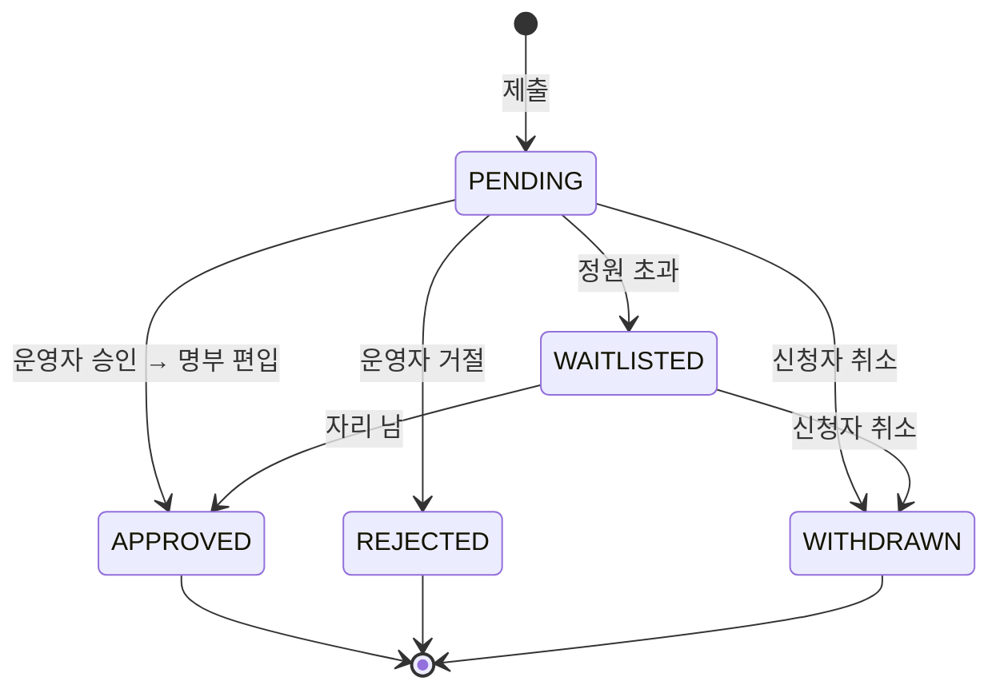

# STUDY_APPLICATION — 신청서

회원이 스터디에 낸 신청. 폼 정의와 답변을 **제출 시점 스냅샷**으로 같이 보관해, 폼이 나중에 바뀌어도 신청서는 안 바뀐다.

## 컬럼

| 컬럼 | 타입 | NULL | 설명 |
|---|---|---|---|
| ID | BIGINT PK | N | |
| USER_ID | BIGINT FK → USER | N | 신청자 |
| STUDY_ID | BIGINT FK → STUDY | N | |
| STATUS | VARCHAR(20) | N | 아래 |
| FORM_SNAPSHOT | JSON | N | 제출 당시 질문 정의 |
| FORM_ANSWER | JSON | N | 답변 |
| CREATED_AT | DATETIME | N | = 신청 시각 |
| UPDATED_AT | DATETIME | N | = 마지막 상태 변경 시각 |

## 관계
- N : 1 [USER](./USER.md), [STUDY](./STUDY.md)
- 승인되면 [STUDY_PARTICIPANT](./STUDY_PARTICIPANT.md) 행이 생긴다 (신청서는 그대로 남는다)

## 상태 — STATUS

| 값 | 뜻 | 누가 |
|---|---|---|
| `PENDING` | 제출됨, 검토 대기. 기본값 | 신청자 |
| `APPROVED` | 승인. **같은 트랜잭션에서 STUDY_PARTICIPANT 생성** | 운영자 |
| `REJECTED` | 거절 | 운영자 |
| `WITHDRAWN` | 신청자가 스스로 취소 | 신청자 |
| `WAITLISTED` | 정원 초과로 대기 (미확정) | 운영자/자동 |

- `APPROVED`/`REJECTED` 는 종결. 되돌리려면 새 신청.
- 신청 가능 조건: STUDY.STATUS=`OPEN` + 모집 상태 `RECRUITING` + 로그인 + 같은 스터디에 열린 신청 없음.

## 제약
- `UNIQUE(STUDY_ID, USER_ID)` — 중복 신청 차단. `WITHDRAWN` 후 재신청을 허용하려면 부분 유니크(활성 상태만) 또는 앱 레벨 검사.
- 인덱스 `(STUDY_ID, STATUS)` — 운영자 신청 목록

## 미확정
- 폼을 JSON 스냅샷으로 갈지, `STUDY_QUESTION` + `STUDY_APPLICATION_ANSWER` 테이블로 갈지. 스냅샷이 단순하고 "폼 바뀌어도 신청서 보존"을 공짜로 얻는다 — 기본 제안.
- `WAITLISTED` 를 여기 둘지 [STUDY_INTEREST](./STUDY_INTEREST.md) 로 뺄지.
- 결정자·거절 사유(`DECIDED_BY`, `DECIDED_AT`, `REJECTION_REASON`) — 표 설계에 있음. 운영자 화면에 필요하면 추가.
- 운영자가 신청 목록에서 "이전 참여 이력·완주율"을 보려면 STUDY_PARTICIPANT + ATTENDANCE 조인 — 스키마 추가 없음.
