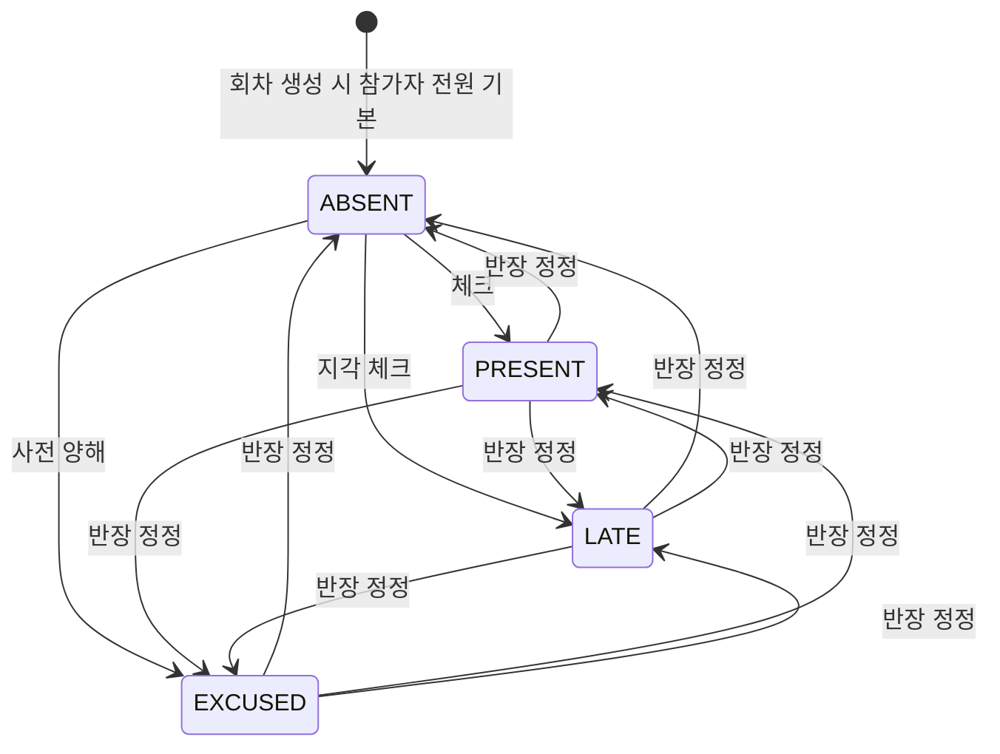

# STUDY_ATTENDANCE — 출석

회차(STUDY_MEETING) × 회원 1행. 반장이 디스코드 명령어(`specs/discord-attendance/spec.md`)나 화면(`specs/attendance/spec.md`)에서 찍고, 사후 수정 가능.
마이페이지 출석 현황·완주율은 **여기서 계산**해서 가져간다 (다른 화면에서 재계산 금지).

## 컬럼

| 컬럼 | 타입 | NULL | 설명 |
|---|---|---|---|
| ID | BIGINT PK | N | |
| ACCOUNT_ID | BIGINT FK → ACCOUNT | N | |
| STUDY_ID | BIGINT FK → STUDY | N | 비정규화 — 스터디별 전체 출석 집계용 |
| STUDY_GROUP_ID | BIGINT FK → STUDY_GROUP | N | 비정규화 — 반별 출석 집계용. 실제 참석한 반 (cross-group 출석 시 home group 이 아닐 수 있음) |
| STUDY_MEETING_ID | BIGINT FK → STUDY_MEETING | N | |
| STATUS | VARCHAR(20) | N | 아래 |

## 관계
- N : 1 [ACCOUNT](./ACCOUNT.md), [STUDY_MEETING](./STUDY_MEETING.md), [STUDY_GROUP](./STUDY_GROUP.md), [STUDY](./STUDY.md)

## 상태 — STATUS

| 값 | 뜻 | 완주율 계산 |
|---|---|---|
| `PRESENT` | 출석 | 출석 |
| `LATE` | 지각 (기준 시간은 운영 정책) | 출석 |
| `EXCUSED` | 사전 양해 결석 | 출석 |
| `ABSENT` | 결석. 기본값 — 회차를 추가할 때 분반의 ACTIVE·PAUSED 참여자 행을 미리 ABSENT 로 만든다 ([회차 스펙](../../specs/study-meeting/spec.md)). 시작 전 ABSENT 는 화면에서 빈칸이다 | 결석 |

전이 제한 없음 — 반장/운영자가 사후 수정 가능.

## 제약
- `UNIQUE(STUDY_MEETING_ID, ACCOUNT_ID)`
- 인덱스 `(ACCOUNT_ID, STUDY_ID)` — 마이페이지 전체 출석 현황
- 인덱스 `(ACCOUNT_ID, STUDY_GROUP_ID)` — 반별 출석 현황
- 인덱스 `(STUDY_ID, ACCOUNT_ID)` — 스터디 안 여러 계정의 출석 이력 (V18)
- 인덱스 `(STUDY_ID, STATUS)` — 스터디별 출석 현황 집계

## 미확정
- 지각 기준(분) — 운영 정책. 스키마 무관.

## 확정
- 행 생성 시점 — 회차를 **추가할 때** 분반의 ACTIVE·PAUSED 참여자 행을 `ABSENT` 로 만든다 (2026-10-02, [회차 스펙](../../specs/study-meeting/spec.md)). 회차 뒤에 합류한 사람은 행이 없을 수 있다 — 명부는 `status: null` 로 보인다.
- 쓰기는 한 문장 upsert(`INSERT ... ON DUPLICATE KEY UPDATE`) — 조회 후 저장으로 나누면 스냅샷 읽기로 중복 INSERT 가 난다. 회차를 지우면 그 회차 행도 지운다 (`STUDY_MEETING` 으로 가는 외래키는 없다).
- 완주율 공식 — `(PRESENT×1.0 + EXCUSED×1.0 + LATE×0.5) / 전체 과거 미팅`. 분모 0이면 null("–"). 상세 산식은 `specs/attendance/spec.md` 참조.
