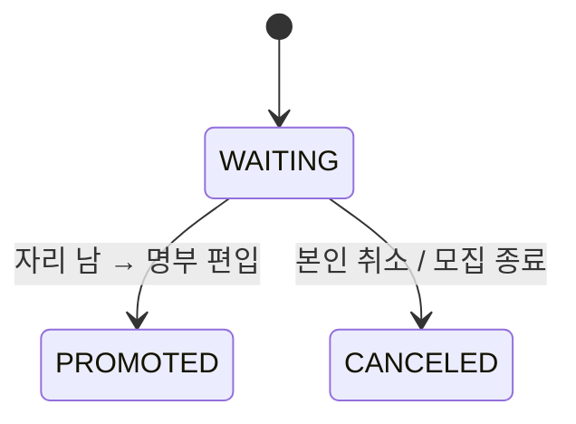

# STUDY_INTEREST — 반 관심 / 대기 등록

drawio 에서 [STUDY_PARTICIPANT](./STUDY_PARTICIPANT.md) 와 **컬럼이 동일**한 테이블. 회의에서 용도가 명시되지 않았다.
가장 그럴듯한 해석은 **정원 초과 대기자 명부** — 참가자는 아니지만 자리가 나면 편입될 사람.

## 컬럼

| 컬럼 | 타입 | NULL | 설명 |
|---|---|---|---|
| ID | BIGINT PK | N | |
| USER_ID | BIGINT FK → USER | N | |
| STUDY_SECTION_ID | BIGINT FK → STUDY_SECTION | N | |
| STATUS | VARCHAR(20) | N | 아래 |
| ROLE | VARCHAR(20) | N | 편입 시 받을 역할. 보통 `MEMBER` |
| JOINED_AT | DATETIME | N | 등록 시각 (대기 순번 기준) |
| CREATED_AT / UPDATED_AT | DATETIME | N | |

## 관계
- N : 1 [USER](./USER.md), [STUDY_SECTION](./STUDY_SECTION.md)

## 상태 — STATUS (대기자 해석 기준)

| 값 | 뜻 |
|---|---|
| `WAITING` | 대기 중. 기본값 |
| `PROMOTED` | 자리 나서 STUDY_PARTICIPANT 로 편입됨 |
| `CANCELED` | 본인 취소 / 만료 |

## 제약
- `UNIQUE(USER_ID, STUDY_SECTION_ID)`

## 미확정 — **이 테이블의 존재 자체**
세 가지 선택지. 08/28 에 하나 고른다.
1. **이대로 대기자 명부** (위 정의)
2. **STUDY_APPLICATION.STATUS = `WAITLISTED`** 로 흡수 — 대기는 "아직 승인 안 된 신청"이므로 신청서에 두는 게 자연스럽다. 테이블 하나 줄어든다. **기본 제안**
3. STUDY_PARTICIPANT.STATUS 에 `WAITLISTED` 추가 — 명부에 아직 아닌 사람을 섞게 되어 비추천
