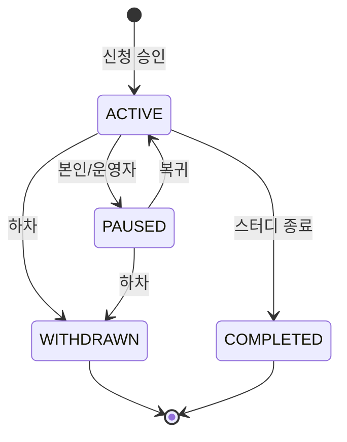

# STUDY_PARTICIPANT — 명부

반에 소속된 사람. 신청 승인 시 생기고, 출석·마이페이지·완주율의 기준이 된다.
"운영자가 수동으로 옮기거나 복사하는 단계"를 없애는 테이블 — 승인 = 명부 편입.

## 컬럼

| 컬럼 | 타입 | NULL | 설명 |
|---|---|---|---|
| ID | BIGINT PK | N | |
| USER_ID | BIGINT FK → USER | N | |
| STUDY_SECTION_ID | BIGINT FK → STUDY_SECTION | N | 반. 반 이동 = 이 값 변경 |
| STATUS | VARCHAR(20) | N | 아래 |
| ROLE | VARCHAR(20) | N | 아래 |
| JOINED_AT | DATETIME | N | 편입 시각 |
| CREATED_AT / UPDATED_AT | DATETIME | N | |

## 관계
- N : 1 [USER](./USER.md), [STUDY_SECTION](./STUDY_SECTION.md)
- 출처: [STUDY_APPLICATION](./STUDY_APPLICATION.md) `APPROVED`

## 상태 — STATUS

| 값 | 뜻 |
|---|---|
| `ACTIVE` | 참여 중. 기본값 |
| `PAUSED` | 잠시 쉼 (출석 집계 제외) |
| `WITHDRAWN` | 중도 하차. 삭제 대신 이 상태 |
| `COMPLETED` | 완주 (STUDY CLOSED 시 ACTIVE → COMPLETED 일괄) |

## 상태 — ROLE

스터디 안에서의 역할. 시스템 권한(USER.ROLE)과 별개.

| 값 | 뜻 |
|---|---|
| `MEMBER` | 기본 |
| `LEADER` | 반장. 회차 시작·출석 체크·수정 권한 (디스코드 명령어) |
| `CO_LEADER` | 부반장. LEADER 와 같은 권한 |

## 제약
- `UNIQUE(USER_ID, STUDY_SECTION_ID)`
- 같은 STUDY 의 다른 반에 동시 소속 금지는 앱 레벨 (STUDY_ID 가 이 테이블에 없음)

## 미확정
- 반 이동 이력을 남길지 (`SECTION_MOVED_AT` 또는 별도 로그).
- `LEFT_AT`·운영 `MEMO` — 표 설계에 있음.
- [STUDY_INTEREST](./STUDY_INTEREST.md) 와 병합 여부.
