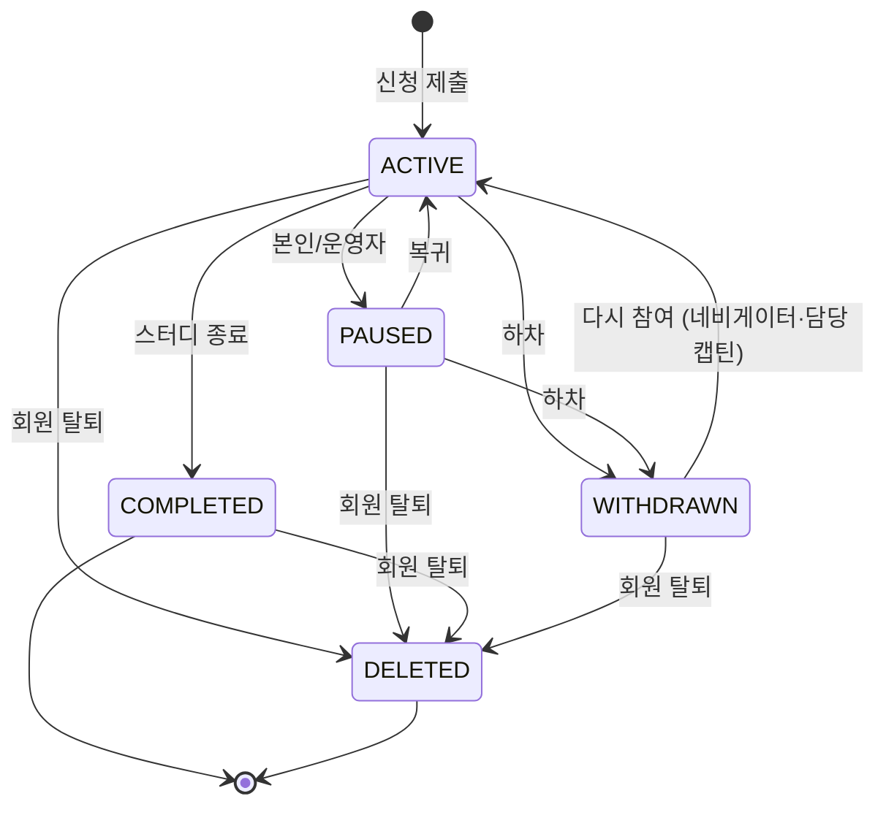

# STUDY_PARTICIPANT — 명부

반에 소속된 사람. 신청 제출 시 생기고, 출석·마이페이지·완주율의 기준이 된다.
"운영자가 수동으로 옮기거나 복사하는 단계"를 없애는 테이블 — 제출 = 명부 편입.

## 컬럼

| 컬럼 | 타입 | NULL | 설명 |
|---|---|---|---|
| ID | BIGINT PK | N | |
| ACCOUNT_ID | BIGINT FK → ACCOUNT | N | |
| STUDY_CLASS_ID | BIGINT FK → STUDY_CLASS | N | 반. 반 이동 = 이 값 변경 |
| STUDY_COHORT_ID | BIGINT FK → STUDY_COHORT | N | 비정규화 — "이 사람이 몇 기 멤버였는가" 조회용 (STUDY_CLASS_ID 로 도출 가능). 반 이동 시에도 같은 기수 안이면 불변 |
| STATUS | VARCHAR(20) | N | 아래 |
| PARTICIPANT_ROLE | VARCHAR(20) | N | 아래 |
| JOINED_AT | DATETIME | N | 편입 시각 |
| LEFT_AT | DATETIME | Y | 참여가 끝난 시각. `WITHDRAWN`·`DELETED` 일 때만 값이 있다. 출석률 집계가 이 시각까지의 회차만 분모에 넣는다(2026-10-01). 다시 참여하면 NULL ([참여 중단 스펙](../../specs/study-participant/spec.md), 2026-10-07) |

## 관계
- N : 1 [ACCOUNT](./ACCOUNT.md), [STUDY_CLASS](./STUDY_CLASS.md)
- 출처: [STUDY_APPLICATION](./STUDY_APPLICATION.md) 제출. 담당 캡틴은 반 편성 때 반 지정으로 ([분반 스펙](../../specs/study-group/spec.md#담당-캡틴의-반-지정))

## 상태 — STATUS

| 값 | 뜻 |
|---|---|
| `ACTIVE` | 참여 중. 기본값 |
| `PAUSED` | 잠시 쉼 (출석 집계 제외) |
| `WITHDRAWN` | 참여 중단 — 하차 · 제명을 가르지 않는다. 삭제 대신 이 상태. `LEFT_AT` 에 중단 시각. 네비게이터 · 담당 캡틴이 다시 참여시킬 수 있다 |
| `COMPLETED` | 완주 (STUDY ENDED 시 ACTIVE → COMPLETED 일괄) |
| `DELETED` | 회원 탈퇴로 사라진 행. 삭제 대신 이 상태 — 행을 지우면 STUDY_ATTENDANCE(ACCOUNT_ID 로만 연결, FK 없음)가 출석률 집계에서 통째로 빠지기 때문([user-leave spec](../../specs/user-leave/spec.md)). `LEFT_AT` 에 탈퇴 시각. ACCOUNT_ID 는 그대로 둔다 — 참조할 ACCOUNT 행 자체가 없어져 더는 사람으로 되짚을 수 없다 |

```mermaid
stateDiagram-v2
  [*] --> ACTIVE : 신청 제출
  ACTIVE --> PAUSED : 본인/운영자
  PAUSED --> ACTIVE : 복귀
  ACTIVE --> WITHDRAWN : 하차
  PAUSED --> WITHDRAWN : 하차
  WITHDRAWN --> ACTIVE : 다시 참여 (네비게이터·담당 캡틴)
  ACTIVE --> COMPLETED : 스터디 종료
  ACTIVE --> DELETED : 회원 탈퇴
  PAUSED --> DELETED : 회원 탈퇴
  COMPLETED --> DELETED : 회원 탈퇴
  WITHDRAWN --> DELETED : 회원 탈퇴
  COMPLETED --> [*]
  DELETED --> [*]
```

## 상태 — PARTICIPANT_ROLE

스터디 안에서의 역할. 시스템 권한(ACCOUNT.SYSTEM_ROLE)과 별개.

> 캡틴 값은 두지 않는다. 스터디를 만든 **담당 캡틴**도 참여자라 반 편성 때 이 테이블에 `MEMBER` 행이 생긴다 (신청서 없이). 「담당 캡틴인가」는 이 테이블이 아니라 `STUDY.CREATED_BY` 로 판정한다 ([POL-0001](../../01-planning/_registry/policies/POL-0001-roles.md), 2026-10-07).

| 값 | 뜻 |
|---|---|
| `MEMBER` | 기본 |
| `LEADER` | 반장. 회차 시작·출석 체크·수정 권한 (디스코드 명령어) |
| `CO_LEADER` | 부반장. LEADER 와 같은 권한 |

## 제약
- `UNIQUE(ACCOUNT_ID, STUDY_CLASS_ID)`
- 같은 기수의 다른 반에 동시 소속 금지는 앱 레벨 (`STUDY_COHORT_ID` 는 비정규화 컬럼이라 DB 제약 대상이 아님)

## 미확정
- 반 이동 이력을 남길지 (`SECTION_MOVED_AT` 또는 별도 로그).
- 운영 `MEMO` — 표 설계에 있음. (`LEFT_AT` 은 2026-10-01 회원 탈퇴 작업으로 구현 완료)
