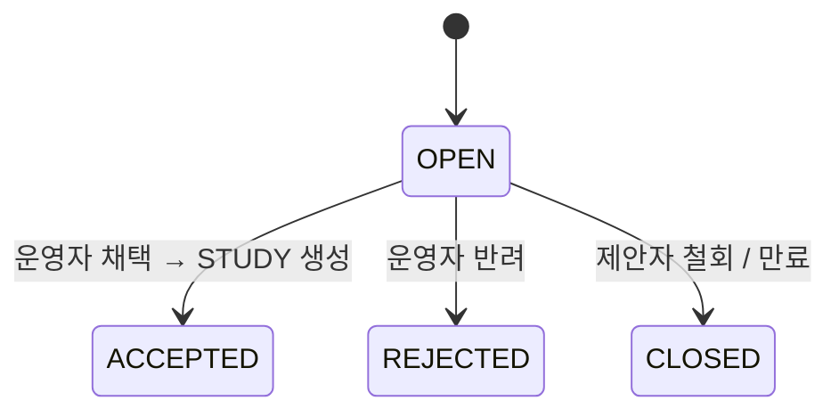

# STUDY_PROPOSAL — 스터디 제안

회원이 "이런 스터디 열어주세요" 하고 올리는 제안. 다른 회원이 관심을 표시([STUDY_PROPOSAL_INTEREST](./STUDY_PROPOSAL_INTEREST.md))하고, 운영자가 채택하면 STUDY 로 승격.

## 컬럼

| 컬럼 | 타입 | NULL | 설명 |
|---|---|---|---|
| ID | BIGINT PK | N | |
| PROPOSER_USER_ID | BIGINT FK → USER | N | 제안자 |
| CONTENT | TEXT | N | 제안 내용 |
| PROPOSED_DATE | DATE | N | 희망 시작 시기 |
| STATUS | VARCHAR(20) | N | 아래 |

## 관계
- N : 1 [USER](./USER.md)
- 1 : N [STUDY_PROPOSAL_INTEREST](./STUDY_PROPOSAL_INTEREST.md)
- 채택 시 → [STUDY](./STUDY.md) (역참조 컬럼 `STUDY_ID` 추가 미확정)

## 상태 — STATUS

| 값 | 뜻 |
|---|---|
| `OPEN` | 게시됨, 관심 모으는 중. 기본값 |
| `ACCEPTED` | 운영자 채택 → STUDY 생성 |
| `REJECTED` | 운영자 반려 |
| `CLOSED` | 제안자 철회 / 기한 만료 |

## 제약
- 인덱스 `(STATUS, CREATED_AT)`

## 미확정
- drawio 에는 `TITLE` 이 없다 — 목록에 띄우려면 필요.
- 채택 시 생성된 STUDY 를 가리키는 `STUDY_ID` 컬럼.
