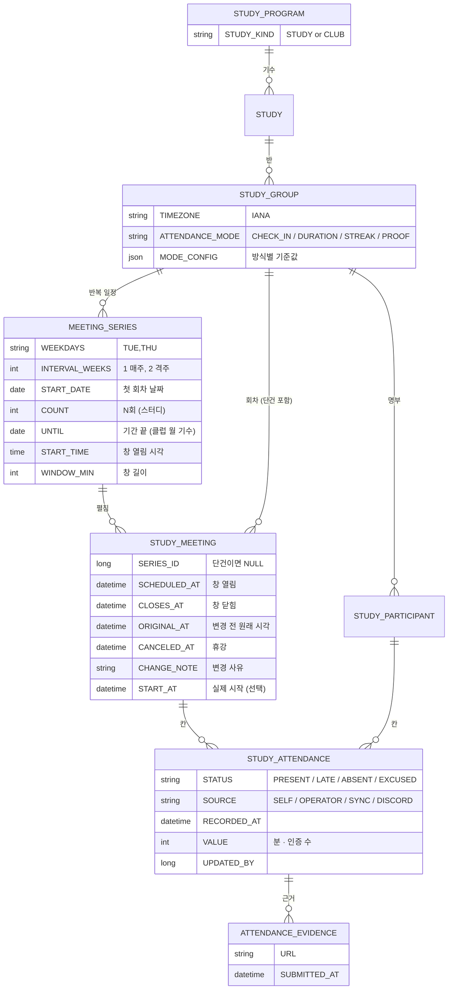

# 회차 · 출석 흐름

> 작성: 2026-09-28 · 상태: **제안 (미결정)** · 코드 기준 `beta` (`976e425`)
> ⚠️ 먼저 머지된 설계와 어긋나는 곳이 있다 → [먼저 머지된 것과의 관계](#먼저-머지된-것과의-관계--맞춰야-할-곳)
> 전제: **스터디와 클럽을 둘 다 웹에서 지원한다.**

| 문서 | 무엇 |
|---|---|
| **이 문서** | 전체 그림 · 두 축 · 모델 한 장 · 정해야 할 것 |
| [회차](./meeting.md) | 반복 일정(매주·격주·매일) · 단건 회차 · 생성 · **회차 액션(휴강 · 미루기 · 일정 변경 · 추가 · 되돌리기 · 삭제)** · 범위 수정 |
| [회차 설정 UI](./meeting-ui.md) | 구글 캘린더처럼 — 달력 · 팝오버 · 범위 묻기(이 회차만/이후/모두) · 여러 개 선택 · 확정 전 영향 요약 |
| [출석률 계산](./attendance-rate.md) | 어느 회차를 세나(칸 판정) · 점수 · 개인/반/스터디 합치기 · 표시 · 경고 · 지금 코드와 다른 곳 |
| [출석](./attendance.md) | 출석 방식 4종 · 출석 칸 · 출석 과정 · 불참 과정 · 출석률 · 회차가 바뀌면 출석은 |
| [여정 · 페르소나 · 조합표](../journeys/README.md) | 일정 패턴(주 1회·분반·여러 요일·격주·매일·단건) × 상황 — 어느 조합에 화면이 필요한가 |
| [지금 구현](./as-is.md) | 현재 코드가 어디까지 됐나 · 코드와 기획이 어긋난 곳 |

## 한 줄 결론

**회차는 반복 일정으로 한 번에 펼치고, 그 뒤로는 회차 행이 진실이다. 조작은 구글 캘린더처럼 하되 지난 회차는 바뀌지 않는다. 출석은 반마다 "무엇으로 인정하나"를 고른다.**

## 왜 — 무엇을 풀어야 하나

| 스터디·클럽 | 모이는 주기 | 출석 근거 | 지금 쓰는 도구 |
|---|---|---|---|
| 일반 스터디 | 주 1~2회 저녁, **격주**도 있음 | 그 시각에 들어왔나 | 구글시트 |
| WEEKLY X | 매일 | 그날 **공부 시간** | 구글시트 |
| Daily LeetCode | 매일 | 그날 풀었나 (**스트릭**) | 외부 서비스 자동 기록 |
| 얼리버드 | 매일 아침 | **인증 사진 2장** | 디스코드 채팅 |

- 회차가 만들어지는 코드가 **없다.** 화면은 mock 이 일정 문구를 읽어 지어낸다 ([지금 구현](./as-is.md#구현-현황)).
- 일정은 **처음 정한 대로 가지 않는다.** 강사 사정으로 한 주 쉬면 뒤가 전부 밀리고, 당일 30분 늦게 시작하면 지각 판정이 틀어진다.
- 출석 근거가 넷이라, 스터디용 "시각 체크인" 하나로 만들면 클럽 셋은 웹과 원래 도구를 **이중으로** 관리하게 된다.

## 먼저 머지된 것과의 관계 — 맞춰야 할 곳

이 문서들을 쓰는 동안 `beta` 에 같은 주제가 먼저 들어갔다 — [출석 방식 제안](../../share/2026-09-27-attendance-mode.md) · [클럽 출석 재검토](../../share/2026-09-27-club-attendance-rethink.md) · [디스코드 일괄 출석 스펙](../../specs/discord-attendance/spec.md)(구현 완료) · playground 네비게이터 회차 관리(#142).
**어긋나는 곳을 조용히 한쪽으로 고치지 않고 여기 모은다.** 리뷰에서 정한 뒤 해당 문서를 고친다.

| # | 주제 | 먼저 머지된 쪽 | 이 문서들 | 맞추는 안 (제안) |
|---|---|---|---|---|
| R1 | 출석 방식의 **자리와 이름** | 기수(`STUDY`)에 `ATTENDANCE_MODE` = `MEETING` · `DAILY_PROOF` · `DAILY_LOG` · `EXTERNAL` | 반(`STUDY_GROUP`)에 `CHECK_IN` · `PROOF` · `DURATION` · `STREAK` | **먼저 쪽 이름·자리를 따른다.** 뜻은 1:1 로 같다 (CHECK_IN=MEETING, PROOF=DAILY_PROOF, DURATION=DAILY_LOG, STREAK=EXTERNAL). 반마다 방식이 달라야 하는 사례가 나오면 그때 반으로 내린다 |
| R2 | **회차가 진행 중인지** 무엇으로 아나 | 실제 시작·종료(`START_AT`/`END_AT`). 디스코드 `!출석체크` 가 예정 ±2h 회차를 **자동 시작**한다 — 구현됨 | 창(`SCHEDULED_AT` ~ `CLOSES_AT`) 시각으로만. `START_AT` 은 기록용 | **둘을 합친다**: 열림 = `START_AT` 이 찍혔거나 `SCHEDULED_AT` 이 지남 · 닫힘 = `END_AT` 이 찍혔거나 `CLOSES_AT` 이 지남. `END_AT` 을 누가 찍는지(디스코드 종료 명령? 창 만료?)는 두 스펙 모두 비어 있다 |
| R3 | **이번만 다른 반** | 디스코드 출석은 자기 반에만 찍는다. 옆 반 회차에 찍으면 지금 계산기에서 결석으로 잡힌다 | 결정 11 — 인정하자는 쪽 | **MVP 는 먼저 쪽(자기 반만).** 인정하려면 출석률 계산이 "칸의 반" 이 아니라 "참가자의 반" 기준이어야 하고, 그건 [출석률 계산](./attendance-rate.md#3-합치기--개인--반--스터디) 에 이미 적은 규칙이다 — 결정 11 에서 같이 정한다 |
| R4 | **클럽의 빈칸** | 클럽은 MVP 에서 빼는 안이 1순위. 넣는다면 클럽 빈칸 = **일정 없음**(결석 아님) · 지각 없음 · 완주 = 제명 안 됨 | 빈칸 = 결석을 모든 방식에 같게. 클럽도 출석률 계산 | 클럽을 MVP 에서 빼면 **충돌 없음** (이 문서의 클럽 부분은 다음 단계 설계로 읽는다). 넣으면 방식별로 "빈칸의 뜻" 을 다르게 둬야 한다 — [출석률 §1](./attendance-rate.md#1-회차-하나를-셀까-말까--칸-판정) 에 한 줄 추가 |
| R5 | **네비게이터 회차 관리 화면** | playground 에 크루 쪽 앱 「내 스터디 › 관리 › 일정」 프로토(#142). 반복 최대 31일 · 회차 제목 · API 초안 `POST …/meetings {scheduledAt[]}` | [meeting spec](../../specs/meeting/spec.md) 의 반복 일정(`MEETING_SERIES`) · 범위 수정 · 미루기 | 화면 자리는 **먼저 쪽**(네비게이터 = 크루 쪽 앱, 캡틴 = 백오피스). API 는 **meeting spec 이 초안을 대체**한다 — 단건 추가는 같은 경로라 호환. 회차 **제목**(`TITLE`)은 meeting spec 에 없으니 추가 |
| R6 | 클럽 새 기수의 반복 일정 끝 | — | 월 기수 = `UNTIL` 월말 | 충돌 없음. 먼저 쪽의 「회차 추가 버튼은 `MEETING` 에서만」 과도 맞는다 (매일 방식은 펼치기로만 생긴다) |

## 용어

화면·문서·API 에서 같은 말을 쓴다. 괄호는 API 이름.

| 용어 | 정의 |
|---|---|
| **회차** (meeting) | 반의 모임 한 번 = 출석을 받는 **창** 하나. 번호(N회차)는 저장하지 않고 휴강을 뺀 날짜순으로 센다 |
| **창** | 회차가 열려 있는 시간. `SCHEDULED_AT` ~ `CLOSES_AT`. 스터디는 2시간, 매일 클럽은 하루 |
| **반복 일정** (series) | 캘린더의 반복 일정 — 요일 · 몇 주마다 · 시각 · N회 또는 언제까지. 반 하나에 여러 개 |
| **단건 회차** | 반복 일정 없이 하나만 추가한 회차 (월 1회 · 특강) |
| **예외** | 반복 일정에서 나왔지만 따로 옮긴 회차 (`ORIGINAL_AT` 있음). 반복 일정을 고쳐도 안 바뀐다 |
| **범위** | 반복 일정 회차를 고치거나 지울 때 고르는 것 — 이 회차만 · 이 회차 및 이후 · 모든 회차 |
| **펼치기** | 반복 일정으로 회차 행들을 만드는 일. 만들 때, 그리고 반복 일정을 고칠 때 (미래만) |
| **휴강** (cancel) | 고른 회차(여러 개)를 열지 않는다. 회수가 준다. 뒤 일정은 그대로 |
| **미루기** (defer) | 고른 날(여러 개)을 비우고 그 뒤 회차를 규칙의 다음 자리로 민다. 회수는 그대로, 끝이 늘어난다 |
| **일정 변경** (reschedule) | 특정 회차의 날짜·요일·시각을 바꾼다. 날짜는 하나씩, 시각만은 여러 개 한꺼번에. 당일 늦은 시작도 이것 |
| **추가** (add) | 규칙에 없는 회차 하나 (보강·특강) |
| **되돌리기** (restore) | 휴강을 풀거나, 옮긴 회차를 원래 날짜·시각으로 |
| **삭제** (delete) | 회차 행을 지운다. 잘못 만든 회차용 — 출석 기록이 있으면 안 된다. 크루에게 흔적이 안 남는다 |
| **반복 일정 수정** | "앞으로 계속" 바뀌는 것. 범위가 "이후" 면 반복 일정을 둘로 나누고, "모두" 면 규칙을 바꾼다. 둘 다 손대지 않은 미래 회차만 다시 펼친다 |
| **출석 방식** | 칸을 무엇으로 채우나 — 체크인 · 공부 시간 · 스트릭 · 인증 |
| **휴가** (leave) | 크루가 **미리** 알린 불참. 본인 분모에서 빠진다 |
| **결석** | 창이 닫혔는데 칸이 비어 있는 것. 저장하지 않는다 |
| **정정** | 운영자가 이미 정해진 칸을 고치는 일 |

"당일 지연"·"연기" 는 일정 변경, "밀기" 는 미루기, "보강" 은 추가로 쓴다.

## 두 축

```
회차 (언제 모이나)             반복 일정 → 펼치기 → 회차 행 → 회차 액션(휴강·미루기·일정 변경·추가·삭제)   ← 모두 공통
출석 방식 (무엇으로 인정하나)   CHECK_IN · DURATION · STREAK · PROOF                               ← 반마다 하나
```

두 축이 만나는 곳은 **출석 칸 하나**다 — 회차 × 참가자. 출석률·명부 격자·알림은 한 벌이다.

## 모델 한 장



컬럼별 설명은 [회차 §1](./meeting.md#1-모델) · [출석 §1](./attendance.md#1-모델).

## 리스크 Top 3

| 리스크 | 영향 | 대응 |
|---|---|---|
| 회차를 옮길 때 출석·휴가가 따라가지 않음 | 10/22 휴가가 10/29 로 옮겨간 회차에 그대로 붙어, 나오려던 사람이 휴가 처리 | 회차 날짜가 바뀌면 **본인 휴가는 풀고 알린다** ([출석 §6](./attendance.md#6-회차가-바뀌면-출석은)) |
| 서머타임을 한 번만 계산 | 미주반 회차가 11월부터 1시간 밀려 체크인이 지각으로 찍힘 | 날짜마다 `ZonedDateTime → UTC`. 경계 테스트 필수 |
| STREAK 외부 연동 불안정 (LeetCode 는 공식 API 없음) | 동기화가 빠지면 전원 결석 | 실패 시 칸을 쓰지 않고 운영자에게 표시. 자가 체크로 시작 가능 |

## 사람이 정해야 할 것

| # | 질문 | 문서의 기본값 | 누가 |
|---|---|---|---|
| 1 | 클럽별 기준값 — WEEKLY X 목표 시간, 얼리버드 창·인증 수, 스트릭 기준 | 60분 · 05~08시 · 2장 (예시) | 각 클럽 운영자 |
| 2 | 기준 미달(공부 시간·인증 수 모자람)은 지각인가 결석인가 | 지각 (0.5) | 기획 |
| 3 | STREAK 을 MVP 에 넣나 | 자가 체크로 시작 | 기획 |
| 4 | 반복 일정·회차 변경은 누가 하나 | 캡틴·네비게이터 | 기획 |
| 5 | 회차를 옮기면 이미 낸 휴가는 | 풀고 알림 | 기획 |
| 6 | 미루기로 기수 끝이 넘어가면 기수 기간(`STUDY.END_AT`)도 늘리나 | 늘린다 (스터디), 넘친 회차는 버린다 (클럽 월 기수) | 기획 |
| 7 | 쉬는 기간(PAUSED)을 어떻게 아나 | 명부에 쉼 이력 필요 | 백엔드 |
| 8 | 휴가 한도 | 없음 | 기획 |
| 9 | 드래그로 옮길 때 범위를 묻나 | 안 묻는다 — 이 회차만 | 기획·디자인 |
| 10 | 크루용 캘린더 구독(ICS)을 언제 하나 | 회차 설정 다음 1순위 | 기획 |
| 11 | 분반 크루가 **이번만 다른 반** 회차에 나오면 출석으로 인정하나 | MVP 는 인정 안 함 (디스코드 스펙과 같게, R3). 인정하면 원래 반 출석률로 센다 ([조합표](../journeys/combinations.md#조합에서-나온-것--스펙결정)) | 기획 |
| 12 | 남은 회차를 전부 쉼(PAUSED)으로 보내면 완주인가 | 미정 | 운영 |
| 13 | 출석 경고 기준 | 연속 결석 2회 · 출석률 60% 미만 (센 회차 ≥ 3) ([출석률 §6](./attendance-rate.md#6-출석-경고)) | 기획·운영 |
| 14 | 하차한 사람의 출석률을 본인에게 보여주나 | 하차 전까지 보여준다 | 기획 |
| 15 | 지각 가중치를 반마다 바꾸게 하나 | 안 한다 — 0.5 고정 | 기획 |

## 다음 액션

- [ ] 결정 1·2·3 — 기획 + 클럽 운영자
- [ ] 결정 4·5·6 — 기획
- [ ] ERD 갱신 — STUDY_GROUP · STUDY_MEETING · STUDY_ATTENDANCE — 백엔드
- [ ] `specs/meeting/spec.md` — 반복 일정·펼치기·회차 액션 API — 백엔드
- [ ] 회차 탭 와이어프레임 — 디자인 ([회차 설정 UI](./meeting-ui.md) 기준)
- [ ] 마이그레이션 + 펼치기·미루기 + 서머타임 테스트 — 백엔드
- [ ] `CHECK_IN` 부터 연결 (스터디), 이어서 `DURATION` → `PROOF` → `STREAK` — 백엔드·프론트
