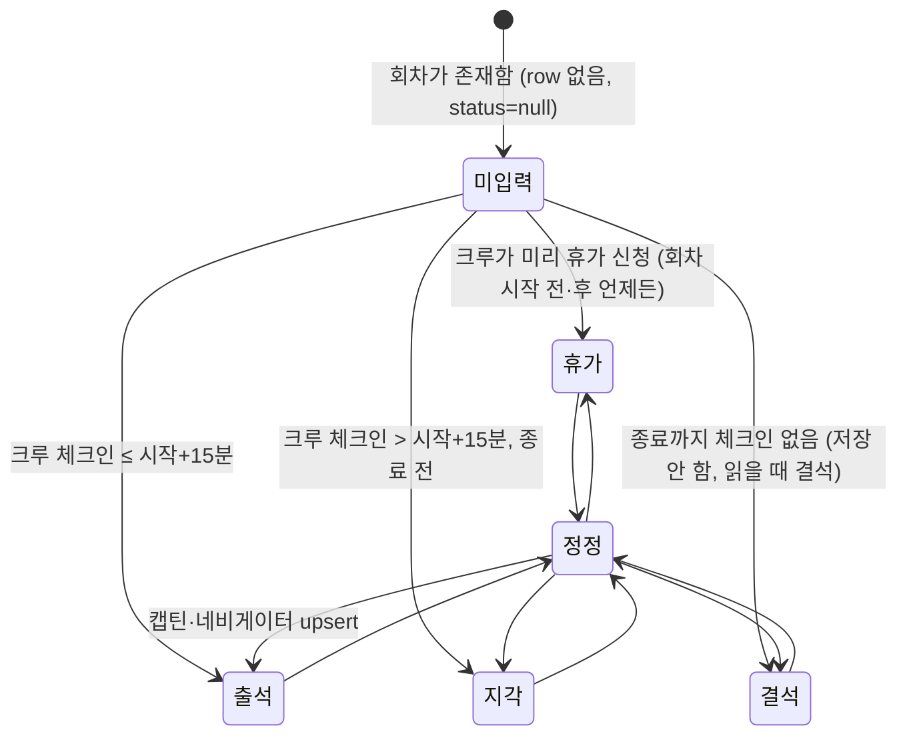
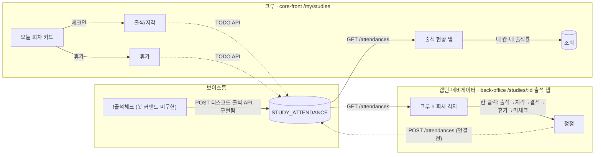
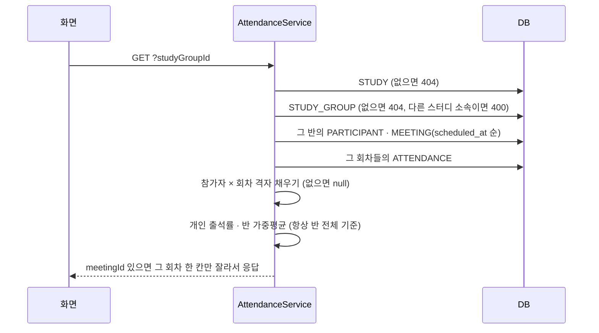

# 출석 · 회차 — 지금 구현 (as-is)

> 작성: 2026-09-28 · 코드 기준 `beta` (`976e425`)
> 정본: API 는 [attendance spec](../../specs/attendance/spec.md), 권한은 [POL-0001](../../01-planning/_registry/policies/POL-0001-roles.md), 시간대는 [POL-0006](../../01-planning/_registry/policies/POL-0006-timezone.md), 크루 화면은 [crew-joined-studies PRD](../../planning/stories/crew-joined-studies/PRD.md).
> 이 문서는 그것들을 **한 줄로 이어 붙인 지도**다. 규칙이 어긋나면 정본을 고치고 여기를 따라 고친다.
> 앞으로 만들 모양(스터디·클럽 공통 제안)은 [README](./README.md) → [회차](./meeting.md) · [출석](./attendance.md).

## 한 줄 요약

회차(`STUDY_MEETING`)마다 크루 한 명당 출석 칸 하나(`STUDY_ATTENDANCE`)가 있다. **크루가 직접 체크인**해서 칸을 채우고, 안 채운 채 회차가 끝나면 결석으로 읽힌다. 틀린 칸은 **캡틴·네비게이터가 백오피스 격자에서** 고친다.

> ⚠️ **지금은 절반만 연결돼 있다.** 백엔드는 명부 조회·운영자 upsert 두 API 만 있고, 두 화면(크루 체크인·백오피스 격자)은 **아직 mock/localStorage** 다. 아래 [구현 현황](#구현-현황)과 [어긋난 곳](#어긋난-곳--정해야-할-것)을 먼저 본다.

---

## 1. 한살이 — 출석 칸 하나의 상태



| 상태 | DB `status` | 출석률 분자 | 분모에 들어가나 |
|---|---|---|---|
| 출석 | `PRESENT` | 1.0 | ✓ |
| 지각 | `LATE` | 0.5 | ✓ |
| 결석 | `ABSENT` 또는 **row 없음(null)** | 0 | ✓ (지난 회차면) |
| 휴가 | `EXCUSED` | — | ✗ 분모에서 뺀다 |
| 아직 안 열린 회차 | null | — | ✗ `scheduled_at > now` |

- 칸은 `(study_meeting_id, account_id)` 로 유일하다 (`UNIQUE`). 같은 칸을 두 번 쓰면 덮어쓴다.
- **결석은 기록하지 않아도 된다.** 지난 회차에 row 가 없으면 서버도 분모에 넣고 분자 0 으로 센다 — 체크인 안 한 사람을 운영자가 매번 결석으로 찍을 필요가 없다.

---

## 2. 누가 무엇을 하나



실선은 화면 안 동작, 점선은 **아직 서버에 안 닿는 연결**이다.

| 누가 | 어디서 | 무엇을 | 권한 근거 |
|---|---|---|---|
| 크루 | core-front `/my/studies` · 오늘 회차 | 체크인 → 누른 시각으로 출석/지각 결정 | POL-0001 "출석 체크는 권한이 아니다" |
| 크루 | 같은 화면 | 휴가 신청 (회차 전·후 언제든) | 〃 |
| 반장 | 디스코드 보이스룸 `!출석체크` | 보이스 참가자 스냅샷으로 일괄 출석, 예정 ±2h 회차 자동 시작 | 백엔드 구현됨 · 봇 커맨드 미구현 ([discord-attendance spec](../../specs/discord-attendance/spec.md)) |
| 캡틴·네비게이터 | back-office 스터디 상세 → 출석 탭 | 이미 기록된 칸을 고친다 | POL-0001 "출석 현황 수정" |

---

## 3. 크루 체크인 — 시각으로 상태가 갈린다

기준: [`core-front/src/lib/attendance.ts`](../../frontend/apps/core-front/src/lib/attendance.ts)

```
회차 시작 = 회차 날짜 + 스터디 일정 문자열의 HH:MM (없으면 20:00)
회차 종료 = 시작 + 120분

   시작        시작+15분                   종료
────┼────────────┼──────────────────────────┼────────▶
    │  체크인→출석 │      체크인→지각          │ 체크인 불가 → 결석
```

예: 목 20:00 스터디 — 20:10 체크인은 출석, 20:30 은 지각, 22:00 이후엔 버튼이 없고 결석으로 읽힌다.

- 휴가는 시각과 무관하게 언제든 저장된다.
- 시작 전의 결석은 칸에 그리지 않는다 (빈 칸).

---

## 4. 운영자 정정 — 격자 한 장

기준: [`back-office-front/src/components/AttendanceTab.tsx`](../../frontend/apps/back-office-front/src/components/AttendanceTab.tsx)

- 구글시트로 하던 일이라 **시트와 같은 모양** — 크루(행) × 회차(열) 한 장. 회차별 화면은 두지 않는다.
- 칸을 누를 때마다 `출석 → 지각 → 결석 → 휴가 → 미체크` 순환. 출석률은 누르는 즉시 다시 계산된다.

서버로 보낼 때(연결 후):

```http
POST /api/studies/{studyId}/attendances
{ "updates": [ { "meetingId": 1, "participantId": 20, "status": "LATE" } ] }
→ 204
```

- 여러 회차·여러 크루를 한 요청에 섞어도 된다. **배치 전체가 한 트랜잭션** (all-or-nothing).
- 칸이 있으면 UPDATE, 없으면 INSERT. 같은 요청을 두 번 보내도 결과가 같다 (멱등).
- 동시에 같은 칸을 새로 만들면 unique 위반 → 409. 그 외엔 last-write-wins, 잠금 없음.
- ⚠️ "미체크" 로 되돌리는 요청은 **API 에 없다** — status 는 4값만 받는다. 격자의 5번째 상태를 서버에 반영할 길이 없다.

---

## 5. 명부 조회와 출석률

`GET /api/studies/{studyId}/attendances?studyGroupId=…[&meetingId=…]` — [AttendanceService](../../backend/api/src/main/java/com/studyclub/api/attendance/AttendanceService.java)



### 출석률 산식 — [AttendanceRateCalculator](../../backend/api/src/main/java/com/studyclub/api/attendance/AttendanceRateCalculator.java)

```
개인 = (출석 수 + 지각 수 × 0.5) / 대상 회차
대상 회차 = 반의 회차 중
            이미 시작함 (scheduled_at ≤ now)
          AND 합류 이후 (scheduled_at ≥ joined_at)
          AND 휴가 아님
참가자 상태가 WITHDRAWN(탈퇴) 이면 0/0 → null ("–" 로 표시)
반 평균 = Σ개인 분자 / Σ개인 분모   (분모 0 인 사람 제외, 가중평균)
```

계산 예 — 5회차 중 3회차까지 진행, 수아는 2회차에 합류:

| 회차 | 1 | 2 | 3 | 4 | 5 |
|---|---|---|---|---|---|
| 수아 | (합류 전) | 출석 | 지각 | (미래) | (미래) |
| 시우 | 출석 | 휴가 | (미입력) | (미래) | (미래) |

- 수아 = (1 + 0.5) / 2 = **75%**
- 시우 = (1 + 0) / 2 = **50%** — 2회차 휴가는 빠지고, 3회차 미입력은 결석으로 센다
- 반 평균 = (1.5 + 1) / (2 + 2) = **62.5%**

### 시간대

서버는 UTC 로 주고받고, 명부는 **그 반의 시간대** 기준으로 보여준다 (POL-0006).

---

## 구현 현황

| 조각 | 상태 | 위치 |
|---|---|---|
| 명부 조회 API | ✅ 구현·테스트 | `backend/api/.../attendance/AttendanceService.java` |
| 운영자 upsert API | ✅ 구현·테스트 | `backend/api/.../attendance/AttendanceUpsertService.java` |
| 크루 체크인·휴가 API | ❌ 없음 (`TODO(api): POST /api/studies/{id}/meetings/{meetingId}/attendance`) | — |
| 크루 화면 | 🟡 localStorage(`sc_my_attendance`) + mock 회차 | `core-front/src/lib/attendance.ts` |
| 백오피스 격자 | 🟡 컴포넌트 state + mock | `back-office-front/src/components/StudyConsole.tsx` |
| 디스코드 일괄 출석 | 🟡 백엔드 API 구현 · 봇 커맨드 미구현 | `backend/api/.../discord/DiscordAttendanceService.java` |
| 네비게이터 회차 관리 화면 | 🟡 playground 프로토 (#142) · localStorage | `playground/.../my/joined/[id]/manage/schedule` |
| 회차(`STUDY_MEETING`) 생성 | ❌ 백엔드에 만드는 코드 없음 (테스트 픽스처뿐) | — |
| 휴가 신청·승인 (LeaveRequest) | ❌ 별도 스펙. 지금 `EXCUSED` 는 upsert 로만 세팅 | — |
| 출석경고 알림 | ❌ 별도 스펙 | `specs/notification/spec.md` |
| 스터디 삭제 시 | ✅ 출석 기록 물리 삭제 | `specs/study/spec.md` |

---

## 어긋난 곳 · 정해야 할 것

| # | 무엇 | 코드 | 기획·정책 | 영향 |
|---|---|---|---|---|
| 1 | **크루가 서버에 체크인할 길이 없다** | upsert 는 LEADER·CO_LEADER 만 (그 외 403) | 체크인은 누구나 (POL-0001) | 크루 화면 연결 불가 — 별도 엔드포인트 필요 |
| 2 | **정정 권한 역할** | `LEADER`·`CO_LEADER` | 캡틴·네비게이터, `CO_LEADER` 는 없앤다 (POL-0001) | 네비게이터 역할 매핑 확정 필요 |
| 3 | **백오피스 분모** | 격자 주석: "체크된 회차만" | 서버: 지난 회차 전부 (미입력=결석) | 같은 사람 출석률이 백오피스·크루 화면·API 에서 다르게 나온다 |
| 4 | **"미체크" 되돌리기** | API 는 4값만, 삭제 없음 | 격자는 5번째 상태로 순환 | 잘못 누른 칸을 비울 수 없다 |
| 5 | **회차는 누가 만드나** | 생성 코드 없음 | 제안: 반 규칙으로 일괄 생성 → [회차](./meeting.md) | 회차 없으면 명부가 비어 있다 |
| 6 | **체크인 시각 판정은 누가** | 프론트가 브라우저 시계로 출석/지각 결정 | — | 서버로 옮길 때 서버 시각 기준으로 재판정해야 조작 불가 |
| 7 | **명부 조회 권한** | 로그인만 하면 아무 스터디 명부 조회 가능 | 크루 명단 열람은 캡틴·네비게이터 (POL-0001) | 다른 스터디 크루 닉네임·출석이 보인다 |
