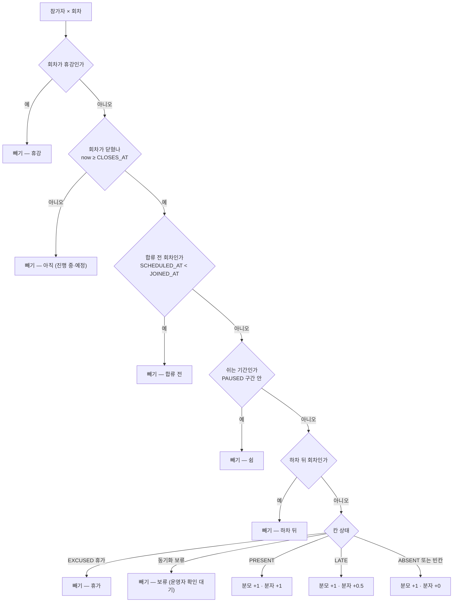
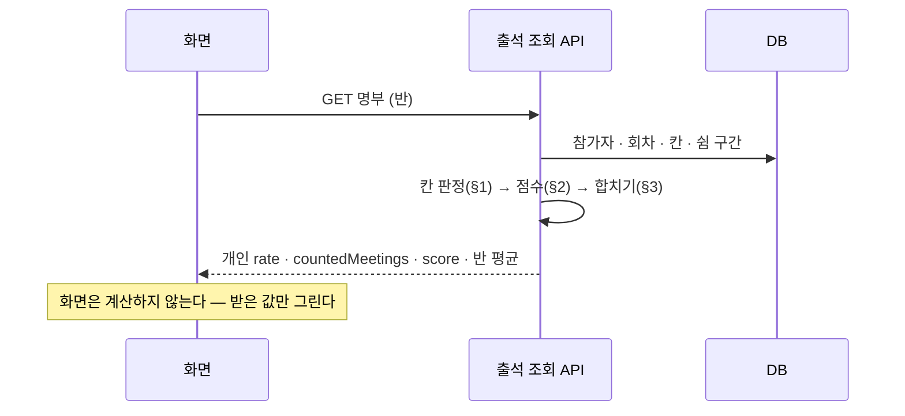

# 출석률 계산 흐름

> 작성: 2026-09-29 · 상태: **제안 (미결정)** · 출석 칸이 어떻게 채워지나는 [출석](./attendance.md), 회차는 [회차](./meeting.md)
> 화면: [운영자 출석 탭](../../specs/meeting/wireframes/10-attendance-grid.html) · [매일 클럽 히트맵](../../specs/meeting/wireframes/13-daily-club.html) · [크루 카드](../../specs/meeting/wireframes/09-crew-checkin.html)

> ⚠️ 클럽 빈칸의 뜻([관계 R4](./README.md#먼저-머지된-것과의-관계--맞춰야-할-곳)) · 닫힘 판정([관계 R2](./README.md#먼저-머지된-것과의-관계--맞춰야-할-곳))이 먼저 머지된 설계와 어긋난다

## 한 줄 결론

**출석률은 서버 한 곳에서만 계산하고, 화면은 받은 값을 그린다.**
대상은 **닫힌 회차**뿐이다. 휴강 · 휴가 · 합류 전 · 쉬는 기간은 빼고, 출석 1 · 지각 0.5 · 결석(빈칸 포함) 0 으로 센다.

## 왜 — 지금 세 곳이 다르게 센다

같은 사람, 같은 기록인데 화면마다 숫자가 다르다.

> 수아 · 5회차 진행 중(20:30) · 1회 출석 · 2회 지각 · 3회 체크인 없이 닫힘 · 4회 휴가 · 5회 아직 체크인 없음

| 어디서 | 코드 | 분모 | 계산 | 결과 |
|---|---|---|---|---|
| 백엔드 API | [AttendanceRateCalculator](../../backend/api/src/main/java/com/studyclub/api/attendance/AttendanceRateCalculator.java) | **시작한** 회차 (진행 중인 5회 포함) | 1.5 / 4 | **38%** |
| 백오피스 격자 | mock `attendanceRate` | **체크된 칸만** (빈칸 3회 빠짐) | 1.5 / 2 | **75%** |
| 크루 화면 | core-front `myRate` | 시작한 회차 | 1.5 / 4 | **38%** |
| **제안** | 서버 한 곳 | **닫힌** 회차 | 1.5 / 3 | **50%** |

- 백오피스는 **안 온 사람이 오히려 높게** 나온다 — 빈칸을 분모에서 빼서.
- 백엔드·크루 화면은 **지금 진행 중인 회차에서 아직 체크인 안 한 사람을 결석으로** 센다. 매일 클럽이면 아침마다 전원의 출석률이 떨어졌다가 저녁에 돌아온다.

---

## 1. 회차 하나를 셀까 말까 — 칸 판정

참가자 한 명 × 회차 하나마다 아래를 **위에서부터** 본다. 먼저 걸리는 줄에서 끝난다.



| 순서 | 빼는 것 | 판정 | 지금 코드 |
|---|---|---|---|
| 1 | 휴강 | `STUDY_MEETING.CANCELED_AT IS NOT NULL` | 휴강 개념 없음 |
| 2 | 아직 안 닫힌 회차 | `now < CLOSES_AT` | `scheduled_at > now` — **시작 기준** |
| 3 | 합류 전 | `SCHEDULED_AT < STUDY_PARTICIPANT.JOINED_AT` | ✓ 같음 |
| 4 | 쉬는 기간 | 회차가 명부 쉼 구간(시작~끝) 안 | PAUSED 를 **전 회차 집계** |
| 5 | 하차 뒤 | `WITHDRAWN` 이면 하차 시각 이후 회차 | 하차자는 **통째로 null** |
| 6 | 휴가 | 칸 `STATUS = EXCUSED` | ✓ 같음 |
| 7 | 동기화 보류 | STREAK 동기화가 실패해 판정 못 한 칸 | 없음 (신규) |

**휴강을 닫힘보다 먼저 본다** — 사후 휴강(이미 닫힌 회차를 휴강 처리)도 빠진다.
**빈칸은 결석이다** — 결석을 저장하지 않기로 했기 때문이다 ([출석 §1-3](./attendance.md#1-3-행은-기록이-생길-때만)).

## 2. 점수 — 상태만 본다

| 칸 상태 | 점수 | 누가 그 상태로 만드나 |
|---|---|---|
| `PRESENT` 출석 | 1 | 체크인 ≤ 열림+15분 · 공부 시간 ≥ 목표 · 인증 수 ≥ 기준 · 스트릭 확인 · 운영자 |
| `LATE` 지각 | 0.5 | 체크인 > 열림+15분 · 공부 시간·인증 부족 · 운영자 |
| `ABSENT` 결석 / 빈칸 | 0 | 운영자 정정 · 닫힐 때까지 기록 없음 |
| `EXCUSED` 휴가 | 뺌 | 크루(열리기 전) · 운영자 |

**출석률 계산은 출석 방식을 모른다.** 방식(체크인·공부 시간·인증·스트릭)은 칸의 **상태를 정할 때** 끝났다 ([출석 §2](./attendance.md#2-방식별-판정)). 그래서 매일 클럽도 주 1회 스터디도 같은 계산을 탄다.

## 3. 합치기 — 개인 · 반 · 스터디

```
개인        = Σ점수 / Σ센 회차                      (센 회차 0 → 없음 "–")
반 평균     = Σ(개인 점수) / Σ(개인 센 회차)          (센 회차 0 인 사람 제외 — 가중평균)
스터디(기수) = 그 기수의 모든 반을 한 통으로 같은 식
```

**평균은 가중평균이다** — 사람마다 출석률을 내서 단순 평균하면 회차를 적게 겪은 사람이 크게 친다.

| | 점수 / 센 회차 | 개인 |
|---|---|---|
| 수아 | 1.5 / 3 | 50% |
| 시우 | 3 / 3 | 100% |
| 예린 (늦게 합류) | 1 / 1 | 100% |
| **반 평균 (가중)** | **5.5 / 7** | **79%** |
| 단순 평균이면 | (50+100+100)/3 | 83% — 1회만 겪은 예린이 수아와 같은 무게 |

| 묶음 | 무엇 | 비고 |
|---|---|---|
| 기수(STUDY) 안 | 반 → 스터디 | 분반이면 두 반을 합친 한 통 |
| 클럽 기수 넘김 | **기수마다 새로 시작** | 10월 출석률과 11월 출석률은 따로. 이월해도 11월 출석률은 0/0 에서 시작 |
| 이번만 다른 반 | **원래 반**에서 센다 | 칸은 방문한 회차에 있어도 참가자의 원래 반 출석률에 넣는다 ([결정 11](./README.md#사람이-정해야-할-것)) |
| 내 전체 (크루 마이페이지) | 스터디별로 보여주고 **합치지 않는다** | 주 1회 8회와 매일 31회를 합치면 매일 클럽이 전부를 덮는다 |

## 4. 보여주기

| 규칙 | 예 |
|---|---|
| 정수 % · 반올림 (0.5 는 올림) | 1.5/4 = 37.5% → **38%** |
| 센 회차가 0 이면 `–` | 첫 회차가 아직 안 닫힘 |
| **분수를 같이 적는다** | `50% · 3회 중 1.5` — 크루 카드·격자 끝 칸. 1/1 = 100% 가 과장되지 않게 |
| 진행 중 회차는 "집계 전" | 격자에서 파란 테두리 칸, 출석률 옆에 `+1 진행 중` |
| 하차한 사람 | 하차 전까지의 값 + `하차` 배지. 반 평균에서는 빠진다 |

완주 점수판(`n/m`)은 출석률과 다른 숫자다 — **출석 + 지각 횟수 / 센 회차**. 지각을 1회로 센다 ([crew-joined-studies PRD](../../planning/stories/crew-joined-studies/PRD.md)).

## 5. 언제 계산하나



- **저장하지 않고 조회할 때마다 계산한다.** 정정·휴강·회차 이동이 곧바로 반영돼야 하고, 반 하나는 많아야 수십 명 × 31회라 가볍다.
- 저장하는 것은 **기수 종료 때의 최종값**뿐 — 완주 판정·이력용 (필요해지면).
- 응답에 **분자·분모도 같이** 준다 (`score`, `countedMeetings`) — 화면이 `3회 중 1.5` 를 그리려면 필요하고, 숫자가 이상할 때 추적할 수 있다.

## 6. 출석 경고

출석률로 "위험한 사람" 을 찾는다. 네비게이터 페인 — "누가 위험군인지 즉시 안 보임".

| 조건 (기본값 제안) | 알림 |
|---|---|
| **연속 결석 2회** (닫힌 회차 기준, 휴가·휴강 건너뜀) | 크루 본인 + 네비게이터 |
| 센 회차 ≥ 3 이고 **출석률 < 60%** | 네비게이터 격자에서 빨간 숫자 |

- 센 회차 3 미만은 경고하지 않는다 — 1회 빠지면 0% 가 된다.
- 매일 클럽은 "연속 결석 3일" 같이 반마다 다를 수 있다 → 결정 13.
- 자동 제외(명부에서 빼기)는 MVP 밖.

## 7. 경계 사례

| 상황 | 결과 | 이유 |
|---|---|---|
| 3회에 합류 | 1·2회는 합류 전이라 안 센다 | 늦게 온 게 결석이 아니다 |
| 회차를 미뤘다 (10/22 → 10/29) | 옮겨진 뒤 날짜로 닫힘 판정 | 칸은 회차를 따라간다 |
| 닫힌 회차를 사후 휴강 | 전원 분모에서 빠진다. 이미 찍힌 체크인 칸은 남는다 | 휴강 판정이 먼저 |
| 휴강 되돌리기 | 다시 센다 | 칸을 지우지 않았으니까 |
| 오늘 늦게 시작(20:00 → 20:30) | 체크인 시각으로 재판정 후 닫힐 때 센다 | 지각 기준이 바뀌었다 |
| 운영자가 결석 → 휴가로 정정 | 그 회차가 빠진다 | 사후 사유 인정 |
| 11월 한 달 쉼 | 11월 회차 빠짐. 12월부터 다시 | 쉼 구간 필요 ([결정 7](./README.md#사람이-정해야-할-것)) |
| 남은 회차 전부 쉼 | 쉬기 전까지로 계산 | 완주 여부는 [결정 12](./README.md#사람이-정해야-할-것) |
| 스트릭 동기화 실패 | 그 칸은 "보류" — 빼고 운영자에게 표시 | 우리 쪽 실패를 크루 결석으로 만들지 않는다 |
| 모든 회차가 휴가 | `–` | 센 회차 0 |
| 회차가 하나도 없다 | `–` (반 평균도) | |

---

## 8. 지금 코드에서 바뀌는 것

| 무엇 | 지금 | 제안 | 테스트 추가 |
|---|---|---|---|
| 닫힘 기준 | `scheduledAt ≤ now` (시작) | `closesAt ≤ now` (닫힘) | 진행 중 회차는 분모에 없다 |
| 휴강 | 없음 | 분모에서 뺀다 | 휴강 회차는 빈칸이어도 안 센다 · 사후 휴강 |
| PAUSED | 전 회차 집계 | 쉼 구간만 뺀다 | 쉼 구간 안 회차 제외 · 구간 밖은 센다 |
| WITHDRAWN | 통째로 null | 하차 전까지 계산 · 반 평균 제외 | 하차 전 회차는 센다 |
| 동기화 보류 | 없음 | 뺀다 | STREAK 실패 칸 제외 |
| 응답 | `attendanceRate` 만 | `score` · `countedMeetings` 추가 | 분자·분모 값 검증 |
| 백오피스 mock | 체크된 칸만 | **서버 값 사용** — mock 함수 삭제 | — |
| 크루 화면 mock | 시작한 회차, 브라우저 계산 | **서버 값 사용** | — |

기존 테스트 [AttendanceRateCalculatorTest](../../backend/api/src/test/java/com/studyclub/api/attendance/AttendanceRateCalculatorTest.java) 중 `현재_시각과_정확히_같은_미팅은_포함된다` 는 "닫힘 시각과 같으면 포함" 으로 바뀐다. 나머지(합류일 경계 · 가중치 · 휴가 · 분모 0)는 그대로 유효하다.

## 사람이 정해야 할 것

번호는 [README 결정 목록](./README.md#사람이-정해야-할-것) 과 같다.

| # | 질문 | 제안 |
|---|---|---|
| 12 | 남은 회차를 전부 쉬면 완주인가 | 미정 |
| 13 | 출석 경고 기준 — 연속 결석 몇 회, 출석률 몇 % | 연속 2회 · 60% (센 회차 ≥ 3) · 반마다 바꿀 수 있게 할지 |
| 14 | 하차한 사람의 출석률을 크루 본인에게 보여주나 | 보여준다 (하차 전까지) |
| 15 | 지각 가중치 0.5 를 반마다 바꾸게 하나 | 안 한다 — 전 서비스 0.5 |
