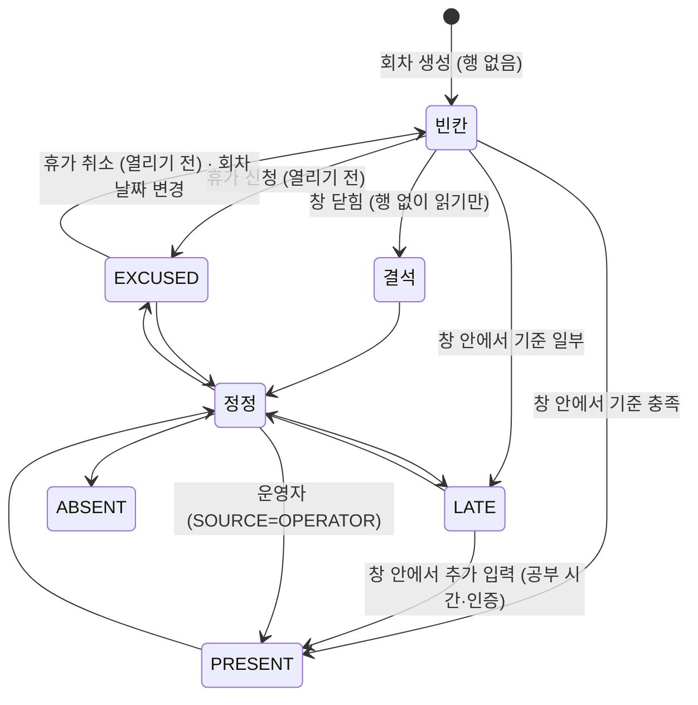
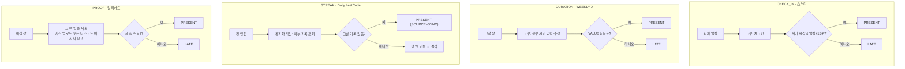
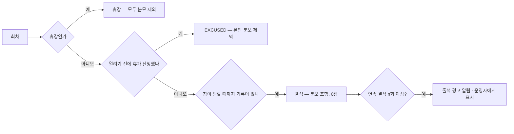

# 출석 — 방식 · 출석 · 불참 · 출석률

> ⚠️ 방식 이름·자리는 먼저 머지된 [출석 방식 제안](../../share/2026-09-27-attendance-mode.md) 과 다르다 — 맞추는 안은 [관계 R1](./README.md#먼저-머지된-것과의-관계--맞춰야-할-곳)

> 작성: 2026-09-28 · 상태: **제안 (미결정)** · 전체 그림은 [README](./README.md), 회차는 [회차](./meeting.md), 지금 구현은 [지금 구현](./as-is.md)
> 화면: [크루 체크인 와이어프레임](../../specs/meeting/wireframes/09-crew-checkin.html) · [운영자 출석 탭 와이어프레임](../../specs/meeting/wireframes/10-attendance-grid.html)
> 관련 ERD: [STUDY_ATTENDANCE](../erd/STUDY_ATTENDANCE.md) · [STUDY_PARTICIPANT](../erd/STUDY_PARTICIPANT.md) · API 정본(현재): [attendance spec](../../specs/attendance/spec.md)

## 한 줄 결론

**출석 칸의 상태 4값(출석·지각·결석·휴가)은 모두가 공유하고, 반마다 "그 4값을 무엇으로 정하나" 만 고른다.**
결석은 저장하지 않는다 — 창이 닫혔는데 칸이 비어 있으면 결석이다.

---

## 1. 모델

### 1-1. 반의 출석 방식 — `STUDY_GROUP`

| 컬럼 | 뜻 |
|---|---|
| `ATTENDANCE_MODE` | `CHECK_IN` · `DURATION` · `STREAK` · `PROOF` |
| `MODE_CONFIG` | 방식별 기준값 (JSON) |

| | 주 1회 스터디 | WEEKLY X | Daily LeetCode | 얼리버드 |
|---|---|---|---|---|
| 방식 | `CHECK_IN` | `DURATION` | `STREAK` | `PROOF` |
| 기준값 | `{lateAfterMin: 15}` | `{targetMin: 60}` | `{provider: "leetcode"}` | `{required: 2}` |
| 창 ([회차](./meeting.md#1-1-반복-일정--meeting_series-신규)) | 20:00부터 120분 | 하루 (00:00부터 1440분) | 하루 | 05:00부터 180분 |

> 클럽 숫자(60분·05~08시·2장)는 예시다. 실제 기준은 각 클럽에서 받는다 ([결정 1](./README.md#사람이-정해야-할-것)).

**방식은 반에 둔다, 프로그램이 아니라.** 클럽 새 기수는 직전 기수의 반을 방식째 복사한다. 기수 중간에 방식을 바꿔도 지난 기수 기록은 그 기수 반의 방식으로 남는다.

### 1-2. 출석 칸 — `STUDY_ATTENDANCE`

회차 × 참가자 한 칸. `UNIQUE(STUDY_MEETING_ID, ACCOUNT_ID)`.

| 컬럼 | 지금 | 제안 | 왜 |
|---|---|---|---|
| `STATUS` | 있음 | 유지 — `PRESENT · LATE · ABSENT · EXCUSED` | 출석률·격자·알림이 한 벌 |
| `SOURCE` | 없음 | 추가 — `SELF · OPERATOR · SYNC · DISCORD` | 동기화·디스코드가 **운영자가 고친 칸을 덮지 않게** |
| `RECORDED_AT` | 없음 | 추가 | 체크인 시각. 회차 시각이 바뀌면 이걸로 다시 판정한다 |
| `VALUE` | 없음 | 추가 (INT, NULL) | `DURATION` 은 분, `PROOF` 는 인증 수 |
| `UPDATED_BY` | 없음 | 추가 | 누가 고쳤나. 정정 이력 테이블은 필요해질 때 |

**`ATTENDANCE_EVIDENCE`** (PROOF 방식만) — 칸 하나에 인증 여러 개. `URL`(업로드한 사진 또는 디스코드 메시지 링크) · `SUBMITTED_AT`. 운영자가 격자에서 칸을 누르면 사진을 볼 수 있어야 정정할 수 있다.

### 1-3. 행은 기록이 생길 때만

지금 코드와 같다. ERD 는 "회차 시작 시 전원 `ABSENT` 행 미리 생성" 을 제안하고 있지만:

- 매일 클럽이면 한 달 × 인원만큼 빈 행이 생긴다.
- 회차 생성·추가·미루기·참가자 합류 때마다 행을 맞춰 넣고 빼는 일이 따라온다.

그래서 **닫힌 회차에 행이 없으면 결석**으로 읽는다. ERD 를 코드 쪽으로 고친다.

---

## 2. 방식별 판정

| 방식 | 크루가 하는 일 | PRESENT | LATE | 결석 |
|---|---|---|---|---|
| `CHECK_IN` | 창 안에서 체크인 버튼 | 체크인 ≤ 열림 + `lateAfterMin` | 그 뒤, 닫히기 전 | 닫힐 때까지 없음 |
| `DURATION` | 그날 공부 시간 입력 (창 안에서 고칠 수 있음) | `VALUE ≥ targetMin` | `0 < VALUE < targetMin` | 입력 없음 |
| `STREAK` | 없음 — 외부 계정만 연결 | 동기화가 그날 기록을 찾음 | — | 못 찾음 |
| `PROOF` | 인증 사진·메시지 링크 제출 | 제출 수 ≥ `required` | `0 < 수 < required` | 제출 없음 |

- 판정은 **서버 시각**으로 한다. 지금 mock 은 브라우저 시계로 판정해서 시계를 돌리면 지각이 출석이 된다.
- `DURATION`·`PROOF` 의 "모자람 = 지각(0.5)" 은 제안이다 ([결정 2](./README.md#사람이-정해야-할-것)).
- 회차에 실제 시작(`START_AT`, 디스코드)이 찍혀 있으면 `CHECK_IN` 의 지각 기준은 `max(SCHEDULED_AT, START_AT) + lateAfterMin` — 반장이 늦게 열었는데 크루가 지각이 되지 않게.

---

## 3. 출석 과정

### 3-1. 한 칸의 한살이



### 3-2. 방식별 흐름



- `STREAK` 은 **창이 닫힌 뒤 한 번** 돈다. `SOURCE=OPERATOR` 칸은 덮지 않는다.
- **"기록 없음" 과 "동기화 실패" 는 다르다.** 외부에 그날 기록이 없으면 결석이다. 우리 쪽 동기화가 실패하면(외부 API 장애) 그 회차의 `SYNCED_AT` 이 비고, 동기화가 성공할 때까지 **그 회차는 닫히지 않은 것**으로 본다 — 전원이 결석으로 잡히지 않는다. 운영자에게 표시하고 재시도한다.
- 디스코드 입구(`/StudyStart`, 채널 인증 사진 수집)는 `SOURCE=DISCORD` 로 **같은 칸에 쓰는 입구가 하나 느는 것**이다. 판정 규칙은 같다.

### 3-3. 누가 어느 칸에 쓰나

| 누가 | 어디서 | 쓸 수 있는 칸 | 쓸 수 있는 때 |
|---|---|---|---|
| 크루 본인 | 내 스터디 | 자기 칸 | 창 안 (휴가는 열리기 전) |
| 동기화 작업 | 서버 | STREAK 반의 칸 | 창이 닫힌 뒤, OPERATOR 칸 제외 |
| 캡틴·네비게이터 | 백오피스 격자 | 담당 반의 모든 칸 | 언제든 |

---

## 4. 불참 과정

불참은 셋으로 갈린다. **회차가 없어졌나, 미리 알렸나, 그냥 안 왔나.**



| 불참 | 누가 | 언제까지 | 기록 | 출석률 |
|---|---|---|---|---|
| 휴가 (사전 불참) | 크루 본인 | 창이 열리기 전. 취소도 그때까지 | `EXCUSED`, `SOURCE=SELF` | 분모에서 뺀다 |
| 사후 사유 인정 | 운영자 | 언제든 | `EXCUSED`, `SOURCE=OPERATOR` | 분모에서 뺀다 |
| 결석 | — | 창이 닫히는 순간 | **행 없음** | 분모 포함, 0 |
| 휴강 | 운영자 | 언제든 | 회차 `CANCELED_AT` | 전원 분모에서 뺀다 |
| 잠시 쉼 | 크루·운영자 | — | 명부 `STATUS=PAUSED` | 쉬는 동안의 회차는 뺀다 ([결정 7](./README.md#사람이-정해야-할-것)) |
| 중도 하차 | 크루·운영자 | — | 명부 `STATUS=WITHDRAWN` | 하차 전 회차까지만 센다. 반 평균에서는 빠진다 ([출석률 §4](./attendance-rate.md#4-보여주기)) |

**출석 경고**는 결석을 저장하지 않아도 만든다. 창이 닫힐 때 "이 회차에 행이 없는 ACTIVE 참가자" 를 조회하면 그게 결석자다.

---

## 5. 출석률

계산 흐름·경계 사례·코드 변경은 [출석률 계산](./attendance-rate.md) 이 정본이다. 요약만:

```
개인 = (PRESENT × 1 + LATE × 0.5) / 센 회차
센 회차 = 닫힌 회차 − 휴강 − 합류 전 − 쉬는 기간 − 하차 뒤 − 휴가
         (STREAK 반은 동기화가 끝나야 닫힌 것으로 본다)
반 평균 = Σ점수 / Σ센 회차  (가중평균)
```

**닫힌 회차만 센다.** 매일 클럽에서 "시작함" 기준을 쓰면 오늘 아침 아직 인증 안 한 사람이 하루 종일 결석으로 보인다.

## 6. 회차가 바뀌면 출석은

출석 칸은 **회차 행에 붙어 있어서 회차가 옮겨지면 같이 따라간다.** 대부분은 그게 맞지만, 날짜에 묶인 기록(휴가)은 따라가면 틀린다.

| 회차 액션 ([회차 §4](./meeting.md#4-회차-액션--일정은-틀어진다)) | 가능한 때 | 칸에 일어나는 일 |
|---|---|---|
| **일정 변경 — 시각만, 같은 날** (늦게 시작) | 예정·열림 | `CHECK_IN` 칸을 `RECORDED_AT` 으로 **다시 판정** — 20:20 체크인은 시작이 20:30 으로 늦춰지면 지각 → 출석. `OPERATOR` 칸은 그대로 |
| **일정 변경 — 날짜** · **미루기** | 예정 (아직 체크인 없음) | 본인이 낸 휴가(`EXCUSED`, `SOURCE=SELF`)는 **푼다** + "일정이 바뀌어 휴가가 취소됐다" 알림. 10/22 사정이 10/29 에도 있다는 보장이 없다. 운영자가 준 휴가는 둔다 ([결정 5](./README.md#사람이-정해야-할-것)) |
| **휴강** | 언제든 | 칸은 지우지 않고 남긴다 — 출석률에서만 빠진다. 휴강을 되돌리면 그대로 살아난다 |
| **되돌리기** | 예정 | 휴강 해제는 칸이 그대로 살아난다. 옮긴 회차를 원래 날짜로 돌리는 것은 날짜 변경과 같다 — 본인 휴가를 푼다 |
| **추가** | — | 새 회차, 칸 없음. 추가한 날짜가 합류 전이면 그 사람에겐 대상이 아니다 |
| **반복 일정 수정·삭제** (이후 · 모두) | — | 기록이 있는 회차는 다시 펼칠 때 빠지므로 영향 없음 |
| **삭제** | 기록 없는 회차만 | 지울 칸이 없다 — 출석 기록이 있으면 삭제가 막힌다 |

```
미루기 예 — 매주 목, 10/22 를 미룸, 수아가 10/22 에 휴가를 냈었다

         10/15   10/22        10/29   11/5 ...
전       출석    [휴가]         ·       ·
후       출석    (회차 없음)   [휴가 풀림 → 빈칸] + 알림
```

---

## 7. API (제안)

| Method | Path | 누가 | 하는 일 |
|---|---|---|---|
| POST | `/api/studies/{studyId}/meetings/{meetingId}/attendance/me` | 크루 본인 | 방식에 맞는 기록 제출 — `CHECK_IN` 은 바디 없음, `DURATION` 은 `{minutes}`, `PROOF` 는 `{evidenceUrl}` |
| PUT / DELETE | `/api/studies/{studyId}/meetings/{meetingId}/leave` | 크루 본인 | 휴가 신청 · 취소 (열리기 전) |
| GET | `/api/studies/{studyId}/attendances` | 기존 | 명부 조회 — 휴강 회차 표시·집계 제외 추가 |
| POST | `/api/studies/{studyId}/attendances` | 기존, 운영자 | 정정 (`SOURCE=OPERATOR`) |

- 크루 입구는 **방식과 무관하게 하나**다. 서버가 반의 방식을 보고 바디를 해석한다 — 화면이 방식마다 다른 엔드포인트를 알 필요가 없다.
- 체크인을 두 번 눌러도 처음 값을 유지한다 (멱등). 출석 뒤 다시 눌러 지각으로 바뀌면 안 된다.
- 크루 입구와 운영자 정정은 권한이 달라 엔드포인트를 나눈다.

## 8. 지금 코드·ERD 와 달라지는 곳

| 무엇 | 지금 | 제안 |
|---|---|---|
| 칸 컬럼 | `STATUS` 만 | `SOURCE · RECORDED_AT · VALUE · UPDATED_BY` 추가 |
| 행 생성 시점 | 코드: 기록 시에만 / ERD: 전원 ABSENT 미리 | 기록 시에만 — ERD 를 고친다 |
| 분모 | 시작한 회차 | 닫힌 회차, 휴강 제외 → [출석률 계산](./attendance-rate.md) |
| PAUSED | 코드: 전 회차 집계 / ERD: 집계 제외 | 쉬는 기간만 제외 |
| 크루 체크인 | localStorage, 브라우저 시계 | API, 서버 시각 |
| 판정 로직 위치 | [AttendanceRateCalculator](../../backend/api/src/main/java/com/studyclub/api/attendance/AttendanceRateCalculator.java) (률만) | 방식별 판정도 서버 한 곳 |
