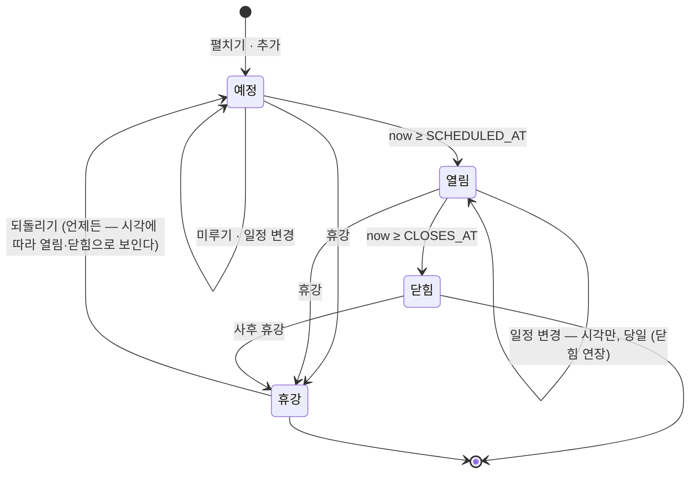
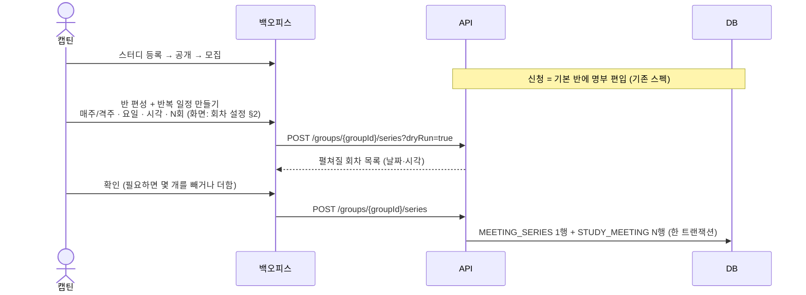
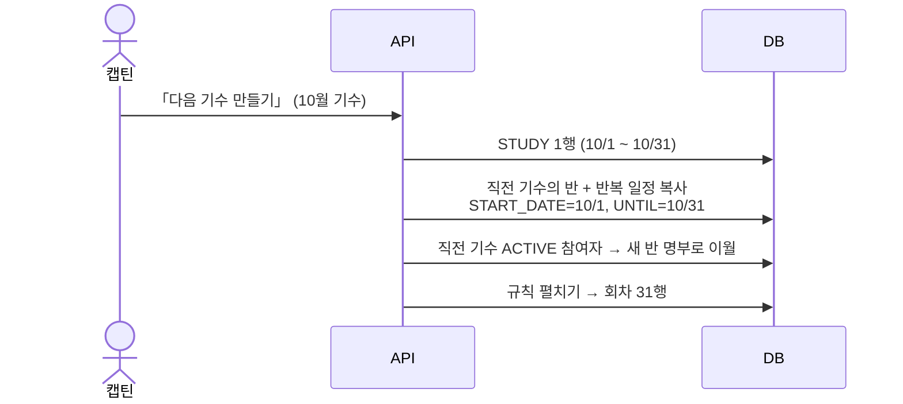
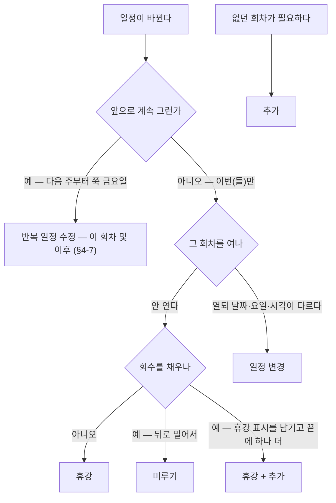
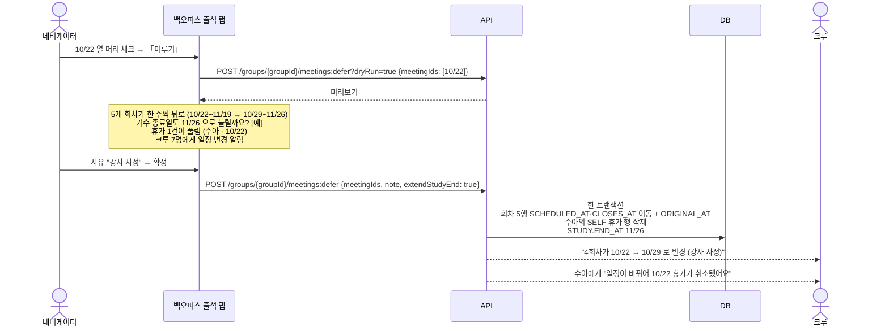

# 회차 — 규칙 · 생성 · 변경

> 작성: 2026-09-28 · 상태: **제안 (미결정)** · 전체 그림은 [README](./README.md), 출석은 [출석](./attendance.md), 화면은 [회차 설정 UI](./meeting-ui.md)
> 관련 ERD: [STUDY_GROUP](../erd/STUDY_GROUP.md) · [STUDY_MEETING](../erd/STUDY_MEETING.md)

## 한 줄 결론

**반복 일정은 회차를 펼칠 때(그리고 미룰 때)만 쓴다. 펼친 뒤로는 회차 행이 진실이다.** 조작은 구글 캘린더처럼 — 반복 일정은 범위(이 회차만 · 이후 · 모두)를 골라 고치고, 회차는 하나씩 옮기고 지운다.
매주·격주·주 2회·매일은 반복 일정으로, 월 1회·불규칙은 날짜를 하나씩 추가해서 만든다. 일정이 틀어지면 반복 일정을 고치지 않고 **회차 액션**으로 회차 행을 고친다 — **휴강 · 미루기 · 일정 변경 · 추가 · 되돌리기 · 삭제** ([§4-2](#4-2-액션-정의)). "앞으로 계속" 바뀌는 것만 반복 일정 수정이다. 화면은 [회차 설정 UI](./meeting-ui.md).

---

## 1. 모델

### 1-1. 반복 일정 — `MEETING_SERIES` (신규)

구글 캘린더의 반복 일정과 같은 것이다. **반 하나에 여러 개** 있을 수 있다 — 정규 화요일 + 격주 토요일 특강, 또는 "이 회차 및 이후" 수정으로 둘로 나뉜 경우.

| 컬럼 | 뜻 | 예 |
|---|---|---|
| `STUDY_GROUP_ID` | 어느 반 | |
| `WEEKDAYS` | 요일 집합 | `THU` · `TUE,THU` · `MON..SUN` |
| `INTERVAL_WEEKS` | 몇 주마다 | `1` 매주 · `2` 격주 |
| `START_DATE` | 첫 회차 날짜. **격주의 기준 주**도 여기서 정해진다 | `2026-10-03` |
| `COUNT` | 몇 회 — 스터디 | `8` |
| `UNTIL` | 언제까지 — 클럽 월 기수 | `2026-10-31` |
| `START_TIME` | 창이 열리는 시각 (TIME) | `20:00` |
| `WINDOW_MIN` | 창 길이 (분) | `120` · 하루 `1440` |

반(`STUDY_GROUP`)에 남는 것:

| 컬럼 | 뜻 |
|---|---|
| `TIMEZONE` | 반의 시간대 (IANA). 반의 모든 반복 일정과 단건 회차가 이 시간대로 펼쳐진다 — 이미 있는 컬럼 |
| `ATTENDANCE_MODE` · `MODE_CONFIG` | 출석 방식 → [출석 §1](./attendance.md#1-모델) |

- `COUNT` 와 `UNTIL` 은 **둘 중 하나만** 쓴다. 이게 [미루기](#4-5-미루기--여러-날을-비우고-뒤로) 동작을 가른다 — "8회 과정" 은 미루면 끝이 늘어나고, "10월 한 달" 은 미루면 넘친 회차가 떨어진다.
- **왜 반에 두지 않고 따로 떼나.** 반에 규칙 하나를 두면 "이 회차 및 이후 금요일로" 를 표현할 수 없다 — 과거 목요일과 미래 금요일이 한 반에 공존해야 한다. 캘린더가 반복 일정을 둘로 쪼개는 것과 같은 방식이다.
- 지금 엔티티의 `STUDY_GROUP.START_AT`(Instant) 은 반복 일정의 `START_TIME` 으로 옮기고 지운다.

### 1-2. 회차 — `STUDY_MEETING`

**회차 = 출석을 받는 창 하나.**

| 컬럼 | 지금 | 제안 | 왜 |
|---|---|---|---|
| `SERIES_ID` | 없음 | **추가** — 어느 반복 일정에서 나왔나. 단건 회차는 NULL | 범위 수정(이 회차 및 이후 · 모든 회차)이 어느 회차를 건드리는지 안다 |
| `SCHEDULED_AT` | 있음 | 창 열림 (UTC) | |
| `CLOSES_AT` | 없음 | **추가** — 창 닫힘 (UTC) | 규칙이 나중에 바뀌어도 지난 회차의 마감은 그대로여야 한다 |
| `ORIGINAL_AT` | 없음 | **추가** — 처음 펼쳤을 때의 시각. 옮긴 적 없으면 NULL | "10/22 → 10/29 변경" 표시 · 이 값이 있으면 **반복 일정에서 떨어져 나온 예외** — 반복 일정을 고쳐도 건드리지 않는다 |
| `CANCELED_AT` | 없음 | **추가** — 휴강 | 분모에서 뺀다 |
| `SYNCED_AT` | 없음 | 추가 — STREAK 반만. 외부 기록 동기화가 끝난 시각 | 동기화 실패를 결석으로 만들지 않는다 ([출석률 §1](./attendance-rate.md#1-회차-하나를-셀까-말까--칸-판정)) |
| `CHANGE_NOTE` | 없음 | 추가 — 변경·휴강 사유 (선택) | 크루 화면에 "강사 사정으로 미룸" |
| `START_AT` / `END_AT` | 있음 | 유지 — 실제 시작·종료 (디스코드가 채움, 선택) | 지각 기준 → [출석 §2](./attendance.md#2-방식별-판정). ⚠️ 디스코드 출석은 이 값으로 진행 중을 판정한다 — [관계 R2](./README.md#먼저-머지된-것과의-관계--맞춰야-할-곳) |

**회차 번호(N회차)는 저장하지 않는다.** 취소 안 된 회차를 날짜순으로 세서 읽을 때 붙인다. 저장하면 휴강·미루기·일정 변경 때마다 뒤 번호를 전부 고쳐야 한다.

### 1-3. 회차 상태 (저장하지 않고 계산)



| 상태 | 조건 |
|---|---|
| 휴강 | `CANCELED_AT IS NOT NULL` |
| 예정 | `now < SCHEDULED_AT` |
| 열림 | `SCHEDULED_AT ≤ now < CLOSES_AT` |
| 닫힘 | `now ≥ CLOSES_AT` |

---

## 2. 반복 규칙 — 무엇을 표현하나

| 일정 | 표현 | 반복 일정 |
|---|---|---|
| 매주 목 | 반복 | `THU` · 1주 |
| 주 2회 화·목 | 반복 | `TUE,THU` · 1주 |
| **격주 토** | 반복 | `SAT` · **2주** |
| 격주 화·목 | 반복 | `TUE,THU` · 2주 — 한 주는 화·목 둘 다, 다음 주는 쉼 |
| 매일 | 반복 | `MON..SUN` · 1주 |
| 평일만 | 반복 | `MON..FRI` · 1주 |
| 매월 첫째 토 · 불규칙 · 한 번뿐인 특강 | 단건 회차 | 달력에서 날짜를 눌러 하나씩 추가 (`SERIES_ID = NULL`) |

**월 단위 반복("매월 첫째 토")을 규칙으로 만들지 않는다.** 캘린더 표준(RRULE)을 쓰면 표현은 되지만 라이브러리가 하나 들어오고, 운영자는 1년에 몇 번 쓰지 않는다. 한 기수에 3~4번이면 달력에서 고르는 게 빠르다.

### 격주의 기준 주

격주는 "몇 번째 주를 쉬나" 가 정해져야 한다. **`START_DATE` 가 있는 주가 0주차**이고, 거기서 `INTERVAL_WEEKS` 배수인 주만 모인다.

```
START_DATE = 10/3(토), 격주 토, 6회

주차   0      1      2      3      4      5      6      7      8      9     10
날짜  10/3  (10/10) 10/17 (10/24) 10/31 (11/7) 11/14 (11/21) 11/28 (12/5) 12/12
       ●             ●             ●             ●             ●             ●
```

---

## 3. 만들어지는 과정

### 3-1. 스터디 — 반 편성 뒤 반복 일정을 만들면 펼쳐진다



### 3-2. 클럽 — 다음 기수를 만들면 같이 펼쳐진다

클럽은 기수가 **한 달** 단위로 이어지고, 이전 기수 참여자는 다시 신청하지 않는다 ([STUDY](../erd/STUDY.md#참여-신청--프로그램-종류에-따라-다르다)).



### 3-3. 펼치기 (공통)

```
d = START_DATE
anchor = d 가 속한 주의 월요일
while (COUNT 미달) and (d ≤ UNTIL):
    주차 = (d − anchor) / 7
    if d 의 요일 ∈ WEEKDAYS and 주차 % INTERVAL_WEEKS == 0:
        열림 = ZonedDateTime(d, START_TIME, 반.TIMEZONE) → UTC
        insert STUDY_MEETING(SERIES_ID, SCHEDULED_AT=열림, CLOSES_AT=열림+WINDOW_MIN)
    d += 1일
```

| 예 | 결과 |
|---|---|
| 매주 목 20:00 KST · 10/1부터 8회 | 10/1 · 8 · 15 · 22 · 29 · 11/5 · 12 · 19 — 매번 11:00Z ~ 13:00Z |
| 격주 토 10:00 KST · 10/3부터 6회 | 10/3 · 17 · 31 · 11/14 · 28 · 12/12 |
| 격주 화·목 · 10/6부터 6회 | 10/6 · 8 · 20 · 22 · 11/3 · 5 |
| 화·목 21:00 PT · 10/27부터 6회 | 10/27 · 29 · 11/3 · 5 · 10 · 12. 서머타임이 끝나는 11/1 전은 다음날 04:00Z, 뒤는 05:00Z |
| 매일 00:00 KST · 1440분 · 10/1~10/31 | 31회. 매일 전날 15:00Z ~ 당일 15:00Z |

- **시간대는 날짜마다 UTC 로 바꾼다.** 오프셋을 한 번 구해 더하면 서머타임 경계에서 한 시간 밀린다.
- 기수에 끝이 있으니 **끝까지 한 번에** 펼친다. cron 이 필요 없다. 끝이 없는 기수가 실제로 생기면 그때 "앞으로 4주 유지" 작업을 붙인다.
- 단건 회차는 펼치기가 없다 — 날짜 하나에 한 행.

---

## 4. 회차 액션 — 일정은 틀어진다

**반복 일정을 고치지 않고 회차 행을 고친다.** "이번만 다르다" 를 반복 일정에 예외로 쌓으면 반복 일정과 실제 회차가 어긋난다. 고친 회차는 `ORIGINAL_AT` 이 찍혀 **예외**가 된다 — 캘린더에서 반복 일정 하나만 옮긴 것과 같다.

### 4-1. 먼저 가른다 — 이번만인가, 앞으로 계속인가



### 4-2. 액션 정의

| 액션 | 정의 | 고를 수 있는 회차 | 회수 | 뒤 일정 |
|---|---|---|---|---|
| **휴강** | 고른 회차를 **열지 않는다.** 행은 남고 "휴강" 으로 보인다 | **여러 개** | 준다 | 그대로 |
| **미루기** | 고른 날을 비우고, 그 날부터의 회차를 **규칙의 다음 자리로 한 칸씩** 민다 | **여러 개** (모두 예정) | 그대로 | 뒤로 밀린다 · 끝이 늘어난다 |
| **일정 변경** | 고른 회차의 날짜·요일·시각을 바꾼다 | 날짜를 바꾸면 **하나**, 시각만 바꾸면 **여러 개** | 그대로 | 그대로 |
| **추가** | 규칙에 없는 회차를 하나 만든다 (보강·특강) | — | 는다 | 그대로 |
| **되돌리기** | 휴강을 풀거나, 옮긴 회차를 원래 날짜·시각(`ORIGINAL_AT`)으로 | 하나씩 | — | — |
| **삭제** | 행을 **지운다.** 크루에게 흔적이 안 남는다 — **잘못 만든 회차**용 | 여러 개 (출석 기록 없는 것만) | 준다 | 그대로 |

- "당일 지연"·"연기" 는 따로 두지 않는다 — 둘 다 **일정 변경**이다. 출석에 미치는 영향은 "날짜가 바뀌었나" 로 갈린다 ([출석 §6](./attendance.md#6-회차가-바뀌면-출석은)).
- "밀기" 는 **미루기**로 부른다.
- **휴강과 삭제를 가른다.** 캘린더의 "삭제" 는 흔적 없이 사라지지만, 수업을 안 하는 것은 크루가 알아야 하고 기록이 남아야 한다. 화면의 기본 동작은 휴강이고, 삭제는 기록이 없는 회차에만 연다.
- 화면 용어와 API 용어를 같게 쓴다: 휴강 `cancel` · 미루기 `defer` · 일정 변경 `reschedule` · 추가 `add` · 되돌리기 `restore` · 삭제 `delete`.

### 4-3. 언제 무엇을 할 수 있나

| 회차 상태 | 휴강 | 미루기 | 일정 변경 | 되돌리기 |
|---|---|---|---|---|
| 예정 | ✓ | ✓ | ✓ | ✓ |
| 열림 | ✓ (체크인한 사람이 있으면 경고) | ✗ | **시각만**, 같은 날 안에서 (늦게 시작) | ✗ |
| 닫힘 | ✓ (사후 휴강 — 분모에서 뺀다) | ✗ | ✗ | — (옮길 수 없으니 되돌릴 일정도 없다) |
| 휴강 | — | ✗ | ✗ | ✓ 언제든. 닫힌 회차면 "빈칸 n명이 결석으로 잡힌다" 경고 |

- **미루기는 반복 일정에서 나온 회차에만.** "다음 자리" 를 반복 일정이 알려줘야 한다. 단건 회차는 일정 변경으로 옮긴다.
- **체크인 기록이 있는 회차는 다른 날로 옮길 수 없다.** 그 체크인은 그날 한 것이다.

### 4-4. 휴강 — 여러 날 한꺼번에

격자 열 머리에서 회차를 여러 개 체크 → 「휴강」 → 사유 한 번 입력.

```
예) 추석 연휴 10/1 · 10/8 둘 다 휴강 (매주 목 8회)
    ~~10/1~~ · ~~10/8~~ · 10/15 · 10/22 · 10/29 · 11/5 · 11/12 · 11/19   → 6회
```

- `CANCELED_AT` + `CHANGE_NOTE`. 행은 지우지 않는다 — 크루 화면에 "휴강" 이 보여야 하고 되돌릴 수 있어야 한다.
- 번호는 휴강을 빼고 세므로 뒤 번호가 당겨진다 (10/15 가 1회차).
- 휴강한 회차의 출석 칸은 남기고 출석률에서만 뺀다.

### 4-5. 미루기 — 여러 날을 비우고 뒤로

```
1. 고른 날 중 가장 이른 날 = 기점
2. 움직일 회차 = 기점 이후, **같은 반복 일정**의 예정 회차 (휴강·단건·다른 반복 일정 회차는 제자리)
3. 자리 = 규칙을 기점부터 다시 펼친 날짜들 − 고른 날
4. 움직일 회차를 날짜순으로 자리에 하나씩 배정
```

| 예 (고른 날) | 결과 | 끝 |
|---|---|---|
| 매주 목 8회 · **10/22** | 10/1 · 8 · 15 · **29 · 11/5 · 12 · 19 · 26** | 11/19 → 11/26 |
| 매주 목 8회 · **10/22, 10/29** (두 주 연속) | 10/1 · 8 · 15 · **11/5 · 12 · 19 · 26 · 12/3** | → 12/3 |
| 매주 목 8회 · **10/22, 11/5** (띄엄띄엄) | 10/1 · 8 · 15 · **29 · 11/12 · 19 · 26 · 12/3** | → 12/3 |
| 화·목 6회 · **11/3** | 10/27 · 29 · **11/5 · 10 · 12 · 17** | 11/12 → 11/17 |
| 화·목 6회 · **11/3, 11/5** (그 주 통째로) | 10/27 · 29 · **11/10 · 12 · 17 · 19** | → 11/19 |

- 여러 날을 고르는 것으로 "몇 칸" 이 정해진다. 칸 수를 따로 입력하지 않는다.
- 규칙 끝이 넘어갈 때:

| 규칙 끝 | 미뤘을 때 |
|---|---|
| `COUNT` (스터디 8회) | 끝이 늘어난다. 기수 종료일(`STUDY.END_AT`)도 늘릴지 묻는다 |
| `UNTIL` (클럽 10월) | 기수 밖으로 나가는 회차는 **떨어진다.** 미리보기에 "2회가 기수 밖으로 나가 삭제됨" |

- 움직인 회차는 모두 `ORIGINAL_AT` 이 채워진다 → 크루에게 "일정 변경" 알림 한 번.
- 당기기(앞으로)는 두지 않는다. 필요하면 일정 변경으로 하나씩.

### 4-6. 일정 변경 — 특정 회차만 요일·날짜·시각이 다르다

| 무엇을 바꾸나 | 고르는 수 | 예 |
|---|---|---|
| **날짜** (요일이 바뀌는 것 포함) | 하나 | 10/22(목) → 10/24(토). 강사 일정 때문에 이번만 토요일 |
| **시각만** | 여러 개 | 11월 회차 4개만 20:00 → 21:00. 선택한 회차에 같은 시각을 적용 |
| **시각만, 당일** | 하나 (열림도 가능) | 오늘 30분 늦게 시작. 닫힘도 30분 늦춘다 |

- `SCHEDULED_AT` · `CLOSES_AT` 을 바꾸고 `ORIGINAL_AT` 에 원래 값을 남긴다. 창 길이는 반복 일정의 `WINDOW_MIN` 그대로.
- 시각은 **반 시간대** 기준으로 받고 날짜마다 UTC 로 바꾼다 — 11월 회차 4개를 21:00 으로 바꾸면 서머타임 앞뒤로 UTC 가 다를 수 있다.
- 다른 회차와 겹쳐도 막지 않는다 (같은 날 2회는 실제로 있다). 미리보기에 경고만.
- 날짜가 바뀌어 다른 회차를 건너뛰면 번호가 바뀐다. 화면에 "4회차 (10/22 → 10/24)".
- 당일에 늦게 시작하면 이미 체크인한 사람의 판정을 체크인 시각으로 **다시 계산한다** — 20:20 체크인은 시작이 20:30 이 되면 지각 → 출석.
- "매주 이 시각으로" 가 되면 일정 변경이 아니라 반복 일정 수정(이 회차 및 이후)이다. 같은 시각 변경을 3번 넘게 하고 있으면 그쪽을 안내한다.

### 4-7. 추가 · 반복 일정 수정·삭제 — 범위를 고른다

**추가** — 달력의 빈 날짜를 눌러 한 행 (`SERIES_ID = NULL`). "휴강 + 추가" 는 미루기와 결과가 비슷하지만 **휴강한 회차가 목록에 남는다.**

**반복 일정 수정·삭제** — 반복 일정에서 나온 회차의 요일·시각·끝을 바꾸거나 지울 때, 캘린더처럼 **범위**를 묻는다.

| 범위 | 수정하면 | 삭제하면 |
|---|---|---|
| **이 회차만** | = 일정 변경 (예외가 된다) | = 휴강 (기록 없으면 삭제도 고를 수 있다) |
| **이 회차 및 이후** | 반복 일정을 **둘로 나눈다** — 기존 것은 이 회차 전날까지(`UNTIL`), 새 것은 이 회차부터 새 규칙으로. 이후 회차를 새 반복 일정으로 다시 펼친다 | 반복 일정을 **이 회차 전날에 끝낸다.** 이후 회차는 휴강(기록 있음) 또는 삭제(기록 없음) — 조기 종료 |
| **모든 회차** | 반복 일정의 규칙을 바꾸고 **미래 회차만** 다시 펼친다 | 미래 회차를 지운다. 지난 회차는 남는다 |

어느 범위든 다시 펼칠 때 **건드리지 않는 회차**가 있다. 캘린더와 가장 크게 다른 점이다.

| 회차 | 처리 | 왜 |
|---|---|---|
| 열렸거나 닫힌 회차 | 그대로 | 출석 기록이 붙어 있다. 캘린더의 "모든 일정" 은 과거도 바꾸지만 여기선 안 된다 |
| 예외 (`ORIGINAL_AT` 있음) · 휴강 | 그대로 | 운영자가 일부러 고친 것이다 |
| 출석 기록(휴가 포함)이 있는 미래 회차 | 그대로 — 남긴 개수를 미리보기에 알린다 | |
| 나머지 미래 회차 | 지우고 다시 펼친다. `COUNT` 면 남은 회수만큼 | |

예 — 매주 목 8회(10/1~11/19), 11/5 에서 "이 회차 및 이후 금요일 20:00 으로":

```
기존 반복 일정  목 · 10/1 ~ 11/4(UNTIL) → 10/1 · 8 · 15 · 22 · 29         (5회)
새 반복 일정    금 · 11/6 부터 COUNT 3    → 11/6 · 13 · 20                   (3회)
```

같은 요청을 두 번 보내도 결과가 같다 (멱등).

### 4-8. 시나리오 — 주 1회 스터디, 한 주 쉬기

> 매주 목 20:00 · 8회 과정 · 10/1 시작. 10/20(화)에 네비게이터가 "이번 주 목요일(10/22)은 쉰다" 고 정했다.
> 수아는 10/22 휴가를 이미 내 두었다.

#### ① 고른다

| 액션 | 결과 회차 | 회수 | 종료 | 크루 화면의 10/22 |
|---|---|---|---|---|
| **미루기** | 10/1 · 8 · 15 · **29 · 11/5 · 12 · 19 · 26** | 8 | 11/19 → **11/26** | 칸이 없다. 4회차에 "원래 10/22" |
| **휴강** | 10/1 · 8 · 15 · ~~22~~ · 29 · 11/5 · 12 · 19 | **7** | 11/19 | "휴강" 칸이 남는다 |
| **휴강 + 추가** | 10/1 · 8 · 15 · ~~22~~ · 29 · 11/5 · 12 · 19 · **26** | 8 | 11/26 | "휴강" 칸이 남는다 |

#### ② 미루기 — 누가 무엇을 누르나



#### ③ DB 에서 바뀌는 것

| 회차 행 | 전 `SCHEDULED_AT` | 후 `SCHEDULED_AT` | `ORIGINAL_AT` | 번호 (계산) |
|---|---|---|---|---|
| A | 10/1 | 10/1 | — | 1 |
| B | 10/8 | 10/8 | — | 2 |
| C | 10/15 | 10/15 | — | 3 |
| D | 10/22 | **10/29** | 10/22 | 4 |
| E | 10/29 | **11/5** | 10/29 | 5 |
| F | 11/5 | **11/12** | 11/5 | 6 |
| G | 11/12 | **11/19** | 11/12 | 7 |
| H | 11/19 | **11/26** | 11/19 | 8 |

- **행은 옮겨질 뿐 새로 만들거나 지우지 않는다.** D 에 붙은 수아의 휴가는 D 를 따라 10/29 로 가게 되므로, 본인 휴가만 골라 푼다 ([출석 §6](./attendance.md#6-회차가-바뀌면-출석은)).
- 출석률은 변하지 않는다 — 움직인 회차는 모두 아직 열리지 않았다.
- 나중에 반복 일정을 고쳐 다시 펼쳐도 `ORIGINAL_AT` 이 찍힌 D~H 는 건드리지 않는다.

#### ④ 크루에게 보이는 것

| 화면 | 전 | 후 |
|---|---|---|
| 내 스터디 · 다음 회차 | 4회차 10/22(목) 20:00 | 4회차 **10/29(목)** 20:00 · `일정 변경` 배지 · "강사 사정" |
| 출석 격자 | 10/22 칸에 휴가 | 10/22 열이 없다. 10/29 열 머리에 "원래 10/22" |
| 완주 점수판 | n / 8 | n / 8 (그대로) |

#### ⑤ 다른 경우

| 상황 | 액션 |
|---|---|
| 10/22 · 10/29 두 주를 쉰다 | 두 날을 골라 미루기 → 끝 12/3 |
| 10/22 만 토요일(10/24)로 | 일정 변경 (날짜) — 뒤 회차는 그대로 |
| 10/22 당일 19:00 에 정해졌다 (아직 예정) | 미루기 가능 — 알림이 늦으니 디스코드 공지도 같이 |
| 10/22 21:00, 이미 열렸고 몇 명이 체크인했다 | 미루기 불가. **휴강** 하면 체크인한 칸은 남고 출석률에서만 빠진다. 8회를 채우려면 끝에 **추가** |
| 10/22 오늘 30분 늦게 시작 | 일정 변경 (시각만, 당일) |

---

## 5. API

정본은 [meeting spec](../../specs/meeting/spec.md). 액션과 엔드포인트의 짝만 적는다.

| 액션 | 엔드포인트 |
|---|---|
| 달력 조회 | `GET …/groups/{groupId}/meetings` |
| 반복 일정 만들기 | `POST …/groups/{groupId}/meeting-series` |
| 반복 일정 수정 (이후 · 모두) | `PATCH …/meeting-series/{seriesId}` |
| 반복 일정 끝내기·삭제 (이후 · 모두) | `DELETE …/meeting-series/{seriesId}` |
| 추가 | `POST …/groups/{groupId}/meetings` |
| 일정 변경 (하나) · 되돌리기(원래 일정으로) | `PATCH …/meetings/{meetingId}` |
| 휴강 · 휴강 되돌리기 · 시각 변경 (여러 개) | `PATCH …/groups/{groupId}/meetings` |
| 미루기 | `POST …/groups/{groupId}/meeting-deferrals` |
| 삭제 | `DELETE …/groups/{groupId}/meetings?ids=` |

- 여러 행을 바꾸는 것은 `?dryRun=true` 로 영향 요약을 먼저 받는다. 크루 알림은 확정 뒤에만, 요청당 한 번.
- 클럽 다음 기수(반·반복 일정 복사 + 명부 이월 + 펼치기)는 스터디 등록 API 쪽 — [study spec](../../specs/study/spec.md) 에 추가 필요.

## 6. 리스크

| 리스크 | 영향 | 대응 |
|---|---|---|
| 반복 일정 수정이 운영자가 고친 회차를 덮음 | 옮겨 둔 회차가 원래 날짜로 돌아감 | `ORIGINAL_AT` 이 있으면 건드리지 않는다 |
| 서머타임을 한 번만 계산 | 미주반 회차가 11월부터 1시간 밀림 | 날짜마다 UTC 변환. 경계 테스트 |
| 미루기·휴강을 잘못 누름 | 여러 회차가 한꺼번에 바뀌고 알림이 나감 | `dryRun` 미리보기 필수. 알림은 확정 뒤에만. 되돌리기 제공 |
