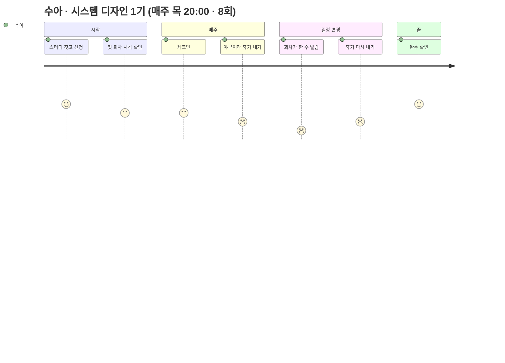
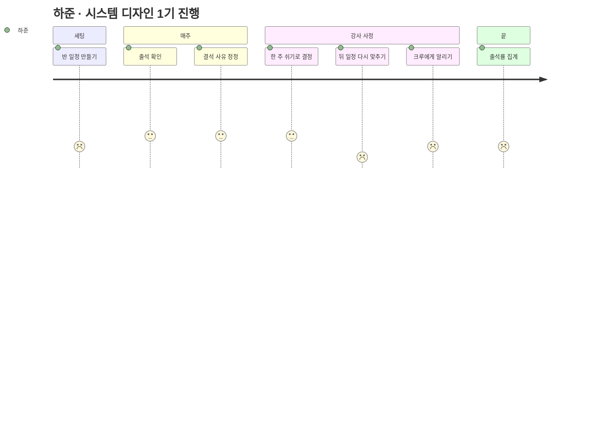
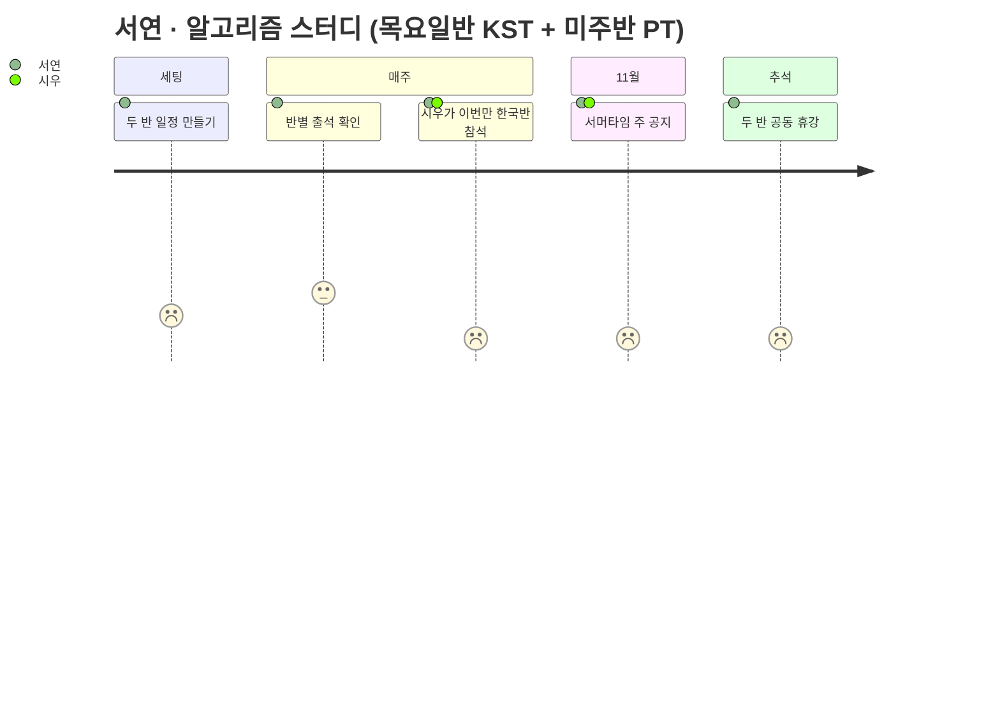
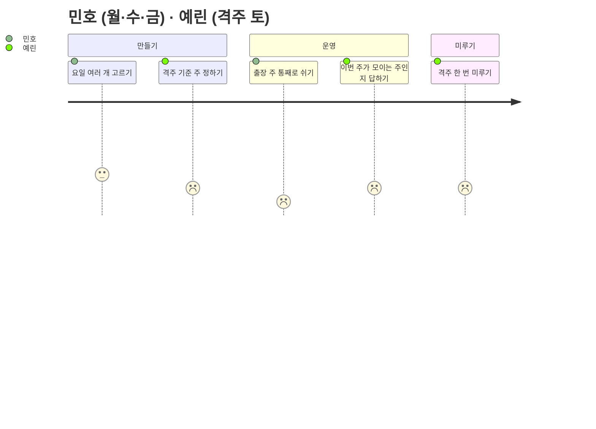
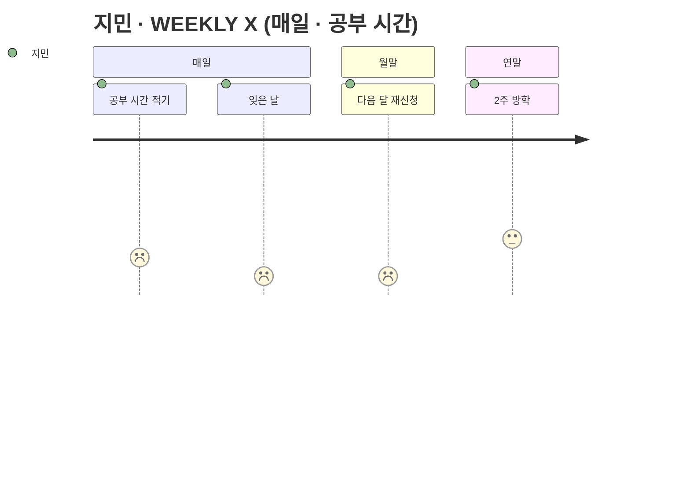
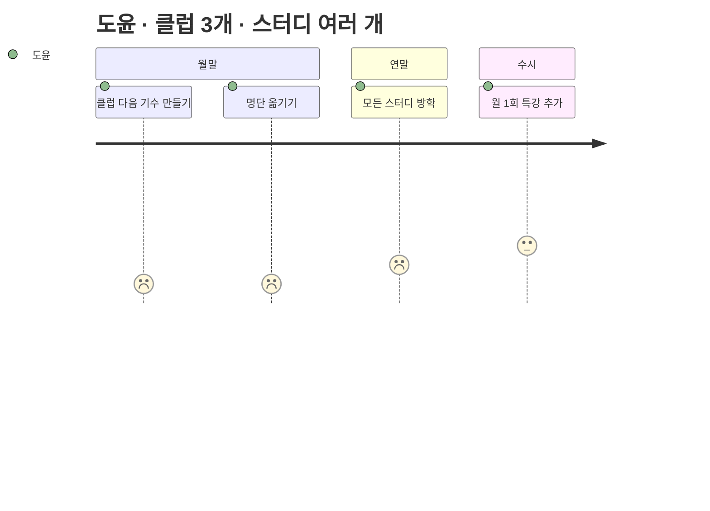

# 사용자 여정 — 일정 패턴별

> 작성: 2026-09-28 · 상태: **제안** · 사람은 [personas](./personas.md), 조합은 [조합표](./combinations.md)
> 표의 「화면」 번호는 [와이어프레임](../../specs/meeting/wireframes/index.html). 그림의 점수는 **지금(시트·디스코드)** 기준 만족도 1~5 — 낮은 곳이 이 기능이 풀어야 할 곳이다.

## 한 줄

여섯 여정 모두 **가장 낮은 점수가 "일정이 바뀌는 순간"** 에 있다 — 쉬기·미루기·기수 넘김. 평소 출석은 지금도 그럭저럭 된다. 그래서 회차 액션(휴강·미루기·기간 쉬기·다음 기수)과 그 알림이 핵심이다.

| 여정 | 누구 | 패턴 | 가장 아픈 순간 | 푸는 화면 |
|---|---|---|---|---|
| J1 | 수아 (크루) | A 주 1회 | 휴가 낸 회차가 옮겨졌는데 모름 | 08 · 09 |
| J2 | 하준 (네비게이터) | A 주 1회 | 한 주 쉬고 8회 채우기 | 06 · 07 |
| J3 | 서연 (네비게이터) + 시우 | B 분반 | 두 반 공동 휴강 · 서머타임 | 11 · 14 |
| J4 | 민호 · 예린 (네비게이터) | C 여러 요일 · D 격주 | "한 칸" 이 한 주가 아님 · 어느 주가 모이는 주인지 | 12 |
| J5 | 지민 (크루) | E 매일 | 매일 기록의 번거로움 · 월 바뀔 때 재신청 | 13 · 15 |
| J6 | 도윤 (캡틴) | E · F | 월 기수 전환 · 연말 방학 | 14 · 15 |

---

## J1. 수아 — 주 1회 스터디 크루

| 단계 | 하는 일 | 화면 | 지금의 페인 | 바뀌는 것 |
|---|---|---|---|---|
| 첫 회차 전 | 다음 회차 시각 확인 | 09 ① | 디스코드 공지를 찾아 올라간다 | 카드에 「4회 · 오늘 20:00 · 2시간 뒤」 |
| 매주 | 체크인 | 09 ②~④ | 반장이 불러야 출석 | 누른 시각으로 출석·지각이 갈린다 |
| 야근 | 휴가 | 09 ⑤ | 반장에게 DM | 버튼 하나. 출석률에서 빠진다 |
| 일정 변경 | 알림 받기 | 08 | 모른다 — 10/22 에 들어갔다가 아무도 없음 | 「4회 10/22 → 10/29」 + 「휴가가 취소됐어요」 |
| 끝 | 완주 확인 | 08 회차 목록 | 시트에서 내 행 찾기 | n/8 |

## J2. 하준 — 주 1회 스터디 네비게이터

| 단계 | 하는 일 | 화면 | 지금의 페인 | 바뀌는 것 |
|---|---|---|---|---|
| 세팅 | 반복 일정 만들기 | 04 | 시트에 날짜 8칸 손으로 | 요일·시각·8회 → 미리보기 → 확정 |
| 매주 | 진행 중 회차 확인 | 10 ① | 끝나고 한꺼번에 기록 | 체크인이 실시간으로 격자에 |
| 정정 | 결석 → 사유 인정 | 10 ④ | 시트 칸 수정, 이력 없음 | ✎ 표시, 자동 입력이 덮지 않음 |
| 강사 사정 | 10/22 쉬고 8회 채우기 | 02 → 06 → 07 | 뒤 5칸 날짜를 손으로 밀고 출석 칸도 옮김 | 「여기서부터 미루기」 한 번 + 영향 요약 |
| 알림 | 크루에게 공지 | 06 | 디스코드 공지 따로 | 확정하면 7명에게 1건 |
| 끝 | 출석률 | 10 | 수식 복붙 | 닫힌 회차만 자동 집계 |

## J3. 서연 — 분반 2개 네비게이터

> 함께 보는 사람: 시우 (미주반 크루)

| 단계 | 하는 일 | 화면 | 지금의 페인 | 바뀌는 것 |
|---|---|---|---|---|
| 세팅 | 반마다 반복 일정 | 11 | 반마다 시트 | 반 전환 → 각각 만들기. 반마다 시간대 |
| 매주 | 반별 출석 | 10 (반 선택) | 시트 두 개 왕복 | 반 드롭다운 |
| 이번만 다른 반 | 시우가 목요일반 회차에 참석 | 11 | 어느 시트에 적을지 애매 | 「이번 주 다른 반으로」 — [결정 11](../flows/README.md#사람이-정해야-할-것) |
| 서머타임 | 미주반 시각 | 09 (자기 반 시간대) | 한국 시각 공지를 보고 한 시간 틀림 | 크루는 자기 반 시간대로, 날짜마다 UTC 변환 |
| 추석 | 두 반 같은 주 휴강 | 11 · 14 | 반마다 따로 | 「이 기수의 모든 반」 체크 → 한 번에 |

## J4. 민호 — 월·수·금 네비게이터 / 예린 — 격주 네비게이터

| 단계 | 누가 | 하는 일 | 화면 | 핵심 |
|---|---|---|---|---|
| 만들기 | 민호 | 월·수·금 · 4주 → 12회 | 04 | 요일 칩 3개 |
| 만들기 | 예린 | 격주 토 · 6회 | 12 | **첫 회차가 있는 주가 0주차** — 미리보기에 쉬는 주를 흐리게 |
| 출장 | 민호 | 11/2 주 통째로 쉬고 뒤로 | 12 | 「이번 주 전체 선택」 → 미루기. 한 칸씩이면 수→금으로 가서 헷갈린다 |
| 문의 | 예린 | "이번 주야?" | 09 ① | 크루 카드에 다음 회차 날짜가 박혀 있다 |
| 미루기 | 예린 | 한 번 미루면 | 12 | 한 칸 = **2주 뒤**. 영향 요약에 "격주라 2주 뒤로" |

## J5. 지민 — 매일 클럽 크루

| 단계 | 하는 일 | 화면 | 지금의 페인 | 바뀌는 것 |
|---|---|---|---|---|
| 매일 | 공부 시간 입력 | 09 (클럽) · 13 | 시트에서 내 행·오늘 열 찾기 | 카드에 숫자 하나 → 저장. 자정 전까지 고침 |
| 잊은 날 | — | 13 | 결석인지 0분인지 애매 | 닫힌 날 빈칸 = 결석. 휴가였다면 운영자 정정 |
| 월말 | 다음 기수 | 15 | 다시 신청 · 시트 새로 | **자동 이월** — 아무것도 안 해도 11월 명부에 |
| 연말 | 방학 | 14 | 공지로만 | 12/22~1/4 휴강이 달력·카드에 보인다 |

**거부 조건**: 시트보다 한 번이라도 더 누르면 안 쓴다. 카드에서 숫자 입력 → 저장이 전부여야 한다.

## J6. 도윤 — 캡틴

| 단계 | 하는 일 | 화면 | 지금의 페인 | 바뀌는 것 |
|---|---|---|---|---|
| 월말 | 클럽 다음 기수 × 3 | 15 | 시트 복사 · 명단 복붙 · 채널 공지 | 「다음 기수 만들기」 — 반·반복 일정 복사 + ACTIVE 명단 이월 + 31회 펼침. 미리보기에서 빠지는 사람 확인 |
| 연말 | 방학 | 14 | 스터디마다 공지 | 기간 선택 → 휴강. 매일 클럽은 14칸이 한 번에 |
| 수시 | 특강 | 01 ③ | 공지만 | 빈 날짜 클릭 → 단건 회차 |
