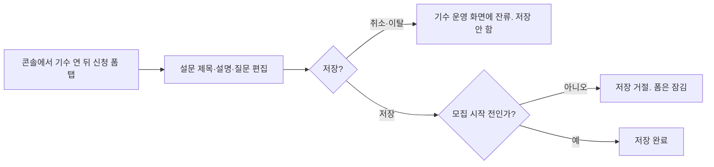
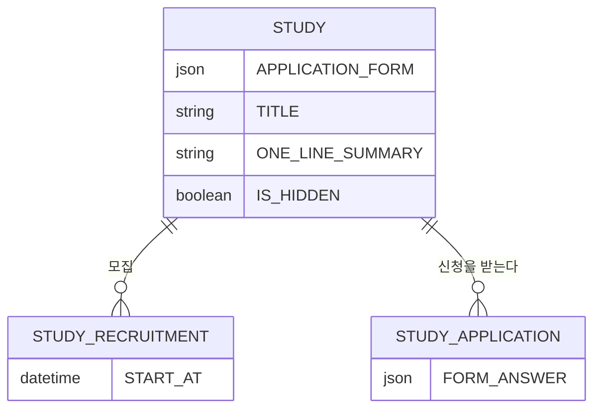

# 캡틴으로서, 스터디 신청용 폼을 제작할 수 있다.

기준 프로토타입: 스터디 운영 콘솔 · 신청 폼 탭

## 1. 기본설명

· **진입·사용 흐름**

· **완료 기준**

1. 캡틴이 맡은 기수의 신청 폼 탭에서 설문 제목·설명과 추가 질문을 만들고 순서를 바꿀 수 있다
2. 질문 설명은 여러 줄로 넣고, 마크다운이 지원자 화면에 그대로 보인다
3. 미리보기 화면을 따로 두지 않아도, 편집 카드가 지원자가 채우는 모양과 같다
4. 디스코드 서버 별명 문항은 모든 폼에 있고, 캡틴이 지우거나 타입을 바꾸지 못한다
5. 이름·이메일은 신청 폼에 두지 않는다
6. 저장하면 그 기수의 신청 폼이 바뀌고 `저장되었습니다.`가 보인다
7. 이 기수에 신청이 들어왔거나, 모집 회차의 시작 시각이 지났으면 폼을 고치지 못한다
8. 추가 질문이 없어도 저장할 수 있다 — 그때 지원자는 플랫폼 기본 문항만 본다
9. 저장된 폼이 없어도 탭이 열리고, 기수 제목·한 줄 소개와 기본 질문·`질문 추가`가 보인다
10. 입력 길이는 상한에서 막힌다. 접힌 카드의 제목·설명은 말줄임 없이 줄바꿈으로 모두 보인다
11. 불러오기·저장이 실패하거나 권한이 없으면 그 사실이 문구로 보인다. 조회가 끝나기 전에는 저장하지 않는다
12. 미로그인이면 콘솔 로그인으로 보낸다. 다른 기수 캡틴·크루는 이 기수 폼을 고치지 못한다

## 2. 화면명세

> **화면**: 신청 폼 설계

### 1. 폼 헤더

- **내용**
  - 설문 제목. 없으면 기수 제목
  - 설문 설명. 없으면 기수 한 줄 소개
  - 예시 지원자 표시 이름·이메일 (설계 화면에서만. 지원자 신청 화면에는 두지 않는다)
- **동작**
  - 연필 또는 카드 선택 → 제목·설명을 고친다
  - 카드 밖을 누르면 편집을 끝내고 고친 값이 반영된 모양으로 돌아간다
- **정책**
  - 미리보기 칸을 따로 두지 않는다. 이 카드가 지원자 화면과 같은 모양이다
  - 설명은 여러 줄이다. 마크다운(`#`~`######` 제목, `**굵게**`, `*기울임*`, `~~취소선~~`, `` `코드` ``, `[링크](url)`, 순서·비순서 목록, 펜스 코드 블록)을 쓴다. 서버는 원문을 저장하고 HTML로 바꾸지 않는다
  - 지원자 화면이 같은 원문을 렌더한다. 렌더러는 HTML을 살균한다. `javascript:` 등 실행 가능한 스킴 링크는 그리지 않는다
  - Empty 허용. 비우면 기수 제목·한 줄 소개를 쓴다. `APPLICATION_FORM`이 없으면 처음부터 이 대체를 쓴다
  - 제목 MAX 200자. 설명 MAX 5,000자. 입력칸에서 상한을 넘기지 못한다
  - 제목은 한 줄. 줄바꿈·탭은 공백으로 바꾼 뒤 trim. 설명은 여러 줄
  - 특수문자·이모지 허용. 허용 문자 목록을 두지 않는다. HTML은 텍스트로 저장한다. 설명만 마크다운 렌더
  - 접힌 카드의 제목·설명은 말줄임 없이 줄바꿈으로 모두 보인다
  - Esc를 누르면 헤더 편집을 끝낸다. 카드 밖 클릭과 같다
- **데이터**: `STUDY.APPLICATION_FORM.title` · `description`. 기본값 `STUDY.TITLE` · `ONE_LINE_SUMMARY`

### 2. 기본 질문 — 디스코드 서버 별명

- **내용**
  - 라벨 `[스터디 클럽++] 디스코드 서버 별명`
  - 단답. 필수. 자리 표시 `홍길동/SWE/산호세/시스템디자인`
- **동작**: 없음. 설계 화면에서는 고치지 못한다
- **정책**
  - 모든 신청 폼에 둔다. 삭제·타입 변경·순서 이동 불가
  - `APPLICATION_FORM.questions`에 넣지 않는다. 플랫폼이 붙인다
  - 지원자 화면에서는 계정 별명으로 채우고 고칠 수 있다. 그 동작은 크루 신청 스토리 소관
- **데이터**: `ACCOUNT.DISCORD_NICKNAME`

### 3. 질문 설계 영역

- **내용**: 기본 질문 아래 추가 질문 목록. 없으면 목록이 비어 있고 질문 추가만 있다
- **동작**: 없음 (하위 번호)
- **정책**
  - 이름·이메일은 이 영역에 두지 않는다. 계정에서 읽는다
  - 저장된 폼이 없거나 `questions`가 비어 있어도 빈 안내 문구를 두지 않는다. `질문 추가`가 빈 상태다

### 3-1. 질문 추가

- **내용**: `질문 추가`
- **동작**: 빈 질문 1개를 목록 끝에 넣고 바로 편집 상태로 연다. 기본 타입 단답형, 필수 켜짐
- **정책**: 모집이 시작된 뒤에는 누를 수 없다

### 3-2. 질문 카드

- **내용**
  - 질문 제목. 없으면 `(질문을 입력하세요)`
  - 설명(선택). 여러 줄. 마크다운. 없으면 설명을 그리지 않는다
  - 타입: 단답형 · 장문형 · 객관식 · 체크박스 · 드롭다운
  - 객관식·체크박스·드롭다운은 선택지. 객관식·체크박스는 `기타` 자유 입력을 켤 수 있다
  - `필수 응답`
- **동작**
  - 연필 또는 카드 선택 → 편집. 카드 밖을 누르거나 Esc를 누르면 편집을 끝낸다
  - 접힌 카드의 순서를 바꾼다. 마우스 끌기 또는 키보드(위·아래)로 한 칸씩. 편집 중인 카드는 순서를 바꾸지 못한다
  - 선택지는 한 줄씩 추가·수정·삭제. 옵션 입력 중 Enter는 바로 아래에 새 옵션을 넣는다. 선택지가 1개이면 삭제하지 못한다
  - `삭제`는 그 질문만 목록에서 뺀다
- **정책**
  - 질문 설명의 마크다운·살균 규칙은 헤더 설명과 같다
  - 질문 제목 Empty 불가. MIN 1자 MAX 200자. 빈 제목으로 저장하면 `질문 제목을 입력해 주세요.`
  - 질문 제목·자리 표시·선택지는 한 줄. 줄바꿈·탭은 공백으로 바꾼 뒤 trim. 특수문자·이모지 허용. HTML은 텍스트
  - 질문 설명 MAX 5,000자. 자리 표시 MAX 200자. 선택지 한 줄 MAX 200자. 입력칸에서 상한을 넘기지 못한다
  - 접힌 카드의 질문 제목·설명·선택지는 말줄임 없이 줄바꿈으로 모두 보인다
  - `questions[]`에 min/max 필드를 두지 않는다. 지원자가 채울 때의 길이·개수 상한은 크루 신청 스토리 유효값 표
  - `RADIO`·`CHECKBOX`·`SELECT`는 선택지 1개 이상. 빈 문자열 옵션 불가. 저장 시 `선택지를 하나 이상 넣어 주세요.`
  - `allowOther`는 `RADIO`·`CHECKBOX`만
  - 타입을 바꾸면 새 타입에 맞지 않는 필드(옵션·기타)는 버린다
  - `id`는 폼 안에서 유일. 지원자 답의 키
- **데이터**: `STUDY.APPLICATION_FORM.questions[]` — `id` / `label` / `type` / `required` / `options` / `allowOther` / `placeholder` / `description`

### 4. 저장

- **내용**: `저장`. 성공 시 `저장되었습니다.`
- **동작**: 누르면 검증 후 기수 신청 폼을 통째로 교체한다
- **정책**
  - 처리 중에는 다시 누르지 못한다. 라벨은 `저장`을 유지한다
  - 처리 중에는 취소·Esc·바깥 클릭으로 나가지 못한다. 브라우저를 닫거나 새로고침하면 요청은 이어질 수 있다. 다시 열면 저장된 값이면 그 값·잠금, 아니면 이전 조회 값이다. 중간 초안을 복구하지 않는다
  - 조회가 끝나기 전에는 저장하지 않는다. 조회가 실패하면 빈 폼을 저장하지 않는다. `다시 시도`로 조회를 다시 한다
  - 저장 실패·시간 초과·통신 끊김은 같은 문구다. `다시 시도`로 같은 저장을 다시 보낸다
  - 저장이 `409`이면 잠금 화면으로 바꾼다. `모집이 시작되어 신청 폼을 수정할 수 없습니다.` 저장 실패 문구를 쓰지 않는다
  - 이 기수 `STUDY_APPLICATION`이 1건 이상이거나, 이 기수 `STUDY_RECRUITMENT` 중 `START_AT <= now()`인 행이 있으면 거절한다. 모집 회차가 아직 없으면 저장한다
  - 추가 질문 0개여도 저장한다
  - 질문 제목·선택지 유효값을 깨면 저장하지 않고 그 카드로 옮긴다
- **데이터**: `PATCH /api/studies/{studyId}/application-form`

### 상태별 화면

| 상태 | 화면 | 카피 |
| --- | --- | --- |
| 로딩 | 신청 폼 탭 | `불러오는 중`. 저장 불가 |
| 조회 실패 | 같은 탭 | `신청 폼을 불러오지 못했습니다. 다시 시도해 주세요.` `다시 시도`. 저장 불가 |
| 미로그인 | 콘솔 로그인 | 로그인 화면 카피. `next` = 이 탭 |
| 권한 없음 | 같은 탭 | `이 스터디의 신청 폼을 고칠 권한이 없습니다.` 저장·삭제·순서 변경 없음 |
| 첫 진입 · 폼 없음 | 같은 탭 | 기수 제목·한 줄 소개 · 기본 질문 · `질문 추가` |
| 기본 | 같은 탭 | 제목·설명·기본 질문·추가 질문 |
| 추가 질문 없음 | 같은 탭 | 제목·설명·기본 질문 · `질문 추가` |
| 편집 중 | 선택한 카드 | 제목·타입·설명·선택지·필수 |
| 검증 실패 | 해당 카드 | `질문 제목을 입력해 주세요.` / `선택지를 하나 이상 넣어 주세요.` |
| 처리중 | 저장 버튼 | `저장`. 다시 누르지 못함. 닫기 불가 |
| 완료 | 같은 탭 | `저장되었습니다.` |
| 저장 실패 | 같은 탭 | `저장하지 못했습니다. 다시 시도해 주세요.` `다시 시도` |
| 잠금 | 같은 탭 | `모집이 시작되어 신청 폼을 수정할 수 없습니다.` 연필·추가·삭제·저장 불가 |

### 데이터 관계

### 비고

- 범위 밖: 크루의 제출, 신청 결과 모아보기, 반 편성, 승인·거절
- 미구현: 저장 API, 모집 시작 후 잠금, 저장 실패·조회 실패·다시 시도 화면. 프로토는 화면 상태로만 저장한다
- 구현 지시: 편집 카드와 지원자 작성 화면은 같은 질문 컴포넌트를 쓴다

## 3. 시스템 요건

### 데이터

| 대상 | 필드 | 제약 |
| --- | --- | --- |
| 기수 | `APPLICATION_FORM` | JSON. `{ title, description, questions }`. null이면 추가 질문 없음 |
| 기수 | `TITLE` · `ONE_LINE_SUMMARY` | 설문 제목·설명이 비었을 때 대체 |
| 기수 | `SCHEDULE` | 이 스토리가 고치지 않는다. 값이 있으면 지원자 폼에 일정 참여 확인이 붙는다 |

`APPLICATION_FORM`:

| 필드 | 필수 | 제약 |
| --- | --- | --- |
| `title` | N | 1~200자. 빈 값은 기수 제목 |
| `description` | N | 마크다운 원문. MAX 5,000자. 빈 값은 한 줄 소개 |
| `questions` | Y | 배열. 빈 배열 허용. 순서 = 화면 순서 |

`questions[]`:

| 필드 | 필수 | 제약 |
| --- | --- | --- |
| `id` | Y | 문자열. 폼 안 UNIQUE. `FORM_ANSWER.answers` 키 |
| `label` | Y | 1~200자 |
| `type` | Y | ENUM `TEXT` `TEXTAREA` `RADIO` `CHECKBOX` `SELECT` |
| `required` | Y | |
| `options` | `RADIO`·`CHECKBOX`·`SELECT`이면 Y | 1개 이상. 한 줄 MAX 200자 |
| `allowOther` | N | `RADIO`·`CHECKBOX`만 |
| `description` | N | 마크다운 원문. 여러 줄. MAX 5,000자 |
| `placeholder` | N | `TEXT`·`TEXTAREA`만. MAX 200자 |

플랫폼 기본 문항(디스코드 별명·참여 가능 요일·일정 참여 확인)은 `questions`에 넣지 않는다. `id=discord`를 보내면 `400`.

### 처리

- 저장은 통째 교체. 부분 패치 없음. 조회 완료 전에 저장하지 않는다
- 이 기수에 신청 행이 있거나, 이 기수 모집 회차 중 `START_AT <= now()`인 것이 있으면 `409`
- 한 줄 필드는 줄바꿈·탭을 공백으로 바꾼 뒤 trim. 특수문자 화이트리스트 없음. 서버는 길이·스키마만 본다
- 마크다운을 서버가 HTML로 바꾸지 않는다. 렌더는 클라이언트. 살균·위험 스킴 차단은 클라이언트 책임. 서버는 길이 상한만 본다
- 시간 초과·통신 끊김·5xx는 저장 실패와 같다. 재시도는 클라이언트가 같은 PATCH를 다시 보낸다
- 실패 응답·로그·에러 리포트에 질문 원문·설명·선택지를 넣지 않는다. 필드명과 사유 코드만

### API

| 메서드 | 경로 | 권한 |
| --- | --- | --- |
| GET | `/api/studies/{studyId}/application-form` | OPEN이고 숨김이 아니면 공개. DRAFT·숨김은 이 기수 캡틴 |
| PATCH | `/api/studies/{studyId}/application-form` | 이 기수 캡틴 |

실패:

- `400` 스키마 위반
- `401` 미로그인
- `403` 이 기수 캡틴이 아님
- `404` 기수 없음
- `409` 모집 시작 이후 수정

### 권한

- 조회(OPEN · `IS_HIDDEN=false`): 누구나. 검증 위치 서버. 이 스토리 화면은 콘솔이라 미로그인이면 로그인부터 한다
- 조회(DRAFT 또는 숨김)·저장: 이 기수 `STUDY_PARTICIPANT.PARTICIPANT_ROLE`이 `LEADER` 또는 `CO_LEADER`, 또는 `ACCOUNT.SYSTEM_ROLE=ADMIN`. 검증 위치 서버
- 미로그인 `401`: 콘솔 로그인. 탭 안에 고치기 컨트롤을 두지 않는다
- 다른 기수 캡틴·이 기수 크루·네비게이터 `403`: 조회만 되는 OPEN 공개 폼이어도 이 탭에서 고치지 못한다. 질문 `삭제`·순서 변경은 저장과 같은 권한이다
- 화면에서 탭을 숨기는 것만으로 끝내지 않는다

## 4. 미확정

- `APPLICATION_FORM` JSON 유지 vs 질문 테이블 정규화
