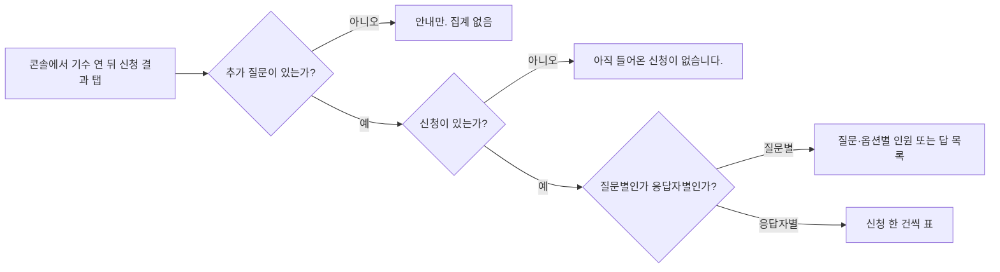
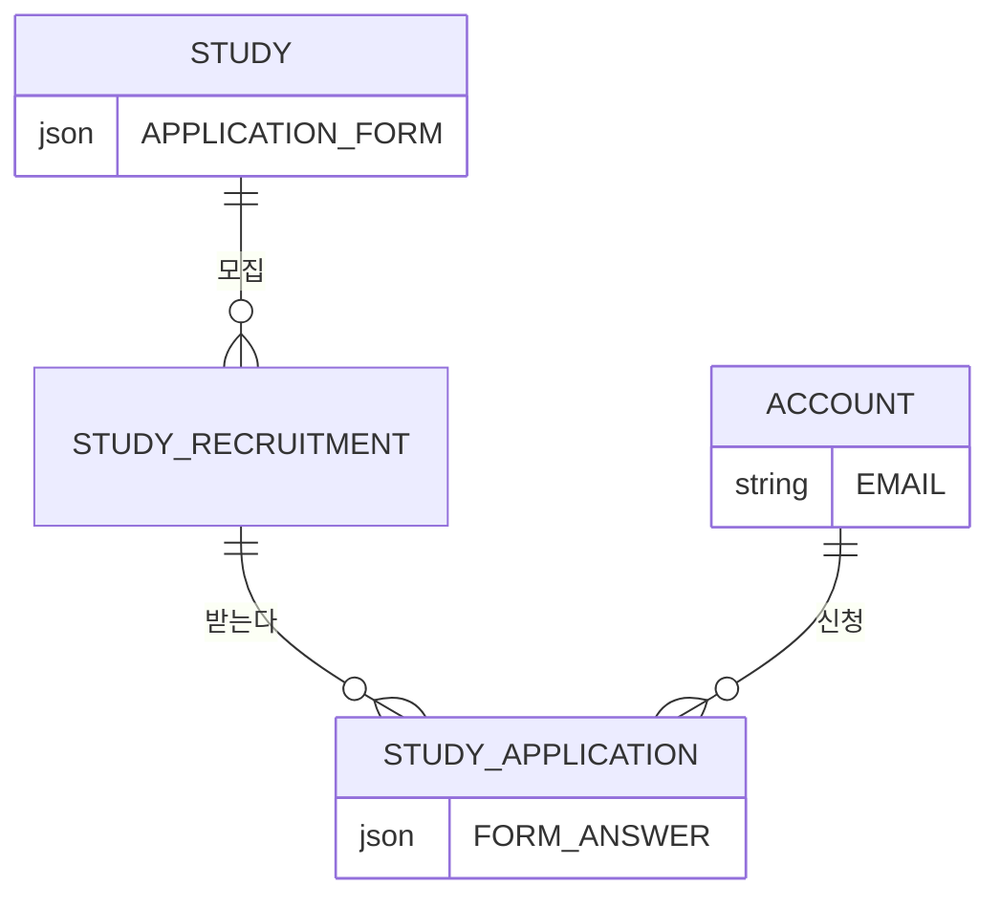

# 캡틴으로서, 스터디 신청서 결과를 모아볼 수 있다.

기준 프로토타입: 스터디 운영 콘솔 · 신청 결과 탭

## 1. 기본설명

· **진입·사용 흐름**

· **완료 기준**

1. 캡틴이 맡은 기수의 신청 결과 탭에서 추가 질문에 대한 답을 볼 수 있다
2. 응답 인원이 `응답자 N명`으로 보인다
3. `질문별`과 `응답자별`을 바꿀 수 있다. 기본은 `질문별`
4. 질문별·옵션별 보기에는 누가 답했는지 붙이지 않는다. 인원과 답 내용만 보인다
5. 응답자별 보기에서 디스코드 별명·이메일·질문별 답을 한 행으로 볼 수 있다
6. 추가 질문이 없으면 탭은 그대로 있고, 추가 질문이 없다는 안내가 보인다. 모집이 시작되기 전이면 신청 폼 탭에서 질문을 만들 수 있다. 잠긴 뒤에는 질문을 추가할 수 없다
7. 신청이 아직 없으면 `아직 들어온 신청이 없습니다.`가 보인다
8. 이 화면에서 신청을 바꾸거나 지우지 않는다. 본인 기수가 아니면 결과를 보지 못한다
9. 불러오기가 실패하거나 미로그인이면 그 사실이 보인다
10. 긴 선택지·별명·이메일은 한 줄 말줄임이고, 답 본문은 줄바꿈으로 모두 보인다

## 2. 화면명세

> **화면**: 신청 결과 모아보기

### 1. 탭

- **내용**: 기수 운영 화면의 `신청 결과`
- **동작**: 누르면 이 스토리 화면이 열린다
- **정책**: 추가 질문이 없어도 탭은 있다. 집계 대신 안내를 보여 준다. 저장된 폼이 없어도 같다

### 2. 응답 수

- **내용**: `응답자 {n}명`. `n`은 보고 있는 모집 회차의 신청 행 수
- **동작**: 없음
- **정책**
  - 거절 상태값은 신청 행에 없다. 행이 있으면 제출 완료로 센다
  - 기본 회차: 열려 있는 모집 회차. 없으면 시작 시각이 가장 최근인 회차
  - 회차가 둘 이상이면 어느 회차인지 고른다
  - 추가 질문이 없으면 이 숫자를 그리지 않고 안내만 보여 준다
- **데이터**: `STUDY_APPLICATION` 행 수
- **조건**: 추가 질문이 1개 이상일 때

### 2-1. 보기 전환

- **내용**: `질문별` · `응답자별`
- **동작**: 누르면 그 보기로 바로 바뀐다. 기본은 `질문별`
- **정책**: 추가 질문이 있고 신청이 1건 이상일 때 의미를 갖는다. 신청 0건이면 전환해도 빈 안내가 같다
- **조건**: 추가 질문이 1개 이상일 때

### 3. 질문별

- **내용**
  - 질문마다 묶음 하나. 번호 · 질문 제목 · 타입 · 그 질문에 답한 인원
  - 객관식·체크박스·드롭다운: 선택지마다 고른 인원. `기타`로 낸 자유 입력은 선택지 막대와 별도로 답 목록으로 보여 준다. 기타 인원은 응답 수에 포함한다
  - 단답형·장문형: 답 텍스트 목록. 제목 없는 질문은 `(제목 없음)`
- **동작**: 없음. 선택지를 눌러 응답자를 펼치지 않는다
- **정책**
  - 질문별·옵션별에는 디스코드 별명·이메일을 두지 않는다. 누가 답했는지는 응답자별에서 본다
  - 체크박스는 한 사람이 여러 선택지를 고를 수 있어 선택지 인원 합이 응답 수를 넘을 수 있다
  - 플랫폼 기본 문항(별명·요일·일정 확인)은 이 보기에 넣지 않는다
  - 그 질문에 답이 없으면 `아직 답이 없습니다.`
  - 선택지 라벨이 길면 한 줄 말줄임(`…`). 전체 문구는 그 요소의 이름으로 둔다
  - 단답·장문·기타 답은 말줄임 없이 줄바꿈으로 모두 보인다. 장문의 줄바꿈은 유지한다
  - 질문 제목이 길면 줄바꿈으로 모두 보인다
- **데이터**: `APPLICATION_FORM.questions[]` + `FORM_ANSWER.answers`
- **조건**: `질문별`이고 신청이 1건 이상일 때

### 4. 응답자별

- **내용**
  - 열: 디스코드 별명 · 이메일 · 추가 질문마다 하나
  - 행: 신청 한 건
  - 답이 없으면 `—`. 체크박스 답은 쉼표로 나열
- **동작**: 없음. 훑어보기만. 행을 눌러 승인하지 않는다
- **정책**
  - 식별은 계정 실명이 아니라 제출 시점 디스코드 서버 별명
  - 열을 모두 볼 수 있어야 한다. 질문이 많아도 가로로 훑을 수 있다
  - 별명·이메일이 길면 한 줄 말줄임(`…`). 전체는 그 칸의 이름으로 둔다
  - 답 칸은 말줄임 없이 줄바꿈으로 모두 보인다
  - 이 화면에서 신청을 바꾸거나 지우지 않는다. 반 배정은 신청자 탭 소관. 행마다 수정·삭제 버튼을 두지 않는다
- **데이터**: `FORM_ANSWER.discordNickname` · `ACCOUNT.EMAIL` · `FORM_ANSWER.answers`
- **조건**: `응답자별`이고 신청이 1건 이상일 때

### 상태별 화면

| 상태 | 화면 | 카피 |
| --- | --- | --- |
| 로딩 | 신청 결과 탭 | `불러오는 중` |
| 조회 실패 | 같은 탭 | `결과를 불러오지 못했습니다. 다시 시도해 주세요.` `다시 시도` |
| 미로그인 | 콘솔 로그인 | 로그인 화면 카피. `next` = 이 탭 |
| 권한 없음 | 같은 탭 | `이 스터디의 신청 결과를 볼 권한이 없습니다.` |
| 추가 질문 없음 | 같은 탭 | `이 스터디는 신청 폼에 추가 질문이 없습니다.` |
| 신청 없음 | 같은 탭 | `아직 들어온 신청이 없습니다.` |
| 질문별 | 같은 탭 | `응답자 N명` · `질문별` |
| 응답자별 | 같은 탭 | `응답자 N명` · `응답자별` |
| 그 질문 답 없음 | 질문별 묶음 | `아직 답이 없습니다.` |

### 데이터 관계

### 비고

- 범위 밖: 신청 폼 설계, 크루의 제출, 승인·거절, 반 편성
- 미구현: 조회 API, 조회 실패·다시 시도 화면. 프로토는 화면에서 목 답으로 집계한다
- 구현 지시: 서버는 신청 목록만 준다. 질문별 막대·표는 클라이언트가 계산한다

## 3. 시스템 요건

### 데이터

| 대상 | 필드 | 제약 |
| --- | --- | --- |
| 기수 | `APPLICATION_FORM.questions` | 집계 대상. 없으면 안내만 |
| 신청 | `FORM_ANSWER.answers` | `questions[].id` → 문자열 또는 문자열 배열 |
| 신청 | `FORM_ANSWER.discordNickname` | 응답자별 식별. VARCHAR 100 |
| 계정 | `EMAIL` | 응답자별 열 |

집계 API·저장 집계 테이블 없음. `GET` 목록의 `respondentCount`는 `applications.length`와 같다.

### 처리

- 기본 회차: 열려 있는 모집 회차. 없으면 `START_AT`이 가장 최근인 회차. 쿼리 `recruitmentId`로 고른다
- 모집 회차가 없으면 신청 없음과 같다. `아직 들어온 신청이 없습니다.`
- 정렬: 신청 ID 오름차순 (먼저 낸 순)
- 시간 초과·통신 끊김·5xx는 조회 실패와 같다. `다시 시도`로 같은 GET을 다시 보낸다
- 실패 응답·로그·에러 리포트에 답 원문·별명·이메일을 넣지 않는다
- 이 API로 신청을 고치거나 지울 수 없다

### API

| 메서드 | 경로 | 권한 |
| --- | --- | --- |
| GET | `/api/studies/{studyId}/applications` | 이 기수 캡틴 |

쿼리 `recruitmentId`(선택): 특정 모집 회차만. 이 기수 소속이 아니면 `422`.

실패:

- `401` 미로그인
- `403` 이 기수 캡틴이 아님
- `404` 기수 없음

### 권한

- 조회: 이 기수 `LEADER`/`CO_LEADER` 또는 `SYSTEM_ROLE=ADMIN`. 검증 위치 서버
- 미로그인 `401`: 콘솔 로그인. `next` = 이 탭
- 다른 기수 캡틴·이 기수 크루 `403`: 탭이 보여도 본문은 권한 없음 문구. 행 수정·삭제 없음
- 화면에서 탭을 숨기는 것만으로 끝내지 않는다

### 개인정보

| 항목 | 목적 | 수명 |
| --- | --- | --- |
| 제출 별명·추가 답 | 누가 뭐라고 답했는지 운영 | 신청 행이 있는 동안 |
| 이메일 | 응답자별 열. 이 화면은 조회만 | 계정 수명. 신청 행과 함께 지워지지 않는다 |

## 4. 미확정

- 명부 `WITHDRAWN`인 사람의 신청을 결과에서 뺄지. 신청 행에는 거절 상태가 없다
