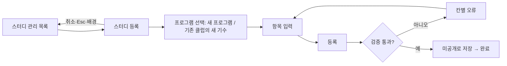
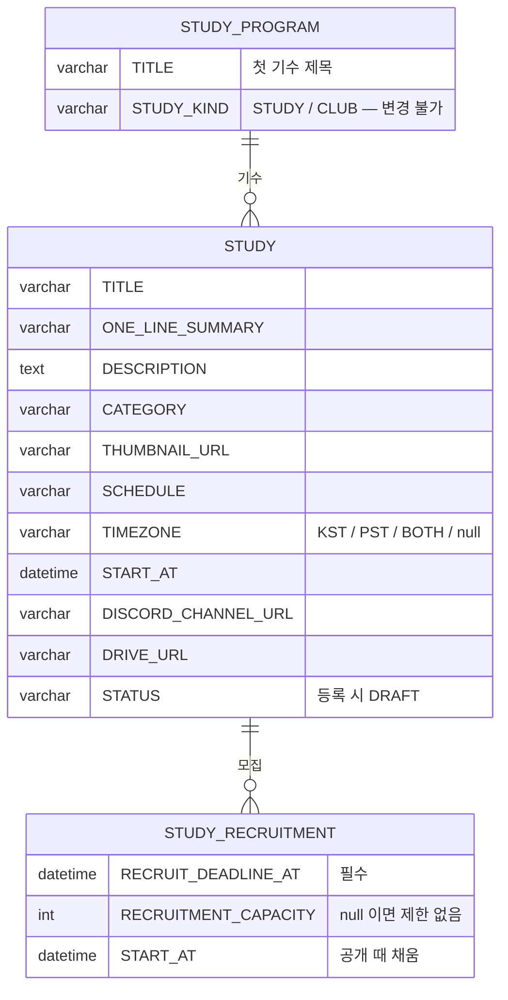

# 캡틴으로서, 신규 스터디를 등록할 수 있다.

기준 프로토타입: 스터디 등록 모달 (playground 운영 콘솔 · 스터디 관리 → 스터디 등록)

## 1. 기본설명

· **진입·사용 흐름**

· **완료 기준**

1. 운영 콘솔 스터디 목록에서 등록 창을 열 수 있다
2. 새 프로그램으로 등록하면 프로그램과 첫 기수가 한 번에 만들어진다. 종류(스터디 · 클럽)를 이때 정한다
3. 기존 클럽을 고르면 그 클럽의 새 기수로 등록된다. 제목·한 줄 소개·상세 설명·주제·시간대·채널·드라이브 주소가 최신 기수 값으로 채워진다
4. 제목·한 줄 소개·주제·모집 마감일을 채워야 등록된다. 빠진 칸은 그 칸에서 이유를 알려 준다
5. 제목과 한 줄 소개가 권장 길이를 넘으면 경고가 보이지만 등록은 된다
6. 상세 설명은 네 제목(목표 / 진행 방식 / 참가 대상 / 특이사항)이 채워진 채 시작한다
7. 정원은 기본이 제한 없음이고, 풀면 1 이상의 정수를 넣어야 한다
8. 등록한 스터디는 늘 미공개 상태로 저장된다
9. 등록 중에는 다시 누를 수 없다
10. 취소하면 입력값이 버려진다

## 2. 화면명세

> **화면**: 스터디 등록 모달

### 1. 모달

- **내용**: 제목 「스터디 등록」
- **동작**
  - 배경 클릭 · Esc · 「취소」 → 닫힌다
  - 열릴 때 한 번만 첫 입력 요소로 포커스가 간다. 입력 중에는 포커스를 옮기지 않는다
  - 열려 있는 동안 배경은 스크롤되지 않는다
  - Tab 은 모달 안에서만 돈다

### 2. 제목 (필수)

- **내용**: 한 줄 입력. 자리표시 「AI 논문 스터디」
- **정책**
  - 비어 있으면 등록할 수 없다
  - 60자를 넘으면 「60자 이내로 입력하세요.」
- **데이터**: `STUDY.TITLE`

### 2-1. 제목 글자수

- **내용**: 현재 글자수 / 권장 24자
- **정책**
  - 24자를 넘으면 경고로 구분해 보인다. 등록은 막지 않는다
  - 권장 길이를 넘으면 목록 카드에서 제목이 잘릴 수 있다

### 3. 한 줄 소개 (필수)

- **내용**: 한 줄 입력. 자리표시 「AI 논문을 함께 읽고 토론합니다.」
- **정책**: 비어 있으면 등록할 수 없다
- **데이터**: `STUDY.ONE_LINE_SUMMARY` — 목록 카드에 보인다

### 3-1. 한 줄 소개 글자수

- **내용**: 현재 글자수 / 권장 25자
- **정책**
  - 25자를 넘으면 경고로 구분해 보인다. 등록은 막지 않는다
  - 25자까지는 목록 카드에서 한 줄로 읽힌다

### 4. 주제 (필수)

- **내용**: AI · ML / 알고리즘 / 데이터 / 소프트웨어 개발 / 커리어 / 북클럽 / 어학 / 라이프스타일 / 기획 · PM / 비즈니스 / 기타. 고른 하나가 드러난다
- **동작**: 하나만 고른다. 다른 것을 누르면 이전 선택이 풀린다
- **정책**
  - 반드시 하나를 골라야 등록된다
  - 목록에서만 고른다. 직접 입력은 없다
  - 순서는 등록 빈도 순이다
  - 여러 주제를 고를 수 없다
- **데이터**: `STUDY.CATEGORY` — 목록 카드의 배경과 아이콘을 정한다

### 5. 상세 설명

- **내용**: 여러 줄 입력. 「목표 / 진행 방식 / 참가 대상 / 특이사항」 네 제목이 미리 채워져 있다. 마크다운을 쓸 수 있다는 안내
- **정책**
  - 선택 입력이다
  - 미리 채운 제목은 지우거나 고쳐도 된다
  - 킥오프 모임·문의처처럼 칸이 없는 내용은 「특이사항」에 쓴다
- **데이터**: `STUDY.DESCRIPTION` (마크다운) — 상세 페이지에서 렌더링한다. 목록 카드에는 보이지 않는다

### 6. 진행 일정

- **내용**: 한 줄 입력. 자리표시 「매주 목 20:00 · 8주 과정」
- **정책**
  - 자유 텍스트. 비워도 등록된다
  - 모집할 때 알리는 문구다. 실제 회차를 만드는 요일·시간은 반이 갖는다
  - 모집 마감일과 다른 값이다
- **데이터**: `STUDY.SCHEDULE` — 비우면 카드에 일정이 보이지 않는다

### 6-1. 일정 안내

- **내용**: 「비우면 신청 화면에 일정 미정으로 안내합니다」
- **정책**: 이 칸이 있으면 신청 폼이 그 일정에 참여할 수 있는지 묻는다

### 7. 모집 마감일 (필수)

- **내용**: 날짜 입력
- **정책**
  - 비어 있으면 「모집 마감일을 입력하세요.」
  - 오늘 이후여야 한다
  - 상시 모집은 없다
  - 모집 상태는 이 값과 정원으로 계산한다. 등록 때 상태를 고르지 않는다
- **데이터**: `STUDY_RECRUITMENT.RECRUIT_DEADLINE_AT`

### 8. 취소

- **동작**: 모달을 닫고 입력값을 버린다

### 9. 등록

- **내용**: 이 모달의 주액션
- **동작**
  - 검증 통과 → 저장하고 완료 화면으로 바뀐다
  - 검증 실패 → 해당 칸에 오류, 저장하지 않는다
  - 처리 중 → 다시 누를 수 없다
- **정책**: 검토 단계는 없다. 등록 결과는 늘 미공개다
- **데이터**: `POST /api/admin/studies`

### 10. 모집 정원

- **내용**: 숫자 입력. 기본은 「제한 없음」이 켜져 있어 입력할 수 없다
- **동작**
  - 「제한 없음」을 켜면 입력이 막히고 넣었던 값이 지워진다
  - 끄면 입력할 수 있다
- **정책**
  - 제한 없음을 끈 채면 1 이상의 정수가 필요하다. 아니면 「1 이상의 정수로 입력하세요. 제한이 없으면 「제한 없음」을 체크하세요.」
  - 모집 회차의 정원이다. 모집 회차마다 따로 정한다
  - 정원에 닿으면 마감일 전이라도 모집 마감이다
  - 현재 인원은 입력하지 않는다. 신청 명부에서 계산한다
- **데이터**: `STUDY_RECRUITMENT.RECRUITMENT_CAPACITY` — null 이면 제한 없음

### 10-1. 제한 없음

- **내용**: 정원 제한이 없는지 켜고 끄는 자리

### 11. 프로그램 (필수)

- **내용**
  - 「새 프로그램」 · 「기존 클럽의 새 기수」. 기본은 새 프로그램
  - 새 프로그램이면 종류(스터디 · 클럽). 기본은 스터디
  - 기존 클럽의 새 기수이면 클럽 목록. 프로그램 제목만 나열한다
- **동작**
  - 새 프로그램 → 프로그램과 첫 기수를 함께 만든다. 프로그램 제목은 이 스터디 제목이다
  - 기존 클럽을 고르면 제목은 프로그램 제목, 한 줄 소개 · 상세 설명 · 주제는 최신 기수 값으로 채워진다. 마감일 · 진행 일정 · 정원은 비운다
  - 기존 클럽의 새 기수인데 프로그램을 고르지 않으면 「기수를 추가할 프로그램을 고르세요.」
  - 모드를 바꾸면 이전 모드에서 고른 값은 지워진다
- **정책**
  - 프로그램만 먼저 등록하는 길은 없다
  - 새 기수를 붙일 수 있는 것은 클럽뿐이다
  - 종류는 프로그램의 속성이고, 한 번 정하면 바꾸지 못한다
- **데이터**: `STUDY.PROGRAM_ID` (기존) · `STUDY_PROGRAM.STUDY_KIND` (새 프로그램)

### 12-1. 종류 안내

- **내용**: 스터디 「한 번 모집해 한 번 진행」 · 클럽 「이전 기수 참여자가 다음 기수에 이어집니다」

### 13. 진행 시작일

- **내용**: 날짜 입력. 선택
- **정책**
  - 모임이 실제로 시작하는 날짜다. 모집 마감일·진행 일정과 다른 값이다
  - 비워 두고 나중에 정보 탭에서 채울 수 있다
- **데이터**: `STUDY.START_AT`

### 14. 디스코드 채널 주소

- **내용**: 한 줄 입력. 자리표시 「https://discord.com/channels/…」
- **정책**
  - 비워도 등록된다
  - http(s):// 로 시작하지 않으면 「http(s):// 로 시작하는 주소를 입력하세요.」
  - 기존 클럽의 새 기수이면 최신 기수의 주소가 채워진다
  - 비어 있으면 사이트 기본 초대 링크로 대신 안내한다
- **데이터**: `STUDY.DISCORD_CHANNEL_URL`

### 14-1. 채널 안내

- **내용**: 「채널을 아직 안 만들었으면 비워 둡니다」

### 15. 자료 드라이브 주소

- **내용**: 한 줄 입력. 자리표시 「https://drive.google.com/…」
- **정책**
  - 비워도 등록된다
  - http(s):// 로 시작하지 않으면 「http(s):// 로 시작하는 주소를 입력하세요.」
  - 이 기수 전용 자료함이다
- **데이터**: `STUDY.DRIVE_URL`

### 16. 시간대

- **내용**: 「미정」 · 「KST」 · 「PST」 · 「동시 진행(KST·PST)」. 기본은 미정
- **동작**: 하나만 고른다
- **정책**
  - 선택 입력이다. 미정으로 등록할 수 있다
  - 어느 시간대 기준으로 도는지만 말한다. 요일·시각은 진행 일정이 말한다
  - 기존 클럽의 새 기수이면 최신 기수의 시간대가 채워진다
- **데이터**: `STUDY.TIMEZONE` — 비어 있으면 사이트에 「시간대 미정」

### 17. 썸네일

- **내용**: 비어 있으면 「주제 기본값」, 있으면 미리보기
- **동작**
  - 「이미지 업로드」 → 파일을 고르면 바로 미리보기가 되고, 버튼이 「다른 이미지로 바꾸기」가 된다
  - 미리보기가 있을 때만 「제거」가 보인다. 누르면 주제 기본값으로 돌아간다
- **정책**: 선택 입력이다. 비우면 목록·상세가 주제 기본 이미지를 쓴다
- **데이터**: `STUDY.THUMBNAIL_URL` — 스토리지에 올린 뒤 돌아온 호스팅 URL

### 상태별 화면

| 상태 | 화면 | 카피 |
| --- | --- | --- |
| 기본 | 새 프로그램 · 스터디 · 정원 제한 없음 · 설명 템플릿 | — |
| 검증 실패 | 칸별 오류 | `60자 이내로 입력하세요.` · `모집 마감일을 입력하세요.` · `기수를 추가할 프로그램을 고르세요.` · `http(s):// 로 시작하는 주소를 입력하세요.` · `1 이상의 정수로 입력하세요. …` |
| 처리중 | 등록 잠김 | — |
| 완료 | 완료 화면 | — |

### 데이터 관계

### 비고

- 범위 밖: 공개, 수정·삭제, 신청 폼, 반 편성, 커리큘럼·후기·통계 입력
- 미구현: 썸네일 업로드 API 가 없다. 고른 파일은 화면 미리보기로만 남는다
- 미구현: 시간대를 저장할 컬럼이 콘솔 폼에 아직 없다

## 3. 시스템 요건

### 데이터

- 요청 필드와 검증은 [study/spec.md 스터디 등록](../../../specs/study/spec.md#스터디-등록) 이 정본이다
- 서버가 채우는 값: `STUDY.STATUS = DRAFT`, `STUDY_RECRUITMENT.START_AT = now()` (NOT NULL), 새 프로그램이면 `STUDY_PROGRAM.TITLE = title`
- 모집 회차(`STUDY_RECRUITMENT`) 1행을 늘 함께 만든다

### 처리

- 필수: title(1~60자) · oneLineSummary · category · recruitDeadline(미래)
- `studyProgramId` 가 있으면 존재하고 `CLUB` 이어야 한다. `studyKind` 와 함께 오면 400
- capacity 는 null 또는 1 이상
- 실패하면 400 `INVALID_INPUT` 에 실패한 필드를 모두 `필드명: 사유` 로 담는다
- 성공하면 201, `Location: /api/admin/studies/{id}`

### API

| 메서드 | 경로 | 권한 |
| --- | --- | --- |
| POST | `/api/admin/studies` | 캡틴 (`SYSTEM_ROLE = ADMIN`) |

### 권한

- 캡틴만 등록한다. 서버에서 검증한다 (403)

### 외부 연동

- 디스코드: 등록이 커밋된 뒤 봇에 스터디 생성을 요청한다. 실패하면 재시도 엔드포인트로 다시 연결한다 — [discord-study-link/spec.md](../../../specs/discord-study-link/spec.md)
- 스토리지: 썸네일 업로드 — 미정

## 4. 미확정

- 상세 설명에 마크다운을 허용할 범위
- 작성 중 이탈할 때 입력값을 어떻게 할지
- 클럽 새 기수의 제목 중복 — 기수 표기를 붙일지, `STUDY.TITLE` 을 유일하게 둘지
- 썸네일 업로드 API
