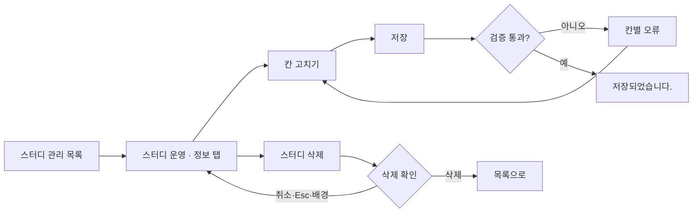
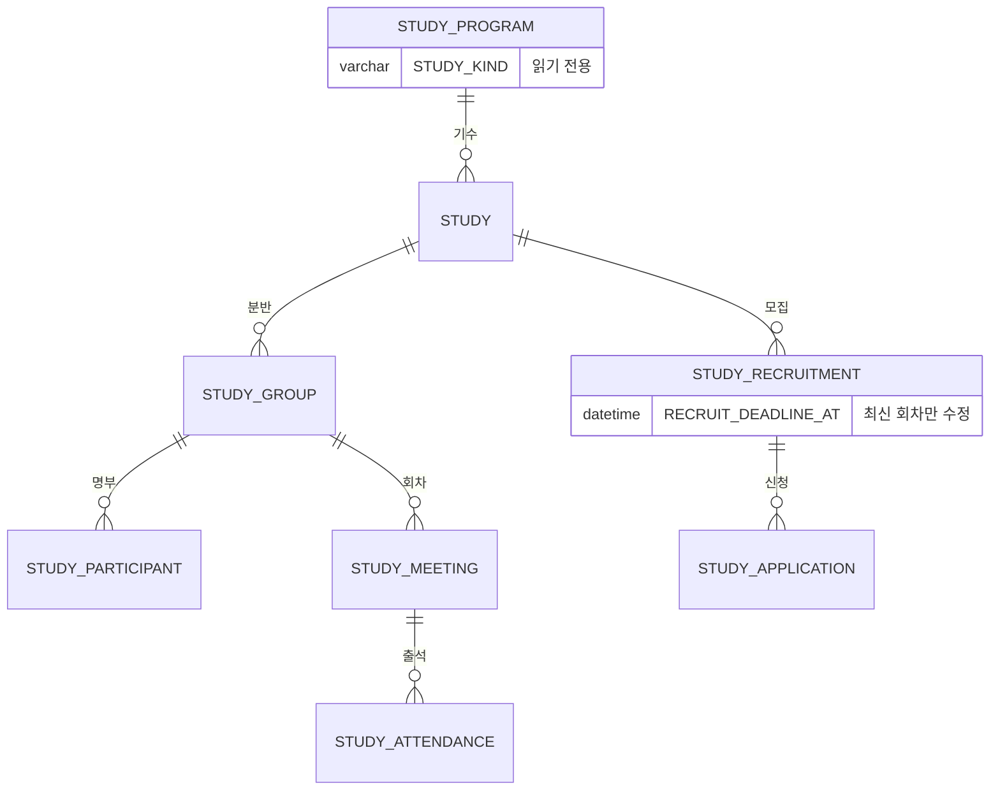

# 캡틴으로서, 등록된 스터디를 수정/삭제할 수 있다.

기준 프로토타입: 스터디 운영 — 정보 탭 (playground 운영 콘솔 · 스터디 관리 → 스터디 운영)

## 1. 기본설명

· **진입·사용 흐름**

· **완료 기준**

1. 정보 탭을 열면 등록 때와 같은 항목이 지금 값으로 채워져 있고, 그 자리에서 고칠 수 있다
2. 프로그램과 종류는 볼 수 있지만 고칠 수 없다
3. 저장하면 바꾼 칸만 반영되고 「저장되었습니다.」가 보인다. 사용자 사이트에도 바로 반영된다
4. 등록과 같은 검증에 걸리면 그 칸에 오류가 보이고 저장되지 않는다
5. 마감이 지난 스터디도 다른 칸은 고칠 수 있다
6. 진행 시작일·디스코드 채널·자료 드라이브 주소를 나중에 채울 수 있다
7. 스터디를 삭제하려면 확인 창을 거친다. 확인 창은 함께 사라지는 것(크루 명단·출석 기록)을 알려 준다
8. 삭제하면 사용자 사이트 목록·상세에서 바로 사라진다. 되돌릴 수 없다

## 2. 화면명세

> **화면**: 스터디 운영 — 정보 탭

### 1. 정보 입력 폼

- **내용**: 등록 모달과 같은 항목이 등록된 값으로 채워져 있다
- **정책**
  - 보이는 칸이 곧 고치는 칸이다. 읽기 화면과 수정 창을 따로 두지 않는다
  - 모집 마감일의 실제 날짜는 이 폼이 보여 준다. 운영 화면 머리는 모집 상태만 말한다
  - 항목별 입력 규칙은 등록과 같다 — [captain-create-study](../captain-create-study/PRD.md)
- **데이터**: `STUDY` · 최신 `STUDY_RECRUITMENT`

### 1-1. 프로그램 · 종류

- **내용**: 폼 맨 위. 프로그램 이름과 종류(스터디 · 클럽), 「변경할 수 없음」
- **정책**
  - 종류는 한 번 정하면 바꾸지 못한다
  - 프로그램 연결도 바꾸지 못한다
- **데이터**: `STUDY_PROGRAM.TITLE` · `STUDY_PROGRAM.STUDY_KIND` (읽기)

### 2. 저장

- **동작**
  - 검증 통과 → 저장하고 「저장되었습니다.」
  - 검증 실패 → 해당 칸에 오류, 저장하지 않는다
  - 처리 중 → 다시 누를 수 없다
- **정책**
  - 검증 규칙은 등록과 같다
  - 바뀐 칸만 보낸다. 마감이 지난 스터디에서 지난 마감일을 다시 보내지 않는다
- **데이터**: `PATCH /api/admin/studies/{studyId}`

### 3. 스터디 삭제

- **동작**: 누르면 삭제 확인 창(4)이 뜬다. 그 자리에서 지워지지 않는다
- **정책**: 저장과 떨어진 자리에 둔다. 잘못 누르면 되돌릴 수 없다

### 4. 삭제 확인 창

- **내용**
  - 삭제할 스터디 이름
  - 함께 사라지는 것: 크루 명단 · 출석 기록
- **동작**
  - 삭제 → 지우고 스터디 목록으로 간다
  - 취소 · 배경 클릭 · Esc → 아무것도 지우지 않고 닫힌다
- **데이터**: `DELETE /api/admin/studies/{studyId}`
- **조건**: 「스터디 삭제」를 눌렀을 때

### 상태별 화면

| 상태 | 화면 | 카피 |
| --- | --- | --- |
| 기본 | 값이 채워진 폼 | — |
| 검증 실패 | 칸별 오류 | 등록과 같은 문구 |
| 처리중 | 저장 잠김 | — |
| 완료 | 저장 결과 | `저장되었습니다.` |
| 삭제 확인 | 확인 창 | 스터디 이름 · 크루 명단 · 출석 기록 |

### 데이터 관계

### 비고

- 범위 밖: 신규 등록, 다음 기수 만들기, 공개·공개 취소, 상태 전환
- 미구현: 프로토는 저장·삭제를 화면에서만 처리한다
- 미구현: 시간대·썸네일 칸이 실제 콘솔 폼에 없다. 시간대 컬럼과 업로드 API 가 없다

## 3. 시스템 요건

### 데이터

- 고칠 수 있는 필드: title · oneLineSummary · description · category · recruitDeadline · capacity · schedule · timezone · startAt · discordChannelUrl · driveUrl
- 고칠 수 없는 필드: studyProgramId · studyKind · status (상태는 공개 API 로만 바꾼다)
- recruitDeadline · capacity 는 id 가 가장 큰(최신) 모집 회차만 고친다
- `null` 과 키 생략을 구분한다. capacity · startAt · discordChannelUrl · driveUrl 은 `null` 이면 비우고, 키가 없으면 그대로 둔다

### 처리

- 수정: 보낸 필드만 반영한다. 검증은 등록과 같다. recruitDeadline 은 null 불가, 보내면 미래여야 한다
- 삭제: 물리 삭제. 스터디와 모집 회차 · 신청 · 반 · 명부 · 출석을 함께 지운다. 같은 프로그램의 다른 기수와 프로그램은 남는다
- 실패: 400 `INVALID_INPUT` (필드명: 사유) · 401 · 403 · 404

### API

| 메서드 | 경로 | 권한 |
| --- | --- | --- |
| PATCH | `/api/admin/studies/{studyId}` | 캡틴 (운영 콘솔) |
| DELETE | `/api/admin/studies/{studyId}` | 캡틴 |

네비게이터의 수정은 사용자 사이트 경로(`PATCH /api/studies/{studyId}`)가 따로 받는다 — 로직은 같고 권한만 다르다.

계약은 [study/spec.md](../../../specs/study/spec.md#스터디-수정).

### 권한

- 수정: 캡틴, 그 스터디의 네비게이터. 서버에서 검증한다
- 삭제: 캡틴만. 크루 명단·출석까지 사라지므로 네비게이터는 못 한다

### 외부 연동

- 없음

## 4. 미확정

- 네비게이터가 고칠 수 있는 항목 범위
- 삭제 대신 보관(아카이브)으로 바꿀지
- 진행 중인 스터디의 삭제를 허용할지
