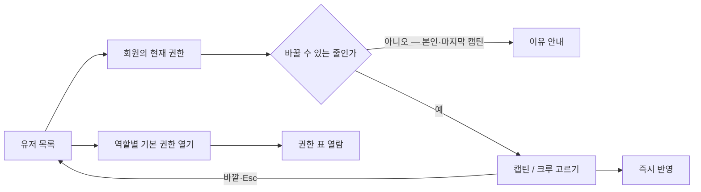
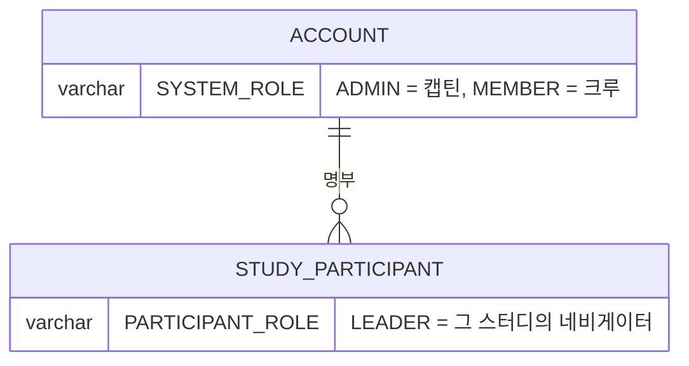

# 캡틴으로서, 유저에게 서로 다른 역할과 권한을 줄 수 있다.

기준 프로토타입: 유저 — 권한 부여 (playground 운영 콘솔 · 유저)

## 1. 기본설명

· **진입·사용 흐름**

· **완료 기준**

1. 유저 목록에서 회원의 계정 권한을 캡틴 또는 크루로 바꿀 수 있다
2. 고르면 그 자리에서 바로 바뀐다
3. 자기 권한은 바꿀 수 없다
4. 마지막 남은 캡틴은 크루로 내릴 수 없다
5. 바꿀 수 없는 줄은 구분되고, 짚으면 이유를 알 수 있다
6. 역할별 기본 권한 표를 열어 캡틴 · 네비게이터 · 크루가 각각 무엇을 할 수 있는지 볼 수 있다
7. 네비게이터는 이 화면에서 주지 않는다. 스터디마다 그 스터디의 크루 명단에서 정한다

## 2. 화면명세

> **화면**: 유저 (운영 콘솔) — 권한 칸 · 기본 권한 표

### 1. 현재 권한

- **내용**
  - 그 회원의 지금 권한. 바꿀 수 있는 자리임이 드러난다
  - 바꿀 수 없는 줄은 구분되고, 짚으면 이유를 알려 준다
- **동작**: 누르면 고를 수 있는 값(2)이 열린다
- **정책**: 캡틴과 크루는 색만으로 구분하지 않는다
- **데이터**: `ACCOUNT.SYSTEM_ROLE`

### 2. 권한 고르기

- **내용**: 캡틴 · 크루
- **동작**
  - 고르면 그 자리에서 바로 바뀐다. 저장 조작이 따로 없다
  - 바깥을 누르거나 Esc → 바꾸지 않고 닫힌다
- **정책**
  - 순서는 캡틴 → 크루
  - 지금 값을 목록 안에서 따로 표시하지 않는다
  - 자기 권한은 바꿀 수 없다
  - 마지막 캡틴은 내릴 수 없다
  - 역할 밖의 개별 권한 예외는 두지 않는다
- **데이터**: `ACCOUNT.SYSTEM_ROLE` (쓰기)
- **조건**: 현재 권한을 눌렀을 때

### 3. 역할별 기본 권한 열기

- **동작**: 누르면 역할별 기본 권한 표(4)가 열린다
- **정책**: 표를 목록 화면에 펼쳐 두지 않는다

### 4. 역할별 기본 권한 표

- **내용**
  - 표 둘: 스터디 단위 권한(캡틴 · 네비게이터 · 크루) 넷, 사이트 전체 권한(캡틴 · 크루) 일곱
  - 첫 칸 머리는 「하는 일」
  - 스터디 단위 표 제목 옆 「네비게이터 권한은 담당 스터디에 국한」
- **동작**: 열람 전용이다. 여기서 권한을 바꾸지 않는다
- **정책**
  - 담당 스터디 안의 일과 사이트 전체에 미치는 일을 한 표에 섞지 않는다
  - 역할 순서는 권한이 많은 쪽부터 (캡틴 → 네비게이터 → 크루)
  - 출석 체크는 권한이 아니다. 기록된 출석을 고치는 일이 권한이다
  - 스터디 공개는 정보 수정과 다른 권한이다
  - 스터디 공지와 사이트 공지를 이름으로 가른다
  - 반 편성은 사이트 전체 표에 둔다 — 네비게이터가 못 하는 일이다
- **데이터**: 역할별 허용 권한 집합 — `proto/console/lib/roles.ts` 한 곳에서 정의
- **조건**: 3 을 눌렀을 때

### 상태별 화면

| 상태 | 화면 | 카피 |
| --- | --- | --- |
| 기본 | 권한 칸 | `캡틴` · `크루` |
| 바꿀 수 없음 | 구분된 권한 칸, 짚으면 이유 | 본인 · 마지막 캡틴 사유 |
| 고르는 중 | 선택지 | `캡틴` · `크루` |
| 완료 | 바뀐 권한 | — |

### 데이터 관계

### 비고

- 범위 밖: 네비게이터 지정 — [captain-view-attendees](../captain-view-attendees/PRD.md), 회원 정지
- 미구현: 권한 변경은 화면에서만 처리한다. 저장 API 가 없다

## 3. 시스템 요건

### 데이터

| 화면 이름 | 저장 값 |
| --- | --- |
| 캡틴 | `ACCOUNT.SYSTEM_ROLE = ADMIN` |
| 크루 | `ACCOUNT.SYSTEM_ROLE = MEMBER` |
| 네비게이터 | 계정 값 아님. `STUDY_PARTICIPANT.PARTICIPANT_ROLE = LEADER` |

### 처리

- 요청자 본인의 권한 변경은 거절한다
- 대상이 마지막 `ADMIN` 이고 `MEMBER` 로 내리는 요청은 거절한다. 판정은 같은 트랜잭션 안에서 `ADMIN` 수를 세서 한다
- 백오피스 로그인은 `SYSTEM_ROLE = ADMIN` 만 통과하므로, 캡틴으로 올린 회원은 다음 로그인부터 백오피스에 들어온다 — [back-office-login/spec.md](../../../specs/back-office-login/spec.md)

### API

| 메서드 | 경로 | 권한 |
| --- | --- | --- |
| PATCH | 계정 권한 변경 — `/api/admin` 아래, 미정 | 캡틴 |

### 권한

- 캡틴만. 서버에서 검증한다

### 외부 연동

- 없음

## 4. 미확정

- 권한 변경 API 경로와 스펙 위치
- 백엔드 Role 이름과 화면 이름의 매핑 — 코드의 `STUDENT/OPERATOR/ADMIN` 과 ERD 의 `MEMBER/ADMIN` 이 다르다
- 권한 변경 이력(누가 언제 바꿨는지)을 남길지
