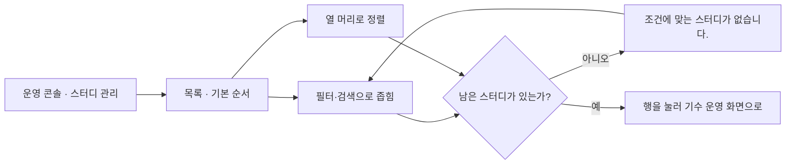
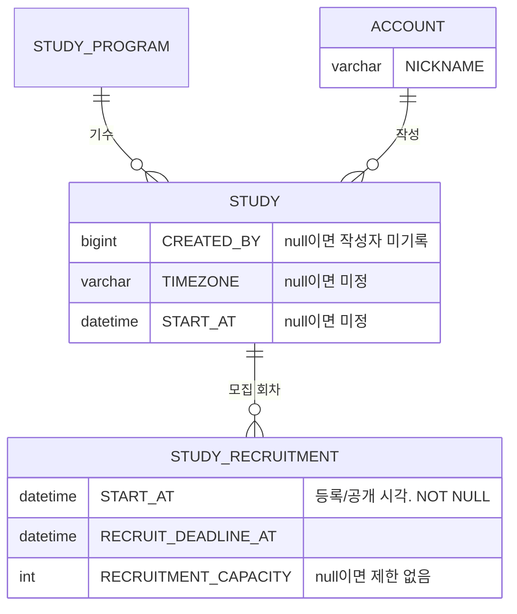

# 캡틴으로서, 모든 스터디의 리스트를 볼 수 있다.

기준 프로토타입: 스터디 관리 (playground 운영 콘솔 · 스터디 목록)

## 1. 기본설명

· **진입·사용 흐름**

· **완료 기준**

1. 목록 한 행에서 스터디의 주제·종류·시간대·모집 일정·모집 상태·지원 현황·시작일·신청 폼·공개 상태·작성자를 함께 볼 수 있다
2. 지원 현황으로 현재 인원과 정원을 비교할 수 있다. 정원이 없는 스터디는 제한 없음으로 읽힌다
3. 작성자 열로 그 스터디를 등록한 캡틴을 알 수 있다. 작성자가 기록되지 않은 스터디는 「—」로 보인다
4. 검색·주제·상태·종류·모집·공개 조건으로 목록을 좁힐 수 있다
5. 「신청 폼 없는 것만」을 켜면 신청 폼이 없는 스터디만 남는다
6. 어느 열이든 오름차순·내림차순으로 정렬할 수 있고, 같은 화살표를 다시 누르면 기본 순서로 돌아간다
7. 열 순서를 끌어서 바꿀 수 있고, 바꾼 순서가 다음 방문에도 유지된다. 「컬럼 순서 초기화」로 되돌릴 수 있다
8. 한 페이지에 20개씩 보이고, 필터·검색·정렬을 바꾸면 1페이지로 돌아간다
9. 목록에 스터디의 출석률이 보이지 않는다

## 2. 화면명세

> **화면**: 스터디 관리 (운영 콘솔)

### 1. 지원 현황

- **내용**: 열 이름 「지원 현황」. 「현재/정원」. 정원을 비운 스터디는 「현재 · 제한 없음」
- **정책**
  - 현재 인원은 신청 명부에서 계산한다. 운영자가 입력하지 않는다
  - 정원은 등록 폼의 「모집 정원」이다. 모집 회차마다 따로 정한다
- **데이터**: `STUDY_RECRUITMENT.RECRUITMENT_CAPACITY` · 신청 명부의 참여자 수

### 2. 모집 시작일

- **내용**: 모집을 시작한 날. 시작 전이면 「—」
- **정책**
  - 모집 시작일은 공개한 날이다
  - 모집 상태(모집중 · 마감)와 다른 열로 둔다
- **데이터**: `STUDY_RECRUITMENT.START_AT`

### 2-1. 모집 종료일

- **내용**: 모집 마감일
- **정책**: 필수 값이다. 이 날이 지나면 모집 마감으로 판정한다
- **데이터**: `STUDY_RECRUITMENT.RECRUIT_DEADLINE_AT`

### 2-2. 종류

- **내용**: 「스터디」 · 「클럽」
- **정책**
  - 프로그램의 속성이다. 같은 프로그램의 기수는 모두 같은 값이다
  - 새 프로그램 등록 때 정하고 이후 바꾸지 않는다
- **데이터**: `STUDY_PROGRAM.STUDY_KIND`

### 2-3. 시간대

- **내용**: 「KST」 · 「PST」 · 「동시 진행(KST·PST)」. 값이 없으면 「미정」
- **정책**: 등록 폼에서 운영자가 고른 값을 그대로 쓴다. 일정 문구로 추정하지 않는다
- **데이터**: `STUDY.TIMEZONE`

### 3. 스터디 시작일

- **내용**: 모임이 실제로 시작하는 날. 등록 폼의 「진행 시작일」과 같은 값. 없으면 「미정」
- **정책**: 자유 텍스트 「진행 일정」은 목록에 두지 않는다 — 정렬·필터를 걸 수 없다
- **데이터**: `STUDY.START_AT`

### 4. 필터

- **내용**: 검색 · 주제 · 상태 · 종류 · 모집 · 공개 조건과 「신청 폼 없는 것만」, 걸린 개수
- **동작**: 조건을 바꾸면 그 자리에서 목록이 좁혀진다
- **정책**
  - 조건들을 한 줄에 둔다. 좁은 화면에서는 줄바꿈 대신 옆으로 넘긴다
  - 주제는 한 번에 하나만 고른다 — `STUDY.CATEGORY` 가 단일 값이다
  - 각 조건의 「전체」 항목에 축 이름을 붙인다 (예: 「공개 전체」)
  - 개수는 필터에 걸린 전체 개수다. 현재 페이지의 개수가 아니다

### 5. 신청 폼 필터

- **내용**: 「신청 폼 없는 것만」
- **동작**: 켜면 신청 폼이 없는 스터디만 남는다. 끄면 전체
- **데이터**: 스터디의 신청 폼 유무

### 6. 컬럼 순서 변경

- **내용**: 열을 옮길 수 있는 자리임이 드러난다. 순서가 기본과 다르면 「컬럼 순서 초기화」
- **동작**
  - 열 머리를 끌어다 놓아 옮긴다
  - 바꾼 순서는 이 브라우저에 저장된다
  - 「컬럼 순서 초기화」를 누르면 기본 순서로 돌아간다
- **정책**: P-ID · 스터디 두 열은 맨 앞에 고정한다. 이 두 열은 옮기지 못한다

### 7. 가로 스크롤바

- **내용**: 표 위에서도 가로로 넘길 수 있다
- **동작**: 위·아래 스크롤이 함께 움직인다
- **정책**: 행이 많아도 표 맨 아래까지 내려가지 않고 옆 열을 볼 수 있어야 한다

### 8. 페이징

- **내용**: 페이지 번호 · 「이전」 · 「다음」. 번호가 많으면 앞뒤를 「…」로 줄인다
- **동작**: 필터·검색·정렬을 바꾸면 1페이지로 돌아간다
- **정책**
  - 한 페이지 20개
  - 한 페이지에 다 들어가면 페이지 번호를 보이지 않는다

### 9. 컬럼 정렬

- **내용**: 열마다 오름차순·내림차순 조작. 걸려 있는 방향이 구분되어 보인다
- **동작**
  - 오름차순·내림차순을 누르면 바로 정렬된다
  - 걸려 있는 방향을 다시 누르면 정렬이 풀리고 기본 순서로 돌아간다
  - 다른 열을 누르면 정렬이 그 열로 옮겨 간다
- **정책**
  - 한 번에 한 열로만 정렬한다
  - 기본 순서: 모집중 먼저, 그 안에서 모집 종료일이 가까운 순
  - 값이 없는 행은 방향과 관계없이 맨 뒤로 보낸다
  - 정렬 대상: P-ID · 스터디 · 스터디 상태 · 주제 · 종류 · 시간대 · 모집 시작일 · 모집 종료일 · 모집 상태 · 지원 현황 · 스터디 시작일 · 신청 폼 · 공개 상태 · 작성자

### 10. 작성자

- **내용**: 이 스터디를 등록한 캡틴의 닉네임. 작성자가 기록되지 않은 스터디는 「—」
- **정책**
  - 스터디를 등록한 계정이 작성자다. 등록 요청을 보낸 계정을 서버가 채운다
  - 등록 폼에서 작성자를 고르지 않는다
  - 등록 뒤에는 바뀌지 않는다. 스터디를 수정한 사람이 달라도 작성자는 그대로다
  - 닉네임만 보인다. 이메일은 목록에 두지 않는다
- **데이터**: `STUDY.CREATED_BY` → `ACCOUNT.NICKNAME`

### 상태별 화면

| 상태 | 화면 | 카피 |
|---|---|---|
| 기본 | 기본 순서로 첫 페이지 | 「N개」 |
| 빈 결과 | 필터·검색에 걸린 스터디가 없음 | 「조건에 맞는 스터디가 없습니다.」 |

### 데이터 관계

### 비고

- **범위 밖**: 공개 설정·신청 폼 열·공개 필터 · 스터디 상태 열·안내·필터 · P-ID 열 · 등록·수정·삭제 · 출석 기록
- **미구현**
  - `STUDY.CREATED_BY` 컬럼이 없다. 등록 API 가 작성자를 기록하지 않는다
  - 운영 콘솔 전용 목록 API 가 없다. 프로토는 mock 데이터로 그린다
  - 프로토의 작성자는 mock 캡틴 중 한 명을 스터디마다 고정으로 배정한 값이다

## 3. 시스템 요건

· **데이터**

| 필드 | 타입 | 필수 | 뜻 |
|---|---|---|---|
| `STUDY.CREATED_BY` | BIGINT | N | 작성자. ACCOUNT 참조(인덱스만, 외래키 없음). null = 컬럼이 생기기 전에 등록된 스터디 |

· **처리**
- 스터디 등록(`POST /api/admin/studies`) 시 서버가 인증된 계정의 ID 로 `CREATED_BY` 를 채운다
- 요청 바디로 작성자를 받지 않는다
- 스터디 수정(`PATCH /api/admin/studies/{studyId}` · 네비게이터용 `PATCH /api/studies/{studyId}`)은 작성자를 바꾸지 않는다
- 기존 스터디는 백필하지 않는다. null 로 둔다

· **API**
- 목록: 운영 콘솔용 스터디 목록 응답에 작성자 닉네임을 포함한다. DRAFT 를 포함해야 하므로 공개용 `GET /api/studies` 와 분리해 `/api/admin` 아래 둔다
- 출석률은 목록 응답에 넣지 않는다

· **권한**
- 목록 조회: `SYSTEM_ROLE=ADMIN`. 서버에서 검증한다

· **계산 규칙**
- 지원 현황의 현재 인원: 신청 명부의 참여자 수. 정의 위치 [study-recruit-status/spec.md](../../../specs/study-recruit-status/spec.md)
- 모집 상태: 모집 종료일 경과 또는 정원 도달. 정의 위치 같음

## 4. 미확정

- 운영 콘솔 목록 API 의 경로·응답 필드 (`GET /api/admin/studies`)
- 작성자 계정이 탈퇴한 경우의 표시
