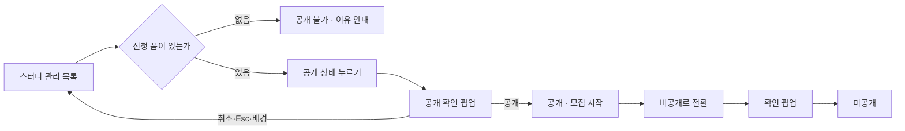
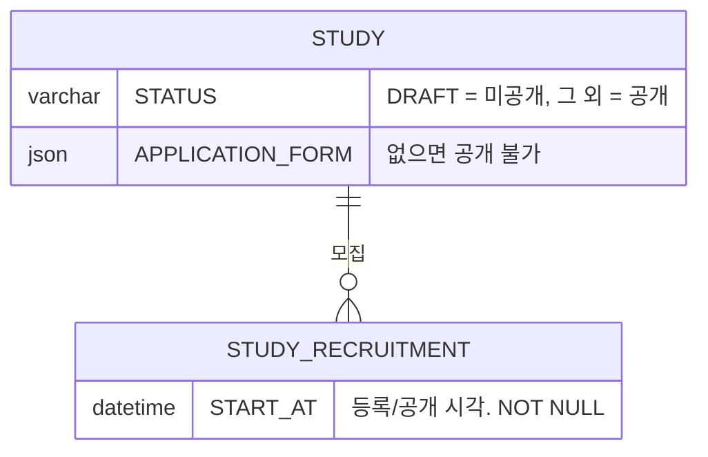

# 캡틴으로서, 등록한 스터디를 공개할 수 있다.

기준 프로토타입: 스터디 관리 — 공개 설정 (playground 운영 콘솔 · 스터디 관리 목록)

## 1. 기본설명

· **진입·사용 흐름**

· **완료 기준**

1. 스터디 목록의 각 행에서 공개 · 미공개를 바꿀 수 있다
2. 공개하면 그날이 모집 시작일이 되고, 스터디 상태가 「개설」이 되어 사용자 사이트에 보인다
3. 공개 · 비공개 전환은 확인 팝업에서 한 번 더 눌러야 바뀐다
4. 신청 폼이 없는 스터디는 공개할 수 없고, 그 이유를 알 수 있다
5. 공개한 스터디를 다시 미공개로 내릴 수 있다. 상태는 「작성 중」으로 돌아간다
6. 등록한 직후 스터디는 늘 미공개다
7. 행마다 신청 폼이 걸려 있는지 볼 수 있다
8. 공개 · 미공개로 목록을 걸러 볼 수 있다

## 2. 화면명세

> **화면**: 스터디 관리 (운영 콘솔) — 목록의 공개 관련 열

### 1. 공개 설정

- **내용**: 이 스터디가 사용자 사이트에 보이는가 — 「공개」 · 「미공개」
- **동작**
  - 누르면 공개 확인 팝업(4)이 뜬다
  - 공개 → 미공개도 같은 자리에서 한다
- **정책**
  - 공개가 곧 모집 시작이다. 스터디 상태가 「개설」(`OPEN`)이 되고 모집 시작일이 채워진다
  - 등록 직후는 늘 미공개다
  - 예약 공개는 없다
  - 두 상태는 색만으로 구분하지 않는다
- **데이터**: `STUDY.STATUS` · `STUDY_RECRUITMENT.START_AT` (쓰기)

### 1-1. 공개할 수 없는 상태

- **내용**: 누를 수 없는 자리임이 드러나고, 짚으면 「신청 폼을 먼저 연결하세요.」
- **정책**
  - 신청 폼이 없으면 공개하지 못한다
  - 공개 → 미공개는 신청 폼과 관계없이 언제나 된다
- **조건**: 신청 폼이 연결되지 않았을 때

### 2. 신청 폼

- **내용**: 그 스터디에 신청 폼이 걸려 있는가
- **정책**
  - 공개 설정 바로 앞에서 확인할 수 있다
  - 모집중인데 폼이 없을 때만 눈에 띄게 알린다
  - 여기서 폼을 붙이지 않는다. 폼은 스터디 운영 화면에서 만든다 — [captain-application-form](../captain-application-form/PRD.md)
- **데이터**: `STUDY.APPLICATION_FORM` (읽기)

### 3. 공개 필터

- **내용**: 「공개 전체」 · 「공개」 · 「미공개」
- **동작**: 고른 상태의 스터디만 남는다

### 4. 공개 확인 팝업

- **내용**
  - 공개할 때: 「‘스터디명’ 스터디를 공개하시겠습니까?」 — 오늘이 모집 시작일이 되고 상태가 「개설」이 되어 사이트에 보인다는 안내
  - 내릴 때: 「비공개로 전환하시겠습니까?」 — 사이트에서 내려가고 상태가 「작성 중」으로 돌아간다는 안내
- **동작**
  - 「공개」 / 「비공개로 전환」을 눌러야 바뀐다
  - 「취소」 · 배경 클릭 · Esc 는 아무것도 바꾸지 않는다
- **정책**: 누르자마자 바뀌지 않는다
- **조건**: 공개 설정을 눌렀을 때

### 상태별 화면

| 상태 | 화면 | 카피 |
| --- | --- | --- |
| 미공개 | 공개 설정 | `미공개` |
| 공개 | 공개 설정 | `공개` |
| 공개 불가 | 누를 수 없는 공개 설정 | `신청 폼을 먼저 연결하세요.` |
| 공개 확인 | 팝업 | `‘스터디명’ 스터디를 공개하시겠습니까?` |
| 비공개 확인 | 팝업 | `비공개로 전환하시겠습니까?` |

### 데이터 관계

### 비고

- 범위 밖: 등록 · 수정 · 삭제, 신청 폼 만들기
- 미구현: 프로토는 공개 전환을 화면에서만 처리한다

## 3. 시스템 요건

### 데이터

| 동작 | 조건 | 결과 |
| --- | --- | --- |
| 공개 | `STATUS = DRAFT` 이고 신청 폼이 있음 | `STATUS = OPEN`, 최신 모집 회차 `START_AT = now` |
| 공개 취소 | `STATUS = OPEN` | `STATUS = DRAFT` (`START_AT` 유지 — 공개됐던 시각 보존) |

### 처리

- 사이트 노출은 `STATUS != DRAFT` 하나로 판정한다
- 이미 공개인데 공개, `DRAFT` 에서 공개 취소, `ONGOING` 이후 공개 취소 → 409
- 신청 폼 없이 공개 → 422
- 확인 팝업은 화면의 절차다. 서버에 확인 단계는 없다

### API

| 메서드 | 경로 | 권한 |
| --- | --- | --- |
| POST | `/api/studies/{studyId}/publish` | 캡틴 |
| POST | `/api/studies/{studyId}/unpublish` | 캡틴 |

계약은 [study/spec.md 스터디 공개](../../../specs/study/spec.md#스터디-공개--공개-취소).

### 권한

- 캡틴만. 스터디 정보 수정 권한과 다르다 — 네비게이터는 공개하지 못한다. 서버에서 검증한다

### 외부 연동

- 없음

## 4. 미확정

- 공개 취소 조건 — 신청이 있는 스터디도 내릴 수 있는지, 내리면 신청자는 어떻게 되는지
- 공개 API 경로 형태와 신청 폼 없음의 응답 코드
