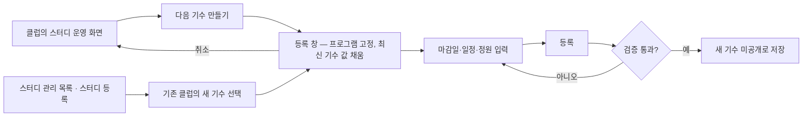
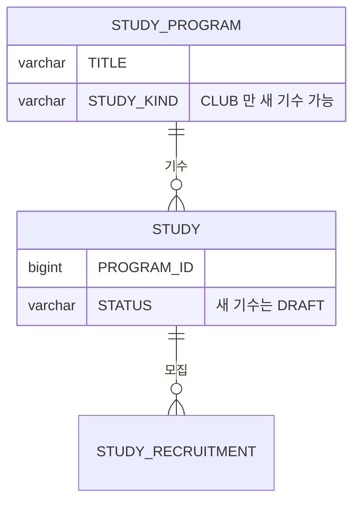

# 캡틴으로서, 기존 스터디를 재등록할 수 있다.

기준 프로토타입: 스터디 운영 — 다음 기수 만들기 (playground 운영 콘솔 · 클럽의 스터디 운영 화면)

## 1. 기본설명

· **배경** — 재등록은 기수제다. 스터디(`STUDY_KIND = STUDY`)는 한 번 모집해 한 번 진행하므로 다음 공고는 새 프로그램이고, 기존 프로그램에 기수를 이어 붙일 수 있는 것은 클럽(`CLUB`)뿐이다.

· **진입·사용 흐름**

· **완료 기준**

1. 클럽의 운영 화면에서 다음 기수를 만들 수 있다. 스터디 종류에는 이 길이 없다
2. 등록 창의 스터디 등록에서 「기존 클럽의 새 기수」를 골라도 같은 결과가 된다
3. 새 기수 창은 프로그램이 정해진 채 열리고, 제목·한 줄 소개·상세 설명·주제가 채워져 있다
4. 모집 마감일·진행 일정·정원은 비어 있다. 기수마다 다시 정한다
5. 채워진 값을 고쳐도 지난 기수 값은 바뀌지 않는다
6. 새 기수는 같은 프로그램 아래에 미공개로 저장된다

## 2. 화면명세

> **화면**: 스터디 운영 — 머리 · 등록 창

### 1. 다음 기수 만들기

- **내용**: 운영 화면 머리의 「다음 기수 만들기」
- **동작**: 누르면 등록 창(2)이 이 스터디의 프로그램으로 정해진 채 열린다
- **정책**: 종류가 클럽인 프로그램의 기수에만 보인다
- **조건**: 클럽의 운영 화면

### 2. 새 기수 등록 창

- **내용**
  - 프로그램: 이 스터디의 프로그램으로 정해져 있다
  - 제목: 프로그램 제목
  - 한 줄 소개 · 상세 설명 · 주제: 최신 기수 값
  - 시간대 · 디스코드 채널 주소 · 자료 드라이브 주소: 최신 기수 값
  - 모집 마감일 · 진행 일정 · 정원: 비어 있음
- **동작**
  - 등록 · 취소와 항목별 입력 규칙은 신규 등록과 같다 — [captain-create-study](../captain-create-study/PRD.md)
- **정책**
  - 채운 값은 시작점일 뿐이다. 새 기수를 고쳐도 지난 기수는 그대로다
  - 「최신 기수」는 같은 프로그램에서 `STUDY.ID` 가 가장 큰 기수다
  - 클럽은 기수가 바뀌어도 같은 채널·드라이브·시간대를 이어 쓴다
- **데이터**: `POST /api/admin/studies` 에 `studyProgramId` 를 담는다

### 상태별 화면

| 상태 | 화면 | 카피 |
| --- | --- | --- |
| 기본 | 최신 기수 값이 채워진 창 | — |
| 검증 실패 | 칸별 오류 | 신규 등록과 같은 문구 |
| 처리중 | 등록 잠김 | — |
| 완료 | 완료 화면 | — |

### 데이터 관계

### 비고

- 범위 밖: 지난 기수 참여자의 자동 이월, 새 기수 공개
- 미구현: 프로토는 저장하지 않는다

## 3. 시스템 요건

### 데이터

- 새 `STUDY` 행과 `STUDY_RECRUITMENT` 1행을 만든다. `STUDY.PROGRAM_ID` = 요청의 `studyProgramId`
- 프로그램 행은 새로 만들지 않는다

### 처리

- `studyProgramId` 의 프로그램이 없거나 `CLUB` 이 아니면 400
- `studyKind` 를 함께 보내면 400 — 기존 프로그램의 종류는 바꾸지 않는다
- 나머지 검증은 신규 등록과 같다

### API

| 메서드 | 경로 | 권한 |
| --- | --- | --- |
| GET | `/api/admin/studies/{studyId}` — 최신 기수 값 채우기 | 캡틴 |
| POST | `/api/admin/studies` (`studyProgramId` 포함) | 캡틴 |

계약은 [study/spec.md 스터디 등록](../../../specs/study/spec.md#스터디-등록) AC-7.

### 권한

- 캡틴만. 서버에서 검증한다

### 외부 연동

- 디스코드 연결은 신규 등록과 같다 — [discord-study-link/spec.md](../../../specs/discord-study-link/spec.md)

## 4. 미확정

- 기수마다 제목이 같아지는 문제 — 기수 표기를 붙일지, 제목을 유일하게 둘지
- 지난 기수 참여자를 새 기수로 이어 받는 방법
