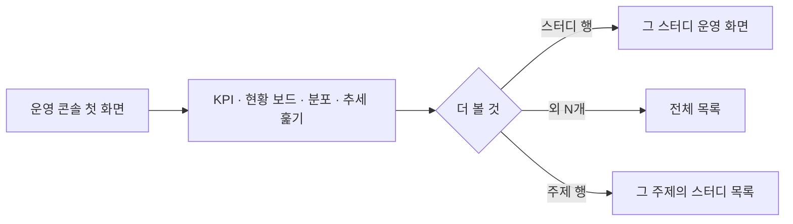
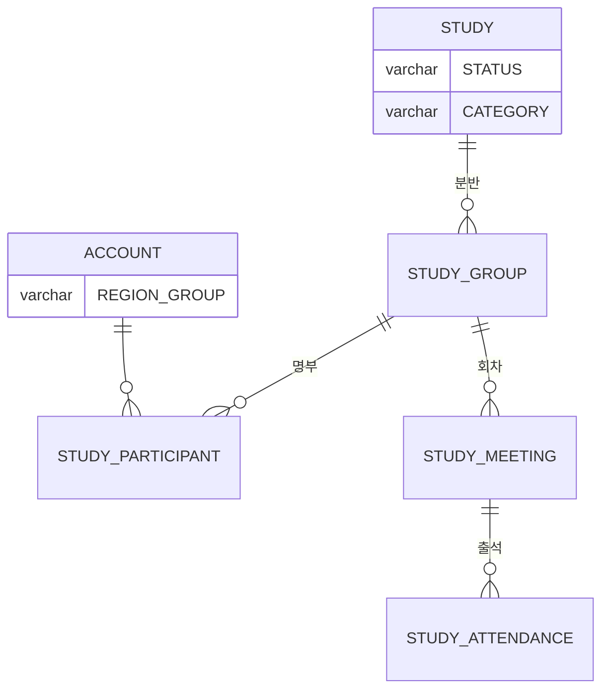

# 캡틴으로서, 스터디클럽 웹사이트의 운영 현황을 볼 수 있다.

기준 프로토타입: 대시보드 (playground 운영 콘솔 · 첫 화면)

## 1. 기본설명

· **진입·사용 흐름**

· **완료 기준**

1. 이 화면의 수가 어느 범위이고 언제 읽은 것인지 알 수 있다
2. 활성 크루 · 평균 출석률 · 크루 1인당 참여 스터디 · 커뮤니티 멤버를 한눈에 볼 수 있다
3. 평균 출석률이 지난주보다 오르고 내린 폭을 알 수 있다. 지난주 값이 없으면 변화를 보이지 않는다
4. 진행중 스터디 · 모집중 스터디 · 예정 행사를 동시에 보고, 각 건수를 알 수 있다
5. 모집중 스터디는 마감이 가까운 것부터, 남은 일수와 함께 보인다
6. 크루가 어느 지역에 얼마나 있는지 비율과 인원으로 알 수 있다
7. 최근 12주 출석률 흐름과 12주 평균을 볼 수 있다. 체크된 회차가 없는 주는 0% 가 아니라 값 없음이다
8. 주제별 스터디 수를 진행중 · 누적으로 바꿔 볼 수 있고, 주제를 눌러 그 주제의 목록으로 갈 수 있다
9. 스터디 행을 누르면 그 스터디로 간다

## 2. 화면명세

> **화면**: 대시보드 (운영 콘솔)

### 1. 제목 줄

- **내용**: 「대시보드」

### 1-1. 기준 · 갱신 시각

- **내용**: 이 화면의 수가 어느 범위이고 언제 읽은 것인가
- **정책**: 범위와 시각을 함께 적는다

### 2. KPI

- **내용**: 커뮤니티의 규모와 건강을 네 가지로 요약한다
- **정책**
  - 넷을 같은 비중으로 둔다
  - 넷 다 전 기간을 센다. 기간을 고를 수 없다

### 2-1. 활성 크루

- **내용**: 지금 스터디를 하고 있는 사람 수와 세는 범위
- **정책**
  - 사람을 센다. 한 사람이 두 스터디에 있어도 1 이다
  - 2-3 의 분모와 같은 집합이다
- **데이터**: 진행 중 스터디의 참여자 (동일인 중복 제거)

### 2-2. 평균 출석률

- **내용**: 전체 스터디를 합친 출석률. 정수 %. 지각을 포함해 센다는 사실
- **데이터**: (출석 + 지각 × 0.5) / 대상 회차. 휴가는 분모에서 뺀다

### 2-2-1. 전주 대비

- **내용**: 지난주보다 오르고 내린 폭(%p). 오름과 내림을 구분해 알린다
- **정책**
  - 이 카드는 내림을 나쁜 변화로 다룬다
  - 지난주 값이 없으면 보이지 않는다. 「–」를 두지 않는다
- **조건**: 지난주 값이 있을 때

### 2-3. 크루 1인당 참여 스터디

- **내용**: 한 사람이 평균 몇 개의 스터디를 하는가. 소수 한 자리
- **정책**: 같은 사람의 같은 스터디 중복 등록은 분자에서 뺀다
- **데이터**: 진행 중 스터디의 참여 건수 ÷ 활성 크루(2-1)

### 2-4. 커뮤니티 멤버

- **내용**: 가입한 사람 수와 그들의 지역
- **정책**: 가입 전체 수다. 활성 크루(2-1)와 다른 모수다

### 3. 현황 보드

- **내용**: 진행중 · 모집중 · 예정 행사 셋과 각 건수
- **정책**
  - 셋을 동시에 보여 준다. 하나만 고르게 하지 않는다
  - 묶음마다 최대 4건을 보여 주고 나머지는 건수로 접는다
  - 건수가 0이든 최대든 이 영역의 높이는 같다

### 3-1. 진행중 스터디

- **내용**: 지금 진행 중인 스터디 이름
- **동작**: 행을 누르면 그 스터디로 간다
- **정책**
  - 이름 외의 값(출석률·회차)은 적지 않는다
  - 이름순이다

### 3-2. 모집중 스터디

- **내용**: 스터디 이름, 마감일과 남은 일수
- **정책**
  - 마감이 가까운 것부터
  - 임박(7일 이내) · 오늘 마감 · 마감 경과를 서로 구분한다. 색만으로 가르지 않는다

### 3-3. 예정 행사

- **내용**: 행사 이름, 날짜와 남은 일수. 당일이면 그 사실
- **정책**: 행사 타입은 적지 않는다

### 3-4. 외 N개

- **내용**: 보여 주지 못한 건수
- **동작**: 누르면 전체 보기로 간다
- **조건**: 항목이 4개를 넘을 때

### 4. 크루 지역 분포

- **내용**: 지역별 비율과 인원, 그 지역의 시간대
- **정책**: 시간대는 계절을 타지 않는 이름으로 적는다. 북미는 PT
- **데이터**: 활성 크루의 거주 지역

### 5. 평균 출석률 추세

- **내용**: 최근 12주 출석률을 주 단위, 시간 순으로
- **동작**: 한 주를 집으면 그 주의 출석률과 밑재료를 알린다 — 「2026-08-24 주 · 출석률 68% (출석 412 / 대상 606)」
- **정책**
  - 체크된 회차가 없는 주는 값 없음이다. 0% 로 알리지 않는다
  - 값이 한 주뿐이어도 그 값을 보인다
  - 값이 하나도 없을 때만 그 사실을 적는다

### 5-1. 12주 평균

- **내용**: 그 기간의 평균. 각 주가 평균보다 위인지 아래인지 견줄 수 있다
- **정책**: 값이 있는 주만으로 계산한다

### 6. 주제별 스터디 수

- **내용**: 주제별 스터디 수. 많은 주제부터, 서로의 크기를 견줄 수 있게
- **동작**: 행을 누르면 그 주제의 스터디 목록으로 간다
- **정책**
  - 개수만 보여 준다. 출석률을 얹지 않는다
  - 크기 비교는 보이는 가장 많은 주제를 기준으로 한다
  - 주제는 스터디마다 하나다. 주제별 합계는 총 스터디 수와 같다
- **데이터**: 목록으로 넘길 때 표시 라벨이 아니라 주제 코드를 쓴다

### 6-1. 진행중 · 누적

- **내용**: 세는 범위 — 「진행중」 · 「누적」. 기본은 진행중
- **동작**: 고르면 개수와 순서가 다시 계산된다. 0개인 주제는 나오지 않는다
- **정책**
  - 진행중은 종료된 스터디를 뺀다. 누적은 종료분까지 센다
  - 고른 범위는 저장하지 않는다. 새로고침하면 진행중으로 돌아간다

### 상태별 화면

| 상태 | 화면 | 카피 |
| --- | --- | --- |
| 기본 | KPI · 보드 · 분포 · 추세 · 주제 | 기준 범위 · 갱신 시각 |
| 전주 값 없음 | 전주 대비 숨김 | — |
| 추세 값 없음 | 추세 영역 | 값이 없다는 안내 |
| 묶음 초과 | 외 N개 | `외 N개` |

### 데이터 관계

### 비고

- 범위 밖: 기간 필터, 행사 관리
- 구현 지시: 자동 갱신 없음 — 새로고침으로만 다시 읽는다
- 미구현: 위젯별 로딩·오류 상태. 연동 시 함께 정의

## 3. 시스템 요건

### 데이터

- 읽기 전용. 저장하는 값이 없다

### 처리

- 모든 KPI 는 전 기간 기준. 추세만 최근 12주

### 계산 규칙 (단일 정의)

- 활성 크루: `STATUS = ONGOING` 스터디의 `STUDY_PARTICIPANT` 중 서로 다른 `ACCOUNT_ID` 수
- 평균 출석률: (PRESENT + LATE × 0.5) / (체크된 출석 − EXCUSED). [attendance/spec.md](../../../specs/attendance/spec.md) 산식과 같다
- 1인당 참여 스터디: 진행 중 스터디의 (계정, 스터디) 쌍 수 ÷ 활성 크루
- 주 단위 출석률: 그 주 회차만으로 같은 식. 분모 0 이면 null

### API

| 메서드 | 경로 | 권한 |
| --- | --- | --- |
| GET | 대시보드 집계 — `/api/admin` 아래, 미정 | 캡틴 |

### 권한

- 캡틴만. 서버에서 검증한다

### 외부 연동

- 없음

## 4. 미확정

- 대시보드 API 경로와 스펙 위치
- 집계를 서버 한 곳에서 할지
- 「주」의 경계를 어느 시간대 기준으로 자를지
- 활성 크루의 「진행 중」에 모집중(`OPEN`) 스터디를 포함할지
