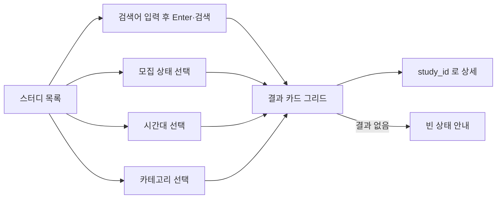
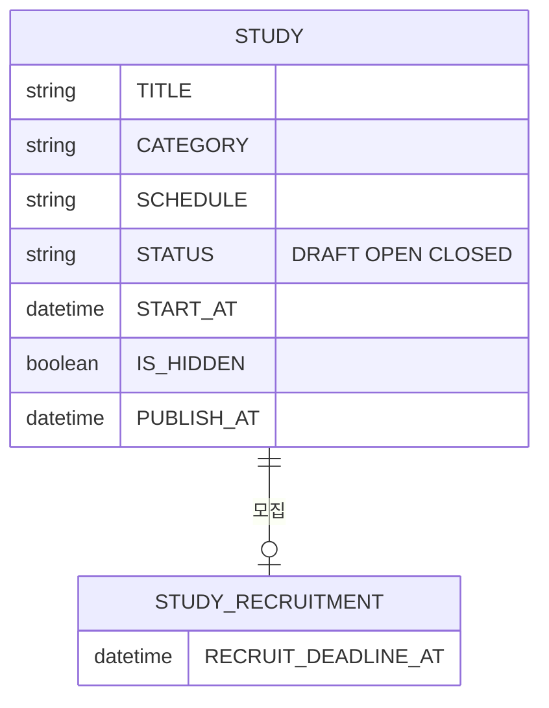

# 크루로서, 스터디 목록을 둘러보고 검색·필터링할 수 있다.

기준 프로토타입: 스터디 목록 (playground 사용자 사이트 · 스터디 목록)

## 1. 기본설명

· **배경**

회원가입 전에도 어떤 스터디가 열려 있는지 둘러볼 수 있어야 함. 분야가 다양해지며 검색·필터 없이는 원하는 스터디를 찾기 어려움

· **하는 일**

- 전체 스터디를 카드 그리드로 봄
- 제목·소개로 검색
- 모집 상태(전체·모집 중·진행 중·종료)로 걸러 봄
- 시간대(KST·PST·동시 모집)로 걸러 봄
- 분야(카테고리)로 걸러 봄
- 카드 상단 배지로 모집 상태(모집중 D-N·마감 임박·상시 모집·진행중·모집 마감)를 한눈에 확인
- 카드에서 시간대·시작 예정일을 확인하고, `study_id`로 상세에 들어가 신청

· **진입·사용 흐름**

· **완료 기준**

1. 로그인 여부와 무관하게 전체 공개 스터디를 볼 수 있다
2. 검색어·모집 상태·시간대·카테고리 조건을 모두 만족하는 카드만 남는다
3. 조건을 만족하는 카드가 없으면 빈 상태를 안내한다. 검색어가 있었으면 지우는 버튼도 함께 준다
4. 카드에는 신청하기·찜 버튼을 두지 않는다 — 신청·찜은 상세로 이동해야 할 수 있다
5. 카드 상단에는 모집 상태 배지가 항상 있다 — 모집 중이면 `모집중 (D-N)`(마감 3일 이내는 배지 색이 바뀐다), 마감일이 없으면 `상시 모집`, 진행 중이면 `진행중`, 끝났으면 `모집 마감`
6. 카드 본문에는 시작 예정일을 항상 보여준다 — 값이 없으면 `미정`으로 명시하고 빈 칸으로 두지 않는다. 모집 마감일은 상단 배지와 겹치므로 본문에 따로 두지 않는다
7. 카드는 스터디가 도는 시간대(KST·PST·동시 모집)를 항상 보여준다
8. 결과 목록에는 정렬 컨트롤을 두지 않는다 — 항상 등록 순서(스터디 순번)로 고정 표시한다
9. 카드를 누르면 그 스터디 상세로 이동한다. 주소 키는 `study_id`다 — [crew-view-study-detail](../crew-view-study-detail/PRD.md)

## 2. 화면명세

> **화면**: 스터디 목록

### 1. 스터디 제목 검색

- **표시**: 검색 아이콘, 입력창. 입력 중이거나 검색어가 적용돼 있으면 지우기(X) 버튼도 함께
- **동작**
  - `Enter` 또는 검색(돋보기) 버튼을 누르면 입력한 검색어가 적용되어 결과가 갱신된다
  - 지우기 버튼을 누르면 입력값과 적용된 검색어를 모두 비운다
- **정책**
  - 앞뒤 공백을 제거한다
  - 한국어·영어 제목·소개 문구를 대상으로 대소문자를 구분하지 않고 부분일치로 본다
  - 타이핑 즉시 필터링하지 않는다 — 커밋(Enter·버튼)이 있어야 적용된다
  - 검색어는 주소에 남기지 않는다
- **데이터**: `query`, `study.title.ko`·`study.title.en`·`study.summary.ko`·`study.summary.en`

### 2. 모집 상태 필터

- **표시**: `전체`·`모집 중`·`진행 중`·`종료` 세그먼트 탭
- **동작**: 누르면 즉시 해당 상태의 카드만 남긴다
- **정책**
  - 기본값은 전체. 한 번에 하나만 선택한다
  - 판정은 `recruitState(study)` + `study.status` — 목록·상세·운영 콘솔이 같은 함수를 쓴다. 화면마다 따로 계산하면 표기가 어긋난다
- **데이터**: `study.status`, `recruitState(study)`

### 3. 시간대 필터

- **표시**: 셀렉트(`시간대`·`KST`·`PST`·`동시 모집`)
- **동작**: 선택 즉시 결과에 반영된다
- **정책**
  - 기본값은 전체
  - 일정(`study.schedule`)·킥오프(`study.recruitment.kickoff`) 문구에서 `KST`/`PST`·`PDT` 표기를 읽어 판정한다
  - 어느 표기도 없으면 `동시 모집`으로 분류한다
- **데이터**: `study.schedule`, `study.recruitment.kickoff`

### 4. 카테고리 필터

- **표시**: 카테고리 칩 목록(전체 포함). 선택된 칩은 채워진 원형 표시와 브랜드 색으로 구분
- **동작**: 누르면 즉시 해당 분야의 카드만 남긴다
- **정책**
  - 기본값은 전체. 한 번에 하나만 선택한다
  - 화면에 제공된 canonical 카테고리 옵션만 쓴다
  - 알고리즘·데이터·소프트웨어 개발·커리어·북클럽·기획·PM 은 `study.category` 값이 없어도 제목·소개 문구의 매칭 규칙으로도 잡는다(레거시 자유입력 데이터 대응)
- **데이터**: `category`, `study.category`, `study.title`, `study.summary`

### 5. 스터디 결과 목록

- **표시**: 조건에 맞는 스터디 카드 그리드(2~3열)
- **정책**
  - 검색어·모집 상태·시간대·카테고리 조건을 모두 만족하는 카드만 표시한다
  - 정렬 옵션은 두지 않는다 — 항상 스터디 순번(`order`) 오름차순으로 고정 표시한다
- **데이터**: `filtered studies`

### 5-1. 스터디 카드

- **표시**
  - 상단 컬러 헤더(분야별 색, 고정 높이): 모집 상태 배지(점 + 문구) · 분야 아이콘·분야명 · 제목(최대 2줄)
  - 본문 한 영역(하단을 별도 바로 분리하지 않는다): 소개(최대 2줄) · 일정(있으면) · 시간대 · 시작 예정일
- **동작**: 카드를 누르면 그 스터디 상세로 이동한다. 주소 키는 `study_id`다
- **정책**
  - 신청하기 버튼·찜(하트) 버튼은 이 카드에 두지 않는다 — 신청·찜은 상세에서만 한다
  - 모집 상태 배지: 모집 중이고 마감일이 있으면 `모집중 (D-N)`(`D-DAY`는 당일), 마감일이 없으면 `상시 모집`, 진행 중이면 `진행중`, 끝났으면 `모집 마감`
  - 배지 점 색: 마감 3일 이내(`D-3` 이하)면 마감임박 색, 그 밖의 모집 중은 모집중 색, 진행 중은 진행중 색, 마감은 마감 색 — 마감임박 기준은 백엔드 `isClosingSoon()`과 동일(3일)
  - 시작 예정일: 값이 없으면 `미정` — 빈 칸을 두지 않는다
  - 모집 마감일은 상단 배지가 이미 말하므로(D-N·모집 마감·상시 모집과 항상 겹친다) 본문에 따로 두지 않는다
  - 시간대: 일정·킥오프 문구에 표기가 없으면 `동시 모집(KST·PST)`
- **데이터**: `study`
- **조건**: 필터 결과가 1개 이상일 때

### 6. 빈 상태

- **표시**
  - 검색어가 있을 때: `"{검색어}"에 해당하는 스터디를 찾을 수 없어요` + `검색어 지우기` 버튼
  - 검색어가 없을 때(필터만으로 결과가 0개): 조건에 맞는 스터디가 없다는 안내 문구
- **동작**: `검색어 지우기`를 누르면 검색어와 모든 필터(모집 상태·시간대·카테고리)를 초기화한다
- **정책**: 오류가 아니라 정상적인 빈 상태로 표시한다
- **조건**: 필터 결과가 없을 때

### 상태별 화면

| 상태 | 화면 | 카피 |
| --- | --- | --- |
| 기본 | 카드 그리드 | — |
| 필터 결과 없음(검색어 없음) | 빈 상태 | 조건에 맞는 스터디가 없다는 안내 |
| 검색 결과 없음 | 빈 상태 + 지우기 버튼 | `"{검색어}"에 해당하는 스터디를 찾을 수 없어요` / `검색어 지우기` |
| 비공개 스터디 | — | 목록에 노출하지 않는다(서버·빌드 판정) |

### 데이터 관계

### 비고

- 범위 밖: 신청하기, 찜, 정렬, 페이지네이션(지금은 전체를 한 번에 그린다 — 카드 수가 늘면 별도 검토)
- 신청하기·찜은 상세로 옮겼다 — [crew-submit-application](../crew-submit-application/PRD.md) 참고
- 검색어·필터 상태는 주소에 남기지 않는다 — 새로고침하면 초기화된다
- 프로토는 공개 여부(`published`)·공개일(`publish_at`)을 **빌드 시점**에 판정한다. 예약 공개가 자동으로 열리려면 재빌드가 필요하다. 실서비스는 서버가 매 요청마다 판정한다
- 카드의 시작일(`STUDY.START_AT`)은 등록 폼에 아직 입력란이 없다. 프로토는 코호트 대표 날짜·킥오프 문구·모집 마감일로 추정해 보여준다 — 실 데이터가 들어오면 이 추정 로직은 걷어낸다
- 상세의 조회 키·화면은 [crew-view-study-detail](../crew-view-study-detail/PRD.md). 신청 흐름은 [crew-submit-application](../crew-submit-application/PRD.md)

## 3. 시스템 요건

### 데이터

| 대상 | 필드 | ERD | 비고 |
| --- | --- | --- | --- |
| 스터디 | TITLE, CATEGORY, SCHEDULE, STATUS | `STUDY` | 목록 카드의 기본 정보 |
| 스터디 | START_AT | `STUDY` | 카드 "시작일". 등록 API 입력 없음 — [study/spec.md](../../../specs/study/spec.md) 미확정 |
| 스터디 | IS_HIDDEN, PUBLISH_AT | `STUDY` | 목록 노출 여부 — 숨김·미도래 공개일은 제외 |
| 모집 | RECRUIT_DEADLINE_AT | `STUDY_RECRUITMENT` | 카드 상태 배지(D-N·마감임박)와 `recruitState` 판정 축 |

### 처리

- 목록 조회: 인증 불필요. 공개 상태(`STATUS=OPEN`, `IS_HIDDEN=false`, 공개일 도래)만 노출
- 검색·모집 상태·시간대·카테고리 필터는 지금은 클라이언트 계산이다(프로토). 실 API 로 옮길 때는 `GET /api/studies` 쿼리 파라미터로 받는다 — [study/spec.md](../../../specs/study/spec.md) 참고
- 정렬은 없다 — 항상 `STUDY` 의 등록 순번(`order`) 고정

### 계산 규칙 (단일 정의)

- 모집 상태: `recruitState(study)` — `status != recruiting` 이거나 모집 마감일이 지나면 `closed`, 그 외 `apply`. 목록·상세·운영 콘솔이 같은 함수를 쓴다
- 상태 배지: `recruitBadge(study, locale)` — 문구(`모집중 (D-N)`·`상시 모집`·`진행중`·`모집 마감`)와 점 색(tone)을 함께 반환. 마감임박(`D-3` 이하) 판정은 백엔드 `isClosingSoon()`과 같은 기준(3일) — [study-recruit-status/spec.md](../../../specs/study-recruit-status/spec.md#판정-규칙). 목록 카드·상세가 같은 함수를 쓴다
- 시작일 표시값: `studyStartValue(study, locale)` — `STUDY.START_AT` 없으면 `미정`. 목록 카드·상세가 같은 함수를 쓴다
- 시간대 분류: `studyTimezone(study)` — 일정·킥오프 문구의 `PST`/`PDT`·`KST` 표기로 판정. 표기가 없으면 `both`(동시 모집). 목록 필터·카드·상세가 같은 함수를 쓴다

### API (예정)

| 메서드 | 경로 | 권한 |
| --- | --- | --- |
| GET | `/api/studies` | 불필요 (공개) |

### 권한

- 조회: 누구나(비로그인 포함)
- 신청·찜: 이 화면에 두지 않는다. 카드를 눌러 상세로 이동한 뒤 로그인 확인부터 진행한다 — [crew-submit-application](../crew-submit-application/PRD.md) 참고

### 외부 연동

- 없음

## 4. 미확정

- `STUDY.START_AT` 을 등록·수정 API 입력으로 받을지, 받는다면 등록 폼 어디에 둘지
- `GET /api/studies` 필드 단위 응답 스펙(현재 미작성) — 이 카드가 쓰는 필드(TITLE·CATEGORY·SCHEDULE·recruitStatus·recruitDeadline·startAt 등)를 확정해야 한다
- 검색·필터를 서버 쿼리로 옮길지, 클라이언트 계산을 유지할지
- 스터디 수가 늘어날 때 페이지네이션·무한 스크롤 도입 여부
