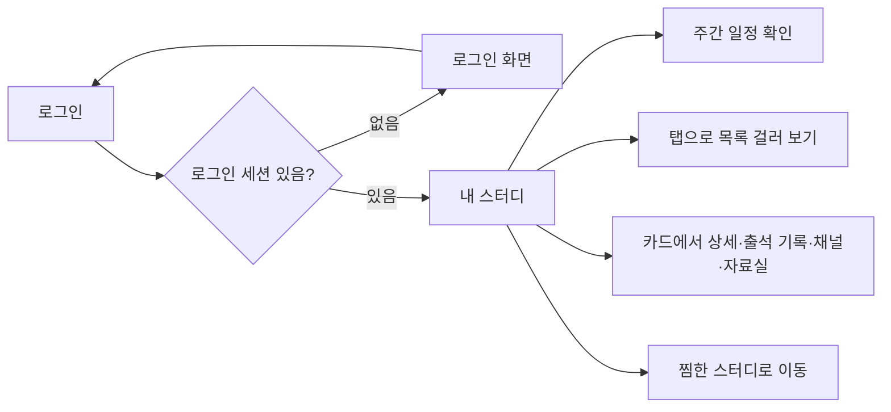
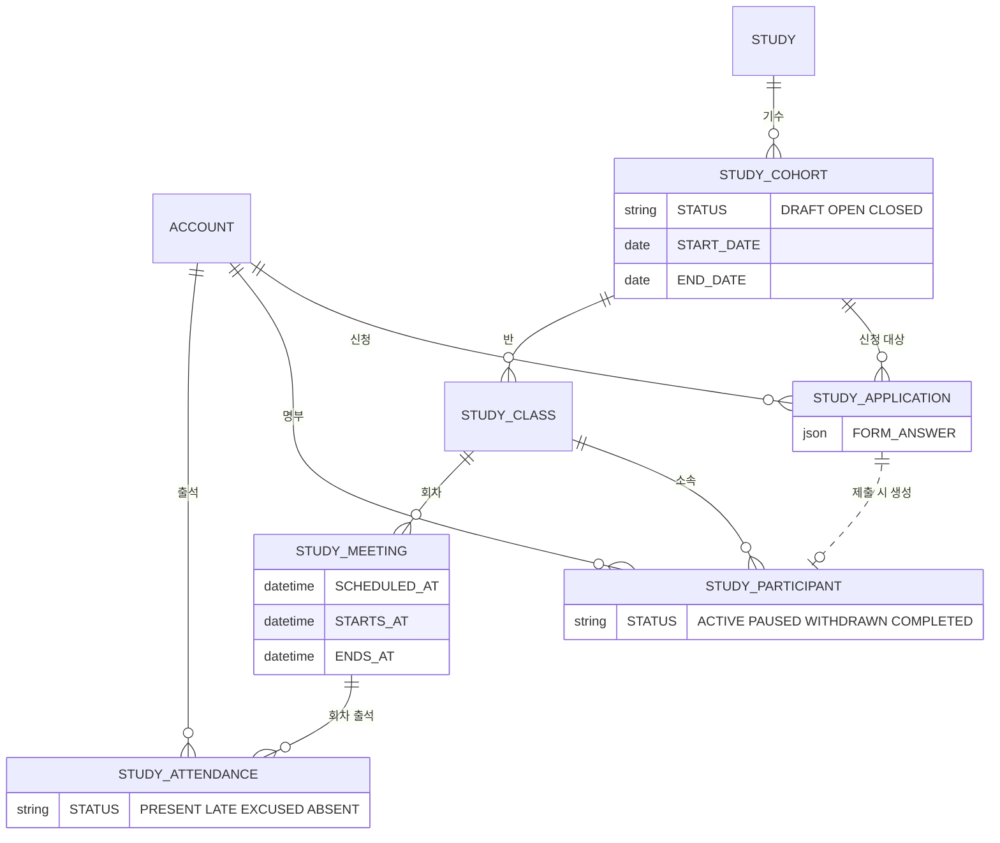

# 크루로서, 내가 참여 중인 스터디를 모아 볼 수 있다.

기준 프로토타입: 내 스터디 (playground 사용자 사이트 · 참여 모음)

## 1. 기본설명

· **배경**

제출한 스터디가 목록·상세에만 있으면 이번 주 참석·출석을 한곳에서 확인하지 못함

· **하는 일**

- 참여 중인 내 스터디를 한 화면에서 모음
- 이번 주 회차를 봄
- 출석 기록에서 다음 회차 참석(채널 입장)
- 시작전·참여중·참여 종료(완주·참여 중단)로 나와의 관계를 걸러 봄
- 내 출석률과 회차별 출석 칸을 봄
- 디스코드·자료실로 이동 (아이콘)

· **진입·사용 흐름**

· **완료 기준**

1. 목록에 참여 상태별 스터디가 보임
2. 처음 열면 참여중 탭임
3. 출석 기록의 다음 회차 칸에서 참석할 수 있음
4. 카드에 내 출석률이 출석 기록 옆에 보이고, 출석 기록으로 회차 칸을 펼칠 수 있음
5. 완주와 참여 중단이 같은 탭에 모이되, 카드에서 완주만 따로 구분됨
6. 찜한 스터디는 참여 상태 탭이 아니라 별도 페이지로 이동

## 2. 화면명세

> **화면**: 내 스터디

### 1. 페이지 제목

- **표시**: 고정 문구 `내 스터디`
- **동작**: 없음
- **작업**: 화면 상단 제목

### 1-1. 주간 일정

- **표시**
  - 제목: 이번 주면 `이번 주 일정 YYYY년 M월`, 다른 주면 `주간 일정 YYYY년 M월`
  - 연·월은 그 주 월요일 기준
  - 월~일 7칸. 요일 라벨과 날짜
  - 회차가 있는 날에 예정 시각·스터디 제목(최대 2줄)
  - 분야마다 왼쪽 띠·배경색. 카드 분야 색과 같음. 같은 분야는 농도도 같음
  - `KST` · `PDT`
  - `이전 주` · `다음 주`
- **동작**
    - 스터디 제목 → 그 스터디 상세
    - 타임존 변경 → 주간 줄과 카드 시각이 함께 바뀜
    - 이전 주 · 다음 주 → 보이는 주가 바뀜
- **정책**
  - 제목과 참여 상태 탭 사이. 참여 상태 탭과 무관
  - 참여중·시작전 회차만. 완주·참여 종료는 제외
  - 주는 월요일부터 일요일
  - 회차 요일은 스터디 일정 문구(`매주 수`, `매주 토` 등)를 따름
  - 날짜·시각은 고른 타임존(KST/PDT) 벽시계. 타임존 전환은 여기 한 곳
  - 칸에 올리는 시각은 예정(`STUDY_MEETING.SCHEDULED_AT`)
- **데이터**: 내 참여 스터디의 회차 목록, 고른 타임존, 주 시작일
- **작업**: 주간 격자 + 주 이동 + 타임존

### 1-1-1. 타임존 전환 탭

- **표시**: `KST` · `PDT`
- **동작**: 주간 줄과 카드·격자 일자·시각이 그 타임존으로 바뀜
- **정책**
  - 기본값: 내 거주 지역. 한국·기타는 KST, 북미는 PDT
  - 카드마다 두지 않음
- **데이터**: 회원 `REGION_GROUP` → 기본 표시 타임존
- **작업**: 세그먼트 탭

### 1-1-2. 주간 줄 · 스터디 제목

- **표시**: 회차 시각 아래. 스터디 제목 최대 2줄. 분야마다 왼쪽 띠·배경색(카드 분야 색). 같은 분야는 농도도 같음
- **동작**: 그 스터디 상세로 이동
- **조건**: 그 칸에 회차가 있을 때

### 2. 참여 상태 탭

- **표시**: `전체` · `시작전` · `참여중` · `참여 종료`
- **동작**: 아래 목록이 그 상태만 남김. 주소는 바뀌지 않음
- **정책**
  - 한 번에 하나만 고름
  - 처음 열면 `참여중`
  - `?open=` 스터디 id로 들어오면 그 스터디가 속한 탭을 연다. 시작전이면 `시작전`. 출석 기록도 펼친다
  - `참여 종료` = 완주 + 참여 중단. 따로 나누지 않음
  - 참여 종료 탭 안에서는 완주 카드를 위에 둠
- **정책 — 상태 판정**
  - 시작전: 명부 `ACTIVE` 이고 오늘 < 기수 `START_DATE`
  - 참여중: 명부 `ACTIVE` 이고 오늘 >= 기수 `START_DATE`
  - 완주: 명부 `COMPLETED`. 배지 문구 `완주`
  - 참여 중단: 명부 `WITHDRAWN`. 크루 배지는 `참여 종료`. 사유는 쓰지 않음
  - `PAUSED`: ERD에 있음. 이 화면 탭·배지는 미정
- **데이터**: `STUDY_PARTICIPANT.STATUS`, `STUDY_COHORT.START_DATE` · `END_DATE`
- **작업**: 필터 탭

### 2-1. 찜한 스터디

- **표시**: 참여 상태 탭 줄 오른쪽. 페이지 이동. 라벨 `찜한 스터디`
- **동작**: 찜한 스터디 모음으로 이동
- **정책**: 이 목록과 다른 축. 탭이 아님
- **작업**: 페이지 이동 버튼

### 3. 빈 상태

- **표시**: 선택한 탭에 해당하는 스터디가 없을 때

| 탭 | 제목 | 설명 |
| --- | --- | --- |
| 전체 | 참여한 스터디가 없습니다 | 신청을 제출하면 여기에 모입니다. |
| 시작전 | 시작 전 스터디가 없습니다 | 신청한 뒤 아직 시작하지 않은 스터디가 여기에 모입니다. |
| 참여중 | 참여 중인 스터디가 없습니다 | 지금 들어가는 스터디가 여기에 모입니다. |
| 참여 종료 | 참여가 끝난 스터디가 없습니다 | 완주했거나 참여가 끝난 스터디가 여기에 모입니다. |

- **동작**: 없음
- **작업**: 탭별 빈 안내

### 4. 스터디 카드

- **표시**: 아이콘 · 제목 · 기간 · 상태 · 다음 회차 또는 완주 점수판 · 출석 기록 · 디스코드·자료실 아이콘
- **정책**
  - 카드 하나가 참여 스터디 하나
  - 스터디 소개 문구는 넣지 않음
  - 정보는 제목 → 기간 → 다음 회차 → 출석 순. 고유 정보(제목·기간)를 위에, 시간에 따라 바뀌는 회차를 아래에 둠
  - 완주 카드는 참여 종료 카드와 구분되어야 함
  - 검색용 태그(분야·온오프·권역)는 이 목록에 두지 않음
- **작업**: 목록 카드

### 4-1. 아이콘

- **표시**: 분야 아이콘. 완주면 아이콘에서 완주임이 구분됨
- **동작**: 없음
- **작업**: 분야 아이콘. 완주 표식

### 4-2. 스터디 제목

- **표시**: 스터디 제목 (화면 언어)
- **동작**: 그 스터디 상세로 이동
- **정책**
  - 카드 제목이 길면 한 줄 말줄임(`…`). 전체는 그 링크의 이름
  - 주간 칸 제목은 두 줄까지 줄바꿈 후 말줄임
- **데이터**: `STUDY.TITLE`
- **작업**: 상세 링크

### 4-3. 참여 상태

- **표시**: `시작전` · `참여중` · `완주` · `참여 종료`
- **정책**: 2번 탭과 같은 판정. 완주는 `참여 종료` 라벨을 쓰지 않음
- **작업**: 상태 배지

### 4-4. 다음 회차

- **표시**
  - 참여중·시작전: `N회차 · yyyy-mm-dd 시각`. `다가오는 일정` 라벨은 쓰지 않음
  - 완주: `완주를 축하합니다!` + 참여 횟수 / 총 횟수 + `회` + 회차 칸
  - 참여 중단: `다음 일정 없음`
- **정책**
  - 참여중: 오늘 이후 첫 회차
  - 시작전: 1회차
  - 완주: 다음 회차 대신 완주 점수판
  - 참여 횟수는 강조, 총 횟수는 보조. 아래 칸은 회차마다 채움
  - 전회 출석 칩은 두지 않음. `n/n` 과 칸이 전회를 말함. 일부 회차만 참여했어도 완주면 축하 문구
  - 참여 횟수·총 횟수·아래 칸은 출석 격자(휴가 제외)와 같음
  - 시각은 주간 줄에서 고른 타임존
  - 참석은 이 줄에 두지 않음. 출석 격자 안 그 회차 칸
- **데이터**: 다음 회차. 완주 시 참여 횟수·총 횟수
- **작업**: 다음 회차 줄 또는 완주 점수판

### 4-5. 스터디 기간

- **표시**: 제목 바로 아래. `yyyy-mm-dd ~ yyyy-mm-dd`
- **정책**: 스터디 고유 정보라 제목과 붙임. 다음 회차보다 위. 시계 아이콘 없음
- **데이터**: 첫·마지막 회차의 예정일을 고른 타임존(KST/PDT)으로
- **작업**: 기간 한 줄

### 4-8. 내 출석률

- **표시**: 출석 기록 토글 오른쪽. 정수 `%`
- **정책**
  - 출석률 = (present + late × 0.5) / 대상 회차. 결석 = 0. 휴가는 분모에서 뺌
  - 대상은 시작된 회차. 시작 전 결석은 칸에도 분모에도 넣지 않음
  - 시작된 회차가 없거나 전부 휴가면 숫자를 숨김
  - 출석 기록을 접어도 토글 옆에 보임
  - 완주 카드에는 두지 않음. 점수판 `n/n` 은 출석+지각 횟수
  - 한 줄을 쓰지 않고 출석 기록 옆에 붙임
  - 높음·보통·낮음이 구분되어야 함. 색만으로 구분하지 않음
- **데이터**: 본인 `STUDY_ATTENDANCE` 집계
- **작업**: 출석 기록 토글 옆 숫자

### 4-6. 출석 기록

- **표시**: 테두리 상자 안 토글 `출석 기록` + 화살표. 있으면 출석률. 펼치면 같은 상자 안 회차 격자
- **정책**
  - 디스코드·자료실과 한 세트로 두지 않음. 펼침 컨트롤
  - 출석 기록: 완주·참여 종료 모두 염. 카드 안에서 격자
- **작업**: 카드 안 펼침

### 4-6-1. 출석 기록 토글

- **표시**: 테두리 상자. `출석 기록`. 접힘·펼침이 드러나야 함. 오른쪽에 출석률(있을 때)
- **동작**: 그 카드 안에서 회차 격자를 열거나 접음. 다른 페이지로 가지 않음
- **정책**
  - 기본은 접힘
  - 여러 장을 동시에 열 수 있음
  - 주소 `?open=스터디id` 로 들어오면 그 카드가 펼쳐져 있음. 그 스터디가 속한 참여 상태 탭도 연다
- **작업**: 카드 안 펼침

### 4-6-1-1. 회차 머리

- **표시**: 칸 위에 회차 번호와 날짜 `M/D(요일)`. 예: `9/8(화)`
- **정책**: 주간 줄과 같은 KST/PDT. 예정일
- **작업**: 격자 머리
- **조건**: 출석 기록이 펼쳐져 있을 때

### 4-6-1-2. 출석 칸

- **표시**: `출석` · `지각` · `결석` · `휴가`. 한글 라벨을 둠. 회차가 없으면 `아직 회차가 없습니다.`
- **정책**
  - 다른 크루 줄은 두지 않음. 본인 칸만. 수정·삭제 버튼을 두지 않음
  - 지난 칸은 누를 수 없음
  - 다음 회차이면서 아직 상태가 없으면 그 칸에 `참석`
  - 회차마다 칸 하나. 여러 줄로 나뉨
  - 아직 시작하지 않은 회차의 결석은 빈 칸. 미체크 문구는 쓰지 않음
- **데이터**: 회차 = `STUDY_MEETING`. 내 출석 = `STUDY_ATTENDANCE.STATUS`
- **작업**: 본인 회차 격자
- **조건**: 출석 기록이 펼쳐져 있을 때

### 4-6-1-3. 격자 · 참석

- **표시**: 다음 회차 칸. 라벨 `참석`. 출석·지각·결석 칸과 같은 크기
- **동작**: 새 탭에서 스터디 디스코드 채널. 출석으로 저장하지 않음
- **정책**: 시작 30분 전부터 회차 종료까지 활성. 칸의 높이·글자 크기는 상태 칸과 같음
- **작업**: 채널 입장
- **조건**: 출석 기록이 펼쳐져 있고 다음 회차에 아직 상태가 없을 때

### 4-6-2. 디스코드

- **표시**: 제목·기간 줄 오른쪽. 디스코드 마크 아이콘. 접근 가능 이름 `디스코드`
- **동작**
  - 참여중·시작전: 새 탭에서 스터디 채널. 없으면 클럽 초대
  - 완주: 클럽 디스코드 로비
  - 참여 중단: 아이콘을 두지 않음
- **정책**: 참여 중단(`WITHDRAWN`) 목록 응답에 채널 URL을 넣지 않는다. 직접 호출해도 서버가 거절한다
- **데이터**: 기수 `DISCORD_CHANNEL_URL`, 없으면 클럽 초대 URL
- **작업**: 외부 링크

### 4-6-3. 자료실

- **표시**: 디스코드 아이콘 옆. 폴더 아이콘. 접근 가능 이름 `자료실`
- **동작**: 새 탭에서 드라이브 폴더. 참여 중단이면 아이콘을 두지 않음
- **정책**: 참여 중단(`WITHDRAWN`) 목록 응답에 자료 URL을 넣지 않는다. URL이 없으면 아이콘을 두지 않는다. 직접 호출해도 서버가 거절한다
- **데이터**: 기수 `DRIVE_URL`
- **작업**: 외부 링크

### 5. 페이지

- **표시**: `이전` · 페이지 번호 · `다음`. 한 페이지에 10개
- **동작**: 그 페이지의 카드만 남김. 주소는 바뀌지 않음
- **정책**: 참여 상태 탭을 바꾸면 1페이지. 10개 이하면 페이지 줄 숨김
- **작업**: 목록 페이지

### 상태별 화면

| 상태 | 화면 | 카피 |
| --- | --- | --- |
| 기본 | 참여중 탭, 주간 일정, 카드 목록 | `내 스터디` |
| 로딩 | 본문 자리 | `불러오는 중…` |
| 빈 결과 | 탭별 빈 안내 | 위 3번 표 |
| 조회 실패 | 본문 자리 | `스터디 목록을 불러오지 못했습니다. 다시 시도해 주세요.` `다시 시도` |
| 권한 없음 | 로그인 화면으로 이동. `next` = 이 화면 | (로그인 화면 카피) |

### 데이터 관계

### 비고

- 범위 밖: 찜 목록 본문, 출석·지각 확정, 캡틴 출석명부, 참여 중단 사유 표기, 휴가 신청·취소
- 스토리 `크루는 스터디 출석부를 볼 수 있다` 는 이 화면의 출석률·출석 기록에 포함. 별도 목록 화면 없음
- 크루 화면에 `참여 중단`이라는 말은 쓰지 않음. 배지는 `참여 종료`
- 명칭: 참여 상태·타임존은 탭. 디스코드·자료실은 아이콘 새 탭. 전회 출석은 점수판 `n/n` 으로 읽음. 검색용 태그는 이 목록에 없음
- 회차의 영어 식별자는 `meeting` (`STUDY_MEETING`). 로그인 `SESSION`과 구분
- 목록의 정본은 명부(`STUDY_PARTICIPANT`). 신청 제출 시 명부가 생긴다
- 프로토는 기수·반을 두지 않고 스터디 한 장에 기간·채널·자료를 붙임. 서버는 기수·반으로 읽음
- 프로토 `accepted` · `recruiting` / `ongoing` / `closed` 는 mock 값. ERD 값은 아래 표
- 참여 상태 탭·페이지 번호는 주소에 안 남김. 출석 기록 펼침만 `?open=`

## 3. 시스템 요건

### 데이터

| 대상 | 필드 | ERD | 비고 |
| --- | --- | --- | --- |
| 신청 | FORM_ANSWER | JSON | 행이 있으면 제출 완료. 상태값 없음. 이 화면은 명부(`STUDY_PARTICIPANT`)만. 프로토 `accepted`는 명부 `ACTIVE` |
| 명부 | STATUS | `ACTIVE` / `PAUSED` / `WITHDRAWN` / `COMPLETED` | `WITHDRAWN` = 참여 중단 → 크루 배지 `참여 종료`. `COMPLETED` = 완주. `PAUSED` 화면 미정 |
| 스터디 | TITLE, STUDY_KIND, CATEGORY | `STUDY` / `CLUB` | 기간·포맷·채널·자료는 기수 |
| 기수 | START_DATE, END_DATE, DISCORD_CHANNEL_URL, DRIVE_URL, STATUS | 기수 상태 `DRAFT` / `OPEN` / `CLOSED` | 모집중·진행중은 저장하지 않고 날짜로 계산 |
| 반 | NAME, STARTS_AT, TIMEZONE | IANA | 참가·회차·출석의 소속 |
| 회차 | SCHEDULED_AT, STARTS_AT, ENDS_AT | `STUDY_MEETING`. UTC datetime | 영어는 meeting. 회차 번호는 ERD 미확정. 프로토는 일정 문구에서 시각을 읽음 |
| 내 출석 | STATUS | `PRESENT` / `LATE` / `EXCUSED` / `ABSENT` | 휴가 = `EXCUSED`. 회차 생성 시 전원 `ABSENT`. 시작 전 화면은 결석을 그리지 않음 |
| 회원 | REGION_GROUP, TIME_ZONE | 권역 `KR` / `NA` / `ETC`. 타임존 IANA | 화면 탭 `KST`/`PDT`는 표시용. 회차 일자도 이 탭 |
| 자료실 | DRIVE_URL | 기수 | 프로토는 스터디별 가짜 링크 |
| 디스코드 | DISCORD_CHANNEL_URL | 기수 | 없으면 클럽 초대. 클럽 초대 URL은 ERD 컬럼 아님 |

### 처리

- 목록: 로그인 회원 + 본인 명부. 신청 제출로 생긴 행만
- 시간 초과·통신 끊김·5xx는 조회 실패. `다시 시도`로 같은 GET을 다시 보낸다
- 참여 중단(`WITHDRAWN`) 행의 `DISCORD_CHANNEL_URL`·`DRIVE_URL`은 목록 응답에 넣지 않는다. 채널·자료 직접 조회도 서버 거절
- 참석: 디스코드 URL만 염. 출석 행을 만들지 않음. 출석 격자 다음 회차 칸만. 주간 줄에는 두지 않음
- 휴가 신청·취소: 이 화면에서 하지 않음. 칸에 `EXCUSED`가 있으면 배지로만 보임
- 출석 확정: 반장 디스코드 명령. 이 화면 범위 밖
- 결석 행: 회차 생성 시 참가자 전원 `ABSENT`. 시작 전 화면은 빈 칸

### 계산 규칙 (단일 정의)

- 참여 상태: 명부 STATUS + 기수 시작·종료 일자. 정의 위치 서버 `STUDY_PARTICIPANT.STATUS` + `STUDY_COHORT.START_DATE`/`END_DATE`. 프로토 `joined.ts` `lifeStatus`
- 다가오는 회차: 참여중은 오늘 이후 첫 회차, 시작전은 1회차
- 완주 점수: 시작된 회차 중 휴가 제외 분모, 출석+지각 횟수 분자. 전회 = 분자 = 분모
- 출석률: (present + late × 0.5) / 대상 회차. 휴가는 분모에서 뺌. 정의 위치 `STUDY_ATTENDANCE` 집계. 다른 화면에서 재계산하지 않음
- 주 제목 연·월: 그 주 월요일
- 참석 버튼 활성: 예정 `시작 − 30분` 이상이고 예정 `종료` 이하
- 회차 일자 표시: 주간 줄에서 고른 KST/PDT. 스터디 반 `TIMEZONE`은 UTC 예정 시각을 풀 때 쓰고, 이 화면 표시 시계는 아님
- 기수 진행: 서버는 `DRAFT`/`OPEN`/`CLOSED` + 날짜로 모집중·진행중을 계산. 프로토 목은 recruiting/ongoing/closed

### API (예정)

| 메서드 | 경로 | 권한 |
| --- | --- | --- |
| GET | `/api/me/studies` | 로그인. 명부 참여만 |
| GET | `/api/me/studies/{id}/meetings` | 해당 명부 |
| GET | `/api/me` | 거주 지역 등 |

출석 체크인 POST는 반장 디스코드 연동 소관. 휴가 POST/DELETE는 이 화면 범위 밖.

### 권한

- 화면·목록: 로그인 회원, 본인 명부만. 검증 위치 서버
- 미로그인: 로그인 화면으로 보냄 (`next` = 이 화면)
- 타인 명부·출석: 이 화면에 두지 않음. 카드 수정·삭제 없음
- 참여 중단: 출석 이력은 열람. 채널·자료실은 거부. 검증 위치 서버. 목록 JSON에 URL을 넣지 않는다

### 외부 연동

- 디스코드: 채널 또는 클럽 초대. 실패 시 브라우저가 링크를 열지 못함. 재시도는 다시 누르기
- 구글 드라이브: 자료실 URL. 폴더 권한은 드라이브 쪽

## 4. 미확정

- 명부 `PAUSED`를 이 화면에서 참여중·참여 종료·숨김 중 어디로 둘지
- 운영 사유 참여 중단을 `WITHDRAWN`과 같은 값으로 둘지
- 스터디가 모이는 권역(한국/미국/동시) 필드. ERD에는 회원 `REGION_GROUP`만 있음
- 회차 번호. ERD 미확정
- 클럽 로비(초대) URL을 어디에 둘지. 기수는 채널 URL만 가짐
- 아무 때나 하는 클럽의 회차 시각. 프로토는 기본 시각을 붙임
- 참여 상태 탭·페이지를 주소에 남길지
