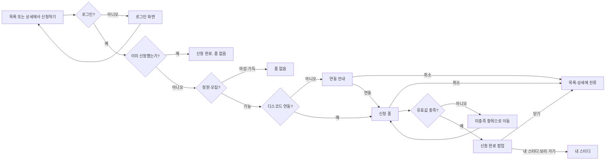
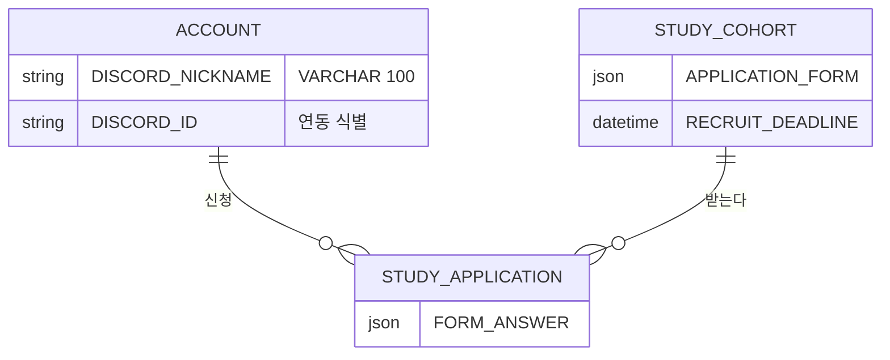

# 크루로서, 스터디 신청 폼을 제출할 수 있다.

기준 프로토타입: 스터디 신청 (playground 사용자 사이트 · 목록·상세의 신청하기)

## 1. 기본설명

· **진입·사용 흐름**

· **완료 기준**

1. 모집중 스터디의 목록과 상세에서 신청 폼을 열 수 있다
2. 미로그인이면 신청하기는 보이되 폼은 열리지 않고 로그인 화면으로 간다. 로그인 뒤 신청 흐름을 이어 간다
3. 디스코드 계정이 연동되지 않으면, 연동을 마친 뒤에만 폼이 열린다
4. 별명·참여 가능 요일·필수 추가 질문·(확정 일정이 있으면) 일정 참여 확인을 유효값에 맞게 채워야 제출된다
5. 유효하지 않으면 미충족 항목으로 화면이 옮겨지고, 그 칸에 실패 문구가 보인다
6. 제출 후 같은 스터디의 신청하기는 `신청 완료`로 바뀌고 폼이 다시 열리지 않는다. 본인도 고치지 못한다
7. 완료 화면에서 지금 화면(목록·상세)에 머물거나, 내 스터디에서 방금 낸 기수가 있는 탭을 연다
8. 모집이 끝나면 `모집 마감`, 정원이 가득이면 `정원 마감`이 보이고 폼이 열리지 않는다
9. 제출·연동이 실패하면 그 화면에서 다시 시도한다. 처리 중에는 창을 닫지 못한다

## 2. 화면명세

> **화면**: 스터디 신청

### 1. 스터디 정보

- **내용**
  - 신청 설문 제목·설명
  - 주제
  - `일정`. 값 없으면 `일정 미정`
  - `모집 기한`. 값 없으면 `상시 모집`. 날짜가 있으면 `{날짜}까지 모집`
  - `스터디 소개`와 상세 본문
- **동작**: 없음
- **정책**
  - 제목은 `APPLICATION_FORM.title`, 없으면 스터디 `TITLE`
  - 설명은 `APPLICATION_FORM.description`, 없으면 스터디 한 줄 소개
  - 이름·이메일은 이 화면에 두지 않는다. 계정에서 읽는다
  - 제목·설명은 말줄임 없이 줄바꿈으로 모두 보인다. 설명의 마크다운·살균은 캡틴 폼 스토리와 같다
- **데이터**: 스터디 제목·소개·상세, 주제, 진행 일정, `STUDY_COHORT.RECRUIT_DEADLINE`

### 2. 디스코드 서버 별명

- **내용**
  - 라벨 `[스터디 클럽++] 디스코드 서버 별명`
  - 자리 표시 `홍길동/SWE/산호세/시스템디자인`
  - 현재 글자 수와 상한 100자
- **동작**: 입력·수정
- **정책**
  - 모든 신청 폼에 둔다. 캡틴이 빼거나 타입을 바꾸지 못한다
  - 계정에 값이 있으면 그 값으로 채운다. 지원자가 고칠 수 있다
  - 제출 때 고친 값을 계정에 다시 저장한다
  - Empty 불가. MIN 1자. MAX 100자. ENUM 없음. 기본값 = 계정 별명, 없으면 빈 칸
  - 공백만이면 빈 값으로 본다. 줄바꿈·탭은 공백으로 바꾼 뒤 trim
  - 특수문자·이모지 허용. 허용 문자 목록을 두지 않는다
  - 입력칸에서 100자를 넘기지 못한다. 현재 글자 수와 상한을 함께 보여 준다
  - 실패 시 이 항목으로 화면을 옮긴다
- **데이터**: `ACCOUNT.DISCORD_NICKNAME`

### 3. 참여 가능한 요일

- **내용**: 라벨 `참여 가능한 요일`. 월요일부터 일요일
- **동작**: 여러 요일을 고르거나 해제한다
- **정책**
  - 모든 신청 폼에 둔다. 진행 일정 유무와 무관하다
  - Empty 불가. MIN 1개. MAX 7개
  - ENUM `mon` `tue` `wed` `thu` `fri` `sat` `sun`. 화면 라벨이 아니라 이 키로 저장한다
  - 기본값 없음(미선택)
  - 실패 시 이 항목으로 화면을 옮긴다
- **데이터**: `STUDY_APPLICATION.FORM_ANSWER` 요일 키

### 4. 일정 참여 확인

- **내용**: `{일정} 참여 가능합니다`
- **동작**: 가능함을 표시하거나 해제한다
- **정책**
  - 확정된 진행 일정이 있을 때만 보인다
  - Empty 불가. ENUM `true`. 기본값 `false`
  - 실패 시 이 항목으로 화면을 옮긴다
- **데이터**: `FORM_ANSWER` 일정 참여 확인
- **조건**: 스터디에 확정 일정이 있을 때

### 5. 캡틴이 설계한 추가 질문

- **내용**: 캡틴이 질문마다 정한 제목·설명·입력 방식·선택지
- **동작**: 그 입력 방식으로 답한다
- **정책**
  - 추가 질문이 있을 때만 보임. 없으면 기본 문항만 두고 빈 안내를 넣지 않는다
  - `required`가 `true`인 질문은 유효값 표 Empty 불가
  - 선택지는 그 질문의 `options`만 받음. `allowOther`가 `true`이면 라벨 `기타`와 자유 입력
  - MIN/MAX는 §3 플랫폼 기본. 질문 객체에 min/max 필드를 두지 않음
  - 단답·기타는 한 줄. 장문은 여러 줄. 특수문자·이모지 허용. HTML은 텍스트
  - 입력칸에서 타입별 상한을 넘기지 못한다
  - 질문 제목·설명·선택지는 말줄임 없이 줄바꿈으로 모두 보인다
  - 실패 시 그 질문으로 화면을 옮김
- **데이터**: `STUDY_COHORT.APPLICATION_FORM.questions[]` → `FORM_ANSWER.answers`
- **조건**: 캡틴이 설계한 추가 질문이 있을 때

### 6. 오류 문구

- **내용**: 미충족 항목 안의 실패 카피 한 줄. 문구는 §3 표
- **동작**
  - 해당 항목으로 화면을 옮긴다
  - 그 항목의 첫 입력칸으로 입력 위치를 옮긴다
- **정책**
  - 한 번에 하나만 보여 준다
  - 검사 순서: 별명 → 요일 → 추가 질문 → 일정 확인
  - 그 항목을 고치면 문구를 걷는다
  - 다시 신청을 누르면 같은 규칙으로 다시 가리킨다
  - 실패는 문구로 알린다. 색만으로 구분하지 않는다
  - 오류 문구는 보조 기술에 알림으로 전달한다. 해당 입력칸은 잘못되었음을 알린다
- **조건**: 유효값을 채우지 않고 신청을 눌렀을 때

### 7. 취소

- **내용**: `취소`
- **동작**: 입력한 내용을 버리고 닫는다. 목록·상세에 머문다
- **정책**
  - 제출 처리 중에는 취소·Esc·바깥 클릭을 받지 않는다
  - 처리 중이 아니면 Esc·바깥 클릭도 취소와 같다. 입력은 버린다. 이탈 확인을 두지 않는다
  - 열린 동안 바깥 화면으로 입력 위치가 나가지 않는다

### 8. 신청

- **내용**: `신청`
- **동작**: 유효하면 저장하고 완료 화면으로 바꾼다
- **정책**
  - 이미 낸 신청은 덮어쓰지 않는다
  - 처리 중에는 다시 누르지 못한다. 라벨은 `신청`을 유지한다
  - 처리 중에는 취소·Esc·바깥 클릭으로 닫지 않는다. 브라우저를 닫거나 새로고침하면 요청은 이어질 수 있다. 다시 열면 저장된 신청이면 `신청 완료`, 아니면 다시 신청한다
  - 저장 실패·시간 초과·통신 끊김은 같은 문구다. 폼에 잔류하고 `다시 시도`로 같은 신청을 다시 보낸다
  - 재시도가 `409` 이미 신청이면 완료 화면으로 바꾼다. `409` 모집 마감·정원 초과면 폼을 닫고 목록·상세 CTA를 그 상태로 바꾼다
- **데이터**: `POST /api/studies/{id}/applications`

> **화면**: 디스코드 연동

### 9. 연동 필수 안내

- **내용**
  - 제목 `디스코드 연동`
  - `스터디 신청 전 디스코드 연동은 필수입니다.`
  - `스터디는 디스코드에서 진행됩니다. 연동이 끝나면 신청 폼으로 이동합니다.`
- **동작**: 없음
- **정책**
  - 연동이 끝나기 전에는 신청 폼을 열지 않는다
  - 화면을 우회해도 서버는 `DISCORD_ID`가 없으면 신청을 거절한다
  - 열린 동안 바깥 화면으로 입력 위치가 나가지 않는다
- **조건**: 디스코드가 연동되지 않은 채로 신청하기를 눌렀을 때

### 10. 디스코드 연동하기

- **내용**: `디스코드 연동하기`
- **동작**: 연동을 마친 뒤 신청 폼을 연다
- **정책**
  - 처리 중에는 다시 누르지 못한다
  - 처리 중에는 취소·Esc·바깥 클릭을 받지 않는다
  - 서버가 인가 코드를 교환해 `DISCORD_ID`·`DISCORD_HANDLE`을 저장한다. 화면이 보낸 식별자는 쓰지 않는다
  - 실패·시간 초과·사용자가 인가를 취소하면 폼을 열지 않는다. 연동 팝업에 잔류한다. `디스코드 연동을 완료하지 못했습니다. 다시 시도해 주세요.`
- **데이터**: `ACCOUNT.DISCORD_ID` · `ACCOUNT.DISCORD_HANDLE`

### 11. 연동 취소

- **내용**: `취소`
- **동작**: 연동하지 않고 닫는다. 신청 폼은 열리지 않는다. 목록·상세에 머문다
- **정책**
  - 연동 처리 중에는 누를 수 없다
  - 처리 중이 아니면 Esc·바깥 클릭도 취소와 같다

> **화면**: 신청 완료

### 12. 신청 완료 안내

- **내용**
  - 제목 `스터디 신청 완료`
  - `스터디 신청이 완료되었습니다. 내 스터디로 이동할까요?`
  - `제출한 내용은 수정할 수 없습니다.`
- **동작**: 없음
- **정책**
  - 이 화면에서 제출 내용을 고치지 않는다. 본인 신청도 수정·삭제 버튼을 두지 않는다
  - 다른 사람의 신청 내용은 이 흐름에 보이지 않는다
  - Esc·바깥 클릭은 닫기와 같다. 처리 중이 아니므로 항상 받는다
- **조건**: 신청을 제출한 뒤

### 13. 닫기

- **내용**: `닫기`
- **동작**: 팝업만 닫고 지금 화면(목록 또는 상세)에 머문다
- **정책**: 바깥을 누르거나 Esc를 눌러도 같다

### 14. 내 스터디 보러 가기

- **내용**: `내 스터디 보러 가기`
- **동작**: 내 스터디로 간다. 방금 제출한 기수가 있는 참여 상태 탭을 연다. 그 카드 출석 기록을 펼친다 (`?open=` 스터디 id)
- **정책**: 시작 전 기수면 `시작전` 탭. 이미 시작된 기수면 `참여중` 탭. 참여중 빈 안내만 보이고 끝나지 않는다

### 상태별 화면

| 상태 | 화면 | 카피 |
| --- | --- | --- |
| 미로그인 CTA | 목록·상세 | `신청하기`. 누르면 로그인. `next` = 이 신청 흐름 |
| 모집중 CTA | 목록·상세 | `신청하기` |
| 기본 | 신청 폼 | 제목 `스터디 신청`. 제출 버튼 `신청` |
| 폼 로딩 | 신청 폼 | `불러오는 중`. 신청 불가 |
| 폼 조회 실패 | 신청 폼 | `신청 폼을 불러오지 못했습니다. 다시 시도해 주세요.` `다시 시도`. 신청 불가 |
| 추가 질문 없음 | 신청 폼 | 기본 문항만. 빈 안내 없음 |
| 연동 없음 | 연동 팝업 | `스터디 신청 전 디스코드 연동은 필수입니다.` |
| 연동 처리중 | 연동 팝업 | `디스코드 연동하기`. 다시 누르지 못함. 닫기 불가 |
| 연동 실패 | 연동 팝업 | `디스코드 연동을 완료하지 못했습니다. 다시 시도해 주세요.` |
| 검증 실패 | 해당 항목 | §3 표의 실패 카피 |
| 처리중 | 신청 버튼 | `신청`. 다시 누르지 못함. 닫기 불가 |
| 제출 실패 | 신청 폼 | `신청하지 못했습니다. 다시 시도해 주세요.` `다시 시도` |
| 완료 | 완료 팝업 | `스터디 신청이 완료되었습니다. 내 스터디로 이동할까요?` |
| 이미 신청 | 목록·상세 CTA | `신청 완료`. 폼 없음. 수정·삭제 없음 |
| 모집 마감 | 목록·상세 CTA | `모집 마감`. 폼 없음 |
| 정원 마감 | 목록·상세 CTA | `정원 마감`. 폼 없음 |
| 스터디 없음 | 상세 | `이 스터디를 찾을 수 없습니다.` 폼 없음 |

### 데이터 관계

### 비고

- 없음: 승인 대기 화면, 신청 취소 화면, 승인·거절. 신청을 없앨 때는 행을 삭제한다
- 범위 밖: 캡틴의 질문 설계, 반 편성
- 미구현: 신청 저장 API, 디스코드 OAuth, 미로그인 진입 화면, 서버 저장 실패·연동 실패 화면. 프로토는 로그인·연동 성공을 가정하고 화면 상태로만 저장한다
- 구현 지시: 목록의 신청하기와 상세의 신청하기는 같은 흐름이다

## 3. 시스템 요건

### 유효값 검증 (Empty / MIN / MAX / ENUM)

trim 후 판정. 클라이언트와 서버가 같은 표. 추가 질문 MIN/MAX는 아래 플랫폼 기본. `questions[]`에 min/max 필드 없음. 특수문자 화이트리스트 없음. 한 줄 필드는 줄바꿈·탭을 공백으로 바꾼 뒤 trim.

| 필드 | Empty | MIN | MAX | ENUM | 기본값 | 실패 카피 |
| --- | --- | --- | --- | --- | --- | --- |
| 디스코드 서버 별명 | 불가 | 1자 | 100자 | — | `ACCOUNT.DISCORD_NICKNAME`. 없으면 빈 칸 | 빈 값 `디스코드 서버 별명을 입력해 주세요.` · 상한 `100자 이내로 입력해 주세요.` |
| 참여 가능한 요일 | 불가 | 1개 | 7개 | `mon` `tue` `wed` `thu` `fri` `sat` `sun` | 없음(미선택) | `참여 가능한 요일을 하나 이상 선택해 주세요.` · ENUM 밖 `참여 가능한 요일을 다시 선택해 주세요.` |
| 일정 참여 확인 | 일정 있으면 불가 | — | — | `true` | `false` | `일정 참여 가능 여부를 확인해 주세요.` |
| 추가 질문 · 단답 | 필수면 불가 | 1자 | 200자 | — | 빈 칸 | 필수 빈 값 `필수 질문에 답해 주세요.` · 상한 `200자 이내로 입력해 주세요.` |
| 추가 질문 · 장문 | 필수면 불가 | 1자 | 2,000자 | — | 빈 칸 | 필수 빈 값 `필수 질문에 답해 주세요.` · 상한 `2,000자 이내로 입력해 주세요.` |
| 추가 질문 · 하나만 고름 | 필수면 불가 | 1개 | 1개 | 그 질문의 `options`. 기타가 켜져 있고 기타를 고르면 자유 입력 | 미선택 | `필수 질문에 답해 주세요.` · ENUM 밖 `선택지를 다시 골라 주세요.` |
| 추가 질문 · 여러 개 고름 | 필수면 불가 | 1개 | 옵션 수(+기타 1) | 그 질문의 `options` + (기타 시) 자유 입력 | 없음 | `필수 질문에 답해 주세요.` · ENUM 밖 `선택지를 다시 골라 주세요.` |
| 기타 자유 입력 | 기타를 고르면 불가 | 1자 | 100자 | — | 빈 칸 | `기타 내용을 입력해 주세요.` · 상한 `100자 이내로 입력해 주세요.` |

### 데이터

| 대상 | 필드 | 제약 |
| --- | --- | --- |
| 계정 | `DISCORD_NICKNAME` | VARCHAR(100). 위 표. 신청 제출 때 계정에도 쓴다 |
| 계정 | `DISCORD_ID` · `DISCORD_HANDLE` | 연동 완료 뒤에만 폼을 연다. 신청 POST도 이 값이 있어야 한다 |
| 신청 | `FORM_ANSWER` | JSON. 별명·요일·일정 확인·추가 질문 답. 행이 있으면 제출 완료 |
| 신청 | `RECRUITMENT_ID` | 제출 시점 열려 있는 `STUDY_RECRUITMENT`. 없으면 신청 불가 |
| 신청 | `ACCOUNT_ID` + 기수 | 같은 기수에 열린 신청이 있으면 거절 |
| 기수 | `APPLICATION_FORM` | JSON 객체. `title`·`description`·`questions`. 아래 스키마 |
| 기수 | 진행 일정 문구 | 있으면 참여 확인 필수. 없으면 `일정 미정`이고 확인을 받지 않음 |
| 기수 | `CAPACITY` | 이 기수 전체 정원. 비교 대상은 명부 활성 인원(`STUDY_PARTICIPANT` 중 `WITHDRAWN` 제외) |
| 기수 | `RECRUIT_DEADLINE` | 없거나 미래이면 신청 가능. 지났으면 `모집 마감` |

`APPLICATION_FORM`:

| 필드 | 필수 | 제약 |
| --- | --- | --- |
| `title` | N | 신청 설문 제목. 없으면 스터디 `TITLE` |
| `description` | N | 신청 설문 설명. 없으면 스터디 한 줄 소개 |
| `questions` | Y | 질문 배열 |

`APPLICATION_FORM.questions[]`:

| 필드 | 필수 | 제약 |
| --- | --- | --- |
| `id` | Y | 문자열. `FORM_ANSWER.answers` 키 |
| `label` | Y | 질문 제목 |
| `type` | Y | ENUM `TEXT` `TEXTAREA` `RADIO` `CHECKBOX` `SELECT` |
| `required` | Y | `true`면 해당 타입 행의 Empty 불가 |
| `options` | `RADIO`·`CHECKBOX`·`SELECT`이면 Y | 문자열 배열. 유효값 표 ENUM |
| `allowOther` | N | `RADIO`·`CHECKBOX`만. `true`면 라벨 `기타`와 자유 입력 |
| `placeholder` | N | `TEXT`·`TEXTAREA` 안내 |
| `description` | N | 지원자에게 보일 부가 설명 |

min/max 필드 없음. 길이·개수 상한은 유효값 표.

타입 → 유효값 표: `TEXT` 단답 · `TEXTAREA` 장문 · `RADIO`/`SELECT` 하나만 고름 · `CHECKBOX` 여러 개 고름

`FORM_ANSWER` 구성:

- `discordNickname`: 문자열
- `availableDays`: ENUM 키 배열
- `scheduleAgreed`: 확정 일정이 있을 때만 `true`
- `answers`: `questions[].id` → 문자열 또는 문자열 배열

### 처리

- 검증: 화면 즉시 + 서버 저장 시 같은 표
- 서버는 `DISCORD_ID`가 없으면 신청을 받지 않는다. 화면 게이트만으로 끝내지 않는다
- `403`이면 저장하지 않고 연동 팝업을 연다. 카피는 연동 없음과 같다
- 폼을 열 때 `GET /api/studies/{id}/application-form`. 실패·시간 초과면 신청하지 않는다. `다시 시도`
- 저장: 신청 1건. `STUDY_APPLICATION.RECRUITMENT_ID` = 그 기수에서 열려 있는 모집 회차. 별명이 바뀌었으면 계정 갱신. 같은 트랜잭션에서 명부 편입
- 신청 취소·승인·거절 없음. 대기·취소 상태값을 두지 않는다. 신청을 없앨 때는 `STUDY_APPLICATION` 행을 삭제하고, 제출 때 만든 명부 행도 같이 삭제한다
- 중복: 같은 기수에 신청 행이 있으면 저장하지 않음
- 모집: 열려 있는 `STUDY_RECRUITMENT`가 없거나 마감이면 저장하지 않음. 화면 CTA `모집 마감`
- 정원: `STUDY_COHORT.CAPACITY`만 본다. 비교 대상은 그 기수 명부 활성 인원(`STUDY_PARTICIPANT` 중 `WITHDRAWN` 제외). 가득이면 저장하지 않음. 화면 CTA는 `정원 마감`. 반은 신청 이후에 정해지므로 반 정원은 보지 않음. 대기열 없음
- 완료: 신청 행이 생긴 뒤 완료 팝업
- 시간 초과·통신 끊김·5xx는 제출 실패와 같다. 재시도는 클라이언트가 같은 POST를 다시 보낸다. 이미 저장된 뒤의 재시도는 `409` 이미 신청 → 완료 화면. `409` 마감·정원은 폼을 닫고 CTA를 바꾼다
- 실패 응답·로그·에러 리포트에 별명·폼 답·`DISCORD_ID`·`DISCORD_HANDLE` 원문을 넣지 않는다. 필드명과 사유 코드만 남긴다
- 개인정보 수집: 디스코드 식별·핸들(연동), 서버 별명, 참여 가능 요일, 일정 참여 확인, 캡틴이 받은 추가 답변
- 목적: 스터디 운영·디스코드 연락
- 수명
  - `FORM_ANSWER`: 신청 행이 있는 동안
  - `DISCORD_NICKNAME`: 계정에 남긴다. 회원 탈퇴 때 계정과 함께 파기한다
  - `DISCORD_ID`·`DISCORD_HANDLE`: 연동 해제 때 삭제한다. 회원 탈퇴 때도 삭제한다

### API

| 메서드 | 경로 | 권한 |
| --- | --- | --- |
| GET | `/api/studies/{id}/application-form` | OPEN이고 숨김이 아니면 공개 |
| POST | `/api/studies/{id}/applications` | 로그인 회원. 모집중 기수. `DISCORD_ID` 있음 |
| PATCH | `/api/me` | 별명 갱신. 로그인 본인 |
| POST | `/api/me/discord/link` | 디스코드 연동. 로그인 본인. 본문은 인가 코드. `DISCORD_ID`·`HANDLE`을 클라이언트가 보내지 않는다 |

실패:

- `400` 유효값 표 위반. 본문에 필드명과 사유 코드. 답변·별명·연동 식별자 원문 없음
- `401` 미로그인
- `403` 디스코드 미연동
- `404` 기수 없음. 화면 `이 스터디를 찾을 수 없습니다.` 폼 없음
- `409` 이미 신청, 모집 마감, 또는 정원 초과

### 권한

- 신청: 로그인 회원이고 `DISCORD_ID`가 있을 때. 검증 위치 서버
- 별명 갱신·디스코드 연동: 로그인 본인. 검증 위치 서버
- 미로그인: 신청하기는 모집중이면 보인다. 누르면 로그인 화면. `next` = 이 신청 흐름. 서버 POST는 `401`
- 본인 신청: 제출 후 수정·삭제 없음. 같은 기수 재제출 없음
- 타인 신청: 목록·상세·이 폼에서 다른 사람의 답·별명을 보여 주지 않는다
- 캡틴이 이 버튼으로 자기 기수에 크루 신청하는 것은 막지 않는다. 콘솔 폼 편집과 다른 권한이다

### 외부 연동

- 디스코드 계정 연동(OAuth)
- 서버가 인가 코드를 토큰으로 바꾸고 `DISCORD_ID`·`DISCORD_HANDLE`을 넣는다
- 클라이언트가 보낸 식별자·핸들은 믿지 않는다
- 실패·타임아웃 시 폼을 열지 않는다. 연동 팝업에 잔류한다. 카피 `디스코드 연동을 완료하지 못했습니다. 다시 시도해 주세요.`
- 프로토는 화면에서 바로 연결한다. 실패 화면은 미구현

## 4. 미확정

- `FORM_ANSWER` JSON 유지 vs 질문·답 테이블 정규화
- 신청 행 삭제·계정 탈퇴 이후 법정 최소 보관 기간
- 기수 진행 일정 문구의 ERD 컬럼. 프로토는 스터디 `schedule`
